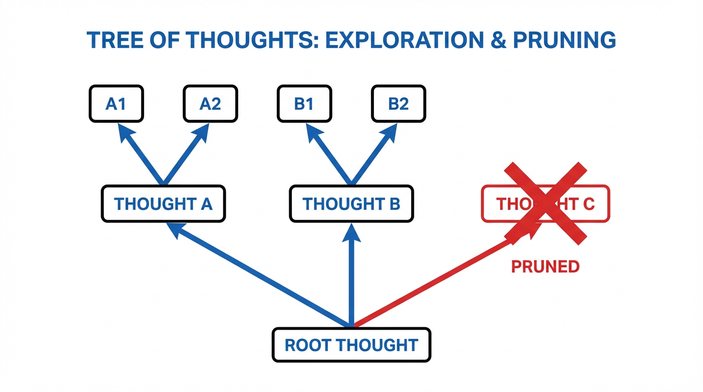

import ReasoningVisualizer from '../../../components/chapter-15/ReasoningVisualizer.tsx';

# 15.2 생각의 트리와 그래프 (Tree/Graph of Thoughts)

표준 자기회귀(Autoregressive) 생성 방식—표준적인 **Chain-of-Thought (CoT)** 를 포함하여—이 가지는 근본적인 한계는 마르코프(Markovian) 속성을 따르는 좌에서 우로(left-to-right)의 디코딩 과정에 엄격하게 종속된다는 점입니다. 일단 하나의 토큰이 샘플링되면, 이는 컨텍스트 윈도우의 불변하는 일부가 됩니다. 만약 모델이 복잡한 추론 과정의 초반부에서 논리적 오류를 범한다면, 이후의 모든 생성 과정은 그 잘못된 전제 조건에 얽매일 수밖에 없습니다.

인간의 인지 과정은 어려운 문제를 해결할 때 선형적으로만 작동하지 않습니다. 우리는 대안적인 가설을 탐색하고, 막다른 길에 다다르면 되돌아가며(backtrack), 여러 부분적인 해결책을 종합하여 하나의 일관된 결론을 도출합니다. 이러한 간극을 메우기 위해 연구자들은 LLM 디코딩 과정에 탐색 알고리즘을 도입하였고, 선형적인 체인(Chain) 패러다임을 **Tree** 로, 그리고 궁극적으로는 **Graph of Thoughts** 로 진화시켰습니다.

---

## 1. 생각의 트리(ToT) 프레임워크

Yao et al. (2023) [[1]](#ref-1) 이 제안한 **Tree of Thoughts (ToT)** 는 LLM 추론을 추론 단계들의 조합 공간(combinatorial space)에 대한 휴리스틱 탐색(heuristic search) 문제로 재정의합니다.

단일한 연속 시퀀스를 생성하는 대신, ToT는 문제를 개별적인 "생각(thoughts)"(중간 추론 단계)으로 분해합니다. 모델은 여러 생각의 갈래(branches)를 탐색하고, 이를 평가하여 어떤 경로를 계속 파고들지, 혹은 어떤 경로를 가지치기(prune)할지 결정합니다.

### 수학적 정식화

표준 CoT에서는 입력 $x$ 가 주어졌을 때 출력 $y$ 에 도달하기 위해 생각의 시퀀스 $z_1, z_2, \dots, z_n$ 를 샘플링합니다. 이때의 확률은 단순히 다음과 같습니다:
$$ P(y, z_{1:n} | x) = \prod_{i=1}^{n} P(z_i | x, z_{1:i-1}) P(y | x, z_{1:n}) $$

ToT에서는 부분적인 추론 경로를 나타내는 상태(state) $s = [x, z_{1\dots i}]$ 를 정의합니다. 이 프레임워크는 두 가지 핵심 컴포넌트를 요구합니다:

1.  **Thought Generator $G(p_{\theta}, s, k)$:** 현재 상태가 주어졌을 때 $k$ 개의 후보 다음 생각들을 생성합니다. 이는 샘플링(temperature $> 0$)을 통해 이루어지거나, 특정 프롬프트를 통해 서로 다른 접근 방식을 제안하도록 유도할 수 있습니다.
2.  **State Evaluator $V(p_{\theta}, s)$:** 해당 상태의 생존 가능성을 점수화하는 휴리스틱 함수입니다. 일반적으로 LLM 자체가 평가자 역할을 하도록 프롬프팅되며, 스칼라 값을 부여하거나 범주형 레이블(예: `sure`, `maybe`, `impossible`)을 할당합니다.

$G$ 와 $V$ 가 정의되면, ToT는 **Breadth-First Search (BFS)** 나 **Depth-First Search (DFS)** 와 같은 고전적인 탐색 알고리즘을 적용합니다.

빔 너비(beam width)가 $b$ 인 BFS를 사용할 경우, 각 깊이 $d$ 에서 알고리즘은 $V(s)$ 에 의해 평가된 상위 $b$ 개의 상태만을 유지합니다. 이는 컨텍스트가 기하급수적으로 폭발하는 것을 방지하는 동시에, 대안적인 브랜치를 유지함으로써 모델이 국소적인 오류(localized errors)로부터 회복할 수 있게 해줍니다.


*Source: Yao et al., 2023 [[1]](#ref-1)*

---

## 2. 생각의 그래프(GoT): 시너지와 반복 정제

ToT는 백트래킹(backtracking)을 가능하게 하지만, 구조적인 결함을 안고 있습니다. 바로 **트리(Trees)는 병합될 수 없다** 는 점입니다. 만약 두 개의 서로 다른 브랜치가 가치 있고 상호 보완적인 부분 해답을 생성했다 하더라도, ToT는 시스템이 둘 중 하나만을 선택하고 나머지는 버리도록 강제합니다.

Besta et al. (2023) [[2]](#ref-2) 가 제안한 **Graph of Thoughts (GoT)** 는 추론 구조를 **Directed Acyclic Graph (DAG)** 로 격상시킵니다. GoT에서 정점(vertices)은 생각을 나타내고, 간선(edges)은 종속성을 의미합니다. 겉보기에는 단순한 이 구조적 업그레이드가 트리는 지원할 수 없는 강력한 인지적 연산을 해제(unlock)합니다.

### 핵심 변환 연산

GoT는 인간의 문제 해결 방식을 모델링한 특정 그래프 변환 연산을 도입합니다:

*   **Aggregation (Synergy):** 여러 개의 생각 $v_1, v_2, \dots, v_k$ 가 하나의 새로운 생각 $v_{new}$ 로 병합됩니다. LLM은 부모 생각들의 가장 좋은 요소들을 종합(synthesize)하도록 프롬프팅됩니다. 이는 문서 요약이나 코드 합성(code synthesis)과 같은 작업에서 매우 효과적입니다.
*   **Refinement (Looping):** 생각 $v$ 가 반복적으로 개선되어 $v^*$ 를 생성합니다. 비순환(acyclic) 속성을 유지하기 위해 기술적으로는 DAG에 새로운 노드를 생성하는 것이지만, 실질적으로는 자기 교정(self-correction) 루프의 역할을 합니다.
*   **Generation:** 부모로부터 새로운 자식 생각들을 생성하는 표준적인 ToT의 브랜칭 연산입니다.

### 비용과 품질의 역설

직관적으로 생각하면, GoT가 ToT보다 구조적으로 더 복잡하기 때문에 연산 비용이 훨씬 더 많이 들 것이라고 가정하기 쉽습니다. 하지만 실제로는 GoT가 **더 낮은 연산 비용으로 더 높은 품질** 을 달성하는 경우가 많습니다 [[2]](#ref-2).

서로 다른 브랜치에 있는 중복되거나 논리적으로 동등한 상태를 식별하고 이를 병합(Aggregation)함으로써, GoT는 ToT보다 탐색 공간을 훨씬 더 공격적으로 가지치기(prune)합니다. 정렬(sorting) 작업에서 GoT는 ToT에 비해 연산 비용을 31% 이상 절감하면서도 품질은 62% 향상시키는 결과를 보여주었습니다.

<ReasoningVisualizer client:load lang="ko" />

### 언제 트리/그래프 탐색 비용을 감수할 가치가 있는가

ToT와 GoT는 모든 프롬프트에 기본으로 켜 두는 디코딩 전략이 아닙니다. 다음 세 가지가 동시에 성립할 때 특히 가치가 커집니다.

- 문제에 의미 있는 대안 경로가 존재할 때
- 중간 상태를 평가하거나 점수화할 수 있을 때
- 초반에 잘못된 경로에 올인하는 비용보다, 여러 분기를 탐색하는 비용이 더 쌀 때

그래서 이 기법들은 일반적인 잡담보다 planning, constrained search, code repair, synthesis 같은 작업에 더 잘 맞습니다. 탐색할 만한 구조가 실제로 있는 문제에서만 search가 힘을 발휘합니다.

---

## 3. 오케스트레이터 구현

GoT를 구현하기 위해서는 시스템을 그래프 구조와 탐색 전략을 관리하는 **Controller** 와 생각들을 생성하고 채점하는 **Executor** (LLM)로 분리해야 합니다.

아래는 Generation과 Aggregation을 처리하는 GoT Controller의 핵심 로직을 보여주는 Python 구현 예시입니다.

```python
import torch
from typing import List, Dict, Any

class GoTNode:
    def __init__(self, thought: str, parents: List['GoTNode'] = None):
        self.thought = thought
        self.parents = parents or []
        self.score = 0.0
        self.children = []

class GoTController:
    def __init__(self, llm_executor):
        self.llm = llm_executor # Mock LLM interface
        self.graph: List[GoTNode] = []

    def generate_thoughts(self, node: GoTNode, k: int) -> List[GoTNode]:
        """하나의 노드를 k개의 새로운 생각으로 브랜칭합니다."""
        prompt = f"Given the current state: {node.thought}\nGenerate {k} distinct next steps."
        responses = self.llm.generate(prompt, num_return_sequences=k)
        
        new_nodes = [GoTNode(thought=r, parents=[node]) for r in responses]
        node.children.extend(new_nodes)
        self.graph.extend(new_nodes)
        return new_nodes

    def score_nodes(self, nodes: List[GoTNode]):
        """LLM을 휴리스틱 함수로 사용하여 노드들을 평가합니다."""
        for node in nodes:
            prompt = f"Evaluate the validity of this reasoning step: {node.thought}. Score from 0.0 to 1.0."
            score_str = self.llm.generate(prompt, max_tokens=5)[0]
            node.score = float(score_str) # 단순화된 파싱

    def aggregate_thoughts(self, nodes: List[GoTNode]) -> GoTNode:
        """시너지를 내는 여러 노드들을 하나의 우수한 노드로 병합합니다."""
        combined_text = "\n".join([f"- {n.thought}" for n in nodes])
        prompt = f"Synthesize the following partial solutions into one optimal solution:\n{combined_text}"
        
        synergy_thought = self.llm.generate(prompt, max_tokens=256)[0]
        synergy_node = GoTNode(thought=synergy_thought, parents=nodes)
        
        for n in nodes:
            n.children.append(synergy_node)
            
        self.graph.append(synergy_node)
        return synergy_node

    def execute_search(self, initial_prompt: str):
        # 1. Root 초기화
        root = GoTNode(thought=initial_prompt)
        self.graph.append(root)
        
        # 2. 생성 및 평가 (Branching)
        candidates = self.generate_thoughts(root, k=3)
        self.score_nodes(candidates)
        
        # 3. Aggregation (Synergy)을 위한 상위 2개 선택
        candidates.sort(key=lambda x: x.score, reverse=True)
        top_candidates = candidates[:2]
        
        # 4. 최종 상태로 병합
        final_node = self.aggregate_thoughts(top_candidates)
        return final_node.thought
```

### KV 캐시 문제

시스템 관점에서 볼 때, ToT와 GoT는 심각한 메모리 단편화(memory fragmentation)를 유발합니다. 모든 브랜치는 공통된 접두사(초기 프롬프트 및 초기 생각들)를 공유하지만 이후에 분기됩니다.

이를 순진하게(naively) 구현할 경우, 공통 접두사에 대한 KV 캐시가 모든 브랜치마다 VRAM에 중복으로 할당됩니다. **vLLM** 과 같은 최신 추론 엔진은 브랜치 간에 메모리 블록을 공유하기 위해 **PagedAttention** (12장에서 논의됨)을 활용합니다. 생각들을 병렬로 생성할 때, 엔진은 블록 수준의 Copy-on-Write 메커니즘을 사용하여 메모리 사용량이 모든 브랜치의 전체 컨텍스트 길이가 아닌 *분기된(divergent)* 토큰에 대해서만 확장되도록 보장합니다.

---

## 4. 최신 흐름: Adaptive Graph of Thoughts (AGoT)

ToT와 GoT의 정적(static)인 특성은 문제의 난이도와 관계없이 동일하게 무거운 연산 프레임워크를 모든 문제에 적용한다는 것을 의미합니다.

최근의 발전된 형태인 **Adaptive Graph of Thoughts (AGoT)** [[3]](#ref-3) 는 **동적 분해(Dynamic Decomposition)** 개념을 도입했습니다. AGoT는 테스트 시간(test-time)에 쿼리의 복잡성을 평가하여 CoT, ToT, GoT를 하나로 통합합니다.

*   문제가 단순하다면, AGoT는 쿼리를 선형적인 CoT 경로로 라우팅합니다.
*   모델이 높은 불확실성(종종 생성 로짓의 엔트로피나 자기 반성 프롬프트를 통해 측정됨)을 감지하면, 동적으로 추론 공간을 그래프 형태로 확장합니다.

이는 **Test-Time Scaling Laws** 의 최전선을 보여줍니다. 연산량을 가장 필요한 곳에 정확하게 할당함으로써, AGoT는 표준 추론 모델을 사용하고도 매우 복잡한 GPQA 벤치마크에서 46.2%의 성능 향상을 달성했습니다. 이는 OpenAI의 o1과 같이 무거운 강화학습으로 명시적으로 훈련된 모델들의 성능에 필적하는 수준이며, 이를 전적으로 추론 시점의 오케스트레이션(inference-time orchestration)만을 통해 이루어냈습니다.

---

## 5. 요약과 열린 질문

Chains에서 Trees로, 그리고 Graphs로의 전환은 LLM을 단순한 시퀀스 예측기로 취급하던 것에서 벗어나, 고전적인 탐색 아키텍처 내부의 엔진으로 활용하는 패러다임의 변화를 나타냅니다.

GoT는 인간과 유사한 추론(합성 및 백트래킹)을 위한 구조적 역량을 제공하지만, "생각하는(thinking)" 정책을 전적으로 외부 Python 오케스트레이터에 위임한다는 한계가 있습니다. 이어지는 **Search-time Compute and o1** 섹션에서 탐구할 다음의 논리적 질문은 다음과 같습니다: *모델이 이러한 그래프 탐색을 내재화하여, 자신의 은닉 상태(hidden states) 내부에서 네이티브하게 브랜칭하고, 가지치기하고, 병합하는 방법을 학습하도록 훈련시킬 수 있을까요?*

---

## Quizzes

<details>
<summary>Quiz 1: 정렬(sorting)이나 집합 교차(set intersection)와 같은 작업에서, 더 복잡한 DAG 구조를 가짐에도 불구하고 Graph of Thoughts (GoT)가 Tree of Thoughts (ToT)보다 연산 비용이 더 저렴한 경우가 많은 이유는 무엇입니까?</summary>
*ToT는 브랜치의 기하급수적인 확장을 강제합니다. 반면 GoT는 상태들의 "Aggregation(병합)"을 허용합니다. 서로 다른 브랜치에서 도출된 논리적으로 동등하거나 중복되는 부분 해답들을 단일 노드로 병합함으로써, GoT는 탐색 공간의 너비를 대폭 줄이고 불필요한 병렬 연산을 가지치기(prune)합니다.*
</details>

<details>
<summary>Quiz 2: 빔 너비가 $b$ 이고 깊이가 $d$ 인 Breadth-First Search (BFS)를 사용하는 ToT 구현에서 시스템 수준의 주요 병목 현상은 무엇이며, 최신 엔진들은 이를 어떻게 완화합니까?</summary>
*주요 병목 현상은 KV 캐시 메모리의 폭발적인 증가입니다. 각 브랜치가 자체적인 컨텍스트를 유지하기 때문에 관리하지 않으면 $O(b \times d)$ 로 확장됩니다. 최신 엔진들은 PagedAttention (또는 RadixAttention)을 사용하여 이를 완화합니다. 이는 여러 시퀀스가 공통 접두사의 KV 캐시 블록을 공유하도록 허용하며, 새롭게 분기되어 생성된 토큰에 대해서만 새로운 메모리를 할당합니다.*
</details>

<details>
<summary>Quiz 3: ToT의 State Evaluator 함수 $V(s)$ 는 RLHF에서 사용되는 표준적인 Reward Model과 근본적으로 어떻게 다릅니까?</summary>
*RLHF의 Reward Model은 일반적으로 인간의 선호도에 맞추기 위해 최종적으로 완성된 출력 시퀀스 전체를 평가합니다. 반면 ToT의 State Evaluator $V(s)$ 는 탐색 알고리즘을 위한 휴리스틱으로 기능하기 위해 부분적이고 중간 단계의 논리적 단계를 평가하며, 현재 경로가 올바른 최종 정답으로 이어질 가능성이 있는지를 판단합니다.*
</details>

<details>
<summary>Quiz 4: LLM의 합성(synthesis) 능력이 제대로 조정되지 않았을 때, GoT의 "Aggregation" 변환이 가지는 주요 위험성은 무엇입니까?</summary>
*할루시네이션의 복리화(Hallucination compounding)입니다. 모델이 부분적으로는 맞지만 논리적으로 모순되는 두 개의 생각을 병합할 경우, 손상된 상태를 합성할 수 있습니다. 이 병합된 노드가 이후 생성 과정의 기초 역할을 하기 때문에, 오류가 전파되어 다운스트림 그래프 전체를 오염시키게 됩니다.*
</details>

<details>
<summary>Quiz 5: 자동회귀적(Autoregressive) 트랜스포머를 사용할 때 상태 공간 그래프 순환(cycles)을 모델링하는 것의 한계를 설명하고, GoT 프레임워크가 이 알고리즘적 제약을 어떻게 극복하는지 설명하시오.</summary>
*자동회귀적 트랜스포머는 시퀀스를 선형적으로 생성하며 시간이 엄격히 순방향으로 진행되는 고정된 컨텍스트 창에 조건화됩니다. 이로 인해 이전 상태로 되돌아가는 그래프 순환을 기본적으로 모델링하는 것은 불가능합니다. 이전 상태를 다시 덧붙이는 것은 선형 컨텍스트 길이 $L$을 확장시킬 뿐이며, 진정한 순환 논리 없이 $O(L^2)$의 어텐션 비용을 초래합니다. GoT 프레임워크는 외부 컨트롤러(Controller)를 활용하여 순환 작업(정제 또는 루핑 등)을 처리함으로써 이 제약을 극복합니다. 컨트롤러는 루프를 방향성 비순환 그래프(DAG) 구조 내에서 새롭고 고유한 노드를 생성하는 작업으로 처리하여, 트랜스포머 고유의 인과적 어텐션(causal attention) 메커니즘을 보존하면서도 외부적으로 순환 상태 정제를 흉내 냅니다.*
</details>

---

## References

1. <a id="ref-1"></a>Yao, S., et al. (2023). *Tree of Thoughts: Deliberate Problem Solving with Large Language Models.* [arXiv:2305.10601](https://arxiv.org/abs/2305.10601).
2. <a id="ref-2"></a>Besta, M., et al. (2023). *Graph of Thoughts: Solving Elaborate Problems with Large Language Models.* [arXiv:2308.09687](https://arxiv.org/abs/2308.09687).
3. <a id="ref-3"></a>Pandey, T., Ghukasyan, A., Goktas, O., & Radha, S. K. (2025). *Adaptive Graph of Thoughts: Test-Time Adaptive Reasoning Unifying Chain, Tree, and Graph Structures.* [arXiv:2502.05078](https://arxiv.org/abs/2502.05078).
