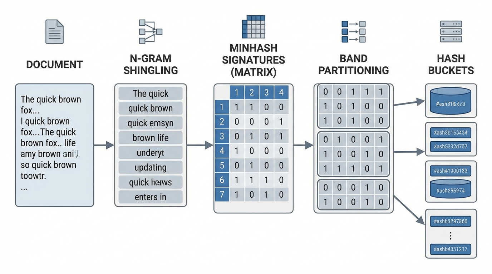
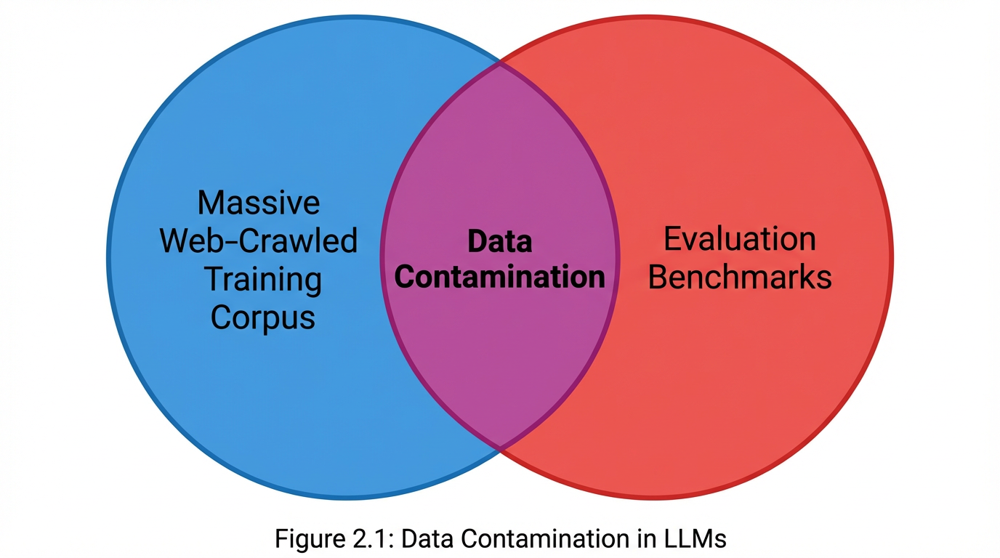

import NgramContaminationVisualizer from '../../../components/chapter-17/NgramContaminationVisualizer.tsx';

# 17.4 Contamination Issues

화재 감식에서 화재가 사고인지 방화인지 판단할 때, 조사관들은 가솔린과 같은 인화성 액체 잔류물(Ignitable Liquid Residues, ILR)을 탐지합니다. 하지만 카펫, 접착제, 플라스틱 등 현대의 가정용 자재들은 대부분 석유를 기반으로 만들어집니다. 이러한 자재들이 불에 타면서 열분해(Pyrolysis)를 일으키면, ILR과 완벽하게 똑같은 화학 물질을 방출합니다. 만약 조사관이 깨끗한 대조군을 설정하지 않거나 여러 현장에서 동일한 장갑을 재사용한다면, 미세한 오염 물질이 유입됩니다. 그 결과, 화학 분석은 방화라고 강력하게 지시하지만 실제로는 범죄가 발생하지 않은 "False Positive(위양성)" 가 발생하게 됩니다.

Foundation Model 엔지니어링에서 MMLU나 HumanEval과 같은 벤치마크로 Large Language Model (LLM) 을 평가하는 것은, 모델이 진정한 일반화(Generalization) 능력을 갖추었는지 감식하는 과정과 같습니다. 그러나 공격적인 웹 크롤링, 합성 데이터(Synthetic Data)의 유출, 또는 부적절한 중복 제거(Deduplication)로 인해 모델의 학습 코퍼스에 벤치마크 테스트 셋이 무심코 포함되었다면, 그 벤치마크 점수는 False Positive 에 불과합니다. 모델은 추론하는 법을 배운 것이 아니라, 단순히 범죄 현장을 암기한 것입니다.

이러한 현상을 **Data Contamination** (데이터 오염) 이라고 부르며, 현재 AI 평가의 신뢰성을 위협하는 가장 치명적인 문제입니다 [[1]](#ref-1). 사전 학습(Pre-training) 코퍼스가 수십 조 개의 토큰으로 확장됨에 따라, 평가 데이터를 완벽하게 격리하는 작업은 단순한 필터링을 넘어 거대한 분산 시스템 엔지니어링의 영역으로 넘어왔습니다.

<div style="background-color: #f8f9fa; border-left: 5px solid #dc3545; padding: 15px; margin: 20px 0; border-radius: 4px;">
  <h4 style="margin-top: 0; color: #dc3545;">🧪 케이스 스터디: MMLU 데이터 오염 논란</h4>
  
  <p>MMLU(Massive Multitask Language Understanding)는 모델 평가의 표준으로 자리 잡았으나, 그 유명세로 인해 역설적으로 학습 데이터에 오염되었을 가능성이 커졌습니다. 모델들이 거대한 웹 크롤링 데이터를 학습함에 따라 벤치마크 문제 자체가 학습 셋에 포함되는 현상이 발생한 것입니다.</p>
  
  <p><strong>기술적 심층 분석:</strong></p>
  <ul>
    <li><strong>데이터 오염 퀴즈(Data Contamination Quiz)</strong>: 연구 결과, 많은 최신 모델들이 아주 짧은 프롬프트만으로도 MMLU 문제를 정확히 복원해냈습니다. 이는 모델이 추론하는 것이 아니라 문제 자체를 직접 암기하고 있음을 시사합니다.</li>
    <li><strong>셔플링에 대한 민감도</strong>: 유명한 실험에 따르면, 객관식 보기(A, B, C, D)의 순서를 바꾸거나 기호를 숫자로 변경하는 것만으로도 모델의 점수가 <strong>15% 이상 폭락</strong>하는 경우가 확인되었습니다. 이는 모델이 문제의 맥락을 이해하는 대신 정답 번호와 위치 편향(Positional Bias)에 의존하고 있음을 보여줍니다.</li>
  </ul>
  
  <p><strong>엔지니어링에 미친 영향:</strong></p>
  <ul>
    <li><strong>벤치마크 고도화</strong>: 이 논란 이후 MMLU-CF와 같이 오염되지 않은 버전의 벤치마크가 개발되었으며, 학습 데이터와 테스트 데이터 간의 <strong>n-gram 중복 분석</strong>을 통한 필터링이 필수적인 공정이 되었습니다.</li>
    <li><strong>평가 체계의 변화</strong>: 단순 점수보다는 카나리 토큰(Canary tokens) 삽입이나 비공개 테스트 셋 활용의 중요성이 강조되고 있습니다.</li>
  </ul>
  
  <p><strong>핵심 교훈</strong>: 철저한 데이터 오염 검증 없는 높은 벤치마크 점수는 모델의 실제 성능을 보장하지 않습니다.</p>
  
  <p><em>참고 문헌: Golchin, S., &amp; Surdeanu, M. (2023). "Is Your Model Bright or Just Memorizing?"</em></p>
</div>

---

## The Anatomy of Data Contamination

오염은 0과 1로 나뉘는 이분법적인 상태가 아닙니다. 오염은 그 심각성에 따라 스펙트럼으로 존재하며, 모델 수명 주기의 각기 다른 단계에서 발생합니다.

### Phase-Based Contamination
1. **Pre-training Leakage**: 가장 흔한 오염 경로입니다. GSM8K나 MMLU 같은 벤치마크는 GitHub, Reddit, 교육용 포럼 등에서 활발하게 논의됩니다. Common Crawl과 같은 웹 크롤러가 인터넷을 수집할 때 이러한 논의 내용까지 모두 흡수합니다. 엔지니어들이 중복 제거(Deduplication)에 심혈을 기울임에도 불구하고, 테스트 셋의 파편들은 필연적으로 사전 학습 코퍼스에 스며들게 됩니다.
2. **Post-training (SFT/RLHF) Leakage**: 더욱 교묘하고 위험한 경로입니다. Supervised Fine-Tuning (SFT) 과정에서 엔지니어들은 종종 GPT-4와 같은 강력한 선도 모델(Frontier Model)이 생성한 합성 데이터에 의존합니다. 만약 교사 모델(Teacher Model)이 이미 오염되어 있었거나, 합성 데이터 생성 프롬프트가 벤치마크와 유사한 작업을 요구했다면, 학생 모델(Student Model)은 의미론적(Semantic)으로 이 오염을 고스란히 물려받게 됩니다.

### Type-Based Contamination
- **Exact Match (Verbatim) Contamination**: 학습 데이터에 평가 프롬프트와 정답 문자열이 토씨 하나 틀리지 않고 정확히 포함된 경우입니다.
- **Input-Only Contamination**: 모델이 학습 중 벤치마크의 '질문'은 보았으나 '정답'은 보지 못한 경우입니다. Exact Match 보다는 덜 심각하지만, 모델이 테스트 셋의 특정 구문과 데이터 분포에 익숙해지도록 만들어 성능을 인위적으로 부풀리는 효과를 낳습니다.
- **Semantic (Paraphrased) Contamination**: 학습 데이터에 벤치마크 질문과 논리적으로는 동일하지만, 엔티티(Entity)가 바뀌었거나 문장이 재구성된 내용이 포함된 경우입니다 (예: "Alice가 사과 3개를 가지고 있다"를 "Bob이 오렌지 3개를 들고 있다"로 변경). 이는 전통적인 문자열 매칭 기반의 필터를 쉽게 우회합니다 [[2]](#ref-2).

---

## Detection at Scale: The Math of Deduplication

Exact Match 오염을 탐지하려면 평가 벤치마크와 전체 사전 학습 코퍼스를 일일이 비교해야 합니다. 두 텍스트 문서 간의 겹침(Overlap) 정도를 측정하는 표준 지표는 **Jaccard Similarity** 입니다.

문서 $D$ 가 주어졌을 때, 연속된 $n$-gram 의 집합(일반적으로 $n=13$)을 추출하여 이를 $S$ 라고 정의합니다. 학습 문서 $S_{train}$ 과 벤치마크 문서 $S_{test}$ 간의 Jaccard 유사도는 다음과 같습니다:

$$ J(S_{train}, S_{test}) = \frac{|S_{train} \cap S_{test}|}{|S_{train} \cup S_{test}|} $$

1조 개의 토큰 코퍼스(예: $10^{10}$ 개의 문서)를 벤치마크 스위트와 정확히 비교하는 것은 $O(N \times M)$ 의 연산 복잡도를 요구하므로 현실적으로 불가능합니다. 이를 해결하기 위해 엔지니어들은 **MinHash** 와 **Locality-Sensitive Hashing (LSH)** 를 결합하여 사용합니다 [[4]](#ref-4).

### MinHash Signatures
MinHash 는 Jaccard 유사도를 근사하는 확률적 기법입니다. 해시 함수 $h$ 는 $n$-gram 전체 집합의 원소들을 고유한 정수로 매핑합니다. 집합 $S$ 의 MinHash 값은 그 중 가장 작은 해시 값입니다:

$$ h_{min}(S) = \min_{x \in S} h(x) $$

MinHash 의 수학적 마법은, 두 집합의 MinHash 값이 충돌할(즉, 같을) 확률이 정확히 두 집합의 Jaccard 유사도와 일치한다는 점입니다:

$$ P(h_{min}(S_{train}) = h_{min}(S_{test})) = J(S_{train}, S_{test}) $$

$K$ 개의 독립적인 해시 함수를 사용함으로써, 각 문서에 대해 작고 압축된 "서명 벡터(Signature Vector)"를 생성할 수 있습니다. 두 서명에서 일치하는 값의 개수를 세어 Jaccard 유사도를 추정하게 됩니다.

### Locality-Sensitive Hashing (LSH)
압축된 서명을 사용하더라도, 벤치마크 질문마다 $O(N)$ 번의 스캔을 수행하는 것은 여전히 너무 느립니다. LSH 는 $K$ 차원의 서명을 $r$ 개의 행(Row)으로 이루어진 $b$ 개의 밴드(Band)로 나눕니다 ($K = b \times r$).

각 밴드는 특정 버킷(Bucket)으로 해싱됩니다. 만약 두 문서가 $b$ 개의 밴드 중 *단 하나라도* 동일한 값을 공유한다면, 정확한 Jaccard 계산을 수행할 '후보 쌍(Candidate Pair)'으로 분류됩니다. 두 문서가 후보 쌍이 될 확률은 다음과 같습니다:

$$ P(\text{candidate}) = 1 - (1 - J(S_{train}, S_{test})^r)^b $$

이 공식은 가파른 계단 함수(Step Function)를 만들어냅니다. 엔지니어들은 $b$ 와 $r$ 값을 조정하여, 유사하지 않은 문서들은 엄격하게 걸러내면서도 특정 임계값(예: 0.8) 이상의 Jaccard 유사도를 가진 문서들에 대해서는 거의 100%에 가까운 재현율(Recall)을 보장할 수 있습니다.



*(Source: Generated by Gemini)*

---

## Engineering the Decontamination Pipeline

견고한 오염 제거 파이프라인을 구축하려면, GPU나 분산 CPU 클러스터를 효율적으로 활용하기 위해 MinHash 생성 과정을 벡터화(Vectorization)해야 합니다. 아래는 문서 배치의 서명을 생성하고 벤치마크 대비 오염도를 추정하는 기초적인 PyTorch 구현 예시입니다.

```python
import torch
import hashlib
from typing import List, Set

def generate_ngrams(text: str, n: int = 13) -> Set[str]:
    """문서에서 단어 단위의 n-gram을 생성하여 지역적 구문 구조를 포착합니다."""
    tokens = text.lower().split()
    return set([" ".join(tokens[i:i+n]) for i in range(len(tokens) - n + 1)])

def compute_minhash_signatures(documents_ngrams: List[Set[str]], num_hashes: int = 128) -> torch.Tensor:
    """
    벡터화된 연산을 사용하여 문서 배치의 MinHash 서명을 계산합니다.
    (batch_size, num_hashes) 형태의 텐서를 반환합니다.
    """
    batch_size = len(documents_ngrams)
    signatures = torch.full((batch_size, num_hashes), float('inf'), dtype=torch.int64)
    
    # 결정론적 선형 합동 생성기(LCG) 파라미터
    # h_i(x) = (a_i * x + b_i) % p
    torch.manual_seed(42) # 파이프라인 실행 간 재현성을 위한 고정 시드
    p = 2**31 - 1
    a = torch.randint(1, p, (num_hashes,), dtype=torch.int64)
    b = torch.randint(0, p, (num_hashes,), dtype=torch.int64)
    
    for doc_idx, ngrams in enumerate(documents_ngrams):
        for ngram in ngrams:
            # n-gram을 기본 64비트 정수 해시로 변환 (속도를 위해 MD5 접두사 사용)
            base_hash = int(hashlib.md5(ngram.encode('utf-8')).hexdigest()[:15], 16)
            
            # 이 n-gram에 대해 K개의 해시 함수를 동시에 계산
            hash_vals = (a * base_hash + b) % p
            
            # 해당 문서 서명의 최솟값 업데이트
            signatures[doc_idx] = torch.minimum(signatures[doc_idx], hash_vals)
            
    return signatures

def check_contamination(doc_sigs: torch.Tensor, benchmark_sig: torch.Tensor, threshold: float = 0.8) -> torch.Tensor:
    """
    배치 전체에 대해 Jaccard 유사도를 추정하고 오염 여부를 플래그 처리합니다.
    (batch_size,) 형태의 불리언 텐서를 반환합니다.
    """
    # doc_sigs: (batch_size, num_hashes)
    # benchmark_sig: (num_hashes,)
    matches = (doc_sigs == benchmark_sig).float()
    estimated_jaccard = matches.mean(dim=1)  # 형태: (batch_size,)
    
    return estimated_jaccard >= threshold
```

### Interactive N-Gram Overlap Analysis

$n$-gram 크기가 오염 탐지에 어떤 영향을 미치는지 직관적으로 이해하기 위해 아래의 시각화 도구를 사용해 보십시오. $N$ 값이 작을 때(예: $N=2$)는 흔한 문법 구조 때문에 False Positive 가 높게 나타나는 반면, $N$ 값이 클 때(예: $N=10$)는 의미론적 패러프레이징(Semantic Paraphrasing)을 놓칠 수 있음을 확인할 수 있습니다.

<NgramContaminationVisualizer client:load />

---

## Beyond Exact Match: Semantic and Dynamic Benchmarking

MinHash LSH 가 문자 그대로의 유출(Verbatim Leakage)을 잡아내는 업계 표준이긴 하지만, 의미론적 오염(Semantic Contamination) 앞에서는 근본적으로 장님이 됩니다. LLM 의 성능이 고도화됨에 따라, 평가 패러다임은 이러한 사각지대를 해결하는 방향으로 전환되고 있습니다 [[2]](#ref-2), [[3]](#ref-3).

### 1. Embedding-Based Detection
패러프레이징된 벤치마크를 잡아내기 위해 엔지니어들은 Dense Retrieval 모델(예: E5, BGE)을 도입합니다. 벤치마크 질문과 학습 문서를 모두 잠재 벡터 공간(Latent Vector Space)으로 투영(Projection)합니다. 학습 문서와 테스트 질문 간의 코사인 유사도(Cosine Similarity)가 임계값을 초과하면 해당 문서는 오염으로 간주됩니다. 수조 개의 토큰에 대해 Dense Embedding 을 실행하는 것은 비용이 너무 많이 들기 때문에, 이 방법은 원시 웹 크롤링 데이터보다는 주로 고품질 SFT 데이터셋에 엄격하게 적용됩니다.

### 2. Perturbation Testing
모델의 높은 점수가 진정한 지능이 아니라 오염 덕분이라는 것을 어떻게 증명할 수 있을까요? 바로 벤치마크를 섭동(Perturbation)시키는 것입니다. 테스트 셋의 엔티티(예: 이름, 숫자, 특정 조건)를 프로그래밍 방식으로 교체하여, 논리적으로는 동일하지만 표면적인 문자열은 전혀 다른 작업을 생성합니다.
만약 모델이 표준 MMLU 에서는 90%를 기록했지만, 섭동된 MMLU 에서는 45%로 추락한다면, 이는 치명적인 암기(Catastrophic Memorization)가 발생했음을 의미합니다. 모델은 문제를 푸는 데 필요한 근본적인 추론 능력이 아니라, 벤치마크의 특정 토큰 시퀀스를 외워버린 것입니다 [[3]](#ref-3).

### 3. Canary Insertion
소프트웨어 보안 분야에서 영감을 받아, 연구자들은 벤치마크 데이터셋이 웹에 공개되기 전에 고유하고 무작위로 생성된 암호화 문자열(예: `2b3c4d5e-test-canary-ignore`)인 "카나리아(Canary)"를 주입합니다. 만약 새로 학습된 모델에게 카나리아 주변의 텍스트를 자동 완성하라고 프롬프트를 주었을 때 모델이 해당 UUID 를 성공적으로 출력한다면, 이는 모델이 사전 학습 중에 해당 데이터셋에 노출되었음을 확정적으로 증명하는 셈입니다.

### 4. Dynamic Benchmarking
오염에 대한 궁극적인 방어책은 정적(Static) 벤치마크를 완전히 폐기하는 것입니다. 동적 벤치마킹(Dynamic Benchmarking)은 프로그래밍 규칙이나 선도 모델을 사용하여 새로운 테스트 셋을 지속적으로 생성함으로써, 평가 데이터의 타임스탬프가 모델의 학습 컷오프(Cutoff) 날짜보다 *무조건 나중*이 되도록 보장합니다. LiveBench 나 Chatbot Arena 와 같은 플랫폼이 이 원칙에 따라 운영되며, 과거의 사전 학습 데이터 유출 문제를 무의미하게 만듭니다.



*(Source: Generated by Gemini)*

---

## Summary & Open Questions

데이터 오염(Data Contamination)은 AI 평가를 단순한 채점 과정에서 일종의 적대적 포렌식 과학(Adversarial Forensic Science)으로 변모시켰습니다. 우리는 오염이 Pre-training 과 SFT 단계 모두에 어떻게 침투하는지, 그리고 엔지니어링 팀이 $n$-gram 겹침을 찾아내기 위해 수조 개의 토큰을 스크러빙하는 MinHash LSH 파이프라인을 어떻게 배포하는지 살펴보았습니다. 또한 단순 문자열 매칭의 한계와, 모델의 진정한 능력을 밝혀내기 위해 의미론적 탐지 및 동적 섭동 테스트(Dynamic Perturbation Testing)가 왜 필수적인지 분석했습니다.

정적 벤치마크의 취약성을 되돌아보며, 다음과 같은 열린 질문들을 고민해 보시기 바랍니다:
- 만약 모델이 인류의 모든 지식을 암기하게 된다면, 어느 시점부터 "오염"이 단순한 "학습"으로 인정받게 될까요?
- 완벽한 "Zero-shot" 작업이라는 개념 자체를 보장하는 것이 불가능해진 상황에서, 모델의 추론 능력을 어떻게 신뢰할 수 있게 평가할 수 있을까요?

이러한 질문들은 모델이 단순히 성능이 뛰어난 것을 넘어, 안전하고 인간의 의도에 부합(Aligned)하도록 보장하는 더 광범위한 과제로 직결됩니다. 이는 다음 장인 **Chapter 18: AI Safety & Alignment Research** 에서 심도 있게 다룰 예정입니다.

## Quizzes

<details>
<summary>Quiz 1: 최신 Instruction Tuning (SFT) 데이터셋에서 오염을 탐지할 때 단순한 n-gram Exact Match 방식이 불충분한 이유는 무엇입니까?</summary>
*SFT 데이터셋은 종종 GPT-4와 같은 다른 강력한 LLM을 사용하여 합성적으로(Synthetically) 생성됩니다. 이러한 교사 모델들은 원본 벤치마크 질문의 엔티티를 변경하거나, 형식을 바꾸거나, 패러프레이징하는 경향이 있습니다. 이러한 의미론적 오염(Semantic Contamination)은 단순 문자열 매칭(n-gram)을 우회하므로, 이를 탐지하려면 임베딩 기반의 유사도 측정이나 LLM-as-a-judge 접근법이 필요합니다.*
</details>

<details>
<summary>Quiz 2: MinHash LSH의 맥락에서, 밴드의 수 $b$ 는 일정하게 유지하면서 밴드당 행의 수 $r$ 을 증가시키면 어떤 일이 발생합니까?</summary>
*$r$ 을 증가시키면 밴드 내의 $r$ 개 해시 값이 모두 완벽하게 일치해야 하므로 매칭 조건이 훨씬 더 엄격해집니다. 이는 False Positive (관련 없는 문서가 같은 버킷에 해싱되는 경우)의 확률을 낮추지만, False Negative (거의 동일한 문서를 놓치는 경우)의 위험을 증가시킵니다. 즉, LSH 확률 계단 함수(Step Function)를 오른쪽으로 이동시켜, 두 문서가 후보 쌍이 되기 위해 더 높은 Jaccard 유사도를 요구하게 만듭니다.*
</details>

<details>
<summary>Quiz 3: 어떤 모델이 코딩 벤치마크에서 85%의 점수를 달성했지만, 프롬프트 내의 변수명을 무작위로 변경하자 정확도가 30%로 떨어졌다고 가정해 봅시다. 이는 모델의 학습 과정에 대해 무엇을 시사합니까?</summary>

*이러한 극적인 성능 저하는 데이터 오염(Data Contamination)과 단순 암기(Pure Memorization)가 발생했음을 강력하게 시사합니다. 모델이 진정한 논리적 추론이나 알고리즘적 일반화 능력을 학습했다면, 표면적인 변수명 변경에 대해 강건(Robust)하게 대응했을 것입니다. 모델은 기저의 프로그래밍 논리가 아니라 벤치마크가 호스팅된 GitHub 리포지토리의 특정 토큰 시퀀스 자체를 외워버린 것입니다.*
</details>

<details>
<summary>Quiz 4: 모델이 질문만 보고 정답은 보지 못하는 "Input-Only Contamination"이 여전히 벤치마크 무결성에 심각한 위험으로 간주되는 이유는 무엇입니까?</summary>
*정답이 없더라도, 입력 데이터에 노출되는 것만으로도 모델은 테스트 셋의 특정 구문, 어휘 분포, 그리고 포맷팅에 익숙해집니다. 사전 학습(Pre-training) 과정에서 이는 모델의 내부 표현(Internal Representation)을 벤치마크의 매니폴드(Manifold)에 가깝게 이동시킵니다. 추론(Inference) 시에 모델은 프롬프트를 파싱하는 데 더 적은 용량(Capacity)을 소비하게 되고, 통계적으로 더 일관된 문장을 생성할 확률이 높아집니다. 결과적으로 완전히 처음 보는 Out-of-Distribution 작업에 비해 점수가 인위적으로 부풀려지게 됩니다.*
</details>

<details>
<summary>Quiz 5: 연속 n-gram을 활용하여 집계 오염 점수 $C$를 도출하는 논리 시퀀스를 정식화하십시오. Exact match와 의미론적 오염을 플래그 지정하기 위한 명시적 수학적 임계 경계식은 무엇입니까?</summary>
*오염 점수 $C$는 벤치마크 길이에 맞춰 정규화된 n-gram 집합 교집합의 크기로 정식화됩니다: $C = \frac{|S_{train} \cap S_{test}|}{|S_{test}|}$. Exact match 오염은 연속 일치 임계값이 $C \ge \theta_{exact}$ (보통 $n \ge 13$, $\theta_{exact} \approx 0.8$)를 넘을 때 플래그가 지정됩니다. 의미론적 패러프레이징 오염은 문자열 한계를 우회하며 잠재 벡터 코사인 거리로 측정됩니다: $D_{cos} = 1 - \frac{E(S_{train}) \cdot E(S_{test})}{\|E(S_{train})\| \|E(S_{test})\|}$. 만약 $D_{cos} \le \theta_{semantic}$인 경우 연속 n-gram 매칭이 실패하더라도 해당 시퀀스는 오염으로 결정론적으로 분류됩니다.*
</details>

---

## References

1. <a id="ref-1"></a>Balloccu, F., et al. (2024). *A Survey on Data Contamination for Large Language Models.* [arXiv:2402.02823](https://arxiv.org/abs/2402.02823).
2. <a id="ref-2"></a>Chen, S., Chen, Y., Li, Z., Jiang, Y., Wan, Z., He, Y., Ran, D., Gu, T., Li, H., Xie, T., & Ray, B. (2025). *Benchmarking Large Language Models Under Data Contamination: A Survey from Static to Dynamic Evaluation.* [ACL Anthology](https://aclanthology.org/2025.emnlp-main.511/).
3. <a id="ref-3"></a>Ishikawa, Y. (2025). *Data Contamination or Genuine Generalization? Disentangling LLM Performance on Benchmarks.* [Academic Journal of Natural Science](https://www.suaspress.org/ojs/index.php/AJNS/article/view/v2n2a03).
4. <a id="ref-4"></a>Milvus Documentation (2025). *MINHASH_LSH: Large-Scale Deduplication and Similarity Search.* Zilliz.
