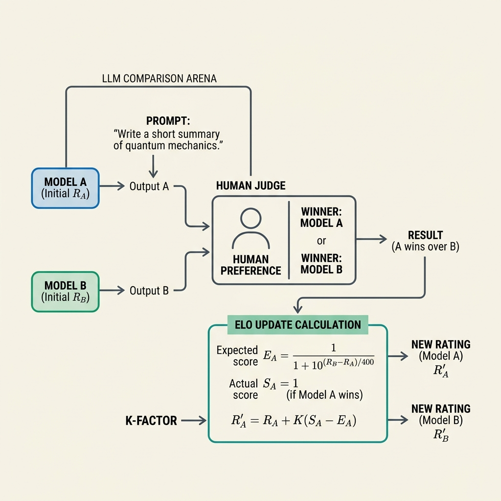

# 17.3 Elo 평점 및 리더보드 (Elo Rating & Leaderboards)

대규모 언어 모델(LLMs)을 평가하는 것은 AI 분야에서 가장 어려운 문제 중 하나입니다. MMLU나 GSM8K와 같은 학술적 벤치마크는 정적이며 데이터 오염(Data Contamination)에 취약합니다. 모델의 능력을 진정으로 이해하기 위해 AI 커뮤니티는 **Elo 평점 시스템** 과 실시간 **리더보드 (Leaderboards)** 를 통한 인간 선호도 평가로 눈을 돌렸습니다.

이러한 방식의 가장 대표적인 예가 **LMSYS Chatbot Arena** 입니다. 여기에서 사용자들은 두 개의 익명 모델과 나란히 대화하고 어떤 모델의 응답이 더 좋은지 투표합니다. 이러한 크라우드소싱 기반의 블라인드 A/B 테스트는 조작하기 어려운 동적인 리더보드를 생성합니다.

## 메커니즘: 크라우드소싱 기반의 듀얼 (Crowdsourced Duels)

Elo 평점을 사용하여 LLM 리더보드를 구축하는 프로세스는 다음과 같습니다:
1.  **블라인드 듀얼 (Blind Duels)**: 사용자가 프롬프트를 입력합니다. 두 개의 익명 모델(예: 모델 A와 모델 B)이 응답을 생성합니다.
2.  **인간의 판단 (Human Judgment)**: 사용자는 더 나은 응답에 투표합니다 (또는 무승부 선언).
3.  **평점 업데이트 (Rating Update)**: 시스템은 결과와 기존 평점을 기반으로 두 모델의 Elo 평점을 업데이트합니다.


*출처: AI 생성 이미지*

## Elo의 수학

원래 체스를 위해 설계된 Elo 평점 시스템은 플레이어의 상대적인 실력 수준을 계산합니다. LLM의 맥락에서 "플레이어"는 모델입니다.

### 1. 기대 점수 (Expected Score)

평점이 $R_A$ 와 $R_B$ 인 두 모델이 주어졌을 때, 모델 A의 기대 점수(이길 확률)는 로지스틱 곡선을 사용하여 계산됩니다:

$$E_A = \frac{1}{1 + 10^{(R_B - R_A)/400}}$$

마찬가지로 모델 B의 기대 점수는 다음과 같습니다:
$$E_B = \frac{1}{1 + 10^{(R_A - R_B)/400}}$$

$E_A + E_B = 1$ 임에 유의하세요. 모델 A의 평점이 모델 B보다 $400$ 점 높으면, $E_A \approx 0.91$ 이 되며, 이는 모델 A가 $91\%$ 의 확률로 이길 것으로 예상됨을 의미합니다.

### 2. 평점 업데이트 (Rating Update)

듀얼 후, 실제 점수 $S_A$ 와 기대 점수 $E_A$ 를 기반으로 평점이 업데이트됩니다:

$$R'_A = R_A + K(S_A - E_A)$$

여기서:
-   $R'_A$ 는 새로운 평점입니다.
-   $K$ 는 단일 게임이 평점에 미치는 영향을 결정하는 상수(K-factor)입니다 (예: $K=32$).
-   $S_A$ 는 실제 점수입니다: 승리는 $1$, 무승부는 $0.5$, 패배는 $0$ 입니다.

평점이 높은 모델이 평점이 낮은 모델에 패배하면, $(S_A - E_A)$ 가 커지기 때문에 평점 변화가 큽니다.

### Elo를 넘어서: Bradley-Terry 모델

표준 Elo는 평점을 순차적으로 업데이트하지만, LMSYS Arena와 같은 플랫폼은 오프라인 분석을 위해 종종 **Bradley-Terry 모델** 을 사용합니다. Bradley-Terry 모델은 최대 우도 추정(Maximum Likelihood Estimation)을 사용하여 전체 듀얼 데이터셋에 대해 한 번에 확률 모델을 피팅합니다. 이는 순차적인 Elo 업데이트보다 무승부 및 다중 비교를 더 견고하게 처리합니다.

실무적으로는 여기서 한 단계 더 나아가 **confidence interval** 과 **bootstrap** 을 함께 표시해야 합니다. 리더보드의 1등과 2등이 3점 차이라도, 신뢰구간이 크게 겹치면 “동률에 가깝다”고 해석하는 편이 맞습니다. 사용자 프롬프트의 분포가 날마다 바뀌고, 특정 모델 쌍의 대결 수가 충분하지 않을 수 있기 때문입니다.

### 리더보드 숫자를 읽을 때의 함정

개발자와 AI engineer에게 중요한 것은 순위 자체보다 **내 제품의 트래픽과 얼마나 비슷한 평가인가** 입니다.

- **Prompt mix drift:** Arena에는 창의적 글쓰기, 코딩, 번역, 잡담이 섞입니다. 우리 서비스가 법률 문서 요약이라면 전체 Elo보다 해당 도메인 평가가 중요합니다.
- **Style preference:** 사용자는 긴 답변, 자신감 있는 답변, 보기 좋은 Markdown을 선호할 수 있습니다. 이것이 항상 정확성을 뜻하지는 않습니다.
- **Model identity leakage:** 블라인드 평가라도 특정 문체나 refusal 패턴으로 모델을 알아볼 수 있습니다. 이 경우 완전한 blind test가 아닙니다.
- **Repeated user bias:** 같은 사용자 집단이 특정 모델을 자주 평가하면 투표가 독립 표본이 아닐 수 있습니다.
- **Version churn:** API 모델은 silent update가 있을 수 있습니다. leaderboard의 모델 이름과 실제 배포 모델이 같은 가중치/시스템 프롬프트인지 확인해야 합니다.

따라서 리더보드는 “모델 선택의 출발점”이지 “릴리스 승인서”가 아닙니다. 후보를 좁힌 뒤에는 private eval, latency/cost profile, safety regression, 실제 workflow canary를 반드시 거쳐야 합니다.

## PyTorch를 이용한 배치 Elo 업데이트 구현

내부 모델 평가(예: 여러 미세 조정 버전 비교)를 실행하는 개발자의 경우, PyTorch에서 배치 Elo 업데이트 시스템을 구현하면 매우 효율적일 수 있습니다. 다음은 배치 듀얼에 대한 기대 점수와 업데이트를 계산하는 방법입니다.

```python
import torch

def compute_batch_elo_update(ratings_a, ratings_b, outcomes, k_factor=32.0):
    """
    배치 듀얼에 대한 Elo 평점 업데이트를 계산합니다.
    
    Args:
        ratings_a: 모델 A의 현재 평점 텐서. 형태: (batch_size,)
        ratings_b: 모델 B의 현재 평점 텐서. 형태: (batch_size,)
        outcomes: 모델 A의 결과 텐서 (승리는 1.0, 무승부는 0.5, 패배는 0.0).
                  형태: (batch_size,)
        k_factor: K-factor 하이퍼파라미터.
        
    Returns:
        new_ratings_a: 모델 A의 업데이트된 평점.
        new_ratings_b: 모델 B의 업데이트된 평점.
    """
    # 기대 점수 계산
    # torch.pow(10, ...) 또는 log(10)과 함께 exp를 사용합니다.
    exponent = (ratings_b - ratings_a) / 400.0
    expected_a = 1.0 / (1.0 + torch.pow(10.0, exponent))
    expected_b = 1.0 - expected_a
    
    # 업데이트 계산
    # outcomes는 A에 대한 점수입니다. B의 경우 점수는 (1.0 - outcomes)입니다.
    update_a = k_factor * (outcomes - expected_a)
    update_b = k_factor * ((1.0 - outcomes) - expected_b)
    
    new_ratings_a = ratings_a + update_a
    new_ratings_b = ratings_b + update_b
    
    return new_ratings_a, new_ratings_b

# 예제 사용법
batch_size = 4
# 초기 평점
r_a = torch.tensor([1500.0, 1600.0, 1400.0, 1500.0])
r_b = torch.tensor([1400.0, 1700.0, 1400.0, 1500.0])

# A에 대한 결과: 승리, 패배, 무승부, 승리
outcomes = torch.tensor([1.0, 0.0, 0.5, 1.0])

new_a, new_b = compute_batch_elo_update(r_a, r_b, outcomes)

print("Original A:", r_a)
print("Updated A:", new_a)
print("Original B:", r_b)
print("Updated B:", new_b)
```

## 제품 팀을 위한 Leaderboard 설계 패턴

내부에서 여러 모델 후보를 비교한다면, 공개 Arena를 그대로 복제하기보다 제품 목적에 맞춘 작은 arena를 만드는 편이 낫습니다.

1. **Task-stratified sampling:** 프롬프트를 업무 유형별로 나눕니다. 예를 들어 `support_summary`, `sql_generation`, `policy_refusal`, `code_review` 처럼 태그를 둡니다.
2. **Pair coverage control:** 인기 모델끼리만 많이 붙지 않도록, 각 모델 쌍이 최소 대결 수를 갖게 합니다.
3. **Human + judge hybrid:** 고비용 인간 평가는 calibration set과 hard cases에 집중하고, 나머지는 calibrated judge로 확장합니다.
4. **Tie를 허용:** 억지 승자는 leaderboard를 불안정하게 만듭니다. 실제 사용자가 차이를 느끼지 못하는 샘플은 tie로 두는 것이 더 정직합니다.
5. **Severity weighting:** 모든 승패를 동일하게 보지 않습니다. harmless한 문체 차이보다 결제 금액 오류, 의료 정보 오류, 보안 취약점 누락에 더 높은 가중치를 둡니다.

한 줄로 말하면, 좋은 리더보드는 “누가 더 똑똑한가”를 묻지 않습니다. “이 제품의 중요한 상황에서 어느 모델이 더 덜 위험하고 더 유용한가”를 묻습니다.

## 17.4와 17.5로 이어지는 관점

Elo와 Bradley-Terry는 선호도 데이터를 숫자로 압축하는 훌륭한 도구입니다. 하지만 이 숫자는 데이터 오염, judge 편향, prompt mix, 운영 비용을 자동으로 해결해 주지 않습니다. 다음 절에서는 평가셋 자체가 오염되는 문제를 다루고, 그 다음에는 이런 신호들을 실제 릴리스 게이트로 묶는 방법을 봅니다.

## Quizzes

<details>
<summary>Quiz 1: 챗봇 모델을 평가할 때 블라인드 A/B 테스트(예: Chatbot Arena)가 표준 벤치마크보다 우수한 것으로 간주되는 이유는 무엇인가요?</summary>
*표준 벤치마크는 정적이며 훈련 데이터에 포함되어 오염될 수 있으므로 점수가 부풀려질 수 있습니다. 반면 인간 판사를 둔 블라인드 A/B 테스트는 예측하거나 조작하기 어려운 다양하고 현실적인 프롬프트에서 모델을 평가합니다. 이는 챗봇 어시스턴트의 궁극적인 목표인 실제 사용자 선호도를 측정합니다.*
</details>

<details>
<summary>Quiz 2: 2000 Elo를 가진 모델이 1000 Elo를 가진 모델과 대결하여 이기면 평점은 어떻게 변할까요? 패배하면 어떻게 될까요?</summary>
*2000 Elo 모델이 이기면 기대 점수가 이미 1.0에 가까웠기 때문에 평점 변화가 매우 작을 것입니다. 반대로 패배하면 매우 예상치 못한 결과이기 때문에 평점 변화가 매우 클 것이며(최대 전체 K-factor만큼), 승자는 많은 점수를 얻고 패자는 많은 점수를 잃게 됩니다.*
</details>

<details>
<summary>Quiz 3: 평가 플랫폼에서 Bradley-Terry 모델과 비교할 때 순차적 Elo 업데이트 시스템의 주요 한계는 무엇인가요?</summary>
*순차적 Elo 업데이트는 순서에 의존적입니다. 즉, 최종 평점은 게임이 처리된 순서에 따라 달라집니다. 반면 Bradley-Terry 모델은 모든 게임을 동시에 고려하는 전체 데이터셋 최적화 접근 방식으로, 데이터 순서에 더 견고하며 모든 모델이 서로 대결하지 않은 희소 데이터(Sparse Data)를 더 잘 처리합니다.*
</details>

<details>
<summary>Quiz 4: 공개 챗봇 리더보드에서 높은 순위를 기록한 모델을 곧바로 엔터프라이즈 RAG 제품에 배포하면 위험한 이유는 무엇인가요?</summary>
*공개 리더보드의 prompt mix와 사용자 선호가 제품의 실제 트래픽을 대표하지 않을 수 있기 때문입니다. RAG 제품에서는 근거 충실도, 문서 인용, 모른다고 말하는 능력, 지연 시간, 비용, 보안 정책 준수 같은 별도 지표가 중요합니다. 따라서 공개 Elo는 후보 선별에는 유용하지만, private workflow eval과 canary gate를 대체할 수 없습니다.*
</details>

<details>
<summary>Quiz 5: 오프라인 리더보드 업데이트를 위해 최대 우도 추정(MLE)을 적용하여 Bradley-Terry 모델을 최적화하는 명시적 순차 논리를 도출하십시오.</summary>
*Bradley-Terry 모델은 승리 확률을 $P(i > j) = \frac{e^{s_i}}{e^{s_i} + e^{s_j}}$로 정의합니다. 여기서 $s_i$는 연속적인 잠재 실력(Skill) 매개변수입니다. 오프라인 영점 조절은 총 음의 로그 우도 $L = -\sum \ln P(i > j)$를 최소화합니다. 실력 매개변수 $s_i$에 대한 그래디언트 업데이트는 다음과 같이 유도됩니다: $\frac{\partial L}{\partial s_i} = -\sum_j \left( \mathbb{I}(i \text{ 가 } j\text{를 이김}) - P(i > j) \right)$. 최적화는 글로벌 교정 임계 경계가 수렴할 때까지 $s_i \leftarrow s_i - \eta \frac{\partial L}{\partial s_i}$ 순차적 그래디언트 업데이트로 적용되며, 순차적 Elo 업데이트가 가진 노이즈성 순서 의존성을 우회합니다.*
</details>

---

## References

1. <a id="ref-1"></a>Elo, A. E. (1978). *The Rating of Chessplayers, Past and Present*. Arco.
2. <a id="ref-2"></a>Zheng, L., et al. (2023). *Judging LLM-as-a-Judge with MT-Bench and Chatbot Arena*. [arXiv:2306.05685](https://arxiv.org/abs/2306.05685).
