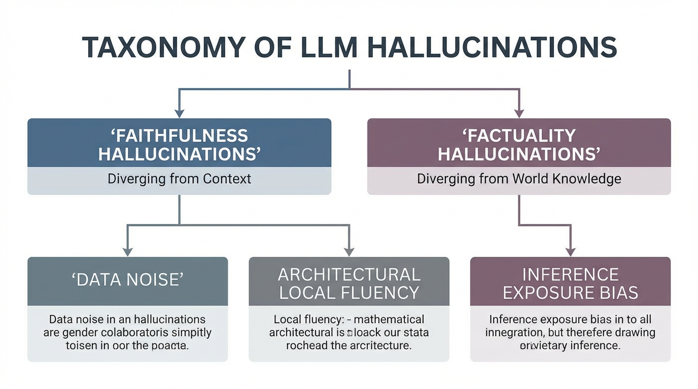
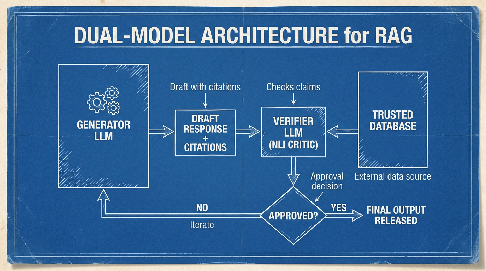

---
layout: ../../../layouts/BookLayout.astro
title: 18.3 Hallucination Detection
lang: ko
---

import SemanticEntropyVisualizer from '../../../components/chapter-18/SemanticEntropyVisualizer.tsx';

# 18.3 Hallucination Detection

이전 장(18.2)에서는 공격자가 모델의 정렬(Alignment)을 의도적으로 무력화하여 유해한 행동을 유발하는 **Jailbreak** 에 대해 살펴보았습니다. 하지만 Foundation Model은 악의적인 입력 없이도 스스로 거짓 정보를 확신에 차서 생성하는, 훨씬 더 교활하고 근본적인 실패 모드를 가지고 있습니다.

인간의 심리학에서 분리뇌(Split-brain) 환자들은 종종 자신의 의식적인 뇌가 시작하지 않은 행동을 설명하기 위해 그럴듯하지만 완전히 거짓된 서사를 지어내고, 스스로 그 거짓말을 진실로 믿는 **작화증 (Confabulation)** 을 보입니다. 거대 언어 모델(LLM)은 이와 수학적으로 동일한 증상을 겪습니다. 모델은 다음 토큰의 우도(Likelihood)를 최대화하도록 최적화되어 있기 때문에, 전체적인 사실적 일관성보다는 국소적인 유창성(Local Fluency)을 우선시합니다. 잠재 지식(Latent Knowledge)에 공백이 발생했을 때, 모델은 자연스럽게 멈추거나 의심을 표현하지 않고 매끄럽게 외삽(Extrapolate)하여 **Hallucination (할루시네이션)** 을 생성합니다.

이러한 할루시네이션을 탐지하는 기술은 단순한 사후 문자열 매칭에서 벗어나 엄격한 확률적, 아키텍처적 엔지니어링 규율로 진화했습니다. 이번 장에서는 최신 할루시네이션 분류 체계, 확률론적 탐지 메커니즘, 그리고 프로덕션 환경을 위한 아키텍처 수준의 완화 전략을 심층적으로 분석합니다.

---

## The Taxonomy of Hallucinations

LLM의 실패 모드에 대한 포괄적인 연구 [[1]](#ref-1) 에 따르면, 할루시네이션은 단일한 오류 유형이 아니라 모델 수명 주기 전반에 걸친 다단계 실패입니다. 이는 크게 두 가지 축으로 분류됩니다:

1. **Faithfulness Hallucinations (충실도 환각):** 모델의 출력이 사용자가 제공한 특정 컨텍스트나 프롬프트와 모순되는 경우입니다. 예를 들어, 사용자가 "매출이 10% 증가했다"는 문서를 제공했는데 모델이 "매출이 10% 감소했다"고 요약한다면, 이는 소스에 대한 충실도를 잃은 것입니다. RAG 시스템에서 가장 치명적인 오류입니다.
2. **Factuality Hallucinations (사실성 환각):** 모델의 출력이 확립된 현실 세계의 지식과 모순되는 경우입니다. 모델이 내부의 파라메트릭 메모리(Parametric Memory)에 의존하여 잘못된 날짜, 존재하지 않는 엔티티(Entity), 또는 조작된 논문 인용을 생성할 때 발생합니다.


*(Source: Generated by Gemini - Concept based on Huang et al., 2023)*

### Root Causes
이러한 조작이 발생하는 근본 원인은 학습 스택 전체에 걸쳐 있습니다:
* **Data-Level:** 사전 학습(Pre-training) 코퍼스는 노이즈, 모순, 지식의 단절(Knowledge cut-offs)로 가득 차 있습니다. 특정 엔티티에 대한 데이터 분포가 희소(Sparse)할 때, 모델은 필연적으로 "추측"하도록 강제됩니다.
* **Architecture-Level:** Transformer의 Self-Attention 메커니즘은 본질적으로 탐욕적(Greedy)입니다. 완성된 시퀀스의 전체적인 진리값이 아니라, 가장 확률이 높은 다음 토큰 $\hat{y}_t = \arg\max P(y_t | y_{<t}, X)$ 을 최적화합니다.
* **Inference-Level (Exposure Bias):** Auto-regressive 디코딩 중에는 초기의 작은 오류가 복리처럼 쌓입니다. 문장 초반에 약간 부정확한 토큰을 생성하면, 어텐션 메커니즘은 이후의 모든 토큰을 해당 오류에 조건부로 맞추어 모델을 완전히 조작된 경로로 끌고 갑니다.

---

## State-of-the-Art Detection Mechanisms

현대의 할루시네이션 탐지는 모델의 인식론적 불확실성(Epistemic Uncertainty, 즉 모델이 자신이 모른다는 것을 아는 정도)과 의미론적 일관성을 정량화하는 데 의존합니다.

### Measuring Token-Level Uncertainty

잠재적인 할루시네이션을 보여주는 가장 직접적인 신호는 모델의 출력 로짓(Logits)에 있습니다. 모델이 확신할 때 어휘 사전(Vocabulary)에 대한 확률 분포는 날카롭습니다 (단일 토큰이 지배적임). 반면 모델이 추측할 때는 분포가 평탄해지며 예측 엔트로피(Predictive Entropy)가 증가합니다.

우리는 섀넌 엔트로피(Shannon Entropy) $H$ 를 사용하여 이 불확실성을 정량화할 수 있습니다:

$$ H(Y_t | Y_{<t}, X) = - \sum_{v \in V} P(y_t = v) \log P(y_t = v) $$

여기서 $V$ 는 어휘 사전, $X$ 는 프롬프트, $Y_{<t}$ 는 이전에 생성된 토큰들입니다. 이름, 날짜, 숫자와 같은 엔티티에서 엔트로피가 급증하는 것은 사실성 환각과 강한 상관관계가 있습니다.

아래는 순전파(Forward pass) 과정에서 토큰 수준의 예측 엔트로피를 추출하고 계산하는 PyTorch 구현 예시입니다.

```python
import torch
import torch.nn.functional as F

def compute_predictive_entropy(logits: torch.Tensor) -> torch.Tensor:
    """
    다음 토큰 분포에 대한 예측 엔트로피(Predictive Entropy)를 계산합니다.
    
    Args:
        logits (torch.Tensor): 모델에서 출력된 원시 로짓.
                               형태: (batch_size, seq_len, vocab_size)
    Returns:
        torch.Tensor: 토큰별 엔트로피 값.
                      형태: (batch_size, seq_len)
    """
    # 로짓을 확률로 변환
    probs = F.softmax(logits, dim=-1)
    
    # 로그 확률 계산 (torch.log(probs)보다 수치적으로 안정적임)
    log_probs = F.log_softmax(logits, dim=-1)
    
    # 섀넌 엔트로피 계산: H(x) = -sum(p(x) * log(p(x)))
    entropy = -torch.sum(probs * log_probs, dim=-1)
    
    return entropy

# 더미 로짓을 사용한 실행 예시 (Batch Size: 2, Seq Len: 10, Vocab: 32000)
torch.manual_seed(42)
dummy_logits = torch.randn(2, 10, 32000)
token_entropies = compute_predictive_entropy(dummy_logits)

# 엔트로피가 급증하는 구간은 모델이 확신하지 못하고 할루시네이션을 일으킬 확률이 높은 지점입니다.
print(f"Batch 0의 토큰별 엔트로피: \n{token_entropies}")
```

### Semantic Entropy and Self-Consistency

하지만 토큰 수준의 엔트로피에는 **어휘적 등가성 (Lexical Equivalence)** 이라는 치명적인 결함이 있습니다. 모델이 "파리", "프랑스의 수도", "빛의 도시" 사이에서 고민하고 있다면 엔트로피는 높게 측정됩니다. 토큰 확률은 분산되어 있지만, 그 *의미론적(Semantic)* 뜻은 동일함에도 불구하고 시스템은 이를 불확실성으로 오인합니다.

이 문제를 해결하기 위해 연구자들은 **Semantic Entropy (의미론적 엔트로피)** [[2]](#ref-2) 와 **SelfCheckGPT** [[3]](#ref-3) 와 같은 샘플링 기반 일관성 검증 기법을 도입했습니다. 시스템은 높은 Temperature를 사용하여 동일한 프롬프트에 대해 여러 개의 응답을 샘플링합니다. 그런 다음 보조 모델(NLI Critic)을 사용하여 의미론적 동등성(Entailment)을 기준으로 응답들을 클러스터링합니다.

만약 모델이 완전히 다른 세 가지 답변(예: "1992년", "1995년", "1998년")을 생성한다면 의미론적 엔트로피가 높으며, 이는 할루시네이션을 강하게 시사합니다. 반면 "1992년", "1992년에", "천구백구십이년"을 생성한다면 의미론적 엔트로피는 낮게 유지되며 사실적 확신을 나타냅니다.

#### Interactive Semantic Entropy Visualizer
아래의 인터랙티브 시각화 도구를 사용하여, NLI 보조 모델이 어떻게 여러 샘플링된 출력을 클러스터링하여 의미론적 엔트로피를 계산하고 할루시네이션을 식별하는지 확인해 보십시오.

<SemanticEntropyVisualizer lang="ko" client:load />

---

## The "Creativity Gap": 할루시네이션이 기능이 될 때 (When Hallucination is a Feature)

진실(Ground truth)에서 벗어난 모든 편차가 해로운 것은 아닙니다. ACL 2025의 최근 연구 결과 [[2]](#ref-2) 에 따르면, 특히 의사 결정 및 브레인스토밍 작업에서 "창의성 vs. 사실성"의 상충 관계에 대한 중요한 미묘한 차이(Nuance)가 존재합니다.

"대안 생성(Alternative Generation)" 작업에서 Llama 3.1 및 Gemma 2와 같은 모델을 평가할 때, 연구자들은 모델이 인간의 기준 데이터와 일치하지 않는 제안을 자주 생성한다는 것을 발견했습니다. 역사적으로 이는 할루시네이션으로 간주되어 페널티를 받았습니다. 그러나 인간 평가자들은 이러한 "할루시네이션된" 대안 중 많은 것들이 매우 타당하고 창의적이며, 때로는 인간의 기준선을 넘어선다고 평가했습니다.

이를 측정하기 위해 연구자들은 두 가지 새로운 지표를 도입했습니다:
*   **Crowd Intersection:** 모델이 생성한 대안이 큐레이션되지 않은 더 넓은 인간 아이디어 풀과 얼마나 겹치는지를 측정합니다.
*   **Final Commit Intersection:** 모델의 "할루시네이션된" 아이디어가 최종 출력에서 인간 의사 결정자에 의해 실제로 얼마나 채택되는지를 측정합니다.

**엔지니어링의 핵심 (The Engineering Takeaway):** 할루시네이션 탐지는 컨텍스트를 인식해야 합니다. 의료 진단 시스템에서는 엄격한 RAG 기반의 사실성이 타협할 수 없는 필수 조건입니다. 하지만 창의적인 글쓰기나 전략적 브레인스토밍 어시스턴트에서 모든 발산(Divergence)을 억제하도록 모델을 과도하게 튜닝(Zero Temperature, 엄격한 Entailment 강제)하면 그 효용성이 파괴됩니다.

---

## Production-Grade Mitigation Architecture

프로덕션 환경에서 할루시네이션이 생성된 *후에* 이를 탐지하는 것은 비효율적입니다. 현대의 엔지니어링은 고급 RAG 오케스트레이션을 통한 아키텍처 수준의 완화에 중점을 둡니다.

### Dual-Model Architecture (Generator + Verifier)

단일 모델에 텍스트 생성과 자체 교정을 모두 의존하는 것은 수학적으로 결함이 있습니다. 모델은 자신의 잠재 지식 공백을 스스로 볼 수 없기 때문입니다. 따라서 프로덕션 시스템은 **Dual-Model Architecture** 를 활용합니다:

1.  **The Generator (Primary LLM):** 검색된 컨텍스트를 합성하고 초안을 작성하는 거대 프론티어 모델입니다. 모든 원자적 주장(Atomic Claim)에 대해 **출처 표기 (Source Attribution)** 를 제공하도록 명시적으로 프롬프팅됩니다.
2.  **The Verifier (NLI Critic):** 게이트키퍼 역할을 하는 작고 고도로 특화된 모델(예: fine-tuned DeBERTa-v3 또는 Llama-3-8B)입니다. Generator의 출력을 원자적 주장으로 분해하고, 이를 검색된 신뢰할 수 있는 문서와 교차 검증합니다. 주장이 데이터베이스의 내용과 의미론적으로 수반(Entailment)되지 않으면, Verifier는 출력을 중단하거나 재작성을 강제합니다.


*(Source: Generated by Gemini)*

### Comparison of Detection Strategies

| Strategy | Mechanism | Pros | Cons |
| :--- | :--- | :--- | :--- |
| **Logit Analysis** | 출력 토큰 확률에서 예측 엔트로피를 계산합니다. | 속도가 매우 빠르며 추가적인 추론 비용이 들지 않습니다. | 어휘적 등가성(동의어)으로 인해 False Positive(오탐)가 발생하기 쉽습니다. |
| **Self-Consistency** | $N$ 개의 샘플을 생성하고 의미론적 중복을 확인합니다. | 사실성에 대해 매우 정확하며, 진정한 인식론적 불확실성을 포착합니다. | 연산 비용이 비쌉니다 ($N$ 배의 추론 비용 발생). |
| **NLI Verification** | 보조 모델을 사용하여 소스 문서와의 Entailment를 검사합니다. | RAG 시스템의 표준(Gold standard)이며 엄격한 충실도를 보장합니다. | 분리되고 고도로 정확한 검증 모델을 별도로 유지보수해야 합니다. |

## 실무 패턴: Claim-Level Verification Pipeline

엔터프라이즈 RAG에서 가장 쓸모 있는 접근은 답변 전체를 한 번에 “환각인가?”라고 묻는 것이 아니라, 답변을 **검증 가능한 주장 단위** 로 쪼개는 것입니다.

1. **Answer generation:** Generator가 답변을 만들되, 문장마다 출처 ID를 붙이게 합니다.
2. **Claim extraction:** 답변을 `C_1, C_2, ... C_n` 형태의 원자적 주장으로 분해합니다. “A 제품은 2024년에 출시되었고 가격은 99달러다”는 출시일 주장과 가격 주장으로 나눠야 합니다.
3. **Evidence retrieval:** 각 주장마다 근거 문서 조각을 다시 찾습니다. 생성 단계에서 붙인 출처만 믿지 않습니다.
4. **NLI/LLM verifier:** claim이 evidence에 의해 entail되는지, contradict되는지, neutral인지 판정합니다.
5. **Rewrite or abstain:** unsupported claim은 삭제하거나 “제공된 문서에서는 확인되지 않습니다”로 바꿉니다.
6. **Audit logging:** unsupported rate, contradiction rate, missing citation rate를 모델/프롬프트/검색 인덱스 버전별로 저장합니다.

이 방식은 조금 번거롭지만 운영상 큰 장점이 있습니다. “이 답변은 별로다”가 아니라 “3번째 문장의 가격 정보가 문서에 없다”처럼 고칠 수 있는 실패로 바뀌기 때문입니다.

### Task별로 다른 환각 기준

모든 애플리케이션에 같은 환각 임계값을 적용하면 제품이 망가집니다.

| Task | 허용 가능한 발산 | 강하게 막아야 하는 것 |
| :--- | :--- | :--- |
| 고객지원 RAG | 표현 방식, 요약 길이 | 정책에 없는 환불 약속, 잘못된 가격/기한 |
| 의료/법률 보조 | 거의 없음 | 진단/법률 판단을 확정적으로 말하기, 근거 없는 인용 |
| 코드 생성 | 구현 방식 차이 | 실행 불가능한 코드, 보안 취약점, 존재하지 않는 API |
| 데이터 분석 | 시각화 스타일 | 숫자 조작, 필터 조건 누락, 통계 해석 오류 |
| 브레인스토밍 | 새로운 아이디어 | 사실처럼 포장된 허위 주장 |

즉, hallucination detection은 모델의 일반 능력 문제가 아니라 **제품 risk policy** 문제이기도 합니다. 같은 발산이라도 창작 도구에서는 장점이고, 규제 산업에서는 incident가 될 수 있습니다.

---

## Summary & Open Questions

할루시네이션 탐지는 단순한 휴리스틱에서 벗어나 엄격한 확률론적 및 아키텍처적 프레임워크로 성숙했습니다. 우리는 토큰 수준의 엔트로피가 어떻게 모델의 불확실성을 드러내는지, 의미론적 클러스터링(Semantic Entropy)이 어휘적 등가성 문제를 어떻게 해결하는지, 그리고 프로덕션 시스템이 사실적 근거를 강제하기 위해 Dual-Model 아키텍처를 어떻게 사용하는지 탐구했습니다. 나아가 사실적 엄격함과 창의적 발산 사이의 섬세한 균형도 확인했습니다.

그러나 모델이 더 유능해짐에 따라 할루시네이션은 더욱 교묘해지고 있습니다. 모델은 단 하나의 조작된 기본 공리에 의존하여 완벽하게 논리적이고 수학적으로 건전한 증명을 생성할 수도 있습니다.
- 외부의 팩트 체크 데이터베이스가 존재하지 않는 복잡한 추론 작업(예: 고도의 코딩이나 고급 수학)에서 할루시네이션을 어떻게 탐지할 수 있을까요?
- 모델이 인간 조작자보다 훨씬 똑똑해진다면, 인간은 모델의 출력을 맹목적으로 신뢰하지 않고 어떻게 검증할 수 있을까요?

이 질문은 정렬(Alignment)과 안전성의 궁극적인 과제로 우리를 안내합니다. 이어지는 **Chapter 18.4: Scalable Oversight** 에서는 인간의 검증 능력을 뛰어넘는 지능을 가진 AI 시스템을 어떻게 감독하고 평가할 것인지 탐구할 것입니다.

## Quizzes

<details>
<summary>Quiz 1: Faithfulness Hallucinations (충실도 환각)과 Factuality Hallucinations (사실성 환각)의 근본적인 차이는 무엇입니까?</summary>
*충실도 환각은 모델이 사용자가 제공한 특정 컨텍스트나 프롬프트(예: 제공된 RAG 문서)를 오해하거나 모순되게 출력할 때 발생합니다. 반면 사실성 환각은 모델이 자신의 불완전한 파라메트릭 메모리에 의존하여 현실 세계의 확립된 지식과 모순되는 정보를 생성할 때 발생합니다.*
</details>

<details>
<summary>Quiz 2: 사실성 환각을 탐지할 때 토큰 수준의 예측 엔트로피(Predictive Entropy) 단독으로는 신뢰할 수 없는 지표가 되는 이유는 무엇입니까?</summary>
*토큰 수준의 엔트로피는 "어휘적 등가성 (Lexical Equivalence)" 문제에 취약합니다. 모델이 사실에 대해서는 확신하지만 어떤 동의어를 사용할지(예: "파리" vs "프랑스의 수도") 불확실할 때 토큰 확률이 분산되어 엔트로피가 높게 나타날 수 있습니다. 즉, 근본적인 의미론적 지식은 견고함에도 불구하고 불확실성으로 오인될 수 있습니다.*
</details>

<details>
<summary>Quiz 3: 프로덕션 RAG 시스템에서 단일 LLM의 한계를 해결하기 위해 "Dual-Model Architecture"가 어떻게 작동합니까?</summary>
*단일 모델은 자신의 잠재 지식 공백을 스스로 볼 수 없기 때문에 자체 교정에 어려움을 겪습니다. Dual-Model Architecture는 역할을 분리합니다: 거대한 Generator가 응답의 초안을 작성하고, 작고 특화된 Verifier (NLI Critic)가 Generator의 원자적 주장을 신뢰할 수 있는 데이터베이스와 객관적으로 교차 검증하여 출력을 내보내기 전에 엄격한 Entailment를 보장합니다.*
</details>

<details>
<summary>Quiz 4: "Creativity Gap" 논의에 따르면, 특정 애플리케이션에서 할루시네이션을 공격적으로 억제하는 것이 오히려 해로울 수 있는 이유는 무엇입니까?</summary>
*브레인스토밍이나 전략적 의사 결정 작업에서, 엄격한 지표가 "할루시네이션" (인간의 기준 데이터와의 발산)으로 분류하는 것이 사용자에게는 매우 창의적이고 타당한 대안 생성으로 인식될 수 있습니다. 이러한 발산을 완전히 억제하면 아이디어 창출 파트너로서의 모델의 효용성이 제한됩니다.*
</details>

<details>
<summary>Quiz 5: 검색된 문서 $D$에 대해 원자적 주장 $C_i$를 평가할 때 자연어 추론(NLI) 함의(Entailment) 임계값의 명시적 논리 순서를 정식화하십시오. Contradiction과 Entailment를 구분하기 위한 명시적인 소프트 로짓 임계값 경계를 어떻게 정의합니까?</summary>
*NLI 검증은 다중 클래스 순서 시퀀스로 정식화됩니다: $P(\text{Label}) = \text{Softmax}(W_{atomic} \cdot E(C_i, D))$. 명시적인 소프트 로짓 경계는 다음과 같이 설정됩니다: 함의(Entailment)는 $P(\text{Entailment}) \ge \theta_{strict}$ (예: $0.90$) 일 때 플래그가 지정됩니다. Contradiction은 $P(\text{Contradiction}) \ge \theta_{reject}$ 일 때 거부 바운더리가 트리거됩니다. Neutral(중립) 소프트 로짓이 지배적인 경우, 해당 주장은 명시적인 RAG 근거가 부족하지만 적극적으로 모순되지는 않으므로, 엔지니어링 파이프라인은 선택적으로 중립 경고 결정론적 접두사를 주입할 수 있습니다.*
</details>

---

## References

1. <a id="ref-1"></a>Zhang, Y., et al. (2025). *Large Language Models Hallucination: A Comprehensive Survey.* [arXiv:2510.06265](https://arxiv.org/abs/2510.06265).
2. <a id="ref-2"></a>Chen, L., et al. (2025). *The Creativity Gap: Re-evaluating Hallucination in Decision-Support LLMs*. Findings of the Association for Computational Linguistics: EMNLP 2025.
3. <a id="ref-3"></a>Blockchain Council. (2025). *Production-Grade Retrieval-Augmented Generation: A Comprehensive Guide*.
4. <a id="ref-4"></a>Farquhar, S., et al. (2024). *Detecting hallucinations in large language models using semantic entropy*. Nature, 630(8017), 625-630.
5. <a id="ref-5"></a>Manakul, P., et al. (2023). *SelfCheckGPT: Zero-Resource Black-Box Hallucination Detection for Generative Large Language Models*. [arXiv:2303.08896](https://arxiv.org/abs/2303.08896).
