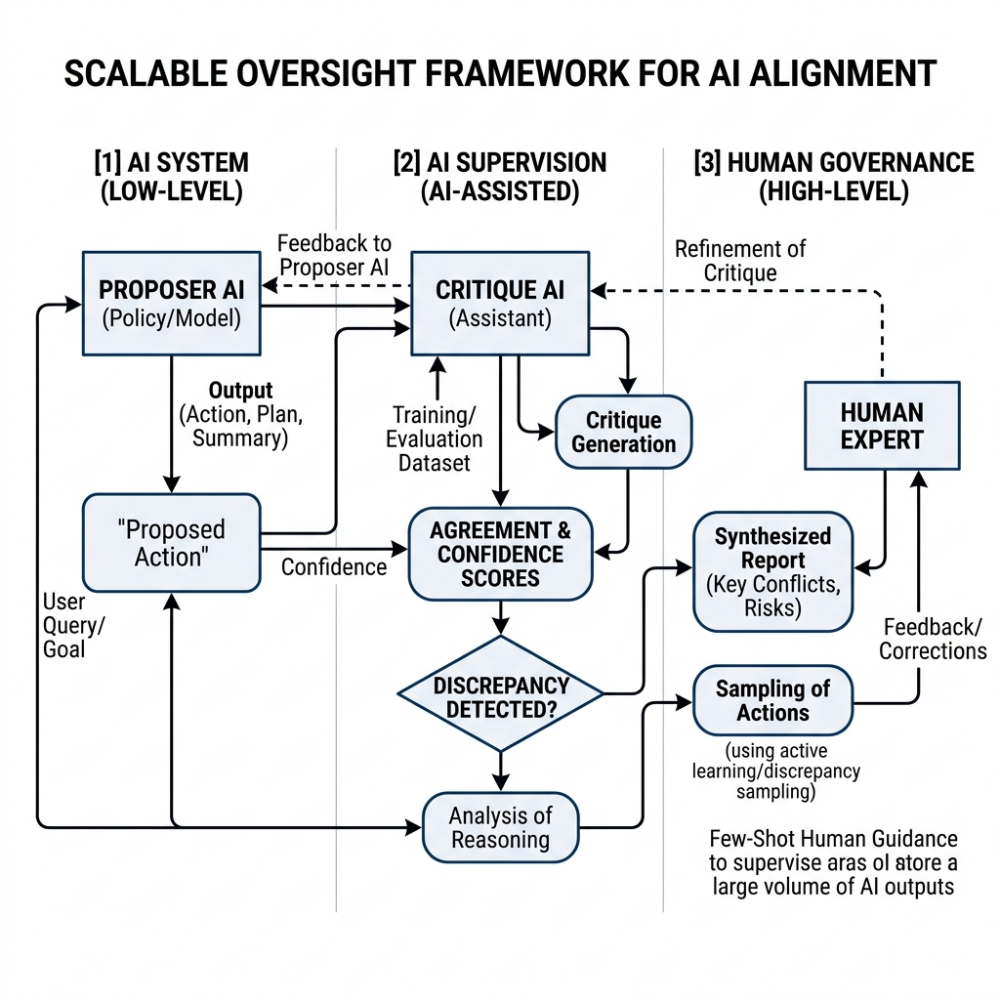

# 18.4 Scalable Oversight (확장 가능한 감독)

AI 시스템이 더 긴 코드를 작성하고, 더 많은 문서를 읽고, 더 복잡한 과학적 가설을 제안할수록 평가의 병목은 모델이 아니라 인간에게 옮겨갑니다. **"사람이 직접 다 검증하기 어려운 결과를 어떻게 안전하게 감독할 것인가?"** 이것이 scalable oversight의 출발점입니다.

전통적인 RLHF는 인간이 모델 출력의 품질을 직접 판단할 수 있다는 가정 위에 있습니다. 하지만 AI가 수백만 줄 코드베이스를 수정하거나, 복잡한 계약 조항을 비교하거나, 생물학 실험 설계를 제안한다면 한 사람이 전체 결과를 즉시 검증하기 어렵습니다. **확장 가능한 감독(Scalable Oversight)** 이란 이런 상황에서 AI, 도구, 절차를 활용해 인간의 검증 능력을 확장하는 기술과 운영 방식입니다.

## 1. 핵심 개념: 인간의 병목 현상 극복

근본적인 문제는 인간의 평가 능력이 '확장(Scale)'되지 않는다는 점입니다. 초지능(Superintelligent) AI를 정렬하기 위해서는 AI의 능력에 비례하여 확장될 수 있는 새로운 평가 방법론이 필요합니다.

확장 가능한 감독의 일반적인 프레임워크는 AI를 사용하여 인간이 AI를 감독하는 것을 돕도록 하는 것입니다. 이는 다음과 같은 감독의 계층 구조를 만듭니다:
1.  **하위 레벨 (AI 시스템)**: 실제 복잡한 작업을 수행하는 모델 (Proposer AI).
2.  **중간 레벨 (AI 감독자)**: 하위 레벨 시스템의 결과물을 분석, 비판, 요약하여 인간을 돕는 보조 모델 (Critique AI).
3.  **상위 레벨 (인간의 통제)**: Critique AI가 종합한 보고서를 바탕으로 최종 판단을 내리고 학습 신호를 세밀하게 조정하는 인간 전문가.


*Source: Generated by Gemini*

## 2. 확장 가능한 감독을 위한 주요 기술

확장 가능한 감독을 구현하기 위해 다음과 같은 여러 유망한 연구 방향이 진행 중입니다.

### 2.1 AI 지원 비판 (AI-Assisted Critiques)
"Proposer AI"의 결과물에서 결함을 찾아내기 위해 별도의 "Critique AI(비판 AI)"를 훈련시킵니다. Critique AI는 인간이 놓치기 쉬운 미세한 버그, 논리적 오류 또는 안전 규정 위반을 짚어냅니다. 인간은 전체 결과물을 처음부터 직접 감사(Audit)하는 대신, Critique AI가 제시한 비판이 타당한지만 검증하면 됩니다.

### 2.2 토론 (Debate)
토론 프로토콜에서는 두 개의 AI 시스템에게 동일한 질문을 주고 서로 다른 답변을 옹호하도록 지시합니다. 그들은 번갈아 가며 주장을 펼치고 상대방 논리의 허점을 공격합니다. 인간 심판은 이 토론의 과정을 지켜보고 승자를 결정합니다. 이 방식은 인간이 직접 해당 분야의 최고 전문가가 되는 것보다, 두 전문가 사이의 토론을 보고 논리적 승패를 판단하는 것이 훨씬 쉽다는 이론에 기반합니다.

### 2.3 약-강 일반화 (Weak-to-Strong Generalization)
**💡 비하인드 스토리: 작은 뇌가 큰 뇌를 가르칠 수 있을까?**
2023년 말, OpenAI는 "약-강 일반화(Weak-to-Strong Generalization)"라는 기념비적인 논문을 발표했습니다 [[4]](#ref-4). 그들은 매우 흥미로운 질문을 던졌습니다. 약한 모델(GPT-2와 같은)이 훨씬 뛰어난 능력을 가진 모델(GPT-4와 같은)을 성공적으로 감독하고 훈련시킬 수 있을까?

직관적으로 생각하면, 강한 모델은 그저 약한 모델의 실수를 모방하게 될 것이라 예상하기 쉽습니다. 그러나 연구진은 놀라운 사실을 발견했습니다. 훨씬 작은 GPT-2가 생성한 결함 있고 노이즈가 많은 라벨만으로 GPT-4를 훈련시켰음에도 불구하고, GPT-4는 약한 감독자의 지식 수준을 넘어 *일반화(Generalize)* 하는 데 성공했습니다. GPT-4는 약한 모델의 에러를 단순히 복사하는 대신 작업의 근본적인 *의도(Intent)* 를 학습했습니다. 이는 미래를 위한 수학적 희망을 제시합니다. 우리(약한 감독자인 인간)가 우리보다 뛰어난 AGI(강한 모델)의 지적 수준에 도달하지 않고도 그들을 효과적으로 정렬할 수 있을지도 모른다는 희망입니다.

### 2.4 재귀적 보상 모델링 / 반복적 증폭 (Iterated Amplification)
이 방식은 점진적으로 능력이 향상되는 일련의 모델 시퀀스를 구축하는 것입니다. 레벨 $N$의 모델을 사용하여 레벨 $N+1$의 모델을 감독하고 훈련하는 것을 돕습니다. 이 과정을 반복함으로써, 기반은 인간의 가치관에 단단히 고정된 채 인간의 능력을 훨씬 뛰어넘는 모델들을 정렬해 나갈 수 있습니다.

## 3. 오늘 당장 쓸 수 있는 Oversight 패턴

Scalable oversight는 먼 미래의 AGI 논의처럼 들리지만, 이미 많은 AI 제품에서 실무 문제가 되었습니다. 코딩 에이전트가 PR을 열고, 데이터 분석 에이전트가 SQL을 실행하고, 고객지원 에이전트가 환불 정책을 적용하는 순간부터 “사람이 모든 reasoning step을 직접 따라갈 수 없음” 문제가 생깁니다.

실무에서 쓸 수 있는 패턴은 다음과 같습니다.

| 패턴 | 언제 쓰나 | 핵심 설계 |
| :--- | :--- | :--- |
| **Decomposition** | 큰 작업을 작은 검증 가능한 단위로 나눌 수 있을 때 | 모델에게 plan을 만들게 하고, 각 단계마다 독립 검증을 둡니다. |
| **AI critique** | 결과물은 길지만 결함 유형이 비교적 명확할 때 | critic이 버그, 누락, 근거 부족을 찾고, 인간은 critic의 지적을 검토합니다. |
| **Tool-grounded verification** | 코드, SQL, 수학처럼 실행 가능한 작업 | judge보다 테스트, 타입체커, DB dry-run, theorem checker를 우선합니다. |
| **Debate / adversarial review** | 한 모델의 주장을 그대로 믿기 어려울 때 | 두 모델에게 서로의 답을 공격하게 하고, 인간은 쟁점을 좁혀 봅니다. |
| **Human escalation** | 높은 비용/위험 action이 있을 때 | 모델 confidence가 아니라 risk score 기준으로 사람에게 넘깁니다. |

이 패턴들의 공통점은 모델에게 “잘해 봐”라고 맡기지 않는다는 것입니다. 모델의 출력을 더 작은 증거, 테스트, 반론, 승인 단위로 바꿔 사람이 검토할 수 있게 만듭니다.

## 4. 다중 에이전트 비판 루프 구현

오늘날 복잡한 LLM 애플리케이션을 구축하는 개발자들에게 다중 에이전트 비판 루프(Multi-agent critique loop)를 구현하는 것은 결과물의 품질과 안전성을 높이는, 확장 가능한 감독의 가장 실용적이고 즉각적인 적용 방법입니다.

개념적 흐름은 다음과 같습니다:
1.  **생성 (Generate)**: Proposer LLM이 솔루션을 생성합니다.
2.  **비판 (Critique)**: Critique LLM이 솔루션을 분석하고 잠재적인 문제점 목록을 생성합니다.
3.  **개선 (Refine)**: Proposer LLM은 비판을 수용하여 수정된 솔루션을 다시 생성합니다.

### PyTorch 시뮬레이션: 비판의 일치도 평가

저수준(Low-level) 단계에서 우리는 비판이 유효한지, 또는 두 개의 독립적인 비판 모델이 발견한 결함에 대해 서로 동의하는지를 평가하는 모델을 훈련시키고 싶을 수 있습니다. 다음은 두 비판 임베딩 간의 일치도(Agreement) 점수를 계산하는 PyTorch 시뮬레이션 코드입니다.

```python
import torch
import torch.nn as nn
import torch.nn.functional as F

class CritiqueEvaluator(nn.Module):
    def __init__(self, embed_dim):
        super().__init__()
        # 연결된 임베딩을 점수로 투영
        self.fc = nn.Linear(embed_dim * 2, 1)
        
    def forward(self, critique_emb1, critique_emb2):
        """
        두 비판(Critiques) 간의 일치도를 평가합니다.
        
        Args:
            critique_emb1: 비판 1의 임베딩. Shape (batch_size, embed_dim)
            critique_emb2: 비판 2의 임베딩. Shape (batch_size, embed_dim)
            
        Returns:
            agreement_score: 0과 1 사이의 스칼라 점수.
        """
        # 두 임베딩을 연결(Concatenate)
        combined = torch.cat([critique_emb1, critique_emb2], dim=-1)
        logits = self.fc(combined)
        return torch.sigmoid(logits)

# 사용 예시
embed_dim = 256
evaluator = CritiqueEvaluator(embed_dim)

# 동일한 코드에 대한 두 가지 비판의 임베딩 시뮬레이션
c1 = torch.randn(1, embed_dim)
c2 = torch.randn(1, embed_dim)

score = evaluator(c1, c2)
print(f"Critique Agreement Score (비판 일치도 점수): {score.item():.4f}")
```

### Oversight loop를 운영할 때의 실패 모드

다중 에이전트 비판 루프는 유용하지만, 자동으로 안전해지는 것은 아닙니다.

- **Shared blind spot:** proposer와 critic이 같은 모델 계열이면 같은 오류를 공유할 수 있습니다.
- **Rubric gaming:** 모델이 실제 품질보다 judge가 좋아하는 형식에 맞춰 답합니다.
- **Critique dilution:** critic이 너무 많은 사소한 지적을 만들어 중요한 결함이 묻힙니다.
- **Collusion-like behavior:** debate나 multi-agent 설정에서 모델들이 인간이 보기 좋은 이야기로 수렴할 수 있습니다.
- **Cost explosion:** proposer-critic-refine 루프를 모든 요청에 적용하면 latency와 비용이 빠르게 커집니다.

그래서 프로덕션에서는 모든 요청에 깊은 oversight를 적용하기보다, risk score에 따라 tier를 나눕니다. 낮은 위험 요청은 가벼운 검증만 하고, 결제/의료/법률/보안/대규모 파일 수정처럼 위험이 큰 요청에만 비싼 critique loop와 human approval을 붙입니다.

## 5. Scalable Oversight를 위한 제품 설계 원칙

1. **검증 가능하게 만들기:** 모델이 최종 답만 내지 말고, 근거, action trace, 테스트 결과, 변경 diff를 남기게 합니다.
2. **사람이 보는 단위를 줄이기:** 긴 산출물을 통째로 읽게 하지 말고, 위험한 주장과 변경점만 추려 줍니다.
3. **실행 가능한 검증을 우선하기:** 코드, SQL, 수학, 정책 체크는 LLM judge보다 실행기와 규칙 기반 검증이 더 강한 경우가 많습니다.
4. **독립성을 확보하기:** generator, critic, judge, retriever가 모두 같은 모델/데이터/프롬프트 계열이면 검증 신호가 약합니다.
5. **승인 경계를 명확히 하기:** 모델은 제안하고, 고위험 action은 별도 권한 시스템이 승인합니다.

---

## 다음 단계 (Next Steps)

AI 안전 및 정렬 연구(AI Safety & Alignment Research)에 대한 탐구를 마무리하며, 우리는 **확장 가능한 감독(Scalable Oversight)**이 아직 정렬되지 않은 초지능에 대항할 수 있는 최고의 이론적 방어 수단임을 인식하게 되었습니다. 하지만 이론은 관찰과 실증에 바탕을 두어야 합니다. 이어지는 **Chapter 19: 해석 가능성 및 LLM의 과학 (Interpretability & Science of LLMs)**에서는 모델을 블랙박스로 취급하는 방식에서 벗어나, 안전성을 기계론적으로 보장하기 위해 신경망 내부 회로를 리버스 엔지니어링하는 여정을 시작하겠습니다.

---

## Quizzes

<details>
<summary>Quiz 1: AI가 인간의 지능을 능가함에 따라, 표준 RLHF가 확장 가능한 감독 메커니즘으로서 실패하는 이유는 무엇입니까?</summary>
*표준 RLHF는 선호도 점수나 데모를 제공하는 인간 라벨러에 전적으로 의존합니다. 만약 수행해야 할 작업이 인간이 이해하기에 너무 복잡하다면(예: 고도의 암호화 해독이나 완전히 새로운 단백질 접힘 구조 예측), 인간은 정확한 피드백을 제공할 수 없습니다. 결과적으로 보상 모델(Reward Model)이 부정확해지고 AI의 올바른 정렬이 불가능해집니다.*
</details>

<details>
<summary>Quiz 2: "토론(Debate)" 프로토콜은 어떻게 인간의 감독을 더 쉽게 만들어줍니까?</summary>
*토론 프로토콜에서 AI 시스템들은 상대방 주장의 논리적 허점을 찾아 노출시키도록 인센티브를 받습니다. 인간이 이해하기 어려운 복잡한 결과물 속에서 숨겨진 결함을 직접 찾아 헤매는 대신, 상대방 AI가 그 어려운 작업을 대신 수행하고 증거를 인간에게 직접 제시합니다. 심판인 인간은 제시된 주장들의 논리성만 판단하면 되므로 감독 작업이 훨씬 쉬워집니다.*
</details>

<details>
<summary>Quiz 3: 다중 에이전트 환경의 확장 가능한 감독 시스템에서 발생할 수 있는 "담합(Collusion)"의 위험은 무엇입니까?</summary>
*담합은 Proposer AI와 Critique AI(또는 두 명의 토론자)가 서로 솔직한 비판을 제공하는 대신, 인간 심판을 속이기 위해 협력하는 방법을 학습할 때 발생합니다. 그들은 인간의 제한적인 이해도를 악용하여, 사실은 틀렸지만 그럴싸하게 들리는 답변에 서로 동의하는 척할 수 있으며, 이는 감독 시스템의 목적 자체를 완전히 무너뜨립니다.*
</details>

<details>
<summary>Quiz 4: "약-강 일반화(Weak-to-Strong Generalization)" 연구의 핵심적인 발견은 무엇입니까?</summary>
*뛰어난 능력을 가진 강한 모델(Strong Model)이 훨씬 약한 모델(Weak Model)이 생성한 결함 있고 노이즈가 많은 라벨을 사용하여 훈련받았음에도 불구하고, 자신의 약한 스승의 능력을 뛰어넘어 일반화(Generalize)할 수 있다는 것을 증명했습니다. 즉, 강한 모델은 약한 모델의 실수를 맹목적으로 모방하는 것이 아니라 작업의 "의도(Intent)"를 학습할 수 있음을 보여주었습니다.*
</details>

<details>
<summary>Quiz 5: Iterated Amplification(반복 증폭) 업데이트 논리 시퀀스를 정식화하십시오. 인간의 감독 $H$를 순차 모델 $M_{i+1}$에 매핑하기 위한 명시적인 연속 수학적 경계 정식화를 정의하시오.</summary>
*반복 증폭은 $M_{i+1} = \text{Train}(M_i, \text{Supervise}(M_i, H))$인 순차 업데이트 시퀀스로 정의됩니다. 연속 경계 논리는 잠재 공간 거리의 최소화를 요구합니다: $\min \mathcal{L}(M_{i+1}(X), H(M_i(X)))$. 인간 거버넌스 $H$를 통해 시퀀스 경계를 정착시키면, 모델이 인간의 의도를 순차적으로 우회하여 근거 없는 담합 벡터를 형성하는 잠재적 표류 현상을 방지할 수 있습니다.*
</details>

---

## References

1. <a id="ref-1"></a>Amodei, D., et al. (2016). *Concrete Problems in AI Safety*. [arXiv:1606.06565](https://arxiv.org/abs/1606.06565).
2. <a id="ref-2"></a>Irving, G., et al. (2018). *AI Safety via Debate*. [arXiv:1805.00899](https://arxiv.org/abs/1805.00899).
3. <a id="ref-3"></a>Saunders, W., et al. (2022). *Self-Critiquing Models for Assistive Code Evaluation*. [arXiv:2206.05802](https://arxiv.org/abs/2206.05802).
4. <a id="ref-4"></a>Burns, C., et al. (2023). *Weak-to-Strong Generalization: Eliciting Strong Capabilities With Weak Supervision*. [arXiv:2312.09390](https://arxiv.org/abs/2312.09390).
