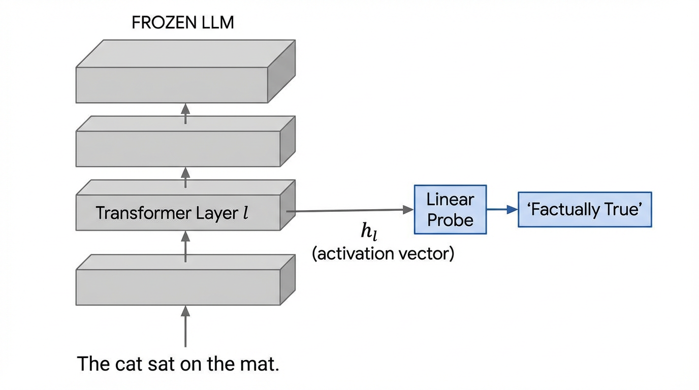
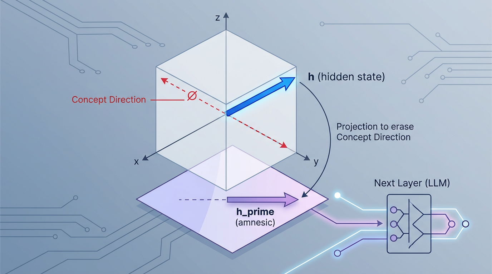

import LinearProbeVisualizer from '../../../components/chapter-19/LinearProbeVisualizer.tsx';

# 19.3 Probing Classifiers

이전 장에서 살펴본 **Logit Lens** 는 매우 강력한 도구이지만, 근본적인 한계점을 가지고 있습니다. 바로 모델이 *출력하려고 의도한 것* 만을 보여준다는 점입니다. Residual Stream 을 Unembedding 행렬을 통해 어휘 공간(Vocabulary space)으로 직접 투영함으로써, 우리는 모델의 즉각적인 예측 의도만을 엄격하게 관찰하게 됩니다.

하지만 모델이 겉으로 명시적으로 말하지 않는 지식을 내부에 품고 있다면 어떨까요?
* 다음 예측 단어가 동사가 아니더라도, 모델은 문장의 주어가 복수형(Plural)이라는 사실을 알고 있을까요?
* 모델이 거짓말을 하도록 프롬프팅(Prompting)된 상황에서, 모델은 내부적으로 그 문장이 사실이 아니라는 것을 *알고* 있을까요?
* "비꼬기(Sarcasm)"나 "감정(Sentiment)"과 같은 고차원적 개념이 은닉 상태(Hidden states)에서 명시적으로 추적되고 있을까요?

이러한 질문에 답하기 위해 우리는 Unembedding 행렬에 의존할 수 없습니다. 대신, 모델의 내부 표현(Representations)을 직접 심문해야 합니다. 이를 위해 우리는 모델의 동결된 은닉 상태 위에서 보조 분류기인 **탐침(Probe)** 을 학습시킵니다.

---

## 1. The Interrogation Room: What is a Probe?

**Probing** (탐침)의 핵심 아이디어는 사전 학습되고 동결된(Frozen) 거대 언어 모델(LLM)을 거대한 특징 추출기(Feature extractor)로 취급하는 것입니다. 입력 데이터셋 $X$ 를 모델에 통과시키고, 특정 레이어 $l$ 에서 연속적인 활성화 벡터(Activation vectors) $h_l \in \mathbb{R}^d$ 를 추출합니다.

그런 다음, 이 활성화 값들로부터 특정 속성 $Y$ (예: 품사, 구문 트리 깊이, 혹은 사실적 진위 여부)를 예측하기 위해 가볍고 작은 지도 학습 모델(탐침) $f_\theta: \mathbb{R}^d \rightarrow \mathcal{Y}$ 를 학습시킵니다.


*출처: AI 생성 이미지*

만약 이 탐침 모델이 높은 정확도를 달성한다면, 우리는 속성 $Y$ 를 예측하는 데 필요한 정보가 레이어 $l$ 의 표현 내부에 성공적으로 인코딩되어 있다고 결론 내릴 수 있습니다.

---

## 2. The Linear Representation Hypothesis

탐침을 설계할 때 매우 중요한 질문이 제기됩니다. *"탐침 모델은 얼마나 복잡해야 하는가?"*

만약 깊고 파라미터가 많은 다층 퍼셉트론(MLP)을 탐침으로 사용한다면, 쉽게 100%의 정확도를 달성할 수 있을 것입니다. 하지만 강력한 MLP는 LLM의 내부 구조를 해석하는 대신, 원본 데이터로부터 *작업 자체를 스스로 학습* 해버릴 위험이 있습니다. 이 시나리오에서 탐침은 LLM의 마음을 읽는 것이 아니라, LLM을 대신해 스스로 생각하고 있는 셈입니다.

이러한 문제를 방지하기 위해 연구자들은 압도적으로 **선형 표현 가설 (Linear Representation Hypothesis, LRH)** 에 의존합니다 [[1]](#ref-1). LRH 는 최신 신경망이 고차원적이고 의미론적인(Semantic) 개념을 고차원 활성화 공간 내의 선형 방향(Linear directions) 또는 초평면(Hyperplanes)으로 인코딩한다고 가정합니다.

따라서 표준적인 관행은 로지스틱 회귀(Logistic Regression)나 단일 선형 레이어와 같은 **선형 탐침 (Linear Probes)** 을 사용하는 것입니다. 수학적 공식은 의도적으로 단순하게 제한됩니다.

$$ \hat{y} = \text{argmax}(\text{softmax}(W \cdot h_l + b)) $$

만약 단순한 선형 초평면이 복잡한 개념(예: 참인 문장과 거짓인 문장)을 성공적으로 분리해 낼 수 있다면, 이는 LLM이 레이어 $l$ 에 도달하기 전에 해당 개념을 추출하고 조직화하는 무거운 계산 작업을 *이미 스스로 수행했다* 는 강력한 증거가 됩니다.

---

## 3. Engineering a Linear Probe (PyTorch)

탐침을 학습시키는 과정은 크게 두 단계로 나뉩니다. 동결된 LLM에서 활성화 값을 추출하는 단계와, 선형 분류기를 학습시키는 단계입니다. 아래는 미리 추출된 활성화 값 위에서 선형 탐침을 학습시키는 현실적인 PyTorch 구현 예시입니다.

```python
import torch
import torch.nn as nn
from torch.utils.data import DataLoader, TensorDataset

class LinearProbe(nn.Module):
    """
    선형 표현 가설(Linear Representation Hypothesis)을 테스트하기 위한 엄격한 선형 탐침입니다.
    은닉층(Hidden layers)이나 비선형 활성화 함수(Non-linear activation functions)가 없습니다.
    """
    def __init__(self, input_dim: int, num_classes: int):
        super().__init__()
        self.proj = nn.Linear(input_dim, num_classes)
        
    def forward(self, x: torch.Tensor) -> torch.Tensor:
        # 가공되지 않은 로짓(Raw logits) 반환
        return self.proj(x)

def train_probe(activations: torch.Tensor, labels: torch.Tensor, epochs: int = 10) -> nn.Module:
    """
    동결된 LLM 활성화 값 위에서 선형 탐침을 학습시킵니다.
    
    Args:
        activations: 레이어 l에서 추출된 (N, hidden_dim) 형태의 텐서.
        labels: 타겟 개념 클래스를 포함하는 (N,) 형태의 텐서.
    """
    # 1. 데이터 로더 준비
    dataset = TensorDataset(activations, labels)
    loader = DataLoader(dataset, batch_size=64, shuffle=True)
    
    input_dim = activations.shape[-1]
    num_classes = labels.max().item() + 1
    
    # 2. 탐침 및 옵티마이저 초기화
    # 여기서 Weight decay는 고차원 공간의 노이즈 방향에 선형 탐침이 과적합(Overfitting)
    # 되는 것을 방지하는 데 매우 중요합니다.
    probe = LinearProbe(input_dim, num_classes).to(activations.device)
    optimizer = torch.optim.AdamW(probe.parameters(), lr=1e-3, weight_decay=0.01)
    criterion = nn.CrossEntropyLoss()
    
    # 3. 학습 루프
    probe.train()
    for epoch in range(epochs):
        total_loss = 0.0
        correct = 0
        total = 0
        
        for batch_x, batch_y in loader:
            optimizer.zero_grad()
            
            logits = probe(batch_x)
            loss = criterion(logits, batch_y)
            
            loss.backward()
            optimizer.step()
            
            total_loss += loss.item()
            predictions = torch.argmax(logits, dim=-1)
            correct += (predictions == batch_y).sum().item()
            total += batch_y.size(0)
            
        print(f"Epoch {epoch+1} | Loss: {total_loss/len(loader):.4f} | Acc: {correct/total:.4f}")
            
    return probe
```

---

## 4. The Selectivity Problem: Is the Probe Cheating?

탐침을 엄격하게 선형으로 제한하더라도, 탐침이 잠재적이고 일반화된 지식을 발견하는 대신 단순히 데이터셋을 암기(Memorization)할 위험이 존재합니다. Hewitt and Liang (2019) 은 이를 **선택성 문제 (Selectivity Problem)** 로 공식화했습니다 [[2]](#ref-2).

탐침이 실제로 LLM의 구조적 지식을 읽고 있다는 것을 증명하기 위해, 그들은 **통제 작업 (Control Tasks)** 이라는 개념을 도입했습니다.
* **실제 작업 (Real Task)**: 활성화 값으로부터 단어의 실제 품사(Part-of-Speech)를 예측하도록 탐침을 학습시킵니다.
* **통제 작업 (Control Task)**: 각 단어 유형에 *무작위적이고 결정론적인* 레이블을 할당합니다 (예: "apple"이라는 단어가 나올 때마다 클래스 3을 할당하고, "run"은 클래스 1을 할당). 그리고 탐침이 이를 예측하도록 학습시킵니다.

만약 탐침이 실제 작업에서 90%의 정확도를 달성하고 통제 작업에서 85%의 정확도를 달성한다면, 이 탐침은 단순히 단어의 정체성(특정 토큰 임베딩을 임의의 레이블에 매핑)을 암기하고 있을 뿐입니다. 고품질의 탐침은 반드시 높은 **선택성 (Selectivity)** 을 보여야 하며, 이는 다음과 같이 정의됩니다.

$$ \text{Selectivity} = \text{Accuracy}_{\text{Task}} - \text{Accuracy}_{\text{Control}} $$

높은 선택성 점수는 LLM의 기하학적 구조가 의미론적 개념을 자연스럽게 군집화(Clustering)하여, 실제 작업이 무작위 통제 작업보다 본질적으로 선형 분리하기 더 쉬운 상태임을 증명합니다.

---

## 5. From Correlation to Causation: Amnesic Probing

우리의 선형 탐침이 높은 선택성으로 복수형(Plural)과 단수형(Singular) 주어를 완벽하게 분류하는 방향 벡터 $W$ 를 성공적으로 찾았다고 가정해 봅시다. 이것이 LLM이 다음 단어를 예측할 때 이 정보를 실제로 *사용한다* 는 것을 의미할까요?

반드시 그렇지는 않습니다. 이 정보는 단순히 네트워크 처리 과정에서 발생하는 상관관계가 높은 부산물(Correlated byproduct)일 수 있습니다. 인과관계(Causation)를 증명하려면 모델의 연산 그래프에 직접 개입(Intervention)해야 합니다.

Elazar et al. (2021) 은 **기억상실 탐침 (Amnesic Probing)** 이라는 기법을 도입했습니다 [[3]](#ref-3). 이 방법론은 모델의 은닉 상태에서 특정 개념을 외과 수술처럼 제거한 뒤, 하위 작업(Downstream task)에서의 행동이 변하는지 관찰하는 것입니다. 이는 반복적 영공간 투영(Iterative Null-space Projection, INLP)을 사용하여 수행됩니다.

수학적으로, $W$ 가 선형 탐침의 가중치 행렬일 때, 모델의 은닉 상태 $h_l$ 을 $W$ 의 영공간(Null space)으로 투영합니다.

$$ h'_l = \left( I - W^T(WW^T)^{-1}W \right) h_l $$


*출처: AI 생성 이미지*

이 새로운 벡터 $h'_l$ 은 탐침된 개념에 대한 정보를 정확히 0으로 포함하고 있습니다 (만약 이 벡터를 탐침에 입력하면 무작위 노이즈가 출력됩니다). LLM의 순전파 과정에서 $h_l$ 을 $h'_l$ 로 대체했을 때 모델이 갑자기 생성된 텍스트에서 주어-동사 수 일치(Subject-verb agreement)를 유지하는 데 실패한다면, 우리는 인과적 연결고리를 증명한 것입니다. 즉, 모델은 해당 작업을 수행하기 위해 그 특정 선형 방향에 *의존(Relies on)* 하고 있었던 것입니다.

---

## 6. Discovering Latent Truth (Unsupervised Probing)

탐침의 가장 심오한 응용 분야 중 하나는 LLM이 자신이 환각(Hallucination)을 일으키고 있다는 사실을 스스로 "알고 있는지" 발견하는 것입니다.

Burns et al. (2022) 은 *레이블이 지정된 데이터 없이* LLM 내부에서 "진실 방향(Truth Direction)"을 찾는 방법을 제안했습니다 [[4]](#ref-4). 그들은 대조 일관성 탐색(Contrast-Consistent Search, CCS)을 도입했습니다. 이 직관은 논리적 일관성(Logical consistency)에 기초합니다. 모델에 $x^+$ ("지구는 평평하다")라는 문장과 정확한 부정문 $x^-$ ("지구는 평평하지 않다")를 입력하면 두 개의 활성화 벡터 $h^+$ 와 $h^-$ 를 얻게 됩니다.

어느 문장이 사실적으로 참인지 모르더라도, 유효한 "진실 탐침(Truth probe)" $P_{true}(x)$ 는 반드시 다음의 논리적 제약 조건을 만족해야 한다는 것을 우리는 알고 있습니다.

$$ P_{true}(x^+) + P_{true}(x^-) = 1 $$

수천 쌍의 문장에 걸쳐 이 일관성 손실(Consistency loss)을 최소화하도록 단순한 선형 탐침을 학습시키면, 탐침은 자연스럽게 LLM 내부의 잠재적인 "진실 방향"으로 수렴합니다. 이 놀라운 발견을 통해 연구자들은 모델이 명시적으로 거짓 정보를 생성하도록 프롬프팅된 상황에서도 모델이 거짓말을 하고 있다는 사실을 내부적으로 감지할 수 있게 되었습니다.

---

## 7. Probe를 제품 디버깅에 쓰는 방법

Probing은 모델 연구용 기법처럼 보이지만, 반복되는 제품 실패를 분석할 때 꽤 실용적입니다.

### 예시 1: 과잉 거부 탐침

안전 튜닝 이후 모델이 정상 보안 교육 질문까지 거부한다고 해봅시다. benign/security 교육 데이터와 실제 위험 요청 데이터를 모아 각 레이어의 activation 위에 선형 probe를 학습시키면, 어느 레이어에서 “위험 요청” 방향이 과도하게 분리되는지 볼 수 있습니다. 이후 해당 레이어 activation direction을 기준으로 refusal classifier를 만들거나, prompt/template이 그 방향을 불필요하게 자극하는지 점검할 수 있습니다.

### 예시 2: RAG 근거 사용 탐침

답변이 검색 문서에 근거했는지, 아니면 모델 내부 지식으로 말했는지 라벨링한 작은 데이터셋을 만들 수 있습니다. 각 답변 생성 직전의 hidden state로 probe를 학습시키면 “grounded answer direction”과 “parametric answer direction”이 분리되는지 확인할 수 있습니다. 분리가 잘 된다면, 실시간으로 근거 부족 답변을 flag하는 보조 신호로 쓸 수 있습니다.

### 예시 3: Tool-call readiness 탐침

에이전트가 tool을 너무 빨리 호출하거나 반대로 필요한 tool을 안 쓰는 경우, 성공/실패 trace에서 tool 호출 직전 activation을 모아 probe를 학습시킬 수 있습니다. probe가 잘 작동하면 planner prompt, tool description, schema 설계가 모델 내부의 action 선택 표현을 어떻게 바꾸는지 실험할 수 있습니다.

### Probe 운영 체크리스트

- train/test split을 prompt template 기준으로도 나눕니다. 같은 문장만 바꿔 외우는 probe를 피해야 합니다.
- control task와 selectivity를 함께 보고, 단순 token identity 암기가 아닌지 확인합니다.
- probe 성능을 곧바로 인과관계로 해석하지 않습니다. 가능하면 activation patching이나 amnesic intervention으로 확인합니다.
- 모델 버전이 바뀌면 probe도 다시 검증합니다. activation geometry는 버전 간에 안정적이지 않을 수 있습니다.
- probe를 production gate로 쓸 때는 false positive 비용을 따로 계산합니다.

탐침은 “모델이 왜 그랬는지 완전히 설명해 주는 도구”가 아닙니다. 하지만 모델 내부에 어떤 정보가 언제, 어디에 생기는지 알려주는 매우 쓸모 있는 계측 장비입니다.

---

## 8. Interactive: The Linear Representation Hypothesis

활성화 공간(Activation space)에서 개념이 어떻게 결정화(Crystallize)되는지 시각적으로 이해하기 위해 아래의 대화형 시뮬레이션을 조작해 보세요. 이 시뮬레이션은 트랜스포머의 레이어가 깊어짐에 따라 두 개념(예: 참인 문장 vs 거짓인 문장)의 표현이 어떻게 진화하는지 보여줍니다.

초기 레이어에서는 개념들이 얽혀 있어(Entangled) 선형 분리가 불가능하지만, 깊은 레이어로 갈수록 선형 분리가 가능한(Linearly separable) 클러스터로 자연스럽게 조직화되며 선형 표현 가설을 입증하는 과정을 관찰할 수 있습니다.


<LinearProbeVisualizer client:load />

---

## 9. Summary and Open Questions

**Probing Classifiers** (탐침 분류기)는 우리가 LLM의 최종 출력만을 관찰하는 한계를 넘어서게 해 주었습니다. 네트워크를 특징 추출기로 취급함으로써, 우리는 모델이 최종 토큰을 생성하기 훨씬 전에 내부적으로 복잡한 언어적, 구문론적, 사실적 개념들을 추적하고 있음을 증명할 수 있습니다. 또한, 기억상실 탐침(Amnesic Probing)과 같은 인과적 개입은 모델이 이러한 내부의 선형 기하학적 구조에 적극적으로 의존하고 있음을 증명합니다.

하지만 탐침에는 치명적인 맹점이 있습니다. 선형 탐침은 우리가 *무엇을 찾고 있는지 이미 알고 있을 때만* 개념을 찾을 수 있습니다. 탐침을 학습시키기 위해서는 데이터셋(예: 품사 태그, 참/거짓 문장)을 반드시 제공해야 합니다.

그렇다면 우리가 미처 탐침해 볼 생각조차 하지 못한, LLM이 학습한 수천 가지의 다른 특징들은 어떨까요? 인간이 정의한 레이블에 의존하지 않고, LLM이 사용하는 개념들의 '완전한 사전(Dictionary)'을 어떻게 발견할 수 있을까요?

이러한 비지도 발견(Unsupervised discovery) 문제를 해결하기 위해, 우리는 기계적 해석 가능성(Mechanistic Interpretability)의 최전선인 **19.4 Sparse Autoencoders (SAE)** 로 넘어가야 합니다.

## Quizzes

<details>
<summary>Quiz 1: LLM의 표현을 해석할 때 깊고 복잡한 MLP 대신 단순한 선형 탐침(Linear Probes)을 선호하는 이유는 무엇인가요?</summary>
*깊은 MLP는 높은 수용력(Capacity)을 가지고 있어, LLM의 내부 구조적 논리를 무시한 채 복잡한 비선형 매핑을 통해 작업 자체를 스스로 학습해버릴 수 있습니다. 선형 탐침은 의도적으로 제한되어 있으며, 만약 선형 탐침이 성공한다면 이는 LLM이 이미 활성화 공간에서 개념을 선형적으로 분리하는 어려운 계산 작업을 내부적으로 완료했음을 증명합니다.*
</details>

<details>
<summary>Quiz 2: Hewitt and Liang의 통제 작업(Control Tasks) 맥락에서, 선택성(Selectivity) 점수가 0에 가깝다는 것은 무엇을 의미하나요?</summary>
*선택성이 0에 가깝다는 것은 탐침이 실제 작업과 무작위 통제 작업에서 동일하게 잘 수행됨을 의미합니다. 이는 탐침이 일반화된 의미론적 특징을 추출하는 것이 아니라, 단순히 토큰의 정체성(예: 특정 토큰 임베딩을 임의의 레이블에 매핑하는 것)을 암기하고 있을 가능성이 높음을 나타냅니다.*
</details>

<details>
<summary>Quiz 3: 일반적인 탐침(Standard probing)이 상관관계만을 증명하는 반면, 영공간 투영(Null-space Projection)을 사용하는 기억상실 탐침(Amnesic Probing)은 어떻게 인과관계(Causation)를 증명할 수 있나요?</summary>
*일반적인 탐침은 은닉 상태에 정보가 존재한다는 것만을 보여줍니다. 기억상실 탐침은 순전파 과정에서 은닉 상태로부터 특정 정보 벡터를 수학적으로 지워버림으로써 적극적으로 개입(Intervene)합니다. 그 결과 모델의 하위 출력이 저하되거나 변경된다면, 이는 모델이 답변을 생성하기 위해 해당 정보에 인과적으로 의존하고 있었음을 증명합니다.*
</details>

<details>
<summary>Quiz 4: 대조 일관성 탐색(CCS)은 어떻게 정답 레이블(Ground-truth labels) 없이도 활성화 공간에서 "진실(Truth)" 방향을 찾을 수 있나요?</summary>
*CCS는 특정 문장과 그 문장의 정확한 부정문이 반드시 반대의 진릿값을 가져야 한다는 논리적 제약 조건을 활용합니다. 문장과 그 부정문에 할당된 확률의 합이 항상 1이 되도록 보장하는 선형 탐침을 학습시킴으로써, 탐침은 인간의 레이블 없이도 LLM이 사실적 진실을 표현하기 위해 사용하는 내부 축(Axis)과 자연스럽게 정렬됩니다.*
</details>

---

## References

1. <a id="ref-1"></a>Park, K., et al. (2023). *The Linear Representation Hypothesis and the Geometry of Large Language Models*. [arXiv:2311.03658](https://arxiv.org/abs/2311.03658).
2. <a id="ref-2"></a>Hewitt, J., & Liang, P. (2019). *Designing and Interpreting Probes with Control Tasks*. EMNLP 2019. [Link](https://aclanthology.org/D19-1275/).
3. <a id="ref-3"></a>Elazar, Y., et al. (2021). *Amnesic Probing: Behavioral Explanation with Amnesic Counterfactuals*. Transactions of the Association for Computational Linguistics (TACL). [Link](https://aclanthology.org/2021.tacl-1.10/).
4. <a id="ref-4"></a>Burns, C., et al. (2022). *Discovering Latent Knowledge in Language Models Without Supervision*. [arXiv:2212.03827](https://arxiv.org/abs/2212.03827).
