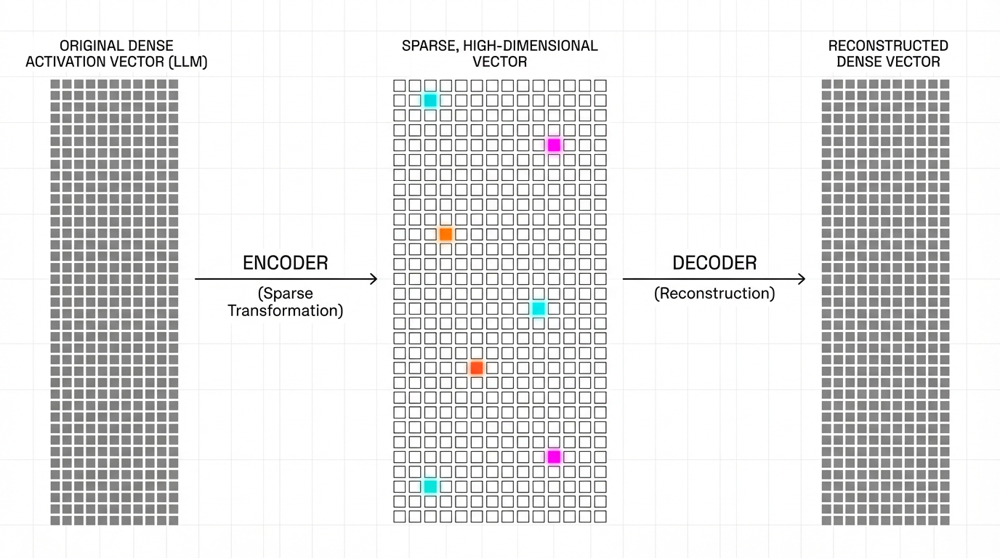

import PolysemanticVisualizer from '../../../components/chapter-19/PolysemanticVisualizer.tsx';

# 19.4 Sparse Autoencoders (SAE)

이전 장에서 살펴본 **Probing Classifiers** 는 LLM의 잔차 스트림(Residual stream)에 숨겨진 특정 개념을 탐지하는 데 유용했습니다. 하지만 탐침(Probing)은 근본적으로 지도 학습 기반의 가설 주도적(Hypothesis-driven) 작업입니다. 즉, 우리가 명시적으로 찾고자 하는 것만 찾을 수 있습니다. 인간이 제공하는 레이블에 의존하지 않고 모델이 학습한 개념의 *전체* 집합을 비지도(Unsupervised) 방식으로 발견하려면 새로운 접근법이 필요합니다.

최근 몇 년간 **Sparse Autoencoders (SAE)** 는 기계적 해석 가능성(Mechanistic interpretability) 분야의 핵심 도구로 부상했습니다. SAE는 GPT-4나 Claude 3 Sonnet과 같은 최첨단 모델의 불투명하고 고차원적인 활성화(Activations)를 수백만 개의 뚜렷하고 인간이 읽을 수 있는 개념으로 역공학(Reverse-engineering)하는 데 성공했습니다.

---

## 1. The Superposition Hypothesis and Polysemanticity

신경망이 무엇을 "생각"하고 있는지 이해하고 싶다면, 직관적인 첫걸음은 개별 뉴런을 살펴보는 것입니다. 만약 특정 뉴런이 모델이 "dog(개)"라는 단어를 처리할 때마다 활성화된다면, 우리는 이를 "개 뉴런(Dog neuron)"이라고 부를 수 있을 것입니다.

하지만 거대 언어 모델(LLM)에서 이러한 단순한 1:1 매핑은 불가능합니다. LLM은 잔차 스트림에 유한한 차원(예: $d = 4096$)을 가지고 있지만, 인간의 언어를 이해하기 위해서는 수백만 개의 독립적인 개념을 표현해야 합니다. 이 차원의 병목 현상을 해결하기 위해 신경망은 **Superposition** (중첩)을 활용합니다.

**Superposition Hypothesis** (중첩 가설)은 모델이 거의 직교(Almost-orthogonal)하는 벡터들을 사용하여 여러 관련 없는 개념들을 동일한 표현 공간에 압축해 넣는다고 설명합니다. 고차원 공간에는 완벽한 직교 방향보다 거의 직교하는 방향이 기하급수적으로 많기 때문에, 모델은 자신이 가진 차원 수보다 훨씬 더 많은 특징(Features)을 표현할 수 있습니다.

중첩의 부작용으로 개별 뉴런은 **Polysemantic** (다의적) 특성을 띠게 됩니다. 단일 뉴런이 "Apple"(과일), "Apple"(기술 기업), "Apple"(음반사)을 처리할 때 모두 활성화될 수 있습니다. 가공되지 않은 뉴런의 활성화 값만 봐서는 현재 *어떤* 개념이 활성화되었는지 전혀 알 수 없습니다.


<PolysemanticVisualizer client:load />

---

## 2. Dictionary Learning via Sparse Autoencoders

이러한 다의적 뉴런(Polysemantic neurons)들을 얽힌 상태에서 풀어내기 위해, 연구자들은 이 문제를 **Dictionary Learning** (사전 학습)으로 접근합니다. 목표는 모델의 밀집된(Dense) 활성화 벡터를 선형적으로 조합하여 만들어내는 희소하고 과완전한(Sparse, overcomplete) 특징들의 집합(사전)을 찾는 것입니다.

**Sparse Autoencoder** 는 $d$ 차원의 활성화 벡터 $x$ 를 훨씬 더 큰 $D$ 차원의 특징 공간 $f$ ($D \gg d$, 보통 16배에서 64배 더 큼)로 투영한 다음, 원본 벡터 $\hat{x}$ 를 재구성(Reconstruction)함으로써 이를 달성합니다.


*(Source: Generated by Gemini)*

표준 SAE의 순전파(Forward pass)는 다음과 같이 정의됩니다.

$$ f = \text{ReLU}(W_{enc}(x - b_{pre}) + b_{enc}) $$
$$ \hat{x} = W_{dec} f + b_{dec} + b_{pre} $$

특징들이 단일한 의미를 가지도록(Monosemantic) 보장하기 위해, 네트워크가 주어진 입력에 대해 $D$ 개의 특징 중 아주 작은 일부만 사용하도록 강제합니다. 이는 일반적으로 재구성 손실(Reconstruction loss)에 $L_1$ 정규화 페널티를 추가하여 구현됩니다.

$$ \mathcal{L} = ||x - \hat{x}||_2^2 + \lambda ||f||_1 $$

차원의 크기를 확장하고 희소성(Sparsity)을 강제함으로써, SAE는 자연스럽게 다의적 뉴런들을 개별적이고 단일한 의미를 지닌 특징들로 분해합니다.

---

## 3. The Dead Latent Problem

SAE를 학습시키는 과정은 심각한 엔지니어링 과제를 동반합니다. 가장 악명 높은 것은 **Dead Latent** (죽은 잠재 변수, 또는 죽은 뉴런) 문제입니다.

특징 공간 $D$ 가 매우 방대하고 희소성 페널티($\lambda$)가 활성화 값을 0으로 강력하게 밀어붙이기 때문에, 학습 초기부터 많은 특징들이 활성화되지 않게 됩니다. 특징이 한 번 활성화되지 않기 시작하면 ReLU 함수로부터 기울기(Gradient)를 전혀 받지 못하게 되어 영원히 "죽은" 상태에 갇히게 됩니다. 초기 SAE 실험에서는 학습된 사전의 90% 이상이 죽어버려 막대한 연산량이 낭비되는 일이 빈번했습니다.

최첨단 학습 파이프라인은 이러한 죽은 잠재 변수를 되살리기 위해 다음과 같은 기법들을 사용합니다.
1. **Ghost Gradients** (유령 기울기): 역전파(Backward pass) 과정에서 인위적으로 죽은 뉴런에 기울기를 전달하여 유용한 방향으로 "넛지(Nudge)"를 줍니다.
2. **Re-initialization** (재초기화): 주기적으로 죽은 뉴런을 식별하고, 현재 가장 높은 재구성 오차(Reconstruction error)를 가진 밀집 활성화 벡터($x$)와 일치하도록 인코더 가중치를 초기화합니다.

---

## 4. Engineering the State-of-the-Art: Top-K SAEs

$L_1$ 페널티는 희소성을 강제하지만, 치명적인 결함인 **Shrinkage** (수축) 문제를 일으킵니다. $L_1$ 페널티는 지속적으로 모든 활성화 값을 0 방향으로 끌어당깁니다. 즉, SAE가 특징들의 실제 크기(Magnitude)를 체계적으로 과소평가하게 만들어 $\hat{x}$ 의 재구성 품질을 저하시킵니다.

2024년, OpenAI 연구진은 GPT-4의 활성화 값 위에서 1,600만 개의 잠재 변수를 가진 SAE를 성공적으로 확장하며 돌파구를 마련했습니다 [[2]](#ref-2). 수축 문제를 해결하기 위해 이들은 $L_1$ 페널티를 완전히 제거하고 이를 명시적인 **Top-K** 활성화 함수로 대체했습니다.

손실 페널티에 의존하여 값을 0으로 미는 대신, Top-K SAE는 밀집 활성화 값을 계산한 뒤 가장 높은 $K$ 개의 값만 엄격하게 선택하고 나머지는 강제로 0으로 만듭니다. 이는 활성화 값의 크기를 왜곡하지 않으면서 $L_0$ 희소성을 직접적으로 제어합니다.

다음은 PyTorch로 구현된 Top-K SAE의 예시입니다.

```python
import torch
import torch.nn as nn
import torch.nn.functional as F

class TopKSAE(nn.Module):
    """
    Top-K Sparse Autoencoder (Gao et al., 2024).
    L1 정규화를 명시적인 Top-K 활성화 함수로 대체하여 Shrinkage(수축) 문제를 해결하고 
    희소성-재구성(Sparsity-reconstruction) 경계를 개선합니다.
    """
    def __init__(self, d_model: int, d_sae: int, k: int):
        super().__init__()
        self.d_model = d_model
        self.d_sae = d_sae
        self.k = k
        
        # 인코더 및 디코더 가중치 초기화
        # 실제 구현에서 디코더 가중치는 일반적으로 단위 길이(Unit-normalized)로 정규화됩니다.
        self.W_enc = nn.Parameter(torch.randn(d_model, d_sae) / (d_model ** 0.5))
        self.b_enc = nn.Parameter(torch.zeros(d_sae))
        
        self.W_dec = nn.Parameter(torch.randn(d_sae, d_model) / (d_sae ** 0.5))
        self.b_dec = nn.Parameter(torch.zeros(d_model))
        
        # 활성화 값을 중앙에 맞추기 위한 사전 인코더 편향(Pre-encoder bias)
        self.b_pre = nn.Parameter(torch.zeros(d_model))

    def encode(self, x: torch.Tensor) -> torch.Tensor:
        # 입력을 중앙에 맞추고 고차원 특징 공간으로 투영
        pre_acts = (x - self.b_pre) @ self.W_enc + self.b_enc
        acts = F.relu(pre_acts)
        
        # 명시적인 Top-K 라우팅: 상위 K개의 활성화 값만 유지하고 나머지는 0으로 만듦
        topk_vals, topk_indices = torch.topk(acts, self.k, dim=-1)
        
        # 희소 텐서(Sparse tensor) 재구성
        sparse_acts = torch.zeros_like(acts)
        sparse_acts.scatter_(-1, topk_indices, topk_vals)
        
        return sparse_acts

    def decode(self, sparse_acts: torch.Tensor) -> torch.Tensor:
        # 원래의 잔차 스트림(Residual stream) 차원으로 다시 투영
        return (sparse_acts @ self.W_dec) + self.b_dec + self.b_pre

    def forward(self, x: torch.Tensor) -> tuple[torch.Tensor, torch.Tensor]:
        sparse_acts = self.encode(x)
        x_reconstructed = self.decode(sparse_acts)
        return x_reconstructed, sparse_acts

# 4096차원 LLM 잔차 스트림을 위한 인스턴스화 예시
# 131,072개의 특징으로 확장(32배 확장)하고 정확히 상위 32개만 활성화 상태로 유지
# sae = TopKSAE(d_model=4096, d_sae=131072, k=32)
```

---

## 5. Scaling Monosemanticity: The Golden Gate Claude

Anthropic 은 자사의 프로덕션 모델인 Claude 3 Sonnet에 SAE를 적용하여 수백만 개의 고도로 추상적인 특징들을 성공적으로 추출했습니다 [[1]](#ref-1). 이들의 발견은 우리가 LLM의 표현을 바라보는 방식을 근본적으로 바꿔놓았습니다.

연구진은 SAE의 특징들이 토큰 중심(Token-centric)이 아니라 **개념 중심 (Concept-centric)** 이라는 것을 발견했습니다. 예를 들어, "금문교(Golden Gate Bridge)"를 나타내는 단일 특징은 모델이 영어 텍스트 "Golden Gate Bridge"를 읽든, 한국어 번역 "금문교"를 읽든, 심지어 다리의 이미지를 처리하든 상관없이 활성화됩니다.


*(Source: Generated by Gemini)*

더 중요한 것은 SAE가 **Causal Steering** (인과적 조향)을 가능하게 한다는 점입니다. 유명한 실험에서 Anthropic 연구진은 모델의 순전파 과정 중 금문교 특징의 활성화 값을 인위적으로 높게 고정(Clamping)했습니다. 그 결과 모델이 금문교에 강박적으로 집착하게 되는 "Golden Gate Claude"가 탄생했습니다. "런던에서 하루를 어떻게 보낼까?"라는 질문에 모델은 런던에서 비행기를 타고 샌프란시스코로 가서 금문교를 보라고 제안했습니다.

관광 명소 외에도 연구진은 아부(Sycophancy), 편향성(Bias), 스팸 이메일, 그리고 생화학 무기 생성과 같은 위험한 능력(Dangerous capabilities)에 대한 특징들을 식별했습니다. 이러한 특정 특징들을 억제함으로써, SAE는 미세 조정(Fine-tuning)을 하거나 모델의 일반적인 지능을 저하시키지 않고도 유해한 행동을 제거할 수 있는 외과적 수술과 같은 AI 안전(AI Safety) 접근법을 제공합니다.

---

## 6. Auto-Interp and Codebook Saturation

SAE가 1,600만 개의 특징을 추출할 때, 인간이 이를 일일이 평가하는 것은 불가능합니다. 해석 가능성을 확장하기 위해 연구자들은 **Automated Interpretability (Auto-Interp)** 를 사용합니다.

Auto-Interp 에서는 별도의 강력한 LLM(예: GPT-4)이 심판(Judge) 역할을 합니다. 심판 모델에게 특정 SAE 특징을 최대로 활성화시키는 수십 개의 텍스트 조각을 제공하고, 이들의 공통점이 무엇인지 판단하도록 프롬프팅합니다. 심판은 레이블(예: "계약 위반과 관련된 법률 용어")을 생성합니다. 레이블의 정확성을 검증하기 위해, 심판 모델은 *본 적 없는(Unseen)* 텍스트 조각에서 해당 특징이 얼마나 강하게 활성화될지 예측하도록 요구받습니다.

조금 더 탐색적인 방향으로는 질적 분석(qualitative analysis)에서 쓰이는 **codebook reduction** 과 **saturation** 개념을 가져와, auto-interp 과정이 더 이상 새로운 범주를 만들어 내지 않는 시점을 보려는 시도도 있습니다 [[3]](#ref-3). 다만 이것은 SAE가 모델 안의 모든 의미 있는 개념을 완전히 다 추출했다는 증명이라기보다, feature dictionary를 점검하는 감사(audit) 휴리스틱에 가깝게 이해하는 편이 정확합니다.

---

## 7. SAE를 실제로 쓸 때의 엔지니어링 판단

SAE는 강력하지만 비싼 도구입니다. 모든 팀이 매번 수백만 feature SAE를 학습시킬 필요는 없습니다. 목적에 따라 스케일을 정해야 합니다.

### 언제 SAE가 좋은 선택인가

- 반복되는 특정 행동을 feature 수준에서 추적하고 싶을 때
- refusal, sycophancy, prompt injection, citation fabrication처럼 안전 관련 개념을 분리하고 싶을 때
- probe처럼 미리 라벨링한 개념만 찾는 방식이 너무 좁을 때
- 모델 내부 feature를 조향하거나 ablation해 인과 효과를 확인하고 싶을 때

### 언제 과한 선택인가

- 단순히 RAG 답변의 근거 누락을 잡고 싶다면 claim verification이 더 싸고 직접적입니다.
- 코드 생성 품질을 높이고 싶다면 test execution과 agent loop 개선이 먼저입니다.
- 작은 모델/작은 데이터에서 빠르게 원인을 보고 싶다면 logit lens, activation patching, probe가 더 빠릅니다.

### 평가 metric

SAE 품질은 재구성 loss 하나로 판단하면 안 됩니다.

- **Reconstruction fidelity:** SAE를 통과한 activation으로 원래 모델 출력이 얼마나 유지되는가.
- **Sparsity:** 한 입력에서 평균 몇 개 feature가 켜지는가.
- **Dead latent rate:** 거의 켜지지 않는 feature가 얼마나 되는가.
- **Feature interpretability:** top activating examples가 사람이 보기에도 하나의 개념으로 묶이는가.
- **Causal effect sparsity:** feature를 조작했을 때 영향이 너무 넓게 퍼지지 않는가.

최근 circuit tracing 흐름은 SAE feature를 끝점으로 보지 않고, feature 사이의 계산 그래프를 만드는 쪽으로 이동하고 있습니다 [[4]](#ref-4). 즉, “이 feature가 있다”에서 “이 feature가 어떤 feature를 거쳐 어떤 logit을 밀어 올린다”로 질문이 바뀌고 있습니다.

---

## 8. Summary and Open Questions

**Sparse Autoencoders** 는 인공지능의 블랙박스를 열어젖혔습니다. LLM의 잔차 스트림을 거대하고 희소한 사전(Dictionary)으로 확장함으로써, 우리는 다의적 뉴런들의 혼돈스러운 중첩 상태를 깔끔하고 단일한 의미를 지닌 개념들로 매핑할 수 있게 되었습니다. $L_1$ 정규화에서 Top-K 아키텍처로의 전환은 이러한 기술이 GPT-4나 Claude 3와 같은 프론티어 모델로 확장될 수 있게 하였으며, 정밀한 행동 조향(Behavioral steering)과 안전 개입을 가능하게 했습니다.

하지만 특징을 추출하는 것은 절반의 성공에 불과합니다. 만약 LLM이 "생각"하는 기계라면, 특징(Features)은 그 생각의 명사와 동사에 불과합니다. 기계적 해석 가능성의 다음 과제는 이러한 특징들이 어떻게 서로 연결되어 복잡한 논리를 수행하는지 이해하는 것입니다. "If-Then" 특징은 작동하는 스크립트를 생성하기 위해 "Python Code" 특징과 어떻게 상호작용할까요?

이 질문에 답하기 위해, 우리는 LLM 내부의 **Circuits** (회로)를 매핑해야 합니다.

## Quizzes

<details>
<summary>Quiz 1: 신경망이 Superposition(중첩)을 활용하여 다의적 뉴런(Polysemantic neurons)을 생성하게 되는 근본적인 이유는 무엇인가요?</summary>
*LLM은 잔차 스트림에 고정되고 유한한 수의 차원을 가지고 있지만, 수백만 개의 독립적인 언어적, 사실적 개념을 표현해야 합니다. 중첩은 모델이 거의 직교(Almost-orthogonal)하는 벡터들을 사용하여 여러 관련 없는 개념들을 동일한 공간에 압축할 수 있게 해주며, 이로 인해 개별 뉴런이 여러 개념에 대해 활성화되는 다의성(Polysemanticity)을 띠게 됩니다.*
</details>

<details>
<summary>Quiz 2: 표준 SAE에서 L1 페널티($\lambda$)를 조정할 때 발생하는 근본적인 트레이드오프(Trade-off)는 무엇인가요?</summary>
*$\lambda$ 를 증가시키면 특징들의 희소성(Sparsity)과 해석 가능성이 향상되지만, 원본 활성화 값에 대한 재구성 오차(MSE)는 악화됩니다. 더욱이 높은 $L_1$ 페널티는 활성화된 특징들의 크기를 인위적으로 0을 향해 끌어내리는 "수축(Shrinkage)" 현상을 유발합니다.*
</details>

<details>
<summary>Quiz 3: Top-K SAE 아키텍처는 표준 L1 정규화 SAE에 내재된 "수축(Shrinkage)" 문제를 어떻게 해결하나요?</summary>
*Top-K SAE는 $L_1$ 페널티를 완전히 제거합니다. 대신 밀집 활성화 값을 계산한 후, 명시적으로 상위 $K$ 개의 가장 높은 값만 선택하고 나머지는 강제로 0으로 만듭니다. 이는 활성화된 특징의 크기를 축소시키는 연속적인 수학적 페널티를 적용하지 않고도 정확한 $L_0$ 희소성을 보장합니다.*
</details>

<details>
<summary>Quiz 4: "다국어 및 멀티모달(Multilingual and multimodal)" SAE 특징의 존재는 LLM의 내부 표현에 대해 무엇을 시사하나요?</summary>
*이는 LLM이 단순히 표면적인 토큰 통계나 특정 언어의 문법을 암기하는 것이 아님을 시사합니다. 대신, 모델은 입력을 고도로 추상적이고 개념적인 공간으로 매핑하여, 다리(Bridge)와 같은 객체의 근본적인 "아이디어"를 호출하는 데 사용된 언어나 모달리티(텍스트 vs 이미지)에 관계없이 보편적으로 표현하고 있음을 의미합니다.*
</details>

<details>
<summary>Quiz 5: 역전파 과정에서 SAE 내부의 Top-K 라우팅을 위한 명시적 수학적 그래디언트 업데이트 논리 시퀀스를 정식화하십시오. Dead Latent 문제를 완화하기 위해 Ghost Gradient 경계를 명시적으로 정의하시오.</summary>
*간단한 형식화에서는 Top-K 라우팅을 하드 마스크 $m_i = \mathbb{I}(i \in \text{Top-K}(x))$ 로 보고, 선택된 latent를 $z_i = m_i x_i$ 로 둡니다. 그러면 역전파에서 직접 그래디언트도 같은 마스크를 따라 흘러 $\frac{\partial \mathcal{L}}{\partial x_i} \approx m_i \frac{\partial \mathcal{L}}{\partial z_i}$ 가 됩니다. 문제는 Top-K 밖의 latent가 직접 학습 신호를 거의 받지 못한다는 점입니다. Ghost-gradient 계열 보정은 비활성 latent에 약한 재구성 기반 보조항을 추가해, 예를 들어 $g_i^{ghost} = \eta (1-m_i)\left(\frac{\partial \mathcal{L}}{\partial \hat{x}} W_{dec}^\top\right)_i$ 처럼 줄 수 있습니다. 핵심은 보편적인 경계식을 외우는 것이 아니라, 죽은 latent에도 약한 gradient 경로를 남겨 훗날 다시 활성 집합으로 들어올 가능성을 만들어 주는 데 있습니다.*
</details>

---

## References

1. <a id="ref-1"></a>Templeton, A., et al. (2024). *Scaling Monosemanticity: Extracting Interpretable Features from Claude 3 Sonnet*. Transformer Circuits Thread. [Link](https://transformer-circuits.pub/2024/scaling-monosemanticity/index.html).
2. <a id="ref-2"></a>Gao, L., et al. (2024). *Scaling and evaluating sparse autoencoders*. [arXiv:2406.04093](https://arxiv.org/abs/2406.04093).
3. <a id="ref-3"></a>De Paoli, S., & Mathis, W. S. (2025). *Codebook Reduction and Saturation: Novel observations on Inductive Thematic Saturation for Large Language Models and initial coding in Thematic Analysis.* [arXiv:2503.04859](https://arxiv.org/abs/2503.04859).
4. <a id="ref-4"></a>Ameisen, E., et al. (2025). *Circuit Tracing: Revealing Computational Graphs in Language Models.* Transformer Circuits Thread. [Link](https://transformer-circuits.pub/2025/attribution-graphs/methods.html).
