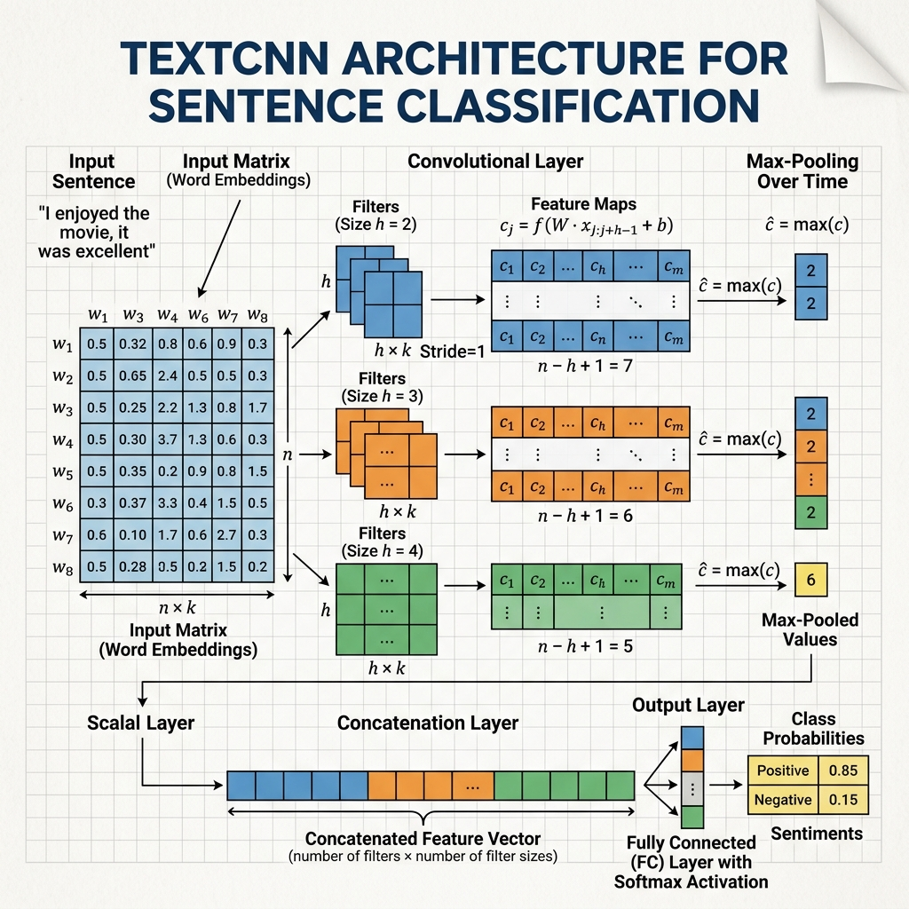

import CnnVisualizer from '../../../components/chapter-2/CnnVisualizer';

# 2.4 NLP를 위한 CNN (CNNs for NLP)

순환 신경망(RNN)이 시퀀스 데이터를 위한 자연스러운 선택으로 간주되었지만, 컴퓨터 비전에서의 성공으로 유명한 합성곱 신경망(CNN)도 자연어 처리(NLP)에 맞게 조정되었습니다.

## 동기: 속도와 병렬성

NLP에서 CNN을 사용하는 주된 동기는 **계산 효율성** 이었습니다.
- **RNN은 본질적으로 순차적입니다:** 단계 $t$를 계산하려면 먼저 단계 $t-1$을 계산해야 합니다. 이는 GPU에서 시간 단계에 따른 병렬 처리를 방해합니다.
- **CNN은 고도의 병렬화가 가능합니다:** 합성곱은 입력의 여러 부분에 동일한 필터를 동시에 적용합니다. 이로 인해 현대식 하드웨어에서 학습 속도가 훨씬 빠릅니다.

## 텍스트에서 1D 합성곱이 작동하는 방식

컴퓨터 비전에서 CNN은 픽셀에 대해 2D 합성곱을 사용합니다. NLP에서는 단어 임베딩 시퀀스에 대해 **1D 합성곱 (1D Convolutions)** 을 사용합니다.

<div style={{ display: 'flex', flexDirection: 'column', alignItems: 'center', width: '100%', margin: '20px 0' }}>

<div style={{ maxWidth: '600px', width: '100%' }}>

</div>

<em style={{ marginTop: '10px', color: '#7f8c8d' }}>출처: AI 생성 이미지. Kim, 2014에서 영감을 받은 개념도</em>

</div>

### 메커니즘
각 행이 단어 임베딩(예: $d=300$)인 행렬로 표현된 문장을 상상해 보세요.
1.  **필터:** $k \times d$ 크기의 필터 행렬(여기서 $k$는 윈도우 크기, 예: 3단어)이 문장을 따라 아래로 미끄러집니다.
2.  **합성곱:** 각 단계에서 요소별 곱셈을 수행하고 결과를 합산하여 단일 숫자(피처)를 생성합니다.
3.  **피처 맵:** 필터가 미끄러지면서 피처 벡터(피처 맵)를 생성합니다.
4.  **풀링:** 일반적으로 **Max-over-time Pooling** 이 적용되어 피처 맵에서 가장 큰 값을 취하여 전체 문장에서 가장 중요한 피처를 식별합니다.

이를 통해 네트워크는 "not good" 또는 "very fast"와 같은 로컬 패턴(n-gram)을 캡처할 수 있습니다.

## 획기적인 아키텍처들

- **TextCNN (Kim, 2014) [[1]](#ref-1):** 다양한 n-gram 길이를 캡처하기 위해 여러 필터 크기를 사용하고 이어서 맥스 풀링을 사용하는 단순하지만 효과적인 아키텍처입니다. 텍스트 분류 작업에서 탁월한 성능을 보였습니다.
- **ByteNet 및 WaveNet:** 이후 아키텍처들은 확장된 합성곱(dilated convolutions)을 사용하여 해상도를 잃지 않고 더 긴 종속성을 캡처했습니다.

**흥미로운 사실:** Yoon Kim의 TextCNN 논문이 발표되었을 때, 많은 연구자들은 놀라움을 금치 못했습니다. 당시에는 "텍스트는 시퀀스이므로 당연히 RNN을 써야 한다"는 고정관념이 지배적이었기 때문입니다. 하지만 CNN은 이미지의 지역적 특징(Local Feature)을 잡아내듯 텍스트의 핵심 단어 조합(n-gram)을 기가 막히게 잡아냈고, 무엇보다 RNN보다 훨씬 빨랐습니다.

---

## PyTorch TextCNN

텍스트 분류를 위해 1D 합성곱을 사용하는 PyTorch에서의 유명한 TextCNN 아키텍처 (Kim, 2014) [[1]](#ref-1)의 단순화된 버전입니다.

```python
import torch
import torch.nn as nn
import torch.nn.functional as F

class TextCNN(nn.Module):
    def __init__(self, vocab_size, embed_dim, num_classes):
        super(TextCNN, self).__init__()
        self.embedding = nn.Embedding(vocab_size, embed_dim)
        
        # 3가지 다른 필터 크기: 3, 4, 5단어
        self.conv1 = nn.Conv1d(in_channels=embed_dim, out_channels=100, kernel_size=3)
        self.conv2 = nn.Conv1d(in_channels=embed_dim, out_channels=100, kernel_size=4)
        self.conv3 = nn.Conv1d(in_channels=embed_dim, out_channels=100, kernel_size=5)
        
        self.fc = nn.Linear(300, num_classes)
        
    def forward(self, x):
        # x shape: (batch_size, seq_len)
        embedded = self.embedding(x) # (batch, seq_len, embed_dim)
        
        # Conv1d는 (batch, channels, seq_len)을 기대합니다.
        embedded = embedded.transpose(1, 2)
        
        # 합성곱 및 ReLU 적용
        x1 = F.relu(self.conv1(embedded))
        x2 = F.relu(self.conv2(embedded))
        x3 = F.relu(self.conv3(embedded))
        
        # Max-over-time 풀링
        x1 = F.max_pool1d(x1, x1.shape[2]).squeeze(2)
        x2 = F.max_pool1d(x2, x2.shape[2]).squeeze(2)
        x3 = F.max_pool1d(x3, x3.shape[2]).squeeze(2)
        
        # 풀링 결과 연결
        combined = torch.cat((x1, x2, x3), dim=1)
        
        # 완전 연결 레이어
        logits = self.fc(combined)
        return logits

# 사용 예시
vocab_size = 1000
embed_dim = 50
num_classes = 2
model = TextCNN(vocab_size, embed_dim, num_classes)

# 10개 단어의 무작위 입력 시퀀스
x = torch.randint(0, vocab_size, (1, 10))
logits = model(x)
print("출력 로짓 형태:", logits.shape)
```

---

## 예제: 슬라이딩 윈도우 합성곱 (Sliding Window Convolution)

크기가 3인 필터가 문장 위를 미끄러지며 피처 맵을 생성하는 방법을 시각화해 보세요. 맥스 풀링은 가장 높은 값을 선택합니다.

<CnnVisualizer client:load lang="ko" />

---

## 왜 CNN이 트랜스포머에 패배했는가

속도 이점에도 불구하고 CNN은 결국 대규모 언어 모델링에서 트랜스포머에 의해 추월당했습니다.

1.  **고정된 컨텍스트 윈도우:** 합성곱 연산은 $k$ 크기의 로컬 윈도우만 볼 수 있습니다. 멀리 떨어진 단어 간의 종속성을 캡처하려면 네트워크가 매우 깊어야 했습니다(많은 레이어 쌓기).
2.  **위치 민감도:** CNN은 RNN에 비해 로컬 윈도우 외부의 정확한 단어 순서에 덜 민감합니다.
3.  **어텐션의 우월성 증명:** 트랜스포머의 셀프 어텐션 메커니즘은 거리에 관계없이 단일 연산($O(1)$ 경로 길이)으로 시퀀스의 *어느* 두 단어 간의 종속성도 캡처할 수 있는 반면, 고도의 병렬화도 유지합니다.

---

## Quizzes

<details>
<summary>Quiz 1: NLP에서 RNN에 비해 CNN이 갖는 가장 큰 장점은 무엇입니까?</summary>
*가장 큰 장점은 병렬화입니다. CNN은 합성곱을 사용하여 시퀀스의 모든 부분을 동시에 처리할 수 있으므로, 단계를 순차적으로 처리해야 하는 RNN보다 GPU에서 훨씬 빠르게 학습할 수 있습니다.*
</details>

<details>
<summary>Quiz 2: CNN은 텍스트에서 장기 종속성을 어떻게 포착합니까?</summary>
*CNN은 여러 합성곱 레이어를 층층이 쌓거나 확장된 합성곱(dilated convolutions)을 사용하여 장기 종속성을 포착합니다. 레이어가 깊어질수록 각 뉴런의 수용장(receptive field)이 커져 입력 시퀀스의 더 많은 부분을 볼 수 있게 됩니다.*
</details>

<details>
<summary>Quiz 3: 왜 오늘날 대규모 언어 모델에 CNN보다 트랜스포머가 선호됩니까?</summary>
*트랜스포머는 셀프 어텐션을 사용하여 거리에 관계없이 단일 연산으로 모든 위치가 다른 모든 위치에 주목할 수 있도록 합니다. 이는 많은 합성곱 레이어를 쌓는 것보다 장기 종속성을 훨씬 더 효과적으로 포착하면서도 고도의 병렬화가 가능하기 때문입니다.*
</details>

<details>
<summary>Quiz 4: TextCNN에서 Max-over-time Pooling의 목적은 무엇인가요?</summary>
*Max-over-time 풀링은 각 피처 맵에 대해 전체 시퀀스 길이에서 최대값을 취합니다. 이는 문장의 어느 위치에서든 특정 패턴의 가장 강력한 활성화를 식별하므로, 모델이 패턴의 정확한 위치에 구애받지 않도록(invariant) 만듭니다.*
</details>

<details>
<summary>Quiz 5: TextCNN에서 여러 필터 크기를 사용하는 것은 어떤 효과가 있나요?</summary>
*여러 필터 크기(예: 3, 4, 5)를 사용하면 모델이 다양한 길이의 n-gram을 동시에 캡처할 수 있습니다. 이는 텍스트에서 다양한 크기의 패턴(예: trigram, 4-gram, 5-gram)을 찾는 것과 유사하며, 입력에 대한 더 풍부한 표현을 제공합니다.*
</details>

<details>
<summary>Quiz 6: 각 레이어의 커널 크기를 $k_l$, 스트라이드를 $s_l$이라고 할 때, 다층으로 쌓인 1D CNN의 $l$번째 레이어에 대한 유효 수용장(Effective Receptive Field) $R_l$의 유도 공식을 기술하시오.</summary>
*레이어 $l$의 수용장 $R_l$은 이전 레이어의 수용장 $R_{l-1}$로부터 재귀적으로 계산할 수 있습니다. 기본 조건은 $R_0 = 1$ (입력 토큰 자체)입니다. 커널 크기 $k_l$과 스트라이드 $s_l$을 갖는 레이어에 대해 수용장은 다음과 같이 확장됩니다: $R_l = R_{l-1} + (k_l - 1) \times \prod_{i=1}^{l-1} s_i$. 이는 깊이가 깊어질수록 수용장이 커널 크기에 비례하여 선형적으로 증가하지만, 스트라이드가 적용되면 기하급수적으로 증가함을 보여줍니다. 만약 모든 레이어의 스트라이드가 $s=1$이고 커널 크기가 $k$로 동일하다면, 공식은 $R_l = l \times (k - 1) + 1$로 단순화됩니다.*
</details>

---

## 앞으로의 과제: 글로벌 컨텍스트의 필요성

우리는 CNN이 병렬화를 통해 속도를 제공하지만 RNN에 비해 장기 종속성을 캡처하는 데 어려움을 겪는다는 것을 보았습니다.
- 전체 병렬화와 글로벌 컨텍스트를 모두 달성하는 것이 가능할까요?
- 순차적 처리나 로컬 윈도우 없이 문장의 모든 단어 간의 관계를 직접 모델링할 수 있을까요?
- "셀프 어텐션" 개념은 어떻게 순환과 합성곱의 필요성을 제거할까요?

이러한 질문들은 우리가 어텐션에만 *전적으로* 의존하여 AI를 혁신한 아키텍처를 탐구할 **챕터 3: 트랜스포머** 로 이어집니다.

---

## References

1. <a id="ref-1"></a>Kim, Y. (2014). *Convolutional neural networks for sentence classification*. [arXiv:1408.5882](https://arxiv.org/abs/1408.5882).
2. <a id="ref-2"></a>**추천 영상**: [3Blue1Brown: But what is a convolution?](https://www.youtube.com/watch?v=IaSGqQa5O-M) 합성곱(Convolution)의 수학적 의미를 시각적으로 가장 완벽하게 설명한 영상입니다.