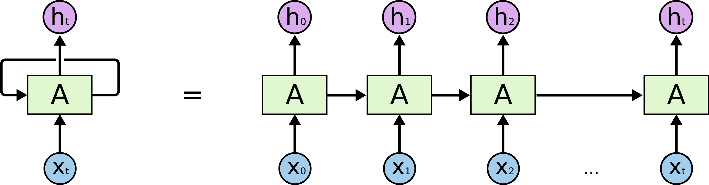

import RnnMemoryVisualizer from '../../../components/chapter-2/RnnMemoryVisualizer';

# 2.1 마르코프 체인에서 RNN까지 (Markov Chains to RNNs)

트랜스포머의 혁명 이전에는 자연어와 같은 시퀀스 데이터를 모델링하기 위해 시간적 종속성을 처리할 수 있도록 설계된 아키텍처가 필요했습니다. 이 여정은 단순한 통계 모델에서 시작하여 순환 신경망(RNN)의 개발로 이어졌습니다.

---

### **동기: 데이터 속 시간의 화살**
대부분의 전통적인 머신러닝 모델은 데이터 포인트가 독립적이고 동일하게 분포(i.i.d.)되어 있다고 가정합니다. 하지만 언어는 본질적으로 시퀀스(순서가 있는 데이터)입니다. 단어의 의미는 그 앞에 어떤 단어가 왔는지에 따라 달라집니다.
* **문맥의 중요성:** "I am going to the bank" (강둑으로 가는 것인가, 아니면 은행으로 가는 것인가?)는 주변 단어에 따라 달라집니다.
* **가변적인 길이:** 문장은 3단어일 수도 있고 100단어일 수도 있습니다. 우리는 이러한 유연성을 처리할 수 있는 아키텍처가 필요합니다.

단순한 통계에서 신경망 메모리로 어떻게 이동했는지 이해하는 것은 왜 트랜스포머가 필요했는지 파악하는 데 매우 중요합니다.

---

### **비유: 메모리가 있는 컨베이어 벨트**
당신이 컨베이어 벨트에서 지나가는 물건들을 검사하는 작업자라고 상상해 보세요.

* **마르코프 방식** 은 **금붕어 기억력** 을 가진 것과 같습니다. 당신은 현재 물건과 어쩌면 바로 이전의 물건만 봅니다. 오직 그 작은 창(window)에만 기반해서 결정을 내립니다. 초록색 공 다음에 빨간색 공이 오면 어떤 행동을 취합니다. 5분 전에 무엇이 지나갔는지는 전혀 모릅니다.
* **RNN 방식** 은 **노트** 를 가지고 있는 것과 같습니다. 각 물건이 지나갈 때마다 그것을 보고, 노트를 읽고(이전 은닉 상태), 결정을 내린 다음, 새로운 메모로 노트를 **업데이트** 합니다. 빨간색 공이 10개 전에 나타났더라도, 그것에 대한 메모가 여전히 노트에 남아 있어 현재 결정에 영향을 미칠 수 있습니다.

---

## 마르코프 체인: 가장 단순한 시퀀스 모델

**마르코프 체인 (Markov Chain)** 은 각 이벤트의 확률이 이전 이벤트에서 달성된 상태에만 의존하는 가능한 이벤트 시퀀스를 설명하는 확률적 모델입니다.

**흥미로운 역사:** 러시아의 수학자 안드레이 마르코프(Andrey Markov)가 1913년에 이 개념을 증명하기 위해 사용한 데이터는 다름 아닌 푸쉬킨의 시소설 *'예브게니 오네긴'*이었습니다. 그는 20,000개의 글자를 수작업으로 분석하여 모음 뒤에 자음이 올 확률 등을 계산했고, 이를 통해 글자 간의 통계적 종속성을 보여주었습니다. 이는 통계적 언어 모델링의 초기 선구적 사례였습니다.

### 마르코프 속성
수학적으로 확률 변수 시퀀스 $X_1, X_2, X_3, \dots$은 다음과 같은 경우 마르코프 속성을 가집니다:
$$P(X_{n+1} = x | X_1 = x_1, X_2 = x_2, \dots, X_n = x_n) = P(X_{n+1} = x | X_n = x_n)$$

NLP에서 $n$-gram 모델은 마르코프 체인의 일종입니다. 바이그램(bigram) 모델은 이전 단어 하나만을 기반으로 다음 단어를 예측합니다.

**한계:** 자연어는 마르코프적이지 않습니다. 문장을 이해하려면 종종 훨씬 더 일찍 나타난 단어에 대한 기억이 필요합니다. 마르코프 체인은 장기 종속성(Long-range dependencies)을 포착하지 못합니다.

### 마르코프 모델이 여전히 중요한 이유

$n$-gram 모델은 현대 언어 모델링에는 너무 제한적이지만, 시퀀스 문제의 본질을 아주 선명하게 보여 줍니다.

첫째, 예측 품질은 "과거의 어떤 정보를 볼 수 있게 하느냐"에 달려 있다는 점을 드러냅니다. 둘째, **문맥 크기** 와 **데이터 희소성** 사이의 트레이드오프를 보여 줍니다. 바이그램에서 5-그램으로 갈수록 더 많은 문맥을 쓸 수 있지만, 가능한 과거 패턴의 수가 폭발적으로 늘어나 대부분은 충분히 관측되지 않습니다. 그래서 초기 언어 모델링 연구에서는 더 큰 문맥 창을 쓰기 위해 smoothing, backoff, count 기반 기법에 엄청난 공을 들여야 했습니다.

RNN이 매력적이었던 이유는 이 고정된 창을 사람이 설계한 통계 대신 학습된 은닉 상태로 바꾸었기 때문입니다. 가능한 모든 과거 패턴의 카운트를 저장하는 대신, 모델이 과거를 압축한 표현을 직접 학습하게 만든 것입니다.

## 순환 신경망 (RNN): 메모리 추가

장기 종속성을 포착하기 위해 **순환 신경망 (RNN, Recurrent Neural Networks)** 이 개발되었습니다. 표준 피드포워드 네트워크와 달리 RNN은 뒤로 순환하는 연결을 가지고 있어 정보가 지속될 수 있습니다.

<div style={{ display: 'flex', flexDirection: 'column', alignItems: 'center', width: '100%', margin: '20px 0' }}>

<div style={{ maxWidth: '600px', width: '100%' }}>

</div>

<em style={{ marginTop: '10px', color: '#7f8c8d' }}>Source: [colah's blog](https://colah.github.io/posts/2015-08-Understanding-LSTMs/)</em>

</div>

### 메커니즘
각 시간 단계 $t$에서 RNN은 입력 벡터 $\mathbf{x}_t$와 이전 시간 단계의 은닉 상태 $\mathbf{h}_{t-1}$을 입력으로 받습니다. 그리고 새로운 은닉 상태 $\mathbf{h}_t$와 출력 $\mathbf{y}_t$를 계산합니다:

$$\mathbf{h}_t = \sigma(\mathbf{W}_{hh}\mathbf{h}_{t-1} + \mathbf{W}_{xh}\mathbf{x}_t + \mathbf{b}_h)$$
$$\mathbf{y}_t = \text{softmax}(\mathbf{W}_{hy}\mathbf{h}_t + \mathbf{b}_y)$$

여기서 $\mathbf{W}$는 가중치 행렬이고 $\sigma$는 활성화 함수(일반적으로 vanilla RNN에서는 tanh)입니다.

은닉 상태 $\mathbf{h}_t$는 네트워크의 메모리 역할을 하며 시간이 지남에 따라 정보를 누적합니다.

### 학습의 현실: 시간을 따라 펼쳐지는 계산 그래프

RNN 다이어그램은 직관적으로는 단순해 보이지만, 실제 학습에서는 중요한 디테일이 숨어 있습니다. 같은 셀을 시퀀스 전체에 반복해서 재사용하기 때문에, 학습 시에는 네트워크를 시간축을 따라 **펼쳐서(unroll)** 하나의 매우 깊은 계산 그래프로 다뤄야 합니다.

이 때문에 두 가지 결과가 바로 따라옵니다.

- **Teacher forcing:** 학습 안정성을 위해 이전 시점의 모델 예측 대신 실제 정답 토큰을 입력으로 넣는 경우가 많습니다.
- **BPTT(시간을 통한 역전파):** 그래디언트가 펼쳐진 모든 시점을 통과해야 하므로, 시퀀스가 길수록 사실상 네트워크 깊이가 커집니다.

여기가 바로 RNN이 역사적으로 중요한 동시에 실무적으로는 까다로웠던 이유입니다. RNN은 가변 길이 문맥을 학습할 수 있게 해 주었지만, 그 대가로 병렬화가 어렵고 긴 구간에서는 수치적으로 불안정한 순차 계산 그래프를 받아들여야 했습니다. 다음 절에서 다룰 LSTM, GRU, 그리고 더 나아가 어텐션은 모두 "학습된 시퀀스 메모리"라는 장점은 유지하되, "긴 거리에서의 불안정한 학습"이라는 약점을 줄이려는 시도로 읽을 수 있습니다.

### 약속과 현실
RNN은 가변 길이의 시퀀스를 처리할 수 있기 때문에 획기적이었습니다. 이론적으로 은닉 상태는 시퀀스의 시작부터 끝까지 정보를 전달할 수 있습니다.

그러나 다음 섹션에서 보겠지만, 표준 RNN을 긴 시퀀스에 대해 학습하는 것은 기울기 문제로 인해 실제로 거의 불가능한 것으로 판명되었습니다.

---

## PyTorch RNN

기본적인 RNN 셀이 PyTorch에서 어떻게 구현되는지, 그리고 시퀀스에 대해 어떻게 루프를 도는지 살펴보겠습니다.

```python
import torch
import torch.nn as nn

class SimpleRNN(nn.Module):
    def __init__(self, input_size, hidden_size, output_size):
        super(SimpleRNN, self).__init__()
        self.hidden_size = hidden_size
        
        # RNN 셀 연산
        self.i2h = nn.Linear(input_size + hidden_size, hidden_size)
        self.i2o = nn.Linear(input_size + hidden_size, output_size)
        self.tanh = nn.Tanh()
        self.softmax = nn.LogSoftmax(dim=1)

    def forward(self, input, hidden):
        # 입력과 은닉 상태를 연결 (concatenate)
        combined = torch.cat((input, hidden), 1)
        hidden = self.tanh(self.i2h(combined))
        output = self.i2o(combined)
        output = self.softmax(output)
        return output, hidden

    def initHidden(self):
        return torch.zeros(1, self.hidden_size)

# 사용 예시
input_size = 5  # 예: 원-핫 벡터 크기
hidden_size = 10
output_size = 5

rnn = SimpleRNN(input_size, hidden_size, output_size)

# 3개 단어의 시퀀스 시뮬레이션
seq_len = 3
hidden = rnn.initHidden()

# 무작위 입력 시퀀스 (seq_len, batch_size, input_size)
sequence = torch.randn(seq_len, 1, input_size)

for i in range(seq_len):
    output, hidden = rnn(sequence[i], hidden)
    print(f"Step {i+1} Output shape:", output.shape)
    print(f"Step {i+1} Hidden shape:", hidden.shape)
```

---

## 예제: RNN의 흐려지는 기억 (Fading Memory)

단어가 처리됨에 따라 은닉 상태가 어떻게 변하는지 시각화해 보세요. 단어가 추가될수록 초기 단어의 영향력이 어떻게 줄어드는지 확인할 수 있습니다 (기울기 소실 문제의 변형).

<RnnMemoryVisualizer client:load lang="ko" />

---

## Quizzes

<details>
<summary>Quiz 1: 왜 n-gram 모델은 마르코프적이라고 간주됩니까?</summary>
*n-gram 모델은 이전 $n-1$개 토큰의 고정된 창(window)만을 기반으로 다음 토큰을 예측하기 때문입니다. 이 창을 벗어난 과거는 미래에 영향을 미치지 않는다고 가정하며, 이는 마르코프 모델의 핵심 가정입니다.*
</details>

<details>
<summary>Quiz 2: RNN에서 은닉 상태(hidden state)의 목적은 무엇입니까?</summary>
*은닉 상태는 네트워크의 메모리 역할을 합니다. 이전 시간 단계의 정보를 전달하고 이를 현재 입력과 결합하여 현재 은닉 상태와 출력을 생성합니다. 이를 통해 네트워크는 시퀀스 데이터를 처리하고 시간적 종속성을 캡처할 수 있습니다.*
</details>

<details>
<summary>Quiz 3: 표준 RNN은 무한한 길이의 시퀀스를 처리할 수 있습니까?</summary>
*이론적으로는 동일한 연산이 각 시간 단계에서 재귀적으로 적용되므로 가능합니다. 하지만 실제로는 메모리가 빠르게 사라지고(기울기 소실) 수치적 불안정성으로 인해 매우 긴 시퀀스에 대한 학습이 불가능합니다.*
</details>

<details>
<summary>Quiz 4: 바이그램(bigram) 모델과 RNN의 가장 큰 차이점은 무엇인가요?</summary>
*바이그램 모델(1차 마르코프 체인)은 다음 단어를 예측하기 위해 바로 이전의 단어 하나만을 확인합니다. 반면 RNN은 은닉 상태를 통해 시퀀스의 모든 이전 단어로부터 정보를 잠재적으로 유지할 수 있습니다. 다만 실제로는 매우 긴 범위의 종속성을 처리하는 데 어려움을 겪습니다.*
</details>

<details>
<summary>Quiz 5: 왜 RNN은 CNN이나 트랜스포머에 비해 병렬화가 어렵나요?</summary>
*RNN은 시간 단계 $t$에서의 계산이 시간 단계 $t-1$의 은닉 상태에 의존하기 때문에 병렬화가 어렵습니다. 이러한 순차적 종속성으로 인해 시퀀스의 모든 요소를 한 번에 처리할 수 없으며, 이는 연산을 시퀀스 길이에 따라 병렬화할 수 있는 CNN이나 트랜스포머와 대조적입니다.*
</details>

<details>
<summary>Quiz 6: BPTT(통사적 역전파)를 사용하여 시점 $t$의 손실 $L_t$에 대한 시점 $k$ ($k \ll t$)의 은닉 상태 $\mathbf{h}_k$의 기울기 $\frac{\partial L_t}{\partial \mathbf{h}_k}$를 유도하고, 연쇄 법칙 항인 $\prod_{j=k+1}^t \frac{\partial \mathbf{h}_j}{\partial \mathbf{h}_{j-1}}$이 기울기 소실(Vanishing Gradient)을 어떻게 유발하는지 수학적으로 증명하시오.</summary>
*은닉 상태 업데이트 식은 $\mathbf{h}_j = \tanh(\mathbf{W}_{hh}\mathbf{h}_{j-1} + \mathbf{W}_{xh}\mathbf{x}_j + \mathbf{b}_h)$입니다. 연쇄 법칙에 따라, $t$ 시점의 손실 $L_t$에 대한 $\mathbf{h}_k$의 기울기는 다음과 같습니다: $\frac{\partial L_t}{\partial \mathbf{h}_k} = \frac{\partial L_t}{\partial \mathbf{h}_t} \frac{\partial \mathbf{h}_t}{\partial \mathbf{h}_k} = \frac{\partial L_t}{\partial \mathbf{h}_t} \prod_{j=k+1}^t \frac{\partial \mathbf{h}_j}{\partial \mathbf{h}_{j-1}}$. 여기서 야코비안 행렬은 $\frac{\partial \mathbf{h}_j}{\partial \mathbf{h}_{j-1}} = \text{diag}(1 - \tanh^2(\mathbf{W}_{hh}\mathbf{h}_{j-1} + \dots)) \mathbf{W}_{hh}^T$입니다. 가중치가 작거나 활성화 함수가 포화(Saturation)되어 $\tanh$ 값이 $\pm 1$에 가까워지면, 야코비안 행렬의 고유값(Eigenvalue)의 절대값이 $1$보다 작아지게 됩니다. 따라서 $t - k$가 커질수록 연속된 행렬곱 $\prod_{j=k+1}^t \frac{\partial \mathbf{h}_j}{\partial \mathbf{h}_{j-1}}$은 기하급수적으로 영벡터에 수렴하게 되어 기울기 소실이 발생합니다.*
</details>

---

## References

1. <a id="ref-1"></a>Rosenblatt, F. (1958). *The perceptron: a probabilistic model for information storage and organization in the brain*. Psychological review, 65(6), 386.
2. <a id="ref-2"></a>Rumelhart, D. E., Hinton, G. E., & Williams, R. J. (1986). *Learning representations by back-propagating errors*. Nature, 323(6088), 533-536.
3. <a id="ref-3"></a>Lipton, Z. C., Berkowitz, J., & Elkan, C. (2015). *A Critical Review of Recurrent Neural Networks for Sequence Learning*. [arXiv:1506.00019](https://arxiv.org/abs/1506.00019).
4. <a id="ref-4"></a>**추천 영상**: [StatQuest: Recurrent Neural Networks (RNNs)](https://www.youtube.com/watch?v=UN7O424H8dM) RNN의 작동 원리를 특유의 직관적인 시각화로 설명한 영상입니다.
