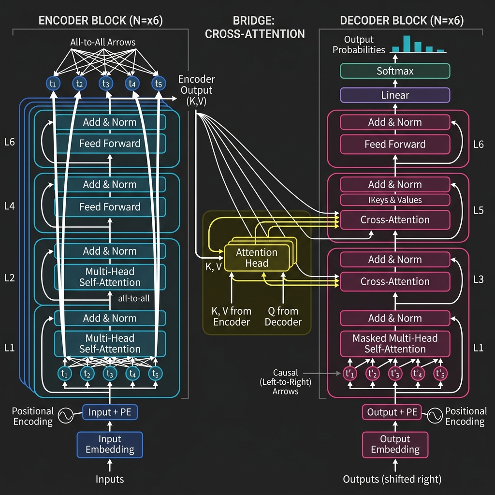

# 4.3 Encoder-Decoder (T5/BART)

**Encoder-Decoder** 아키텍처(Seq2Seq라고도 합니다)는 *Attention Is All You Need*에서 소개된 Transformer의 원래 설계입니다. 입력을 읽고 정리하는 **Encoder** 와, 그 표현을 바탕으로 출력을 생성하는 **Decoder** 가 역할을 나눠 맡습니다.

이 구조가 지금도 중요한 이유는 분명합니다. 어떤 작업은 열린 결말의 continuation처럼 느껴지지 않고, 오히려 “이 입력을 저 출력으로 정확히 바꾸는 일”에 가깝기 때문입니다. 번역, 요약, 문장 재작성, 구조 변환 같은 작업이 대표적이죠.

그래서 범용 어시스턴트는 decoder-only 쪽으로 많이 이동했지만, 입력 시퀀스를 먼저 정확히 이해한 뒤 출력을 만들어야 하는 작업에서는 encoder-decoder가 여전히 강한 선택지입니다.

---

## The Metaphor: The Translator and The Scribe (번역가와 필기사)

책을 프랑스어에서 영어로 번역하는 과정을 상상해 보세요.

1.  **The Encoder (프랑스어 전문가):** 프랑스어 문장 전체를 읽고, 맥락을 이해하며, 의미에 대한 세부적인 정신적 지도(mental map)를 만듭니다.
2.  **The Decoder (영어 필기사):** Encoder로부터 정신적 지도를 받아 영어 문장을 한 단어씩 써내려 가며, 원래 의미에 충실하면서도 영어로 자연스럽게 읽히도록 합니다.

이러한 분업이 바로 Encoder-Decoder 아키텍처의 본질입니다.

---

## The Architecture: Bridging Two Worlds (두 세계의 연결)

이 아키텍처의 결정적인 특징은 **Cross-Attention** 을 통해 매개되는 Encoder와 Decoder 간의 상호작용입니다.

1.  **Encoder**: 입력 처리를 위해 **Bidirectional Self-Attention**을 사용합니다.
2.  **Decoder**: 출력을 autoregressive하게 생성하기 위해 **Causal Self-Attention**을 사용합니다.
3.  **Cross-Attention**: Decoder가 Encoder의 출력에 어텐션을 기울여, 각 출력 토큰을 생성할 때 입력 시퀀스의 관련 부분에 집중할 수 있도록 합니다.

<div style={{ display: 'flex', flexDirection: 'column', alignItems: 'center', width: '100%', margin: '20px 0' }}>

<div style={{ maxWidth: '800px', width: '100%' }}>

</div>

<em style={{ marginTop: '10px', color: '#7f8c8d' }}>Source: Generated by Gemini</em>

</div>

---

## Core Mechanism: Cross-Attention

Cross-Attention에서 쿼리($Q$)는 Decoder의 이전 레이어에서 오고, 키($K$)와 값($V$)은 Encoder의 출력에서 옵니다.

$$\text{Cross-Attention}(Q_{dec}, K_{enc}, V_{enc}) = \text{softmax}\left(\frac{Q_{dec}K_{enc}^T}{\sqrt{d_k}}\right)V_{enc}$$

이를 통해 decoder는 생성의 모든 단계에서 입력 문장을 "되돌아볼" 수 있습니다.

---

## Evolution and Key Models

### 1. T5 (Text-to-Text Transfer Transformer)
**Motivation**: T5 이전에는 감성 분석을 위한 분류 헤드, 질의응답을 위한 스팬 예측 헤드 등 서로 다른 NLP 과업마다 종종 서로 다른 모델 아키텍처나 출력 헤드가 필요했습니다. Google은 *모든* NLP 과업을 text-to-text 문제로 변환함으로써 이러한 복잡성을 단순화하고자 했습니다. 이를 통해 모든 과업에 동일한 모델, 손실 함수, 하이퍼파라미터를 사용할 수 있게 되었습니다 [[1]](#ref-1).

**핵심 혁신 (Key Innovations)**:
- **Text-to-Text 프레임워크**: 번역, 요약, 심지어 분류 과업까지 입력 텍스트를 출력 텍스트로 매핑하는 방식으로 프레임화했습니다. 예를 들어 감성을 분류할 때 입력은 "sentiment: This movie is great"이고 모델은 "positive"라는 텍스트를 출력합니다.
- **Span Corruption 사전 학습**: 단일 토큰을 마스킹하는 대신, 연속된 토큰 스팬을 마스킹하고 이를 복원하도록 학습시켜 sequence-to-sequence 과업에 더 효과적임을 입증했습니다.
- **스케일과 데이터**: C4(Colossal Clean Crawled Corpus) 데이터셋을 도입하여 Encoder-Decoder 모델의 스케일 한계를 밀어붙였습니다.

---

### 2. BART
**Motivation**: Facebook의 BART는 양방향 인코더(BERT와 같은)의 강점과 자기회귀 디코더(GPT와 같은)의 강점을 결합하도록 설계되었습니다. 목표는 이해 과업과 생성 과업 모두에서 탁월한 성능을 발휘하는 모델을 만드는 것이었으며, 특히 요약 및 번역과 같이 sequence-to-sequence 매핑이 필요한 과업에 집중했습니다.

**핵심 혁신 (Key Innovations)**:
- **노이즈 제거 오토인코더 (Denoising Autoencoder)**: 다양한 노이즈 연산을 통해 텍스트를 손상시키고 원래 텍스트를 복원하도록 학습되었습니다 [[2]](#ref-2). 연산에는 토큰 마스킹, 토큰 삭제, 텍스트 인필링, 문장 치환, 문서 회전이 포함되었습니다.
- **자기회귀 디코더 (Autoregressive Decoder)**: 마스킹된 토큰을 병렬로 예측하는 BERT와 달리, BART의 디코더는 출력을 autoregressive하게 생성하므로 유창한 텍스트를 생성하는 데 훨씬 더 적합합니다.

---

### Encoder-Decoder 모델 비교

| 특징 | T5 | BART |
| :--- | :--- | :--- |
| **핵심 아이디어** | Text-to-Text 통합 | 노이즈 제거 오토인코더 |
| **사전 학습 과업** | Span Corruption (빈칸 채우기) | 다양한 노이즈 제거 (마스킹, 삭제 등) |
| **아키텍처** | 표준 Encoder-Decoder | Encoder + 자기회귀 Decoder |
| **적합한 과업** | 다중 작업 학습, 번역 | 요약, 이해 |


---

## PyTorch Implementation: Cross-Attention

다음은 Cross-Attention 메커니즘의 단순화된 구현입니다.

```python
import torch
import torch.nn as nn
import torch.nn.functional as F

class CrossAttention(nn.Module):
    def __init__(self, d_model, num_heads):
        super().__init__()
        self.num_heads = num_heads
        self.d_k = d_model // num_heads
        
        self.q_linear = nn.Linear(d_model, d_model)
        self.k_linear = nn.Linear(d_model, d_model)
        self.v_linear = nn.Linear(d_model, d_model)
        self.out_linear = nn.Linear(d_model, d_model)

    def forward(self, decoder_hidden, encoder_output):
        # decoder_hidden: (batch, seq_len_dec, d_model)
        # encoder_output: (batch, seq_len_enc, d_model)
        batch_size = decoder_hidden.size(0)
        
        # Project and split into heads
        Q = self.q_linear(decoder_hidden).view(batch_size, -1, self.num_heads, self.d_k).transpose(1, 2)
        K = self.k_linear(encoder_output).view(batch_size, -1, self.num_heads, self.d_k).transpose(1, 2)
        V = self.v_linear(encoder_output).view(batch_size, -1, self.num_heads, self.d_k).transpose(1, 2)
        
        # Scaled dot-product attention
        scores = torch.matmul(Q, K.transpose(-2, -1)) / (self.d_k ** 0.5)
        weights = F.softmax(scores, dim=-1)
        
        # Output
        output = torch.matmul(weights, V)
        output = output.transpose(1, 2).contiguous().view(batch_size, -1, self.num_heads * self.d_k)
        
        return self.out_linear(output), weights

# Example usage
d_model = 64
num_heads = 4
seq_len_dec = 5
seq_len_enc = 10
batch_size = 2

decoder_hidden = torch.randn(batch_size, seq_len_dec, d_model)
encoder_output = torch.randn(batch_size, seq_len_enc, d_model)

cross_attn = CrossAttention(d_model, num_heads)
output, weights = cross_attn(decoder_hidden, encoder_output)

print("Output Shape:", output.shape) # Expected: (2, 5, 64)
print("Attention Weights Shape:", weights.shape) # Expected: (2, 4, 5, 10)
```

---

## Quizzes

<details>
<summary>Quiz 1: Cross-Attention과 Self-Attention의 가장 큰 구조적 차이점은 무엇입니까?</summary>
*Self-Attention에서는 쿼리, 키, 값이 모두 동일한 시퀀스에서 옵니다. 반면 Cross-Attention에서는 쿼리는 decoder(생성되는 대상 시퀀스를 나타냄)에서 오고, 키와 값은 encoder(처리되는 소스 시퀀스를 나타냄)에서 옵니다.*
</details>

<details>
<summary>Quiz 2: 기계 번역에서 전통적으로 Decoder-only 모델보다 Encoder-Decoder 모델이 선호되는 이유는 무엇입니까?</summary>
*번역은 대상 문장을 생성하기 전에 소스 문장에 대한 완전한 이해가 필요하기 때문입니다. Encoder는 소스에 대한 풍부한 양방향 표현을 생성할 수 있으며, decoder는 cross-attention을 통해 이 표현에 어텐션을 기울이면서 번역을 생성할 수 있습니다.*
</details>

<details>
<summary>Quiz 3: T5는 감성 분석과 같은 분류 과업을 어떻게 text-to-text 문제로 프레임화합니까?</summary>
*T5는 분류할 텍스트를 입력으로 받고(예: "translate English to German: Hello"), 클래스 인덱스가 아닌 텍스트 라벨(예: "positive" 또는 "negative")을 직접 출력하도록 학습됩니다. 이를 통해 모든 과업을 단일 형식으로 통합합니다.*
</details>

<details>
<summary>Quiz 4: BART에서 "denoising" 목표의 목적은 무엇입니까?</summary>
*Denoising 목표는 모델이 손상된 입력으로부터 원래 텍스트를 복구하도록 강제합니다. 이는 모델이 언어의 구조와 의미를 깊이 이해하도록 가르치며, 요약과 같은 과업을 위해 fine-tuning할 때 일관된 텍스트를 더 잘 생성하도록 만듭니다.*
</details>

<details>
<summary>Quiz 5: 왜 결국 범용 LLM에서는 Encoder-Decoder 모델보다 Decoder-only 모델이 더 인기를 얻게 되었습니까?</summary>
*Decoder-only 모델은 스케일링하기 더 간단하고, 서빙을 위한 인프라가 덜 복잡하며, task-specific fine-tuning 없이도 범용 어시스턴트로서 매우 효과적인 in-context learning과 같은 강력한 창발적 능력을 보여주었기 때문입니다.*
</details>

---

## References

1. <a id="ref-1"></a>Raffel, C., et al. (2019). *Exploring the Limits of Transfer Learning with a Unified Text-to-Text Transformer*. [arXiv:1910.10683](https://arxiv.org/abs/1910.10683).
2. <a id="ref-2"></a>Lewis, M., et al. (2019). *BART: Denoising Sequence-to-Sequence Pre-training for Natural Language Generation, Translation, and Comprehension*. [arXiv:1910.13461](https://arxiv.org/abs/1910.13461).
