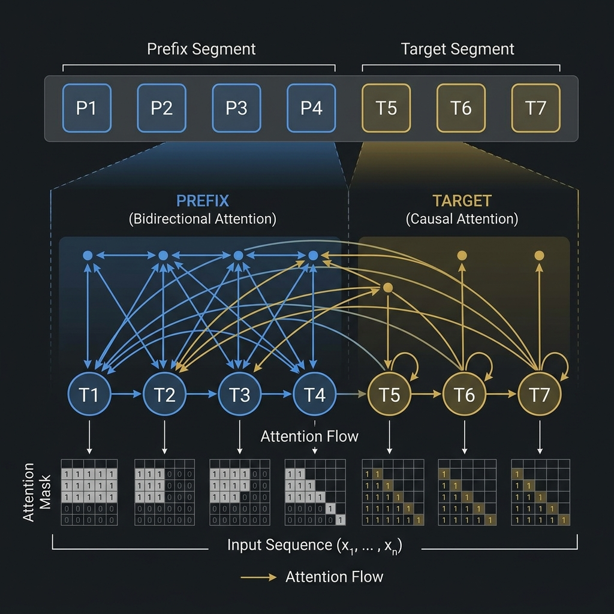

# 4.4 Hybrid & Prefix LM

Encoder-only 모델과 Decoder-only 모델이 Transformer 스펙트럼의 양 극단을 대표하는 동안, **Hybrid** 및 **Prefix Language Model (Prefix LM)** 은 그 격차를 해소하여 두 세계의 장점을 모두 제공하는 것을 목표로 합니다.

이러한 아키텍처는 프롬프트에 대한 깊은 양방향 이해(Encoder와 같음)와 유창한 autoregressive 생성(Decoder와 같음)이 모두 필요한 과업을, 별도의 Encoder-Decoder 아키텍처의 복잡성 없이 처리하도록 설계되었습니다.

---

## The Metaphor: The Guided Storyteller (안내를 받는 이야기꾼)

세부적인 개요(Prefix)를 받고 이야기(Target)를 쓰라는 요청을 받은 작가를 상상해 보세요.
*   개요를 읽고 이해하는 동안 작가는 전체 맥락을 파악하기 위해 앞뒤로 자유롭게 살펴볼 수 있습니다.
*   그러나 이야기를 직접 쓸 때는 지금까지 쓴 내용과 개요만 보면서 한 단어씩 써내려 가야 합니다.

이것이 바로 Prefix LM의 작동 방식입니다. 프롬프트(prefix) 내에서는 bidirectional 어텐션을 허용하지만, 생성되는 대상(target)에 대해서는 causal 어텐션을 강제합니다.

---

## Prefix LM: Non-Causal Attention on the Prompt

**Prefix LM** 에서 입력 시퀀스는 두 부분으로 나뉩니다: 길이가 $L_p$인 prefix와 길이가 $L_t$인 target.

*   **Prefix Tokens ($1 \le i \le L_p$):** 다른 모든 prefix 토큰에 bidirectional하게 어텐션을 기울일 수 있습니다.
*   **Target Tokens ($L_p < i \le L_p + L_t$):** 모든 prefix 토큰과 이전의 모든 target 토큰에 어텐션을 기울일 수 있습니다 (causal 어텐션).

<div style={{ display: 'flex', flexDirection: 'column', alignItems: 'center', width: '100%', margin: '20px 0' }}>

<div style={{ maxWidth: '800px', width: '100%' }}>

</div>

<em style={{ marginTop: '10px', color: '#7f8c8d' }}>출처: AI 생성 이미지</em>

</div>

다이어그램에 표시된 것처럼 어텐션 마스크는 하이브리드 형태입니다: prefix 영역에서는 완전한 가시성을 제공하고, target 영역에서는 하삼각(lower-triangular) 형태를 띱니다.

---

## Key Models and Innovations

### 1. GLM (General Language Model) (2021)
**Motivation**: AI 분야는 이해에 유리한 Encoder-only 모델과 생성에 유리한 Decoder-only 모델로 나뉘어 있었습니다. GLM의 저자들은 사전 학습 목표를 통합하여 단일 모델로 두 가지 유형의 과업 모두에서 탁월한 성능을 발휘하는 모델을 만들고자 했습니다. 그들은 BERT(생성에 부적합)와 GPT(단방향 어텐션으로 인해 이해에 차선책)의 한계를 극복하고자 했습니다 [[1]](#ref-1).

**핵심 혁신 (Key Innovations)**:
- **자기회귀 공백 채우기 (Autoregressive Blank Infilling)**: GLM은 입력에서 연속된 토큰 스팬을 무작위로 비웁니다(T5의 span corruption과 유사). 그러나 이를 병렬로 예측하는 대신, GPT처럼 토큰별로 autoregressive하게 복원합니다.
- **2D 위치 인코딩 (2D Positional Encoding)**: 누락된 스팬의 autoregressive 생성을 처리하기 위해, GLM은 원래 문장에서의 위치와 생성된 스팬 내에서의 위치를 모두 캡처하는 고유한 2D 위치 인코딩을 사용합니다.
- **유연성**: 공백의 수와 길이를 변경함으로써 GLM은 Encoder-only 모델, Decoder-only 모델 또는 전체 Encoder-Decoder 모델처럼 작동하도록 학습될 수 있습니다.

---

### 2. PaLM과 병렬 어텐션 (Parallel Attention)
Google의 PaLM (Pathways Language Model)은 주로 Decoder-only 모델이지만, 하이브리드 설계와 매우 관련이 깊은 아키텍처 수정을 도입했습니다.
- **병렬 레이어 (Parallel Layers)**: 직렬화된 어텐션 및 피드포워드 레이어(LayerNorm -> Attention -> LayerNorm -> FFN) 대신, PaLM은 이들을 병렬로 실행했습니다. 이는 TPU 클러스터에서 학습 속도를 크게 향상시켰습니다.
- **하이브리드 설계와의 관련성**: 이러한 병렬 구조는 인코더의 무거운 컨텍스트 처리와 디코더의 빠른 생성 간의 균형을 맞추려는 후속 하이브리드 모델에 영감을 주었습니다.


---

## PyTorch Implementation: Prefix Mask

다음은 PyTorch에서 Prefix LM을 위한 어텐션 마스크를 구성하는 방법입니다.

```python
import torch

def create_prefix_mask(prefix_len, total_len):
    """
    Create an attention mask for a Prefix LM.
    """
    mask = torch.zeros(total_len, total_len)
    
    # 1. Prefix can attend to all prefix tokens bidirectionally
    mask[:prefix_len, :prefix_len] = 1
    
    # 2. Target tokens can attend to all prefix tokens and preceding target tokens
    for i in range(prefix_len, total_len):
        mask[i, :i+1] = 1
        
    return mask

# Example usage
prefix_len = 3
total_len = 7 # prefix_len (3) + target_len (4)

mask = create_prefix_mask(prefix_len, total_len)

print("Prefix LM Mask:")
print(mask)
```

`prefix_len=3` 및 `total_len=7`에 대한 예상 출력:
```
[[1., 1., 1., 0., 0., 0., 0.],
 [1., 1., 1., 0., 0., 0., 0.],
 [1., 1., 1., 0., 0., 0., 0.],
 [1., 1., 1., 1., 0., 0., 0.],
 [1., 1., 1., 1., 1., 0., 0.],
 [1., 1., 1., 1., 1., 1., 0.],
 [1., 1., 1., 1., 1., 1., 1.]]
```

---

## Quizzes

<details>
<summary>Quiz 1: Prefix LM은 프롬프트를 처리할 때 표준 Decoder-only 모델과 어떻게 다릅니까?</summary>
*표준 Decoder-only 모델은 프롬프트를 인과적으로(causally) 처리하므로, 프롬프트의 토큰이 프롬프트 내의 후속 토큰에 어텐션을 기울일 수 없습니다. 반면 Prefix LM은 프롬프트 내에서 bidirectional 어텐션을 허용하여 토큰이 프롬프트의 전체 컨텍스트를 볼 수 있도록 합니다.*
</details>

<details>
<summary>Quiz 2: 풀(full) Encoder-Decoder 아키텍처와 비교하여 Prefix LM의 가장 큰 장점은 무엇입니까?</summary>
*Prefix LM은 단일 통합 Transformer 레이어 스택을 사용하는 반면, Encoder-Decoder는 두 개의 별도 스택을 사용합니다. 이로 인해 Prefix LM은 구현이 더 간단하고 잠재적으로 파라미터 효율성이 더 높으면서도, 양방향 프롬프트 이해의 일부 이점을 여전히 제공합니다.*
</details>

<details>
<summary>Quiz 3: PyTorch 예시에서 마스크의 왼쪽 상단 $3 \times 3$ 블록이 1로 채워진 이유는 무엇입니까?</summary>
*Prefix 길이가 3이고, prefix 내의 토큰은 prefix 내의 다른 모든 토큰에 bidirectional하게 어텐션을 기울일 수 있기 때문입니다. 따라서 prefix 내의 모든 쌍은 유효한 어텐션을 가집니다.*
</details>

<details>
<summary>Quiz 4: 어떤 종류의 과업에 Prefix LM이 특히 적합할 수 있습니까?</summary>
*Prefix LM은 요약(프롬프트는 텍스트, 타겟은 요약) 또는 번역과 같이 컨텍스트/프롬프트와 생성 대상(target)이 명확히 분리된 과업에 적합하며, 생성이 시작되기 전에 프롬프트에 대한 완전한 이해가 유익한 경우에 유리합니다.*
</details>

<details>
<summary>Quiz 5: GLM의 pre-training 목표 뒤에 숨겨진 핵심 아이디어는 무엇입니까?</summary>
*GLM은 autoregressive blank-infilling 목표를 사용합니다. 입력에서 연속된 토큰 범위를 무작위로 비우고(blank) 모델이 이를 autoregressive하게 복원하도록 학습시켜, 이해 및 생성 과업을 모두 효과적으로 처리할 수 있도록 합니다.*
</details>

---

## References

1. <a id="ref-1"></a>Du, Z., et al. (2021). *GLM: General Language Model Pretraining with Autoregressive Blank Infilling*. [arXiv:2103.10360](https://arxiv.org/abs/2103.10360).
