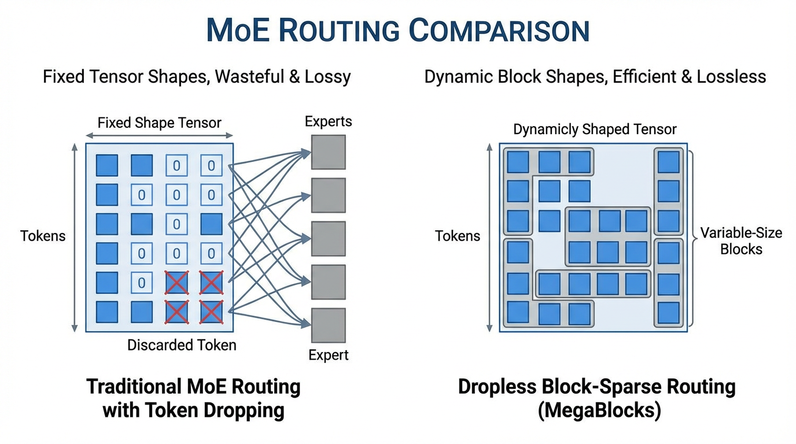

Dense (밀집) 단일 네트워크에서 Sparse (희소) **Mixture of Experts (MoE)** 로의 전환은 단순한 하드웨어 최적화가 아닙니다. 이는 모델의 '용량(Capacity)'을 개념화하는 방식의 근본적인 패러다임 전환입니다. Dense 패러다임에서는 모든 파라미터가 모든 토큰과 곱해지며, 연산 비용이 모델이 가진 지식의 양과 직접적으로 결합됩니다. **MoE** 는 이러한 선형적 관계를 깨뜨립니다. 토큰당 필요한 부동소수점 연산(FLOPs)과 전체 파라미터 수를 분리함으로써, **MoE** 아키텍처는 훨씬 작은 네트워크의 추론 지연 시간(Latency)을 유지하면서도 방대한 양의 세상 지식을 흡수할 수 있게 해줍니다.

이번 케이스 스터디에서는 네 가지 기념비적인 **MoE** 아키텍처인 **Mixtral 8x7B** , **DBRX** , **Grok-1** , 그리고 **DeepSeek-V3** 를 기술적으로 해부해 보겠습니다. 단순히 스펙을 나열하는 것을 넘어, 각 연구팀이 규모와 효율성의 파레토 프론티어(Pareto frontier)를 돌파하기 위해 선택한 구체적인 엔지니어링 트레이드오프와 라우팅 혁신을 분석합니다.

---

## 1. Mixtral 8x7B: 오픈소스 MoE의 촉매제

Mistral AI가 2023년 말에 출시한 **Mixtral 8x7B** [[1]](#ref-1) 는 **MoE** 아키텍처를 대중적인 오픈소스 생태계로 이끈 촉매제였습니다. 이 모델은 **MoE** 가 GPT-4와 같은 빅테크 기업의 조 단위 파라미터 모델 전유물이라는 환상을 깨뜨렸습니다.

### "8x7B"라는 이름의 오해
"8x7B"라는 이름은 훌륭한 마케팅 용어이지만, 기술적으로는 오해의 소지가 있습니다. 가장 흔한 오해는 Mixtral이 70억(7B) 개의 파라미터를 가진 독립적인 모델 8개의 앙상블이며, 따라서 총 560억(56B) 개의 파라미터를 가질 것이라는 생각입니다. 하지만 실제 Mixtral의 총 파라미터 수는 **47B** 개이며, 특정 토큰에 대한 포워드 패스(Forward pass) 동안 활성화되는 파라미터는 **13B** 개뿐입니다.

왜 47B일까요? Transformer 아키텍처에서 Self-Attention 메커니즘과 토큰 임베딩은 모든 전문가(Expert) 간에 **공유** 됩니다. 오직 Feed-Forward Network (FFN) 레이어만이 복제됩니다. 
Dense 7B 모델의 어텐션 파라미터를 $P_{attn}$ , FFN 파라미터를 $P_{ffn}$ 이라고 할 때, Mixtral의 대략적인 총 파라미터 수는 다음과 같이 계산됩니다.

$$ P_{total} = P_{attn} + (8 \times P_{ffn}) \approx 47B $$

### 라우팅 메커니즘 (Routing Mechanism)
Mixtral은 8개의 전문가 중 2개를 선택하는 표준적인 Top-2 라우팅 메커니즘($K=2, N=8$)을 사용합니다. 주어진 입력 상태 $x$ 에 대해, 라우터는 Top-2 로짓(Logits)에 소프트맥스(Softmax)를 적용하여 게이팅 벡터 $G(x)$ 를 계산합니다. **MoE** 레이어의 출력은 선택된 두 전문가의 가중합(Weighted sum)이 됩니다.

$$ y = \sum_{i=1}^{2} G(x)_i E_i(x) $$

토큰당 단 두 개의 전문가만 활성화함으로써, Mixtral은 약 12B 파라미터 모델의 추론 속도를 달성하면서도 47B 파라미터 모델의 지식 용량을 활용합니다. 이는 Sparse **MoE** 가 효율적으로 학습될 수 있고, 양자화(Quantization) 시 소비자용 하드웨어에서도 배포될 수 있음을 증명하며 아키텍처의 민주화를 이끌었습니다.

---

## 2. DBRX: Fine-Grained 전문가의 힘

Mixtral이 Coarse-Grained (거친 입자의) **MoE** 의 실행 가능성을 증명했다면, Databricks의 **DBRX** 는 MegaBlocks 프레임워크 [[2]](#ref-2) 를 기반으로 한 **Fine-Grained (세밀한) MoE 아키텍처** 를 도입하여 다른 길을 개척했습니다.

### 조합의 폭발 (Combinatorial Explosion)
**DBRX** 는 총 132B 파라미터를 가지며, 활성 파라미터는 36B입니다. 8개의 거대한 전문가 중 2개를 선택하는 대신, **DBRX** 는 **16개의 더 작은 전문가를 사용하고 4개를 선택** ($K=4, N=16$) 합니다.

Mixtral과 **DBRX** 모두 사용 가능한 FFN 파라미터의 25%를 활성화하지만, 표현력(Representation power) 측면에서 수학적 의미는 완전히 다릅니다. 단일 레이어를 통과할 때 토큰이 취할 수 있는 가능한 라우팅 조합(전문가 경로)의 수는 이항 계수 $\binom{N}{K}$ 로 결정됩니다.

*   **Mixtral (8 choose 2):** $\binom{8}{2} = 28$ 개의 가능한 경로.
*   **DBRX (16 choose 4):** $\binom{16}{4} = 1820$ 개의 가능한 경로.

더 많고 작은 전문가를 사용함으로써, **DBRX** 는 **65배 더 많은 라우팅 조합** 을 제공합니다. 이러한 세밀한 전문화(Specialization)를 통해 모델은 훨씬 더 높은 해상도로 개념을 혼합하고 매칭할 수 있으며, 활성 파라미터 수를 늘리지 않고도 모델의 품질과 일반화(Generalization) 성능을 크게 향상시킵니다.

### Dropless Routing (MegaBlocks)
전통적인 **MoE** 구현은 GPU 연산을 위한 정적 텐서(Static tensor) 형태를 유지하기 위해 각 전문가에게 엄격한 "용량 계수(Capacity factor)"를 강제합니다. 만약 한 전문가에게 너무 많은 토큰이 몰리면, 초과된 토큰은 단순히 **버려집니다 (Dropped)**. 즉, FFN 처리를 거치지 않고 Residual connection을 통해 그대로 통과하게 되어 성능 저하를 유발합니다.

**DBRX** 는 Block-Sparse 행렬 곱셈을 사용하여 **MoE** 연산을 재구성한 MegaBlocks를 활용합니다. 이를 통해 전문가의 크기를 동적으로 조정할 수 있으며, 토큰이 버려지는 현상을 완전히 제거하는 **Dropless Routing** (드롭리스 라우팅)을 구현합니다. 또한 활용도가 낮은 전문가를 패딩(Padding)하는 데 낭비되는 연산량도 방지합니다.


*Source: Generated by Gemini*

---

## 3. Grok-1: 브루트 포스 스케일링 (Brute Force Scaling)

xAI가 개발한 **Grok-1** [[3]](#ref-3) 은 무식할 정도의 크기 확장이 가진 힘을 보여줍니다. 오픈 소스로 공개될 당시, 이 모델은 무려 **314B** 에 달하는 총 파라미터를 자랑하며 현존하는 가장 큰 오픈 소스 모델 중 하나로 자리 잡았습니다.

Mixtral과 마찬가지로 **Grok-1** 은 8개 중 2개를 선택하는 Top-2 라우팅 전략을 사용합니다. 하지만 베이스 모델 자체가 워낙 거대하기 때문에, 토큰당 활성 파라미터 수만 해도 약 **78B** 에 달합니다. 이는 **Grok-1** 의 *Sparse* 포워드 패스조차 전체 Dense Llama-2 70B 모델보다 크다는 것을 의미합니다.

**Grok-1** 의 주요 엔지니어링 과제는 연산량(FLOPs)이 아니라 **메모리 대역폭(Memory Bandwidth)** 입니다. 16비트 정밀도로 **Grok-1** 의 추론을 실행하려면 600GB 이상의 VRAM이 필요하며, 단순히 가중치를 메모리에 올리기 위해서만 8-way GPU 노드(예: 8x H100 또는 8x MI300X)가 필요합니다. **Grok-1** 은 **MoE** 가 직면할 수밖에 없는 인프라의 장벽을 명확히 보여줍니다. 연산량은 낮게 유지되지만, 메모리 용량 요구사항은 총 파라미터 수에 비례하여 선형적으로 증가한다는 사실입니다.

---

## 4. DeepSeek-V3: 효율성의 정점

2024년 말에 공개된 **DeepSeek-V3** [[4]](#ref-4) 는 **MoE** 엔지니어링의 마스터클래스라 할 수 있습니다. 이 모델은 전체 사전 학습(Pre-training) 과정에 단 278만 H800 GPU 시간만을 사용하여, 경쟁 모델들이 사용한 컴퓨팅 자원의 극히 일부만으로 GPT-4o나 Claude 3.5 Sonnet과 같은 폐쇄형 프론티어 모델에 필적하는 성능을 달성했습니다.

**DeepSeek-V3** 는 총 **671B** 의 파라미터를 가지지만, 토큰당 활성 파라미터는 **37B** 에 불과합니다. 전체 파라미터의 약 5.5%만 활성화하는 이 극단적인 희소성(Sparsity)은 몇 가지 급진적인 아키텍처 혁신을 통해 달성되었습니다.

### DeepSeekMoE: Shared + Fine-Grained Routed Experts
표준 라우팅 풀(Pool)을 사용하는 대신, **DeepSeek-V3** 는 FFN을 두 가지 서로 다른 유형의 전문가로 분리합니다.
1.  **Shared Experts (공유 전문가):** 모든 토큰에 대해 *항상* 활성화되는 1개의 전문가입니다. 이 전문가는 일반적인 언어 구조와 보편적 지식을 포착하여 네트워크의 Dense 백본(Backbone) 역할을 합니다.
2.  **Routed Experts (라우팅 전문가):** 256개의 고도로 전문화된 Fine-Grained 전문가입니다. 라우터는 토큰당 최대 8개를 선택합니다.

이러한 분리 구조는 표준 **MoE** 에서 흔히 볼 수 있는 '라우팅 붕괴(Routing collapse)'를 방지합니다. 초기 레이어에서 모든 전문가가 기본적인 문법을 동시에 학습하려고 시도하다가 라우팅 효율이 떨어지는 현상을 Shared Expert가 전담하여 해결해 주기 때문입니다.

### Auxiliary-Loss-Free Load Balancing (보조 손실 없는 부하 분산)
표준 **MoE** 학습에서는 메인 언어 모델링 손실(Loss)에 보조 손실 함수($L_{aux}$)를 추가하여 라우터가 토큰을 전문가들에게 균등하게 분배하도록 강제합니다. 이 장치가 없으면 네트워크는 "부익부 빈익빈" 루프에 빠지게 됩니다. 하지만 이 보조 손실은 상충하는 그래디언트(Gradient)를 생성합니다. 즉, 특정 전문가가 이미 과부하 상태일 때, 모델이 그 토큰에 가장 *적합한* 전문가에게 토큰을 보내려고 하면 오히려 페널티를 받게 되는 모순이 발생합니다.

**DeepSeek-V3** 는 **Auxiliary-Loss-Free (보조 손실 없음)** 전략을 개척했습니다. 손실 함수를 수정하는 대신, 포워드 패스 중에 라우팅 로짓에 직접 더해지는 **바이어스(Bias) 항** 을 동적으로 조정합니다.

어떤 전문가가 과부하 상태라면 해당 전문가의 바이어스를 줄입니다. 반대로 토큰을 너무 적게 받고 있다면 바이어스를 늘립니다. 이를 통해 메인 언어 모델링 태스크의 그래디언트를 오염시키지 *않고도* 부하 분산(Load balancing)을 보장합니다.

#### Auxiliary-Free 라우팅 구현

다음은 **DeepSeek-V3** 의 동적 바이어스 라우팅의 핵심 개념을 보여주는 PyTorch 구현입니다. 바이어스는 Top-K '선택' 과정에만 적용되며, FFN 조합에 실제로 사용되는 게이팅 가중치(Gating weights)는 바이어스가 없는 원래의 로짓에서 파생된다는 점에 주목하십시오.

```python
import torch
import torch.nn as nn
import torch.nn.functional as F

class DeepSeekAuxFreeRouter(nn.Module):
    def __init__(self, d_model: int, num_routed_experts: int, top_k: int):
        super().__init__()
        # 라우터 네트워크 (Linear 레이어 자체에는 bias가 없음)
        self.gate = nn.Linear(d_model, num_routed_experts, bias=False)
        self.top_k = top_k
        
        # 부하 분산을 위한 동적 바이어스 항 (역전파를 통해 업데이트되지 않음)
        self.register_buffer("expert_bias", torch.zeros(num_routed_experts))
        
    def forward(self, x: torch.Tensor):
        # x shape: [batch_size, seq_len, d_model]
        logits = self.gate(x) # [B, S, E]
        
        # 1. 라우팅 결정에만 동적 바이어스(Dynamic bias)를 추가합니다.
        routing_logits = logits + self.expert_bias
        
        # 2. 바이어스가 추가된 로짓을 기반으로 top-k 전문가를 선택합니다.
        topk_logits, topk_indices = torch.topk(routing_logits, self.top_k, dim=-1)
        
        # 3. 바이어스가 없는(UNBIASED) 원래의 로짓을 사용하여 게이팅 가중치를 계산합니다.
        # DeepSeek은 Softmax 대신 Sigmoid를 사용하여 Affine 조합을 수행합니다.
        # 이를 통해 가중치의 총합이 엄격하게 1.0으로 제한되지 않도록 합니다.
        unbiased_selected_logits = logits.gather(-1, topk_indices)
        gate_weights = torch.sigmoid(unbiased_selected_logits)
        
        # 가중치 정규화 (DeepSeek의 세부 구현에 따라 선택적 적용)
        gate_weights = gate_weights / gate_weights.sum(dim=-1, keepdim=True)
        
        return gate_weights, topk_indices
        
    @torch.no_grad()
    def update_bias(self, expert_load: torch.Tensor, target_load: torch.Tensor, step_size: float = 0.001):
        """
        학습 스텝의 끝에서 호출됩니다.
        expert_load: 이번 배치에서 각 전문가에게 라우팅된 실제 토큰 수.
        target_load: 이상적인 균등 분포 토큰 수.
        """
        # load > target 이면 차이가 음수 -> 바이어스 감소.
        # load < target 이면 차이가 양수 -> 바이어스 증가.
        load_diff = target_load - expert_load
        
        # DeepSeek은 부호(sign) 기반 또는 비례 업데이트 규칙을 사용합니다.
        self.expert_bias += step_size * torch.sign(load_diff)
```

보조 손실을 제거함으로써 **DeepSeek-V3** 는 다음 단어 예측 태스크를 위한 더 순수한 학습 신호를 얻을 수 있었으며, 이는 추론(Reasoning) 및 수학 벤치마크에서 SOTA(State-of-the-Art) 성능을 달성하는 주요 요인이 되었습니다.

---

## 5. 아키텍처 비교 (Architectural Comparison)

차이점을 종합하기 위해, Dense 베이스라인(Llama-3 70B)과 함께 이 모델들의 비교 매트릭스를 살펴보겠습니다.

| Model | Architecture Type | Total Params | Active Params | Experts ($N$) | Top-K ($K$) | Routing Strategy |
| :--- | :--- | :--- | :--- | :--- | :--- | :--- |
| **Llama-3 70B** | Dense | 70B | 70B | N/A | N/A | N/A |
| **Mixtral 8x7B** | Coarse MoE | 47B | 13B | 8 | 2 | Standard Softmax |
| **DBRX** | Fine-Grained MoE | 132B | 36B | 16 | 4 | Dropless (MegaBlocks) |
| **Grok-1** | Coarse MoE | 314B | ~78B | 8 | 2 | Standard Softmax |
| **DeepSeek-V3** | Ultra-Fine MoE | 671B | 37B | 256 (+1 Shared)| 8 | Aux-Loss-Free Bias |

*관찰 결과:* 업계의 트렌드는 명확합니다. 모델은 Coarse-Grained 전문가(8 choose 2)에서 극단적인 Fine-Grained 희소성(256 choose 8)으로 이동하고 있습니다. 총 파라미터 수는 세상의 지식을 담기 위해 기하급수적으로 증가하는 반면, 활성 파라미터 수는 추론 속도와 배치 처리 효율성을 유지하기 위해 엄격하게 제한되고 있습니다.

---

## Quizzes

<details>
<summary>Quiz 1: 왜 Mixtral 8x7B의 총 파라미터 수는 56B가 아니라 47B입니까?</summary>

*Mixtral은 7B 모델 전체를 8번 복제하는 것이 아닙니다. 8개의 전문가에 복제되는 것은 FFN 레이어뿐이고, Self-Attention 가중치와 토큰 임베딩은 모두 공유됩니다. Dense Transformer에서 FFN이 파라미터의 큰 비중을 차지하므로, 이 부분만 8번 복제해도 총 파라미터 수는 56B가 아니라 약 47B가 됩니다.*
</details>

<details>
<summary>Quiz 2: DBRX 라우팅의 가장 큰 이점은 무엇입니까?</summary>

*DBRX의 핵심 이점은 라우팅 경로의 조합적 폭발입니다. Mixtral은 레이어당 $\binom{8}{2} = 28$개의 전문가 조합을 가지지만, DBRX는 $\binom{16}{4} = 1820$개의 조합을 가집니다. 이 훨씬 넓은 조합 공간 덕분에 DBRX는 더 세밀한 전문가들을 유연하게 섞을 수 있고, 활성 연산량을 늘리지 않으면서도 표현력과 일반화 능력을 높일 수 있습니다.*
</details>

<details>
<summary>Quiz 3: 왜 DeepSeek-V3의 동적 바이어스가 표준 보조 손실보다 낫습니까?</summary>

*표준 보조 손실은 균형 제약을 목적 함수에 직접 더하기 때문에, 메인 언어 모델링 손실과 그래디언트 충돌을 일으킵니다. 어떤 토큰에 대해 가장 적합한 전문가가 이미 과부하 상태라면, 보조 손실은 더 나쁜 전문가를 선택하게 만들 수 있습니다. DeepSeek의 동적 바이어스는 부하 분산을 포워드 패스에서 기계적으로 처리하면서도, 그 바이어스를 역전파에서 분리해 의미론적 학습 신호를 깨끗하게 유지합니다.*
</details>

<details>
<summary>Quiz 4: 전문가 용량을 초과하면 어떤 일이 일어나며, MegaBlocks는 이를 어떻게 해결합니까?</summary>

*전통적인 MoE 구현에서는 GPU 실행을 위해 정적인 텐서 형태가 필요합니다. 그래서 전문가의 용량을 초과하면 초과 토큰이 버려지고 FFN을 건너뛰게 되어 품질이 떨어집니다. 반대로 너무 적은 토큰이 들어오면 남는 공간이 패딩으로 채워져 연산이 낭비됩니다. MegaBlocks는 block-sparse 행렬 곱셈을 사용해 라우팅된 토큰 수에 맞춰 연산 블록을 동적으로 조정하므로, 토큰 드롭과 패딩 낭비를 모두 피할 수 있습니다.*
</details>

---

## 7. 요약 및 다음 단계

Mixtral에서 DeepSeek-V3로 이어지는 **MoE** 아키텍처의 진화는 지능을 확장하는 것이 더 이상 단순히 레이어를 쌓는 문제가 아님을 보여줍니다. 핵심은 **라우팅 효율성과 희소성(Sparsity)** 에 있습니다. 우리는 Fine-Grained 전문가가 어떻게 조합적 용량을 증가시키는지, Dropless 라우팅이 어떻게 하드웨어 활용도를 극대화하는지, 그리고 Auxiliary-Loss-Free 전략이 어떻게 학습 신호의 순수성을 보호하는지 살펴보았습니다.

하지만 아키텍처를 설계하는 것은 절반의 성공에 불과합니다. 256개의 전문가를 가진 671B 파라미터 모델을 학습시키는 것은 치명적인 시스템 수준의 도전 과제를 안겨줍니다. 15조 개의 토큰을 GPU가 쉬지 않도록 이 거대한 모델에 어떻게 공급할 수 있을까요? 토큰이 완전히 다른 서버에 상주하는 전문가에게 전송되어야 할 때 발생하는 엄청난 노드 간 통신 오버헤드는 어떻게 처리할까요?

다음 장인 **Chapter 6: Foundation Model Pre-training** 에서는 인프라 계층으로 깊이 내려갑니다. 수개월간의 연속적인 학습 동안 이 거대한 Sparse 모델을 안정적으로 유지하고 데이터를 공급하기 위해 필요한 방대한 데이터 엔지니어링 파이프라인, 토큰화(Tokenization) 과학, 그리고 극한의 네트워킹(NVLink/InfiniBand) 기술을 탐구할 것입니다.

---
## References

1. <a id="ref-1"></a>Jiang, A. Q., et al. (2024). *Mixtral of Experts*. arXiv preprint. [arXiv:2401.04088](https://arxiv.org/abs/2401.04088).
2. <a id="ref-2"></a>Gale, T., et al. (2022). *MegaBlocks: Efficient Routing for Mixture-of-Experts*. arXiv preprint. [arXiv:2211.15841](https://arxiv.org/abs/2211.15841).
3. <a id="ref-3"></a>xAI. (2024). "Open Release of Grok-1." "xAI Blog". [Link](https://x.ai/blog/grok-os).
4. <a id="ref-4"></a>DeepSeek-AI. (2024). *DeepSeek-V3 Technical Report*. arXiv preprint. [arXiv:2412.19437](https://arxiv.org/abs/2412.19437).
