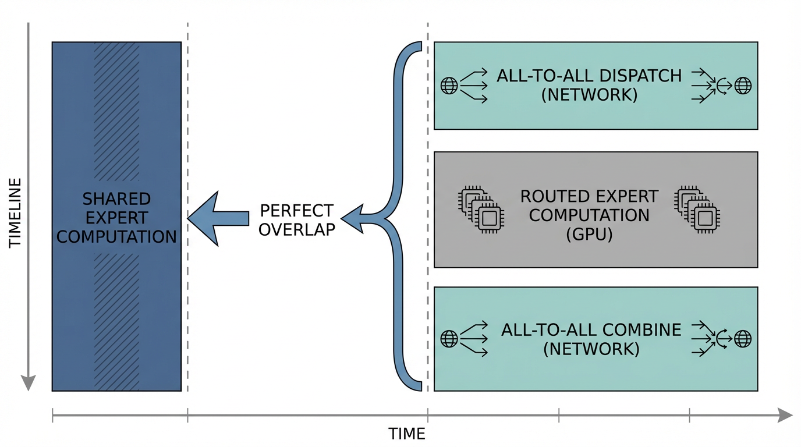

import { ExpertParallelismVisualizer } from '../../../components/chapter-5/ExpertParallelismVisualizer.tsx';

# 5.3 Expert Parallelism (전문가 병렬화)

이전 섹션에서 우리는 라우팅 알고리즘의 수학적 우아함을 확인했습니다. 하지만 하드웨어가 모델을 물리적으로 저장하거나 계산할 수 없다면 완벽한 라우팅 알고리즘도 무용지물입니다.

레이어당 256개의 전문가가 있고 각 전문가가 20억 개의 파라미터를 가진 프런티어 모델을 가정해 봅시다. FP16 정밀도로 단 *하나*의 **Mixture of Experts (MoE)** 레이어를 저장하는 데만 1테라바이트 이상의 VRAM이 필요합니다. 단일 NVIDIA B200 GPU의 메모리는 192GB입니다. 이 모델을 단일 디바이스나 단일 8-GPU 노드에 담는 것은 물리적으로 불가능합니다.

전통적인 데이터 병렬화(Data Parallelism, DP)와 텐서 병렬화(Tensor Parallelism, TP)는 밀집 모델에는 훌륭하지만, **MoE** 아키텍처에는 매우 비효율적입니다. 만약 TP를 사용하여 256개의 전문가를 8개의 GPU에 쪼갠다면, 모든 GPU가 모든 전문가의 계산에 참여해야 하므로 희소 활성화(Sparse activation)의 핵심 이점인 연산 절감 효과가 완전히 사라집니다.

해결책은 **Expert Parallelism (EP, 전문가 병렬화)** 입니다. 전문가의 행렬을 쪼개는 대신, **전문가 자체를** 여러 GPU에 분산 배치(Sharding)합니다. GPU 0은 0번부터 31번까지의 전문가를, GPU 1은 32번부터 63번까지의 전문가를 보유하는 식입니다. 이는 메모리와 연산을 격리시키지만, **All-to-All 네트워크 병목 현상이라는** 거대한 분산 시스템 과제를 야기합니다.

---

## 1. 전문가 병렬화의 구조

**MoE** 모델 내의 표준 트랜스포머 블록에서 셀프 어텐션(Self-attention) 매커니즘은 일반적으로 밀집(Dense) 구조입니다. 따라서 어텐션 레이어는 표준 데이터 병렬화나 텐서 병렬화를 사용하여 처리됩니다. 모든 GPU는 어텐션 가중치의 복제본(또는 TP 샤드)을 보유하고 로컬 토큰 배치를 처리합니다.

패러다임은 토큰이 **MoE** 피드포워드 레이어에 도달할 때 바뀝니다. GPU 0에 있는 토큰이 GPU 1에 물리적으로 위치한 42번 전문가로 라우팅될 수 있기 때문입니다.

이를 해결하기 위해 전문가 병렬화는 고도로 동기화된 2단계 네트워크 작업이 필요합니다.

1.  **배분 단계 (Dispatch Phase, All-to-All):** 모든 GPU는 자신의 로컬 토큰을 살펴보고 대상 전문가별로 그룹화한 다음, 해당 전문가를 소유한 GPU로 네트워크를 통해 전송합니다.
2.  **연산 단계 (Compute Phase):** 각 GPU는 다른 모든 GPU로부터 예측 불가능한 양의 토큰을 전달받습니다. 이 토큰들을 로컬에 저장된 전문가를 통해 처리합니다.
3.  **결합 단계 (Combine Phase, All-to-All):** 계산된 토큰 표현은 원래 토큰을 생성했던 GPU로 네트워크를 통해 다시 전송되어, 다음 밀집 어텐션 레이어가 진행될 수 있도록 합니다.


*출처: AI 생성 이미지*

---

## 2. 디스패처 엔지니어링

전문가 병렬화를 구동하는 핵심 연산은 `All-to-All` 집합 통신 프리미티브(Collective communication primitive)입니다. 텐서를 합산하는 `All-Reduce`나 텐서를 이어붙이는 `All-Gather`와 달리, `All-to-All`은 사실상 분산 행렬 전치(Distributed matrix transpose)와 같습니다. 모든 랭크(Rank)가 다른 모든 랭크에 서로 *다른* 데이터 조각을 보냅니다.

라우팅이 동적이기 때문에, GPU 0은 GPU 1로부터 몇 개의 토큰을 받게 될지 미리 알 수 없습니다. 따라서 실제 고차원 토큰 텐서를 보내기 전에, 올바른 메모리 버퍼를 할당하기 위한 메타데이터 교환을 먼저 수행해야 합니다.

다음은 Megatron-LM 및 DeepSpeed와 같은 실제 라이브러리에서 사용하는 로직을 반영한, `torch.distributed.all_to_all_single`을 활용한 EP 배분 단계의 실제적인 PyTorch 구현 예시입니다 [[1]](#ref-1).

```python
import torch
import torch.distributed as dist

class ExpertParallelDispatcher:
    def __init__(self, ep_group, num_total_experts):
        """
        ep_group: 전문가 병렬화를 위한 torch.distributed 프로세스 그룹.
        num_total_experts: 전체 GPU에 걸친 총 전문가 수.
        """
        self.ep_group = ep_group
        self.world_size = dist.get_world_size(ep_group)
        self.rank = dist.get_rank(ep_group)
        
        # 전문가가 EP 그룹에 균등하게 분산되어 있다고 가정
        assert num_total_experts % self.world_size == 0
        self.local_experts = num_total_experts // self.world_size

    def dispatch(self, hidden_states, expert_indices):
        """
        hidden_states: [num_local_tokens, d_model]
        expert_indices: [num_local_tokens] (라우터가 선택한 글로벌 전문가 ID)
        """
        device = hidden_states.device
        
        # 1. 어떤 GPU(랭크)가 어떤 전문가를 소유하고 있는지 결정
        target_ranks = expert_indices // self.local_experts
        
        # 2. 연속적인 네트워크 전송을 준비하기 위해 대상 랭크별로 토큰 정렬
        sort_idx = torch.argsort(target_ranks)
        sorted_states = hidden_states[sort_idx]
        sorted_target_ranks = target_ranks[sort_idx]
        
        # 3. 이 GPU가 다른 각 GPU로 보내야 할 토큰 수 계산
        send_counts = torch.bincount(sorted_target_ranks, minlength=self.world_size)
        send_counts_list = send_counts.cpu().tolist()
        
        # 4. 메타데이터 교환: 다른 GPU들에게 우리로부터 받을 토큰 수를 알림
        # 수신 버퍼를 할당하기 위해 recv_counts를 알아야 함.
        recv_counts = torch.empty_like(send_counts)
        dist.all_to_all_single(recv_counts, send_counts, group=self.ep_group)
        recv_counts_list = recv_counts.cpu().tolist()
        
        # 5. 들어오는 토큰을 위한 수신 버퍼 할당
        total_recv = sum(recv_counts_list)
        recv_buffer = torch.empty(
            (total_recv, hidden_states.size(1)), 
            dtype=hidden_states.dtype, 
            device=device
        )
        
        # 6. 배분 (THE DISPATCH): NVLink/InfiniBand를 통해 실제 All-to-All 토큰 전송 수행
        dist.all_to_all_single(
            recv_buffer,
            sorted_states,
            output_split_sizes=recv_counts_list,
            input_split_sizes=send_counts_list,
            group=self.ep_group
        )
        
        # recv_buffer는 이제 클러스터 곳곳에서 우리 로컬 전문가를 향해 온 토큰들을 포함함.
        return recv_buffer, recv_counts_list, sort_idx, send_counts_list
```

---

## 3. 고도화된 최적화: 오버래핑(Overlapping) 및 GroupGEMM

위의 `All-to-All` 로직은 기능적으로는 정확하지만, 이를 순진하게 실행하면 심각한 하드웨어 과소 활용을 초래합니다. `dist.all_to_all_single`이 호출되면, 네트워크 인터페이스 카드(NIC)가 기가바이트의 데이터를 전송하는 동안 GPU의 연산 스트리밍 멀티프로세서(SM)는 아무 일도 하지 않고 대기하게 됩니다.

최고 수준의 처리량을 달성하기 위해 현대적인 시스템 엔지니어링은 DeepEP 프레임워크와 DeepSeek-V3 아키텍처 [[2]](#ref-2) 가 개척한 두 가지 핵심 최적화에 의존합니다.

### 최적화 1: 공유 전문가를 통한 연산-통신 오버랩
DeepSeek-V3는 **MoE** 레이어가 $N$개의 "라우팅된 전문가(Routed Experts)"와 1개의 "공유 전문가(Shared Expert)"로 구성되는 패러다임을 도입했습니다. 공유 전문가는 *모든* GPU에 복제(데이터 병렬화)되는 반면, 라우팅된 전문가들은 분산(전문가 병렬화)됩니다.

공유 전문가는 로컬에 위치하므로 네트워크 라우팅이 필요 없습니다. 추론 엔진은 CUDA 스트림을 활용하여 라우팅된 전문가를 위한 All-to-All 네트워크 배분을 비동기적으로 시작합니다. 네트워크가 토큰을 전송하는 동안, GPU SM은 즉시 로컬 토큰에 대한 공유 전문가의 출력을 계산하기 시작합니다. 공유 전문가 연산이 끝날 때쯤이면 라우팅된 전문가 토큰이 네트워크를 통해 도착하여, 통신 지연 시간을 완벽하게 숨길 수 있습니다.

### 최적화 2: GroupGEMM
`recv_buffer`가 클러스터 전체에서 온 토큰으로 채워지면 GPU는 이를 처리해야 합니다. 순진한 접근 방식은 로컬 전문가를 하나씩 순회하는 것입니다.
```python
# 순진하고 느린 방식
outputs = []
for i in range(num_local_experts):
    expert_tokens = get_tokens_for_expert(recv_buffer, i)
    outputs.append(local_experts[i](expert_tokens))
```
전문가마다 별도의 CUDA 커널(GEMM)을 실행하는 것은 매우 비효율적입니다. 특히 전문가당 토큰 수가 크게 다르기 때문입니다. 현대적인 **MoE** 구현은 **GroupGEMM** 커널(주로 CUTLASS나 Triton으로 작성됨)을 사용합니다. GroupGEMM은 배치 크기가 다른 여러 행렬 곱셈을 하나의 거대한 커널 실행으로 융합하여 SM 점유율을 극대화하고 커널 실행 오버헤드를 최소화합니다.

---

## 인터랙티브 시각화: EP 네트워크 시뮬레이터

전문가 병렬화 중에 토큰이 클러스터를 가로질러 물리적으로 어떻게 이동하는지 직관적으로 이해하기 위해 아래의 인터랙티브 시뮬레이터를 사용해 보십시오. 각 GPU가 하나의 특정 전문가를 보유한 4-GPU 클러스터를 모델링합니다.

<ExpertParallelismVisualizer lang="ko" client:load />

---

## 요약 및 다음 단계

전문가 병렬화는 **MoE** 모델이 단일 GPU의 메모리 벽을 깨뜨릴 수 있게 해주는 핵심 인프라입니다. 거대한 분산 All-to-All 전치를 실행함으로써, 활성 연산 발자국은 작게 유지하면서 모델 용량을 수조 개의 파라미터로 확장할 수 있습니다.

하지만 PyTorch 구현과 시각화 도구에서 눈치채셨을 수도 있듯이, 전문가 병렬화는 **토큰이 모든 전문가에게 비교적 균등하게 분산된다는** 암묵적인 가정에 의존합니다. 만약 한 배치의 토큰 중 90%가 GPU 0에 있는 0번 전문가로 가기로 결정한다면, GPU 0은 메모리 부족(OOM)으로 뻗어버리는 반면 GPU 1~3은 유휴 상태가 됩니다.

다음 섹션인 **5.4 Collapsing & Load Balancing** 에서는 라우팅 알고리즘이 작업 부하를 균등하게 분산시키지 못할 때 클러스터가 중단되는 것을 방지하는 시스템 레벨의 안전장치(토큰 드롭핑, 용량 계수, 보조 손실 등)를 살펴보겠습니다.

---

## Quizzes

<details>
<summary>Quiz 1: 왜 우리는 전문가의 가중치 행렬을 쪼개는 텐서 병렬화 대신, 전문가 자체를 GPU에 분산하는 전문가 병렬화를 사용하여 MoE 레이어를 분산시킬까요?</summary>

*TP는 레이어의 행렬을 여러 GPU에 걸쳐 쪼개므로, 최종 출력을 계산하기 위해 모든 GPU가 행렬 곱셈에 참여해야 합니다(All-Reduce 필요). 전문가를 TP로 처리하면 모든 GPU가 해당 전문가에 연산 자원을 소모하게 됩니다. 반면 EP는 특정 GPU에 온전한 전문가를 배치합니다. 이는 특정 활성화된 전문가를 보유한 GPU만 연산을 수행하고 다른 GPU들은 동시에 다른 전문가를 계산할 수 있게 함으로써 MoE의 핵심 이점인 '희소 활성화'를 보존합니다. EP는 전문가 수에 따라 처리량을 선형적으로 확장하는 반면, TP는 지연 시간은 줄일 수 있지만 모든 GPU의 중복 참여를 강제합니다.*
</details>

<details>
<summary>Quiz 2: 제공된 PyTorch 구현에서 `send_counts`를 교환하여 `recv_counts`를 계산하는 첫 번째 `dist.all_to_all_single`이 왜 반드시 필요한가요? GPU가 그냥 들어오는 토큰 텐서를 동적으로 받을 수는 없나요?</summary>

*MPI, NCCL, RCCL과 같은 분산 통신 프리미티브는 최대 대역폭을 달성하기 위해 CPU를 거치지 않는 RDMA(Remote Direct Memory Access) 방식을 사용합니다. RDMA는 데이터 전송이 시작되기 전에 수신 측 GPU에 미리 할당된 연속적인 메모리 블록이 준비되어 있어야 합니다. MoE 라우팅은 동적이기 때문에, GPU 1은 GPU 0이 자신에게 몇 개의 토큰을 보내기로 결정했는지 알 수 없습니다. 메타데이터 교환은 대규모 데이터 전송이 시작되기 전에 모든 GPU가 예상되는 바이트 수를 정확히 알아서 수신 버퍼를 정확하게 할당할 수 있도록 보장합니다.*
</details>

<details>
<summary>Quiz 3: DeepSeek-V3의 "공유 전문가(Shared Expert)" 아키텍처는 All-to-All 배분 병목 현상으로 인한 GPU 유휴 시간 문제를 구체적으로 어떻게 해결하나요?</summary>

*표준 EP에서 GPU는 All-to-All 전송을 시작한 후, 네트워크를 통해 토큰이 도착할 때까지 로컬 전문가 연산을 시작하지 못하고 기다려야 합니다. DeepSeek-V3에서는 "공유 전문가"가 모든 GPU에 복제되어 있습니다(데이터 병렬화). 복제되어 있으므로 노드 간 라우팅이 필요 없습니다. GPU는 라우팅된 전문가를 위한 비동기 All-to-All 배분을 시작하는 즉시 로컬 토큰에 대해 공유 전문가 연산을 실행할 수 있습니다. 공유 전문가 연산이 완료될 즈음에는 네트워크 전송이 완료되어, GPU는 멈춤 없이 즉시 라우팅된 전문가 연산으로 전환할 수 있습니다.*
</details>

---

## References

1. <a id="ref-1"></a>Lepikhin, D., et al. (2020). *GShard: Scaling Giant Models with Conditional Computation and Automatic Sharding*. [arXiv:2006.16668](https://arxiv.org/abs/2006.16668).
2. <a id="ref-2"></a>DeepSeek-AI. (2024). *DeepSeek-V3 Technical Report*. [arXiv:2412.19437](https://arxiv.org/abs/2412.19437).
