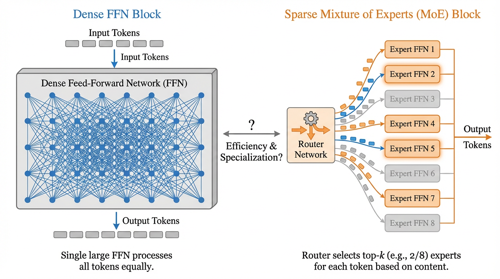

import { MoERouterVisualizer } from '../../../components/chapter-5/MoERouterVisualizer.tsx';

# 5.1 Sparse vs Dense Models (희소 모델 vs 밀집 모델)

이전 장에서 살펴보았듯, 다양한 아키텍처의 홍수 속에서 LLM 추론 생태계는 크게 두 갈래로 양극화되었습니다. 한쪽 끝에는 클라우드 규모의 일괄 처리, 코드 합성, 그리고 고도의 추론 작업에서 기본값이 된 DeepSeek-V3나 Qwen3 같은 **Mixture of Experts (MoE)** 모델이 있습니다. 다른 한쪽 끝에는 메모리 용량이 엄격하게 제한된 엣지 디바이스, 모바일 폰, 초저지연 API 환경에서 여전히 확고한 표준으로 자리 잡은 **Dense** 모델이 있습니다.

왜 희소성(Sparsity)이 핵심 패러다임이 되었는지 이해하려면, 먼저 **Dense** 구조와 **Sparse** 구조 간의 근본적인 차이를 해체해 보아야 합니다. 이것은 단순한 아키텍처의 미세 조정이 아닙니다. 컴퓨팅 자원을 할당하는 방식에 대한 거대한 패러다임의 전환입니다.

---

## 직관적 비유: 종합병원 슈퍼 의사 vs 전문의 분류 시스템

**Dense Model** 을 능력이 매우 뛰어나지만 모든 것을 혼자 처리해야 하는 시골의 종합병원이라고 상상해 봅시다. 이 병원에는 천재적인 '슈퍼 의사'가 단 한 명 있습니다. 환자가 종이에 손을 베여서 오든, 다리가 부러져서 오든, 복잡한 신경계 질환으로 오든, 이 단 한 명의 슈퍼 의사가 모든 환자를 진찰하고, 자신의 방대한 의학 지식을 전부 동원하여 치료법을 처방해야 합니다. 병원의 규모가 커질수록(모델의 확장) 슈퍼 의사는 더 많은 지식을 쌓게 되지만, 문 밖에서 대기하는 환자의 줄은 끝없이 길어집니다. 모든 환자는 의사의 '전적인 주의력'을 요구하기 때문입니다 (모든 파라미터가 활성화됨).

이제 **Sparse MoE Model** 을 현대적인 초대형 메가 병원이라고 상상해 봅시다. 환자가 병원에 들어오면 의사를 바로 만나지 않습니다. 대신, 매우 효율적인 환자 분류 간호사 ( **Router** ) 가 환자를 맞이합니다. 간호사는 환자의 증상을 한 번 쓱 보고는 즉시 필요한 전문의에게 환자를 보냅니다. 심장병 환자는 심장 전문의에게, 뇌 질환 환자는 신경과 전문의 ( **Experts** ) 에게 배정하는 식입니다.
이 병원에는 수백 명의 의사가 고용되어 있지만 (거대한 Total Parameter), 특정 환자 한 명을 진료할 때는 단 두 명의 의사만 적극적으로 일합니다 (작은 Active Parameter). 이를 통해 병원은 단 한 명의 의사가 모든 것을 처리해야 하는 병목 현상 없이, 전례 없는 전문 지식을 바탕으로 수천 명의 환자를 동시에 처리할 수 있습니다.

---

## 스케일링의 위기와 MoE의 부활

역사적으로 **Dense Transformer** 모델은 그 단순성과 예측 가능한 스케일링 법칙 덕분에 시장을 지배했습니다. 더 똑똑한 모델을 원한다면, 그저 더 큰 고밀도 네트워크를 학습시키면 되었습니다. 그러나 규모에 대한 이러한 맹목적인 추구는 곧장 컴퓨팅의 절벽으로 이어졌습니다.

모든 단일 토큰을 처리하기 위해 모든 단일 파라미터가 활성화되어야 하는 최첨단 **Dense** 모델을 학습시키고 서비스하는 것은 천문학적인 비용을 수반합니다. 400B (4,000억 개) 파라미터의 **Dense** 모델은 토큰당 4,000억 번의 곱셈-누산(MAC) 연산을 요구합니다.

사실 **MoE** 의 개념은 Transformer보다 앞서 존재했습니다. 진정한 분수령은 2017년 Noam Shazeer 등이 발표한 Google Brain의 논문 *"Outrageously Large Neural Networks: The Sparsely-Gated Mixture-of-Experts Layer"* [[1]](#ref-1) 와 함께 찾아왔습니다. 그러나 2017년의 하드웨어는 **MoE** 의 복잡한 메모리 접근 패턴을 처리할 준비가 되어 있지 않았습니다. 이후 매력적인 학술적 호기심으로 남아있던 이 기술은, 2024년 초 Mistral AI가 **Mixtral 8x7B** 를 출시하며 비슷한 연산량 체급의 **Dense** 모델들을 압도할 수 있음을 증명하면서 다시 폭발적으로 부상했습니다 [[2]](#ref-2).

최근 **DeepSeek-V3** (총 671B, 활성 37B) 와 **Llama 4 Maverick** (총 400B, 활성 17B) 같은 모델들은, 특히 모델 용량과 추론 연산량을 분리해야 하는 상황에서 **MoE** 를 최전선급 모델들이 자주 선택하는 설계로 자리잡게 만들었습니다 [[3]](#ref-3).

---

## 희소성(Sparsity)의 수학적 이해

표준 **Dense Transformer** 에서 Feed-Forward Network (FFN)는 시퀀스 내의 모든 토큰에 대해 동일한 거대한 가중치 행렬을 적용합니다:

$$ h_{out} = \text{FFN}(h_{in}) = \sigma(h_{in} W_1) W_2 $$

반면 **Sparse MoE** 아키텍처에서는 이 고밀도 FFN이 **Experts** 라고 불리는 $E$ 개의 독립적인 FFN 집합과, 어떤 전문가가 어떤 토큰을 처리할지 결정하는 **Gating Network** (또는 Router)로 대체됩니다.

주어진 토큰 $x$ 에 대한 **MoE** 레이어의 최종 출력은 선택된 전문가들의 출력에 가중치를 곱해 합산한 값입니다:

$$ y = \sum_{i=1}^{E} G(x)_i \cdot E_i(x) $$

여기서:
*   $E$ 는 전체 전문가의 수입니다.
*   $E_i(x)$ 는 $i$ 번째 전문가 네트워크의 출력입니다.
*   $G(x)_i$ 는 $i$ 번째 전문가에 대한 게이팅 값(라우팅 가중치)입니다.

### 라우팅 메커니즘 (Top-K)
희소성(Sparsity)을 달성하기 위해 게이팅 네트워크 $G(x)$ 는 대부분이 0으로 채워진 희소 벡터를 출력해야 합니다. 가장 일반적인 접근 방식은 **Top-K Routing** 입니다. 라우터는 토큰 표현을 $E$ 개의 로짓(Logits)으로 투영하고, Softmax를 적용한 뒤, 상위 $K$ 개의 값만 유지하고 나머지는 0으로 설정합니다:

$$ \text{Logits} = x \cdot W_{gate} $$
$$ \text{Scores} = \text{Softmax}(\text{Logits}) $$
$$ G(x) = \text{TopK}(\text{Scores}, K) $$

만약 $K=2$ 라면 (Mixtral 같은 많은 top-2 MoE 설계처럼), 특정 토큰에 대해 전체 $E$ 명의 전문가 중 상위 2명만 활성화됩니다.


*Source: Generated by Gemini*

---

## Total vs Active Parameters: 효율성의 산술

**MoE** 모델에서 가장 많이 오해받는 부분은 바로 파라미터 수입니다. DeepSeek-V3가 "671B 파라미터 모델"이라는 문구를 읽을 때, 엔지니어는 반드시 이를 두 가지 지표로 나누어 생각해야 합니다:

1.  **Total Parameters (Capacity)** : 모델이 암기하고 있는 지식의 총량입니다. 6,710억 개의 모든 파라미터는 VRAM에 상주해야 합니다.
2.  **Active Parameters (Compute)** : 단일 토큰에 대한 순전파(Forward pass) 중에 실제로 사용되는 파라미터의 수입니다. DeepSeek-V3의 경우 이는 37B에 불과합니다.

**왜 이것이 중요할까요?**
대규모 배치 추론(예: 거대한 프롬프트를 처리하거나 수천 명의 사용자를 동시에 서비스할 때)에서 병목 현상은 **산술 연산량(FLOPs)** 에서 발생합니다. **Dense** 671B 모델은 토큰당 약 1.34 teraFLOPs를 요구합니다. 반면 DeepSeek-V3는 토큰당 약 74 gigaFLOPs만 요구합니다. 이는 토큰당 연산 비용을 약 94% 감소시키는 결과를 낳으며, 클라우드 제공업체가 거대한 모델을 훨씬 낮은 비용으로 서비스할 수 있게 해줍니다.

---

## Dense vs Sparse: 엔지니어링 트레이드오프

두 아키텍처 중 어느 것도 보편적으로 우월하지 않습니다. 최적의 선택은 전적으로 배포 환경의 제약 조건에 달려 있습니다.

| 특성 | Dense Models (예: Llama 3 70B) | Sparse MoE Models (예: DeepSeek-V3, Qwen3) |
| :--- | :--- | :--- |
| **연산량 (FLOPs)** | 높음 (전체 크기에 비례) | 낮음 (활성 크기에 비례) |
| **메모리 (VRAM)** | 높음 (전체 크기에 비례) | **매우 높음** (모든 전문가를 VRAM에 적재해야 함) |
| **추론 지연 시간 (Latency)** | 매우 예측 가능함 | 가변적 (라우팅 오버헤드 및 배치 크기에 따라 다름) |
| **VRAM 대역폭** | 효율적 (순차적 읽기) | 병목 발생 쉬움 (분산된 전문가들에 대한 무작위 접근) |
| **학습 안정성** | 매우 안정적 | "Expert Collapse" 발생 위험 (로드 밸런싱 필요) |
| **최적의 사용 사례** | 엣지 디바이스, 모바일, 지연시간에 민감한 API | 클라우드 규모의 배치 추론, 복잡한 추론, 코딩 |

---

## PyTorch 구현: Sparse MoE 레이어 만들기

메커니즘을 정확히 이해하기 위해, 표준 Top-2 **MoE** 레이어를 직접 구현해 보겠습니다. 실제 프로덕션 모델들은 메모리 이동을 피하기 위해 고도로 최적화된 맞춤형 CUDA 커널(Triton이나 Megatron-LM의 scatter/gather 연산 등)을 사용하지만, 이 PyTorch 구현체는 정확한 수학적 순전파 과정을 보여줍니다.

```python
import torch
import torch.nn as nn
import torch.nn.functional as F

class Expert(nn.Module):
    """단일 전문가 역할을 하는 표준 Feed-Forward Network입니다."""
    def __init__(self, d_model, d_ff):
        super().__init__()
        self.w1 = nn.Linear(d_model, d_ff, bias=False)
        self.w2 = nn.Linear(d_ff, d_model, bias=False)
        self.act = nn.SiLU()

    def forward(self, x):
        return self.w2(self.act(self.w1(x)))

class SparseMoELayer(nn.Module):
    """Top-K 희소 전문가 혼합(Sparse MoE) 레이어입니다."""
    def __init__(self, d_model, d_ff, num_experts, top_k):
        super().__init__()
        self.num_experts = num_experts
        self.top_k = top_k
        
        # 라우터 (Gating Network)
        self.router = nn.Linear(d_model, num_experts, bias=False)
        
        # 전문가 그룹
        self.experts = nn.ModuleList([
            Expert(d_model, d_ff) for _ in range(num_experts)
        ])

    def forward(self, x):
        # x shape: (batch_size, seq_len, d_model)
        batch_size, seq_len, d_model = x.shape
        x_flat = x.view(-1, d_model) # (batch * seq_len, d_model) 형태로 평탄화
        
        # 1. 라우팅 로짓(Logits) 계산
        router_logits = self.router(x_flat) # (batch * seq_len, num_experts)
        routing_weights = F.softmax(router_logits, dim=-1)
        
        # 2. Top-K 전문가 선택
        top_k_weights, top_k_indices = torch.topk(routing_weights, self.top_k, dim=-1)
        
        # 선택된 top-k 전문가들 사이에서 가중치 합이 1이 되도록 정규화
        top_k_weights = top_k_weights / top_k_weights.sum(dim=-1, keepdim=True)
        
        # 3. 토큰을 전문가에게 분배하고 결과 병합
        final_output = torch.zeros_like(x_flat)
        
        # 각 전문가를 순회 (교육적 목적의 접근법이며, 순수 PyTorch에서는 느림)
        for i, expert in enumerate(self.experts):
            # 어떤 토큰들이 전문가 `i`로 라우팅되었는지 마스크 생성
            expert_mask = (top_k_indices == i).any(dim=-1)
            
            if not expert_mask.any():
                continue # 이 전문가에게 할당된 토큰이 없으면 건너뜀
                
            # 실제 토큰 추출
            expert_tokens = x_flat[expert_mask]
            
            # 특정 전문가를 통한 순전파
            expert_out = expert(expert_tokens)
            
            # 이 토큰들에 해당하는 라우팅 가중치 추출
            # 이 전문가가 선택된 정확한 위치(0 부터 top_k-1)를 찾아야 함
            weight_mask = top_k_indices[expert_mask] == i
            expert_weights = top_k_weights[expert_mask][weight_mask].unsqueeze(-1)
            
            # 출력을 라우팅 가중치로 스케일링하고 최종 출력 텐서에 더함
            token_indices = expert_mask.nonzero(as_tuple=True)[0]
            final_output[token_indices] += expert_out * expert_weights
            
        return final_output.view(batch_size, seq_len, d_model)

# 사용 예시
d_model = 1024
layer = SparseMoELayer(d_model=d_model, d_ff=4096, num_experts=8, top_k=2)
dummy_input = torch.randn(2, 128, d_model) # Batch 2, Seq 128
output = layer(dummy_input)
print(f"Output shape: {output.shape}") # 예상 결과: [2, 128, 1024]
```

## 대화형 시각화: 토큰 라우팅

토큰이 전문가들 사이로 어떻게 흩어지는지 개념적으로 이해하기 위해 다음 대화형 시각화 도구를 살펴보십시오. 서로 다른 의미를 가진 토큰들이 특정 전문가로 어떻게 라우팅되는지 관찰할 수 있습니다.

<MoERouterVisualizer lang="ko" client:load />

*(참고: 실제 엔지니어링 환경에서는 PyTorch 모델에서 `top_k_indices`를 로깅하고 이를 시각화 대시보드에 연결하여 특정 전문가가 과부하되지 않는지 확인합니다.)*

---

## 다음 장을 향하여

지금까지 우리는 **MoE** 가 *모델 용량(Capacity)* 과 *추론 연산량(Compute)* 을 분리한다는 사실을 확인했습니다. 그러나 위에서 작성한 코드 구현은 거대한 시스템적 위험을 숨기고 있습니다: **만약 라우터가 전체 토큰의 99%를 Expert 0에게만 보낸다면 어떤 일이 발생할까요?**

한 전문가가 모든 트래픽을 받게 되면 해당 전문가를 실행하는 하드웨어에 심각한 병목 현상이 발생하고, 다른 전문가를 보유한 GPU들은 유휴 상태로 방치됩니다. 이러한 치명적인 실패 모드를 **Expert Collapse** (전문가 붕괴) 라고 부릅니다. 다음 섹션인 **5.2 Routing Algorithms** 에서는 전문가들의 부하를 완벽하게 균형 맞추기 위해 설계된 고급 손실 함수(Loss functions)와 최신 라우팅 메커니즘을 심도 있게 탐구할 것입니다.

---

## Quizzes

<details>
<summary>Quiz 1: 만약 MoE 모델이 총 671B 파라미터를 가지고 있고 토큰당 37B 파라미터만 활성화된다고 가정해 봅시다. FP16 포맷에서 37B 파라미터는 80GB VRAM에 충분히 들어가는데, 왜 이 모델을 단일 80GB GPU에서 실행할 수 없을까요?</summary>

*라우팅 메커니즘이 시퀀스 레벨에서 동적이고 예측 불가능하기 때문입니다. 라우터는 런타임에 토큰 단위로 어떤 전문가를 활성화할지 결정합니다. 따라서 호출 시 즉시 사용할 수 있도록 전체 671B 파라미터에 대한 가중치가 항상 VRAM에 동시에 상주해 있어야 합니다. CPU RAM에서 GPU VRAM으로 전문가를 그때그때 스왑(Swap)하는 것은 PCIe 대역폭의 지연 시간 오버헤드 때문에 허용 불가능할 정도로 느립니다. 요약하자면, MoE는 연산량(FLOPs)과 활성화 메모리(Activation Memory)를 줄여주지만, 정적인 모델 가중치의 VRAM 요구량을 줄여주지는 않습니다.*
</details>

<details>
<summary>Quiz 2: Top-2 라우팅 설정에서, 라우터가 시퀀스 내 압도적인 다수의 토큰을 Expert 1에 할당하고 나머지 전문가들을 완전히 유휴 상태로 남겨둔다면 어떤 문제가 발생할까요?</summary>

*이러한 현상을 "Expert Collapse" 또는 로드 밸런싱 실패라고 부릅니다. Expert 1이 모든 토큰을 처리하게 되면 심각한 컴퓨팅 병목이 발생하여 MoE의 병렬화 이점이 완전히 파괴됩니다. 분산 환경(Expert Parallelism)에서는 Expert 1을 호스팅하는 GPU에 과부하가 걸려 OOM(Out of Memory)이 발생할 수 있는 반면, 다른 GPU들은 동기화를 기다리며 놀게 됩니다. 이것이 최신 MoE 아키텍처들이 정교한 로드 밸런싱 알고리즘을 필수적으로 요구하는 이유이며, 이는 다음 섹션에서 다룰 핵심 주제입니다.*
</details>

<details>
<summary>Quiz 3: 모바일 폰 배포(예: 온디바이스 AI 비서)를 목표로 할 때, 7B 파라미터의 Dense 모델과 토큰당 7B 파라미터만 활성화되는 40B 총 파라미터의 MoE 모델 중 어느 것을 선택하시겠습니까? 엔지니어링 관점에서 이유를 설명하세요.</summary>

*엣지 배포 환경에서는 압도적으로 7B Dense 모델이 선호됩니다. 스마트폰과 같은 엣지 디바이스는 단순히 연산 능력뿐만 아니라 RAM 용량과 메모리 대역폭에 의해 극심한 제약을 받습니다. 40B MoE 모델은 400억 개의 파라미터를 메모리에 저장해야 하며, 이는 대부분의 모바일 기기가 가진 통합 RAM 용량을 초과합니다. 게다가 MoE의 동적 라우팅 오버헤드와 예측 불가능한 메모리 접근 패턴은 제한적이고 고도로 결정론적인(Deterministic) 모바일 NPU(Neural Processing Unit) 아키텍처에 매우 적대적입니다.*
</details>

---

## References

1. <a id="ref-1"></a>Shazeer, N., et al. (2017). *Outrageously Large Neural Networks: The Sparsely-Gated Mixture-of-Experts Layer*. [arXiv:1701.06538](https://arxiv.org/abs/1701.06538).
2. <a id="ref-2"></a>Jiang, A. Q., et al. (2024). *Mixtral of Experts*. [arXiv:2401.04088](https://arxiv.org/abs/2401.04088).
3. <a id="ref-3"></a>DeepSeek-AI. (2024). *DeepSeek-V3 Technical Report*. [arXiv:2412.19437](https://arxiv.org/abs/2412.19437).
