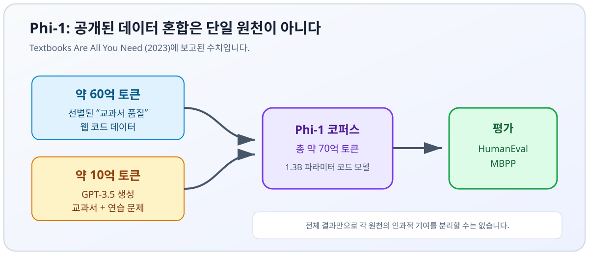

import ModelCollapseVisualizer from '../../../components/chapter-6/ModelCollapseVisualizer.tsx';

# 6.5 Synthetic Data for Pre-training

이전 절에서 수조 개의 파라미터를 가진 모델을 연산하기 위한 물리적 인프라를 살펴보고, 7장에서 구축할 분산 시스템을 예고했다면, 이제 사전 학습(Pre-training)의 마지막이자 가장 본질적인 요소인 '데이터' 그 자체를 다루어야 합니다.

**근거 스냅샷: 2026년 9월 15일.** 인터넷은 방대하지만, 라이선스와 품질 조건을 만족하며 실제 사용할 수 있는 인간 생성 텍스트는 유한합니다. Epoch AI는 품질과 반복 학습을 보정한 공개 텍스트를 약 300조 토큰으로 추정했고, 90% 구간은 100조~1,000조 토큰으로 매우 넓게 제시했습니다. 현재 추세가 이어지면 2026~2032년 사이에 이 재고를 모두 활용할 수 있다고 전망했습니다 [[5]](#ref-5). 이는 불확실성이 큰 예측이지 카운트다운 시계가 아닙니다. 컴퓨팅 최적 비율도 목적함수, 모델군, 반복 토큰 정책, 배포 경제성에 따라 달라집니다.

고품질 데이터가 실제 병목이 된다면 기존 모델로 학습 예시를 생성하거나 변환할 수 있습니다. 그러나 합성 데이터는 여러 재료 중 하나이지 인간 데이터를 대체한다는 공학적 합의가 아닙니다. 그 가치는 provenance, coverage, verification, mixture design에 달려 있습니다.

하지만 이 재귀적 접근법은 수학적으로 매우 위험한 함정을 내포하고 있습니다.

---

## 1. 재귀의 저주: Model Collapse (모델 붕괴)

2024년 Shumailov 등은 재귀 학습에서의 **Model Collapse** 를 분석한 연구를 *Nature*에 발표했습니다 [[1]](#ref-1). 이 실험은 실제 데이터를 이전 모델의 표본으로 대체할 때 분포의 꼬리가 사라지고 근사 오차가 누적될 수 있음을 보여 줍니다. 결과는 데이터 보존과 샘플링 절차에 의존합니다. 합성 데이터가 조금이라도 섞이면 반드시 열화한다거나, 열화가 언제나 비가역적이라는 뜻은 아닙니다.

### 붕괴의 수학적 원리
언어 모델 $P_{\theta}(x)$ 가 특정 데이터셋으로 학습될 때, 모델은 데이터를 완벽하게 암기하는 것이 아니라 기저의 확률 분포를 근사(Approximate)합니다. 통계적 모델의 정의상, 이들은 최빈값(Mode, 가장 흔한 패턴)을 선호하고 꼬리(Tails, 희귀하거나 미묘한 아웃라이어 데이터)에는 더 낮은 확률 질량을 할당합니다.

생성 표본이 희귀 사건을 충분히 담지 못하면 다음 학습자는 편향된 경험 분포를 보게 됩니다. 이를 다음처럼 추상화할 수 있습니다.

$$
q_{t+1}(x) = (1-\lambda)p_{\text{real}}(x) + \lambda\,S\!\left(p_{\theta_t}(x); T, k, F\right)
$$

여기서 $\lambda$는 합성 데이터 혼합 비율이고, $S$는 temperature $T$, 표본 예산 $k$, filter $F$로 결정되는 생성·필터링 연산자입니다. 꼬리 손실은 보편적인 분산 단조 감소 정리가 아닙니다. $\lambda$, 원본 데이터 보존 여부, sampling support, 모델 오차, filtering bias에 따라 달라집니다. 핵심 공학 질문은 “합성인가 실제인가?”가 아니라 **각 예시를 어떤 연산자가 만들었고, 그 연산자가 어떤 slice를 억제했는가?** 입니다.

### Interactive: Model Collapse 시각화

아래 슬라이더는 재귀 샘플링이 꼬리 질량을 떨어뜨리는 한 가지 양식화된 실패 모드를 보여 줍니다. 직관을 위한 도구이며 실제 모든 파이프라인이 같은 궤적을 따른다는 주장이 아닙니다.

<ModelCollapseVisualizer lang="ko" client:load />

이러한 **Model Collapse** 를 방지하기 위해, 엔지니어들은 단순히 모델에게 "텍스트 100억 토큰을 작성해 줘"라고 프롬프트를 주고 이를 사전 학습 코퍼스에 추가할 수 없습니다. 합성 데이터는 엄격하게 엔지니어링되고, 필터링되며, 정답(Ground truth)에 단단히 고정되어야 합니다.

---

## 2. 양보다 질: "Textbooks" 패러다임

합성 사전 학습 데이터 분야의 첫 번째 주요 돌파구는 Microsoft Research의 *Textbooks Are All You Need* (2023) [[2]](#ref-2) 에서 나왔습니다.

Microsoft의 **Phi-1** 연구는 1.3B 파라미터 코드 모델을 약 60억 토큰의 선별된 “교과서 품질” 웹 데이터와 약 10억 토큰의 GPT-3.5 생성 교과서·연습 문제로 학습했습니다 [[2]](#ref-2). 합성 데이터는 선별된 실제 데이터를 보완했으며 전체 코퍼스를 대체하지 않았습니다.

보고된 HumanEval과 MBPP 결과는 좁은 코드 영역에서 데이터 선택과 교육적 구조가 일부 규모 부족을 상쇄할 수 있다는 강한 사례입니다. 합성 토큰과 웹 토큰 사이에 보편적인 기하급수 교환 비율이 있다는 뜻도, 생성 예시가 “완벽하다”는 뜻도 아닙니다. 실무에서는 도메인 slice별 한계 가치를 측정하고, mixture ablation을 수행하며, generator와 filter가 보지 못한 깨끗한 평가셋을 유지해야 합니다.


*출처: [[2]](#ref-2)에 보고된 데이터 양을 바탕으로 직접 제작한 SVG. 최종 점수를 어느 한 원천의 단독 효과로 귀속하지 않습니다.*

---

## 3. Frontier Pipeline에서 합성 데이터가 들어가는 위치

2025~2026년에는 합성 데이터가 filtering, post-training, reasoning distillation, verifier-guided generation에 널리 쓰이게 됐습니다. 공개 보고서는 파이프라인 일부만 밝히므로 합성 데이터가 모든 frontier training의 “중추”라고 단정하면 공개 근거를 넘어섭니다.

### Meta의 Llama 3 파이프라인
Llama 3 보고서는 pre-training data에 대한 모델 보조 품질·도메인 분류와 post-training의 광범위한 합성 데이터 생성을 설명합니다 [[3]](#ref-3). 405B 모델은 더 작은 변형을 개선하는 데 쓰였지만, 보고서는 인간 annotation과 여러 reward-model·filtering 단계도 함께 설명합니다. 따라서 “인간 답변을 완전히 대체했다”는 표현은 근거가 없습니다. **Pre-training selection**, **post-training response generation**, **distillation** 을 서로 다른 provenance category로 보존해야 합니다.

### DeepSeek의 전문가 증류 (Specialist Distillation)
DeepSeek-V3 보고서는 coding·mathematics 같은 영역의 specialist-model data generation을 설명하고, R1 보고서는 reasoning model을 위한 rejection sampling과 distillation을 설명합니다 [[4]](#ref-4) [[6]](#ref-6). 서로 관련은 있지만 구분되는 단계이며, 하나의 미공개 recipe로 합치면 안 됩니다.

수학과 코드는 더 강한 **결과 검증기** 를 제공하는 경우가 많습니다. 그러나 “실행된다”는 사실이 “명세를 만족한다”는 뜻은 아니며, 많은 증명은 저렴한 이진 검사로 환원되지 않습니다. Verifier에도 bug, reward shortcut, test leakage, 검증하기 쉬운 slice 편향이 있을 수 있습니다. 정밀도를 높일 수는 있지만 무한한 독립 데이터를 만들거나 model collapse, contamination, coverage risk를 제거하지는 못합니다.

---

## 4. Rejection Sampling 파이프라인 엔지니어링

합성 데이터를 만드는 흔한 방법 중 하나는 **best-of-$k$ rejection sampling** 입니다. Generator가 한 prompt에 여러 후보를 만들고 reward model이나 task verifier가 평가합니다. 후보는 validity, quality, novelty에 대한 명시적 gate를 모두 통과할 때만 유지합니다. 보정된 threshold 없이 argmax만 보존하면 $k$개가 모두 틀려도 그중 하나를 채택하게 됩니다.

> **의도적으로 단순화한 교육용 예시입니다.** 아래 kernel은 chat template 적용, token 위치 기반 응답 분리, best-of-$k$ filtering만 보여 줍니다. 분산 생성, 도메인별 verifier ensemble, threshold calibration, near-deduplication, contamination quarantine, PII/license filter, immutable manifest, crash-resumable sharding은 생략합니다. Generator와 reward model이 사용 가능한 device에 들어가고, reward model의 scalar score가 이 도메인에 맞게 보정됐다고 가정합니다.

```python
import torch
from transformers import AutoModelForCausalLM, AutoTokenizer, AutoModelForSequenceClassification
from typing import List, Dict, Union

@torch.no_grad()
def rejection_sampling_pipeline(
    prompts: List[str],
    generator: AutoModelForCausalLM,
    gen_tokenizer: AutoTokenizer,
    reward_model: AutoModelForSequenceClassification,
    reward_tokenizer: AutoTokenizer,
    num_candidates: int = 8,
    threshold: float = 0.8
) -> List[Dict[str, Union[str, float]]]:
    """
    Rejection Sampling을 사용하여 합성 데이터를 생성합니다.
    보상 임계값(Threshold)을 통과한 프롬프트-응답 쌍만을 반환합니다.
    """
    device = next(generator.parameters()).device
    reward_device = next(reward_model.parameters()).device
    synthetic_dataset = []

    for prompt in prompts:
        # 1. Serving path와 같은 tokenizer-native chat template을 사용합니다.
        prompt_ids = gen_tokenizer.apply_chat_template(
            [{"role": "user", "content": prompt}],
            tokenize=True,
            add_generation_prompt=True,
            return_tensors="pt",
        ).to(device)
        input_ids = prompt_ids.repeat(num_candidates, 1)
        attention_mask = torch.ones_like(input_ids)
        
        # 합성 후보군 간의 다양성을 유도하기 위해 높은 Temperature 설정
        outputs = generator.generate(
            input_ids=input_ids,
            attention_mask=attention_mask,
            max_new_tokens=256,
            temperature=0.9,
            do_sample=True,
            pad_token_id=gen_tokenizer.eos_token_id
        )
        
        # 문자 길이가 아니라 token 위치로 응답 부분을 분리합니다.
        response_ids = outputs[:, prompt_ids.shape[1]:]
        responses = gen_tokenizer.batch_decode(response_ids, skip_special_tokens=True)

        # 2. Reward Model을 사용하여 후보군 평가
        eval_texts = [
            reward_tokenizer.apply_chat_template(
                [{"role": "user", "content": prompt}, {"role": "assistant", "content": response}],
                tokenize=False,
                add_generation_prompt=False,
            )
            for response in responses
        ]
        reward_inputs = reward_tokenizer(
            eval_texts, return_tensors="pt", padding=True, truncation=True
        ).to(reward_device)
        
        # Sequence Classification 헤드에서 스칼라(Scalar) 보상 값을 출력한다고 가정
        rewards = reward_model(**reward_inputs).logits.squeeze(-1)
        
        # 3. 가장 점수가 높은 후보 선택
        best_idx = torch.argmax(rewards).item()
        best_reward = rewards[best_idx].item()

        # 4. 품질 보장을 위해 임계값(Threshold) 필터링 적용
        if best_reward >= threshold:
            synthetic_dataset.append({
                "prompt": prompt,
                "response": responses[best_idx],
                "reward_score": best_reward
            })

    return synthetic_dataset

# 활용 예시 (모델이 로드되어 있다고 가정):
# dataset = rejection_sampling_pipeline(
#     prompts=["Transformers에서 Pre-LN과 Post-LN의 차이점을 설명해 줘."],
#     generator=llama_3_70b,
#     gen_tokenizer=llama_tokenizer,
#     reward_model=nemotron_reward_model,
#     reward_tokenizer=reward_tokenizer
# )
```

대략적인 비용은 $kF_{\text{gen}} + kF_{\text{verify}}$이지만 실제 wall time은 batching, early rejection, sequence length, cache reuse, verifier placement에 좌우됩니다. 일반적으로 “$k+1$배”라고 단정할 수 없으며, frontier training 총 compute에서 data preparation이 차지하는 비율도 공개 보고서에는 거의 나오지 않습니다.

---

## 5. 프로덕션 실행 계약

합성 데이터 작업은 prompt 폴더가 아니라 immutable manifest에서 시작해야 합니다. Source ID와 license 또는 consent, deletion lineage, PII/secrets policy, prompt template과 tokenizer hash, generator·verifier snapshot, decoding parameter, seed, filter version, 목표 mixture weight를 기록합니다. Semantic sibling과 generator variant를 train/dev/test 분할 전에 묶고, public benchmark, private release prompt, rubric text, near neighbor는 생성 전에 quarantine합니다.

목적함수는 “승인 row 수 최대화”가 아닙니다. Slice별 품질 제약 아래에서 compute당 유용하고 중복되지 않으며 올바르게 귀속된 token을 최대화해야 합니다. 결정적 hyperparameter에는 prompt당 후보 수 $k$, temperature/top-$p$, response-length limit, verifier별 threshold, real/synthetic mixture weight $\lambda$, domain quota, deduplication threshold, maximum retry가 들어갑니다. Memory는 generator weight와 KV cache, verifier weight, batched activation, temporary token buffer, embedding/deduplication index, checkpointed shard를 나눠 추정합니다.

Slice별 yield와 cost를 관찰해야 합니다. Generated, parse-valid, verifier-passing, deduplicated, policy-clean, admitted example 수뿐 아니라 verifier disagreement, score drift, response length, novelty, contamination hit, PII/license rejection, tokens/s, GPU utilization, queue wait, 재구성 가능한 batch ID를 남깁니다. Critical quarantine match, nonfinite score, provenance 누락, verifier calibration 이탈, 보호 slice precision 하락, duplication 급증, admitted token당 비용 초과가 발생하면 pause 또는 abort합니다.

Checkpoint에는 완료 shard ID, input cursor, RNG state, 승인·거절 sample ID와 reason code, generator/verifier/config/tokenizer hash, filter와 deduplication index version, 전체 및 slice별 counter, checksum, completion marker가 들어가야 합니다. Offline release evaluation은 candidate mixture 학습 모델을 real-data baseline과 비교해 domain quality, base-capability retention, safety, memorization, format/tool behavior, latency, critical slice를 paired uncertainty와 함께 검사합니다. 모든 gate를 통과하고 이전 corpus/model bundle이 rollback 가능한 상태일 때만 승격합니다.

---

## Summary

Chapter 6을 통해 Foundation Model pre-training의 엔지니어링 스택을 살펴봤습니다. Byte-level tokenization(6.2), training stability(6.3), 물리적 cluster(6.4)를 거쳐, 이번 절에서는 합성 데이터를 provenance와 evaluation에 민감한 입력으로 다뤘습니다. Rejection sampling과 결과 검증기는 정밀도를 높일 수 있지만 coverage, contamination, recursive-training, evaluator-gaming risk를 없애지는 않습니다.

이제 정제된 데이터가 준비되었고, 네트워크는 안정화되었으며, 거대한 물리적 인프라가 가동될 준비를 마쳤습니다. 우리는 마침내 `loss.backward()` 를 실행할 준비가 되었습니다. 하지만 80GB의 메모리밖에 없는 GPU들에 1조 개의 파라미터를 가진 모델을 물리적으로 어떻게 욱여넣을 수 있을까요?

이어지는 **Chapter 7: Training Optimization & Systems** 에서는 3D 병렬화(3D Parallelism), ZeRO 최적화, 그리고 Flash Attention 등 분산 학습의 소프트웨어 엔지니어링을 깊이 있게 파헤칠 것입니다.

---

## Quizzes

<details>
<summary>Quiz 1: 기각 샘플링(Rejection Sampling) 파이프라인에서 각 프롬프트에 대해 $k$개의 후보 시퀀스를 병렬로 생성합니다. 각 후보 시퀀스가 결정론적 검증기(verifier)를 통과할 독립적인 확률은 $\alpha$입니다. 단일 후보 생성 비용이 $F_{gen}$, 보상 평가 비용이 $F_{rew}$일 때 최소 하나 이상의 유효한 시퀀스를 얻기 위한 기대 연산 비용(FLOPs)을 유도하세요. 나아가 $\alpha = 0.15$일 때 단일 병렬 패스에서 성공할 확률이 $95\%$ 이상이 되도록 보장하는 최소 $k$ 값을 계산하세요.</summary>
*크기 $k$의 병렬 패스에서 최소 하나 이상의 후보가 통과할 확률은 $p = 1 - (1 - \alpha)^k$입니다. 성공할 때까지의 패스 수 $X$는 기하 분포를 따르며 기대값 $E[X] = 1/p$을 가집니다. 각 패스의 연산 비용은 $k(F_{gen} + F_{rew})$ FLOPs이므로 기대 총 연산 비용은 $E[C] = \frac{k(F_{gen} + F_{rew})}{1 - (1 - \alpha)^k}$가 됩니다. 단일 패스에서 $95\%$ 성공 확률을 위한 최소 $k$를 구하면: $1 - (1 - 0.15)^k \ge 0.95 \Rightarrow 0.85^k \le 0.05 \Rightarrow k \ge \frac{\ln(0.05)}{\ln(0.85)} \approx 18.43$입니다. 따라서 최소 정수 $k$는 19입니다.*
</details>

<details>
<summary>Quiz 2: Microsoft의 "Textbooks Are All You Need" (Phi-1) 방법론은 2023년 당시 지배적이었던 스케일링 법칙(Scaling Laws)에 어떻게 반기를 들었는가?</summary>
*Phi-1은 약 60억 개의 선별된 웹 토큰과 10억 개의 합성 교과서·연습 문제 토큰으로 학습한 1.3B 코드 모델이 HumanEval과 MBPP에서 경쟁력 있는 결과를 낼 수 있음을 보여 줬습니다. 이는 해당 설정에서 데이터 선택과 구조가 중요하다는 근거이지, 합성 토큰과 실제 토큰 사이에 보편적이거나 기하급수적인 교환 비율이 있다는 증명은 아닙니다.*
</details>

<details>
<summary>Quiz 3: 창의적 글쓰기나 역사 도메인에 비해 수학이나 코딩 도메인에서 사전 학습용 합성 데이터를 사용하는 것이 훨씬 쉽고 안전한 이유는 무엇인가?</summary>
*수학과 코드는 unit test, compiler, numeric answer, proof assistant 같은 강한 결과 검사를 제공할 수 있습니다. 하지만 검사가 보장하는 것은 검사 범위뿐입니다. Test가 불완전할 수 있고, 실행에 성공해도 명세를 위반할 수 있으며, verifier bug를 exploit할 수도 있습니다. 주관적 영역은 보정된 인간 또는 모델 판단에 더 의존하므로 uncertainty와 disagreement를 숨기지 않고 기록해야 합니다.*
</details>

<details>
<summary>Quiz 4: Meta의 Llama 3나 DeepSeek-V3의 문맥에서 "오프라인 증류(Offline Distillation)" 또는 "전문가 증류(Specialist Distillation)"란 무엇을 의미하는가?</summary>
*거대하고 뛰어난 성능을 가진 프런티어 모델(예: Llama 3 405B)이나 고도로 미세 조정된 전문가 모델을 사용하여 주어진 프롬프트에 대한 수백만 개의 고품질 응답을 생성하는 과정입니다. 이렇게 생성된 합성 응답들은 더 작고 효율적인 모델(예: Llama 3 8B)을 위한 정답 학습 데이터로 사용되며, 인간 어노테이터(Annotator) 없이도 큰 모델의 추론 능력을 작은 모델로 효과적으로 전이(Distill)시키는 역할을 합니다.*
</details>

---

## References

1. <a id="ref-1"></a>Shumailov, I., et al. (2024). "AI models collapse when trained on recursively generated data." Nature. [Link](https://www.nature.com/articles/s41586-024-07566-y).
2. <a id="ref-2"></a>Gunasekar, S., et al. (2023). *Textbooks Are All You Need.* [arXiv:2306.11644](https://arxiv.org/abs/2306.11644).
3. <a id="ref-3"></a>Meta. (2024). *The Llama 3 Herd of Models.* [arXiv:2407.21783](https://arxiv.org/abs/2407.21783).
4. <a id="ref-4"></a>DeepSeek-AI. (2024). *DeepSeek-V3 Technical Report.* [arXiv:2412.19437](https://arxiv.org/abs/2412.19437).
5. <a id="ref-5"></a>Villalobos, P., et al. (2024). *Will we run out of data? Limits of LLM scaling based on human-generated data.* [Epoch AI](https://epoch.ai/publications/will-we-run-out-of-data-limits-of-llm-scaling-based-on-human-generated-data).
6. <a id="ref-6"></a>DeepSeek-AI. (2025). *DeepSeek-R1: Incentivizing Reasoning Capability in LLMs via Reinforcement Learning.* [arXiv:2501.12948](https://arxiv.org/abs/2501.12948).
