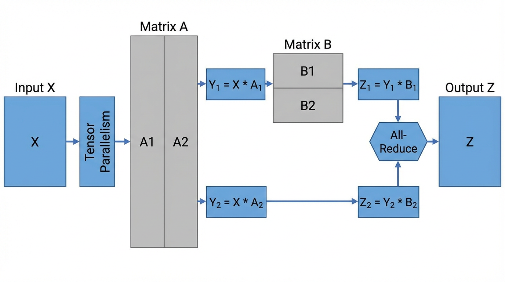
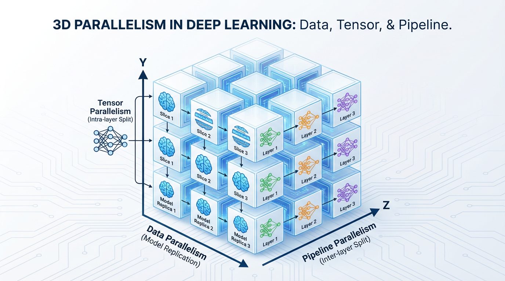

import PipelineMemoryVisualizer from '../../../components/chapter-7/PipelineMemoryVisualizer.tsx';

# 7.3 모델 병렬화와 파이프라인 병렬화 (Model & Pipeline Parallelism)

이전 장에서 우리는 ZeRO가 클러스터 전체에 모델 상태를 동적으로 분할(Partitioning)하여 **Memory Wall** (메모리 장벽) 을 어떻게 극복하는지 살펴보았습니다. 하지만 ZeRO에는 근본적인 한계가 존재합니다: **ZeRO는 '레이어 단위(Layer-level)'로 동작합니다.** 순전파(Forward)나 역전파(Backward)가 진행되는 동안, ZeRO는 특정 레이어의 *전체* 가중치 행렬을 단일 GPU 상에 온전히 재구성해야만 합니다.

Foundation Model 의 파라미터가 1,000억(100B) 개를 넘어서면, 수학적 연산 그 자체가 거대해집니다. 모델이 충분히 크거나 컨텍스트 윈도우(Context window)가 극단적으로 길어지면, *단일 레이어* 의 활성화(Activations)와 가중치만으로도 H100 GPU의 80GB VRAM 한계를 초과하게 됩니다. 단일 행렬 곱셈 연산조차 메모리에 들어가지 못할 때, Data Parallelism (ZeRO를 포함하여) 은 완전히 붕괴합니다. 이제 우리는 모델 자체를 물리적으로 조각내야(Shard) 합니다.

이러한 물리적 분할을 가능하게 하는 두 가지 핵심 축이 바로 **Pipeline Parallelism (레이어 간 분할)** 과 **Tensor Parallelism (레이어 내 분할)** 입니다.

---

## 1. 파이프라인 병렬화 (PP)

**Pipeline Parallelism** 은 신경망을 공장의 조립 라인처럼 취급합니다. 전체 모델을 하나의 GPU에 올리는 대신, 모델을 '깊이(Depth)'를 기준으로 잘라냅니다. 예를 들어 4개의 GPU에 40개의 레이어를 가진 Transformer를 올린다면, GPU 0은 1~10번 레이어를, GPU 1은 11~20번 레이어를 처리하는 식입니다.

### 파이프라인 버블 (The Bubble Problem) 과 마이크로 배칭
단순하고 순진한 방식의 파이프라인 병렬화는 하드웨어 활용도 측면에서 재앙에 가깝습니다. GPU 0이 배치를 처리하고 GPU 1로 넘기면, GPU 0은 역전파가 맨 끝에서부터 다시 돌아올 때까지 아무것도 하지 않고 유휴 상태(Idle)로 대기해야 합니다. 이 유휴 시간을 **Pipeline Bubble** (파이프라인 버블) 이라고 부릅니다.

이 문제를 완화하기 위해 Google은 **GPipe** [[1]](#ref-1) 를 도입했습니다. GPipe는 거대한 미니 배치(Mini-batch)를 더 작은 **마이크로 배치(Micro-batches)** 로 쪼갭니다. GPU 0이 마이크로 배치 1 ($F_1$) 을 처리하고 GPU 1로 넘기면, GPU 1이 $F_1$ 을 처리하는 동안 GPU 0은 곧바로 $F_2$ 처리를 시작할 수 있습니다. 이를 통해 파이프라인을 항상 '가득 찬' 상태로 유지하여 버블의 상대적 크기를 극적으로 줄입니다.

### 1F1B (One-Forward-One-Backward) 스케줄링
GPipe는 활용도(Utilization) 문제는 해결했지만, 심각한 메모리 문제를 야기했습니다. GPipe는 *어떤* 역전파 마이크로 배치를 실행하기 전에 *모든* 순전파 마이크로 배치를 먼저 실행합니다. 이는 곧 GPU 0이 역전파가 도달할 때까지 모든 마이크로 배치에 대한 막대한 양의 활성화(Activations) 텐서를 메모리에 들고 있어야 함을 의미합니다.

현대의 프레임워크(Megatron-LM 등)는 GPipe 대신 **1F1B (One-Forward-One-Backward)** 스케줄을 사용합니다. 1F1B에서는 마지막 GPU가 특정 마이크로 배치의 순전파를 마치는 즉시 해당 마이크로 배치의 역전파를 실행합니다. 이 역전파는 파이프라인을 거슬러 올라가며 순전파와 교차(Interleave)하여 실행됩니다.

역전파를 조기에 실행함으로써, 1F1B는 활성화가 차지하고 있던 메모리를 즉각적으로 해제합니다. 파이프라인 버블의 크기는 수학적으로 GPipe와 동일하게 유지되면서도, **최대 메모리 풋프린트(Peak memory footprint)는 전체 마이크로 배치 수가 아닌 파이프라인 스테이지 수에 의해서만 제한** 되는 놀라운 효율을 달성합니다.

### 인터랙티브 시각화: GPipe vs 1F1B

아래의 시각화 도구를 사용하여 GPipe와 1F1B 스케줄의 차이를 직접 확인해 보십시오. 특히 하단의 **Peak Memory** 차트를 주의 깊게 관찰하여, GPU 0이 특정 시점에 얼마나 많은 마이크로 배치 활성화를 메모리에 들고 있어야 하는지 비교해 보시기 바랍니다.

<PipelineMemoryVisualizer lang="ko" client:load />

---

## 2. 텐서 병렬화 (TP)

Pipeline Parallelism 이 모델을 레이어 *사이* 에서 자른다면, **Tensor Parallelism (TP)** 은 단일 레이어 *내부* 의 수학적 연산 자체를 쪼갭니다.

NVIDIA의 **Megatron-LM** [[2]](#ref-2) 이 주도한 TP는 오늘날 거대 모델 학습을 가능하게 만든 핵심 엔진입니다. TP는 Multi-Head Attention (MHA) 과 Multi-Layer Perceptron (MLP) 블록의 거대한 가중치 행렬을 물리적으로 여러 GPU에 분산시킵니다.


*출처: AI 생성 이미지. Inspired by Shoeybi et al., 2019.*

### Megatron-LM의 MLP 분할 (The MLP Split)

표준 Transformer의 MLP는 두 번의 선형 변환(Linear transformation)으로 구성됩니다: $Y = \text{GeLU}(XA)$ 그리고 $Z = YB$. Megatron-LM은 통신 오버헤드를 최소화하면서 이 연산을 분산시키기 위해 **Column Parallelism** 과 **Row Parallelism** 을 절묘하게 결합합니다.

1. **Column Parallelism on $A$:** 첫 번째 가중치 행렬 $A$ 를 수직으로 잘라 $A_1$ 과 $A_2$ 로 나눕니다. GPU 0은 $Y_1 = XA_1$ 을 계산하고, GPU 1은 $Y_2 = XA_2$ 를 계산합니다. 비선형 활성화 함수인 GeLU는 요소별(Element-wise) 연산이므로 각 GPU에서 독립적으로 적용될 수 있습니다. *여기까지는 어떠한 네트워크 통신도 필요하지 않습니다.*
2. **Row Parallelism on $B$:** 두 번째 가중치 행렬 $B$ 를 수평으로 잘라 $B_1$ 과 $B_2$ 로 나눕니다. GPU 0은 $Z_1 = Y_1 B_1$ 을 계산하고, GPU 1은 $Z_2 = Y_2 B_2$ 를 계산합니다.
3. **Synchronization (동기화):** 최종 출력을 얻기 위해서는 부분 결과값들을 더해야 합니다: $Z = Z_1 + Z_2$. 이는 단 한 번의 **All-Reduce** 연산을 통해 달성됩니다.

아래는 Megatron 스타일의 MLP 블록을 구현한 실제 PyTorch 코드입니다. 단일 GPU에서 수행되던 표준 연산이 어떻게 분산 프리미티브(Distributed primitives)로 대체되는지 주목해 보십시오.

```python
import torch
import torch.nn as nn
import torch.distributed as dist

class MegatronMLP(nn.Module):
    def __init__(self, d_model, d_ff, rank, world_size):
        super().__init__()
        # Column Parallelism: 출력 차원(Output dimension)을 분할합니다.
        self.w1 = nn.Linear(d_model, d_ff // world_size)
        
        # Row Parallelism: 입력 차원(Input dimension)을 분할합니다.
        self.w2 = nn.Linear(d_ff // world_size, d_model)
        self.gelu = nn.GELU()
        
    def forward(self, x):
        # 1. Column Parallel 순전파 (독립적인 연산, 통신 없음)
        # Input x: [batch, seq, d_model] 
        # Output y_local: [batch, seq, d_ff // world_size]
        y_local = self.gelu(self.w1(x))
        
        # 2. Row Parallel 순전파 (부분합 계산)
        # Output z_local: [batch, seq, d_model]
        z_local = self.w2(y_local)
        
        # 3. All-Reduce를 통해 TP 그룹 내 모든 GPU의 부분 결과를 합산합니다.
        dist.all_reduce(z_local, op=dist.ReduceOp.SUM)
        
        return z_local
```

### 통신 병목 현상 (The Communication Bottleneck)
**Tensor Parallelism** 은 엄청나게 강력하지만, 가혹한 하드웨어 제약 조건을 동반합니다. 위 코드에서 볼 수 있듯, *매 단일 Transformer 블록 내부마다* `All-Reduce` 연산이 필수적으로 요구됩니다. 이처럼 빈도가 높고 연산을 블로킹(Blocking)하는 통신은 막대한 대역폭을 요구합니다. 결과적으로, **TP는 거의 예외 없이 단일 물리적 노드 내부의 GPU들(예: NVLink로 연결된 8대의 GPU)로 엄격히 제한됩니다.** 일반적인 이더넷이나 심지어 InfiniBand를 통해 노드 간 TP를 실행하면 학습 속도는 처참하게 무너집니다.

---

## 3. 시퀀스 병렬화 (SP)

AI 산업이 128k에서 1M 토큰에 이르는 거대한 컨텍스트 윈도우(Context windows)로 이동함에 따라, 엔지니어들은 새로운 Memory Wall 에 직면했습니다. 표준 TP에서는 가중치 행렬은 분할되지만, **모든 GPU가 여전히 전체 시퀀스 길이만큼의 활성화(Activations) 텐서를 온전히 보유해야 합니다.** Attention 연산의 메모리 사용량은 시퀀스 길이의 제곱에 비례하여 증가하므로, 긴 컨텍스트에서는 TP를 사용하더라도 Out-Of-Memory (OOM) 에러를 피할 수 없습니다.

**Sequence Parallelism (SP)** [[3]](#ref-3) 은 데이터 자체를 시퀀스 차원(Sequence dimension)을 따라 분할함으로써 이 문제를 해결합니다. 만약 시퀀스 길이가 8,000이고 8대의 GPU가 있다면, 각 GPU는 단 1,000개의 토큰만을 저장하고 처리합니다.
- MLP 레이어에서는 토큰들이 서로 독립적으로 처리되므로 SP가 아주 매끄럽게 동작합니다.
- Attention 레이어에서는 GPU 0에 있는 토큰이 GPU 7에 있는 토큰에 Attention을 수행해야 하므로, 복잡한 통신 알고리즘(예: **Ring Attention** 또는 **DeepSpeed-Ulysses**)을 사용하여 단일 디바이스에 전체 시퀀스를 구체화(Materialize)하지 않고도 연산을 수행합니다.

---

## 4. 3D 병렬화와 자동 샤딩

Llama 3나 GPT-4와 같은 SOTA(State-of-the-Art) 모델을 학습시킬 때, 엔지니어들은 이 기술들 중 하나만 선택하지 않습니다. 이 모든 기술을 결합하여 **3D Parallelism** 을 구축합니다.


*출처: AI 생성 이미지.*

1. **Tensor Parallelism (노드 내부):** 초고속 NVLink를 사용하여 단일 서버 내부의 8대 GPU 간에 수학적 연산을 잘게 쪼갭니다.
2. **Pipeline Parallelism (노드 간):** InfiniBand를 사용하여 여러 대의 서버에 걸쳐 모델의 레이어를 순차적으로 배치합니다.
3. **Data Parallelism (클러스터 전체):** 수천 대의 서버에 이 전체 TP+PP 셋업을 복제하여 방대한 데이터셋을 병렬로 처리합니다.

### 자동 병렬화의 부상
거대한 신경망을 3D 하드웨어 토폴로지에 수동으로 매핑하는 것은 엔지니어에게 극도로 고통스러운 작업입니다. 현재 시스템 연구의 최전선은 **Automated Parallelism** (자동 병렬화) 에 있습니다. **Alpa** [[4]](#ref-4) 와 같은 컴파일러는 병렬화를 일종의 최적화 문제로 취급합니다. 모델의 연산 그래프(Computational graph)와 클러스터의 네트워크 대역폭을 분석함으로써, Alpa는 엔지니어가 복잡한 분산 코드를 직접 작성하지 않아도 DP, TP, PP의 수학적으로 가장 완벽한 조합을 자동으로 도출해 냅니다.

---

## Quizzes

<details>
<summary>Quiz 1: Megatron-LM이 MLP 블록에서 첫 번째 선형 레이어에는 Column Parallelism을, 두 번째 선형 레이어에는 Row Parallelism을 의도적으로 짝지어 사용하는 이유는 무엇인가?</summary>
*Column Parallelism을 먼저 실행하면, 중간 활성화(Intermediate activation) 텐서가 물리적으로 GPU들에 분할된 상태가 되며 이 과정에서 통신 오버헤드가 전혀 발생하지 않습니다. 뒤이어 실행되는 Row Parallelism은 이 분할된 상태를 그대로 입력으로 받아 부분합(Partial sum)을 계산합니다. 이러한 절묘한 설계 덕분에 전체 2-layer MLP 블록은 맨 마지막에 단 한 번의 All-Reduce 동기화만 필요하게 되어, 단순한 분할 방식에 비해 통신 오버헤드를 절반으로 줄일 수 있습니다.*
</details>

<details>
<summary>Quiz 2: Pipeline Parallelism에서 1F1B (One-Forward-One-Backward) 스케줄이 GPipe와 정확히 동일한 크기의 파이프라인 버블을 가짐에도 불구하고 최대 메모리(Peak memory) 사용량을 극적으로 줄일 수 있는 이유는 무엇인가?</summary>
*GPipe는 역전파를 시작하기 전에 모든 마이크로 배치의 순전파를 끝마쳐야 하므로, 파이프라인 앞단에 있는 GPU들은 모든 마이크로 배치의 활성화(Activations)를 동시에 메모리에 쌓아두어야 합니다. 반면 1F1B는 순전파와 역전파를 교차(Interleave)시킵니다. 특정 마이크로 배치의 역전파가 완료되는 즉시 해당 활성화 메모리가 해제됩니다. 따라서 1F1B의 최대 메모리 사용량은 전체 마이크로 배치의 수가 아니라 파이프라인 스테이지(깊이)의 수에 의해서만 제한됩니다.*
</details>

<details>
<summary>Quiz 3: Tensor Parallelism (TP) 이 일반적으로 단일 물리적 서버(Node) 내부의 GPU들로 제한되는 반면, Pipeline Parallelism (PP) 은 서로 다른 서버 간에 널리 배포될 수 있는 근본적인 이유는 무엇인가?</summary>
*TP는 매 단일 Transformer 블록 내부에서(즉, 레이어마다 여러 번) 블로킹(Blocking) 방식의 All-Reduce 동기화를 요구합니다. 이렇게 빈도가 잦고 거대한 통신은 NVLink와 같은 노드 내부의 초고대역폭/초저지연 연결망을 필수적으로 요구합니다. 반면 PP는 오직 레이어의 경계에서만 활성화 텐서를 주고받으므로, 통신 빈도가 훨씬 낮고 대역폭 요구량도 적어 InfiniBand와 같은 노드 간 통신망으로도 충분히 감당할 수 있습니다.*
</details>

<details>
<summary>Quiz 4: 극단적으로 긴 컨텍스트 윈도우(Long context windows) 환경에서, 표준 Tensor Parallelism 이 해결하지 못하는 메모리 병목 현상을 Sequence Parallelism (SP) 이 어떻게 해결하는가?</summary>
*표준 Tensor Parallelism 에서는 모델의 가중치 행렬은 분할되지만, 각 GPU는 여전히 전체 시퀀스 길이에 해당하는 활성화(Activations) 텐서를 들고 있어야 합니다. 컨텍스트가 길어지면 Attention 활성화 메모리가 시퀀스 길이의 제곱에 비례하여 팽창하므로 OOM 에러가 발생합니다. SP는 시퀀스 차원 자체를 물리적으로 분할하므로, 각 GPU가 토큰의 일부분만 저장하고 연산하게 만들어 활성화 메모리 풋프린트를 극적으로 감소시킵니다.*
</details>

<details>
<summary>Quiz 5: GPipe나 1F1B 방식의 파이프라인 병렬화에서 파이프라인 스테이지 수를 $P$, 마이크로 배치 수를 $M$이라 할 때, 전체 이상적인 연산 시간 중 파이프라인 버블(Bubble)의 비율을 수식으로 도출하시오.</summary>
*파이프라인 버블은 순전파와 역전파 과정에서 각각 $P-1$개의 마이크로 배치만큼 발생하므로 총 유휴 상태는 $2(P-1)$입니다. 전체 연산 워크로드는 $2M$ 마이크로 배치의 시간 소요를 갖습니다. 따라서 전체 연산 중 버블 비율 $F_{\text{bubble}}$은 다음과 같이 표현됩니다: $F_{\text{bubble}} = \frac{P-1}{M + P - 1}$. 결과적으로 $P$에 비해 $M$이 아득히 커질수록 파이프라인 버블 비율은 0에 수렴하며 클러스터 활용도가 최대화됩니다.*
</details>

---

## References

1. <a id="ref-1"></a>Huang, Y., et al. (2019). *GPipe: Easy Scaling with Micro-Batch Pipeline Parallelism.* NeurIPS. [arXiv:1811.06965](https://arxiv.org/abs/1811.06965).
2. <a id="ref-2"></a>Shoeybi, M., et al. (2019). *Megatron-LM: Training Multi-Billion Parameter Language Models Using Model Parallelism.* [arXiv:1909.08053](https://arxiv.org/abs/1909.08053).
3. <a id="ref-3"></a>Li, S., et al. (2021). *Sequence Parallelism: Making 4D Parallelism Possible.* [arXiv:2105.13120](https://arxiv.org/abs/2105.13120).
4. <a id="ref-4"></a>Zheng, L., et al. (2022). *Alpa: Automating Inter- and Intra-Operator Parallelism for Distributed Deep Learning.* OSDI. [arXiv:2201.12023](https://arxiv.org/abs/2201.12023).
