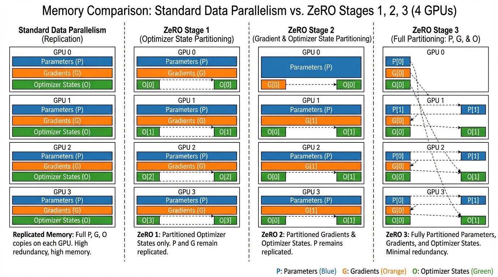

import ZeROMemoryVisualizer from '../../../components/chapter-7/ZeROMemoryVisualizer.tsx';

# 7.2 ZeRO (Zero Redundancy Optimizer)

이전 장에서 우리는 Distributed Data Parallel (DDP) 이 데이터셋을 여러 GPU에 분할하여 연산량을 선형적으로 확장하는 방법을 살펴보았습니다. 하지만 DDP는 치명적인 물리적 한계를 내포하고 있습니다: **클러스터 내의 모든 GPU는 모델과 학습 상태(Training states)의 완벽하고 동일한 복제본을 유지해야 합니다.** 

Foundation Model 의 크기가 2019년 10억(1B) 개 수준에서 2020년 1,000억(100B) 개 이상으로 폭발적으로 증가함에 따라, 엔지니어들은 **Memory Wall** (메모리 장벽) 이라는 거대한 물리적 한계에 부딪혔습니다. 클러스터에 아무리 많은 GPU를 추가하더라도, 모델이 *단일* GPU의 VRAM에 들어가지 않는다면 학습 자체가 수학적으로 불가능했습니다.

이 장벽을 허물기 위해 Microsoft의 연구진은 **Zero Redundancy Optimizer (ZeRO)** [[1]](#ref-1) 를 개발했습니다. ZeRO는 전체 클러스터의 VRAM을 단일하고 연속적인 메모리 풀(Pool)로 취급하여 분산 학습의 패러다임을 근본적으로 재정의합니다. 즉, Model Parallelism 의 메모리 효율성과 Data Parallelism 의 통신 효율성 및 단순성을 동시에 달성한 것입니다.

---

## 1. GPU 메모리의 해부학 (The Anatomy of GPU Memory)

ZeRO가 메모리를 어떻게 최적화하는지 이해하려면, 학습 중에 메모리가 어디로 증발하는지 먼저 해부해 보아야 합니다.

Foundation Model 의 표준인 혼합 정밀도(Mixed-precision) 학습을 진행할 때, GPU 메모리는 크게 두 가지 범주로 소비됩니다: **Residual States** (활성화 값, 임시 버퍼, 메모리 파편화)와 **Model States** (모델 상태).

여기서 핵심 병목은 **Model States** 입니다. 모델의 총 파라미터 수를 $\Phi$ 라고 가정해 봅시다. Adam 옵티마이저를 사용하는 표준 DDP 환경에서 단일 GPU가 부담해야 하는 메모리 풋프린트(Footprint)는 다음과 같습니다:

1. **Parameters (FP16):**  $2\Phi$ 바이트.
2. **Gradients (FP16):**  $2\Phi$ 바이트.
3. **Optimizer States (FP32):**  Adam은 수치적 언더플로우를 방지하기 위해 마스터 가중치(Master weights), 모멘텀(1차 모멘트), 분산(2차 모멘트)의 복제본을 고정밀도인 FP32로 유지해야 합니다.
   - Master Weights: $4\Phi$ 바이트
   - Momentum: $4\Phi$ 바이트
   - Variance: $4\Phi$ 바이트
   - *Total Optimizer State:* $12\Phi$ 바이트.

**총 Model State 메모리 = $16\Phi$ 바이트.** 

여기서 매우 놀라운 사실을 발견할 수 있습니다: **옵티마이저 상태(Optimizer states)가 전체 메모리의 75%를 차지합니다 ($16\Phi$ 중 $12\Phi$).** 

만약 Llama 3 70B와 같은 700억 파라미터 모델을 학습시키려 한다고 가정해 봅시다. Model States 에만 $16 \times 70 \text{ billion} \approx 1.12 \text{ Terabytes}$ 의 VRAM이 필요합니다. 최신 NVIDIA H100 GPU의 VRAM은 80GB에 불과합니다. 표준 DDP 환경에서는 1대의 GPU를 쓰든 10,000대의 GPU를 쓰든, 이 모델을 학습시키는 것은 수학적으로 불가능합니다.

---

## 2. ZeRO의 철학: 중복의 제거

표준 DDP는 그래디언트의 평균을 내기 위해 **All-Reduce** 연산을 사용합니다. 역전파(Backward pass)가 끝나면 모든 GPU는 정확히 동일한 그래디언트를 가지게 되며, 모든 GPU가 독립적으로 정확히 동일한 옵티마이저 스텝을 밟아 자신만의 가중치 복제본을 업데이트합니다. 이는 엄청난 메모리 중복(Redundancy)입니다.

ZeRO는 모델 상태를 복제하는 대신, 클러스터 내의 $N$ 개 GPU에 걸쳐 **분할(Partitioning)** 함으로써 이 중복을 제거합니다. ZeRO는 세 가지 점진적인 단계(Stage)로 구현됩니다.


*출처: AI 생성 이미지. Inspired by Rajbhandari et al., 2020.*

### Stage 1: Optimizer State Partitioning ($P_{os}$)
모든 GPU가 거대한 $12\Phi$ 크기의 옵티마이저 상태를 저장하는 대신, ZeRO-1은 옵티마이저 상태를 $N$ 개의 동일한 파티션으로 쪼갭니다.
- GPU $i$ 는 전체 파라미터 중 자신에게 할당된 특정 파티션의 옵티마이저 상태만 저장합니다.
- GPU $i$ 는 자신에게 할당된 가중치 조각(Slice)을 업데이트할 책임만 집니다.
- **Memory Footprint:**  $16\Phi$ 에서 $4\Phi + \frac{12\Phi}{N}$ 로 감소합니다.
- **Communication Overhead:**  **0%**. All-Reduce 대신, ZeRO는 그래디언트에 대해 *Reduce-Scatter* 를 수행한 뒤, 업데이트된 가중치에 대해 *All-Gather* 를 수행합니다. 네트워크를 통해 전송되는 총 데이터 양은 표준 DDP의 All-Reduce와 수학적으로 정확히 동일합니다.

### Stage 2: Gradient Partitioning ($P_{os+g}$)
GPU $i$ 가 가중치의 파티션 $i$ 만 업데이트할 책임이 있다면, 전체 그래디언트 텐서를 들고 있을 필요가 없습니다. ZeRO-2에서는 역전파 중 그래디언트 버킷이 계산되는 즉시, 해당 그래디언트를 책임지는 GPU로 축소 및 분산(Reduce-Scatter)시킨 후 로컬 복제본을 즉각 폐기합니다.
- **Memory Footprint:**  $2\Phi + \frac{14\Phi}{N}$ 로 감소합니다.
- **Communication Overhead:**  **0%**. Stage 1과 정확히 동일한 Reduce-Scatter / All-Gather 프리미티브를 사용합니다.

### Stage 3: Parameter Partitioning ($P_{os+g+p}$)
분산 학습의 궁극적인 형태로, PyTorch 생태계에서는 **FSDP (Fully Sharded Data Parallel)** 라고도 불립니다. ZeRO-3는 파라미터 자체마저 분할합니다. 이제 어떤 GPU도 완전한 모델을 들고 있지 않습니다.
- **Mechanism:**  특정 Transformer 레이어가 순전파(Forward) 또는 역전파(Backward) 연산을 수행해야 할 때, ZeRO-3는 Just-In-Time (JIT) 방식으로 *All-Gather* 를 수행하여 해당 레이어의 가중치만 일시적으로 재구성합니다. 해당 레이어의 연산이 끝나는 즉시 가중치는 메모리에서 삭제됩니다.
- **Memory Footprint:**  GPU 대수에 비례하여 선형적으로 확장됩니다: $\frac{16\Phi}{N}$.
- **Communication Overhead:**  **~1.5x**. 순전파와 역전파 *모두* 에서 가중치를 All-Gather 해야 하므로, DDP에 비해 네트워크 볼륨이 50% 증가합니다. 하지만 이 오버헤드는 레이어 $L$ 의 통신과 레이어 $L-1$ 의 연산을 중첩(Overlap)시킴으로써 대부분 숨길 수 있습니다.

---

## 3. Interactive Visualization: The Memory Wall

아래의 인터랙티브 컴포넌트를 사용하여 다양한 크기의 Foundation Model 과 클러스터 규모에 따른 메모리 풋프린트를 시뮬레이션해 보십시오. 표준 DDP가 H100의 80GB VRAM 한계를 얼마나 빨리 초과하는지, 그리고 ZeRO-3가 어떻게 메모리 풋프린트를 극적으로 낮추어 남은 VRAM을 더 큰 배치 사이즈나 더 긴 컨텍스트 윈도우 확장에 사용할 수 있게 해주는지 관찰할 수 있습니다.

<ZeROMemoryVisualizer lang="ko" client:load />

*(Note: 이 시각화 도구는 순수한 Model State 메모리만 계산합니다. 실제 환경에서는 활성화(Activation) 메모리도 고려해야 하며, 이는 Activation Checkpointing 기법을 통해 완화할 수 있습니다.)*

---

## 4. GPU의 한계를 넘어서: ZeRO-Offload & ZeRO-Infinity

ZeRO-3를 사용하면 GPU를 추가함에 따라 메모리를 선형적으로 분산할 수 있습니다. 하지만 만약 당신이 단일 GPU나 4-GPU 노드 하나만 가진 연구자라면 어떻게 해야 할까요?

DeepSpeed 팀은 전체 시스템의 메모리 계층 구조를 쥐어짜내기 위해 **ZeRO-Offload** [[2]](#ref-2) 와 **ZeRO-Infinity** [[3]](#ref-3) 를 도입했습니다.

*   **ZeRO-Offload (CPU RAM):**  CPU는 연산 속도는 느리지만 방대한 메모리(종종 1TB 이상의 시스템 RAM)를 가지고 있습니다. ZeRO-Offload는 $12\Phi$ 크기의 옵티마이저 상태와 Adam 연산을 CPU로 넘깁니다(Offload). GPU가 스텝 $t$ 의 순전파/역전파를 계산하는 동안, CPU는 비동기적으로 스텝 $t-1$ 의 가중치를 업데이트하고 PCIe를 통해 GPU로 다시 전송합니다. 이를 통해 단일 GPU에서도 130억(13B) 파라미터 모델을 학습시킬 수 있습니다.
*   **ZeRO-Infinity (NVMe Storage):**  오프로드 개념을 고속 NVMe SSD로 확장한 기술입니다. 고속 NVMe 스토리지를 거대한 가상 메모리 풀로 취급하고 메모리 중심의 타일링(Tiling) 기법을 사용함으로써, ZeRO-Infinity는 단일 머신에서 **수조 개(Trillions)** 의 파라미터를 가진 모델을 호스팅하고 미세 조정(Fine-tuning)할 수 있게 해줍니다. GPU 메모리 장벽을 완전히 분쇄한 것입니다.

---

## 5. 엔지니어링 구현 (DeepSpeed)

ZeRO를 위해 로우레벨(Low-level)의 Reduce-Scatter 및 All-Gather CUDA 커널을 직접 작성하는 것은 극도로 복잡합니다. 오늘날 엔지니어들은 Microsoft의 `deepspeed` 라이브러리나 PyTorch 네이티브의 `FSDP` 에 의존합니다.

아래는 DeepSpeed를 사용하여 ZeRO-3를 상용 수준(Production-grade)으로 통합하는 예시입니다. DeepSpeed가 표준 PyTorch 코드를 어떻게 감싸서(Wrapper) 동작하는지 주목해 보십시오.

### DeepSpeed 설정 파일 (`ds_config.json`)
DeepSpeed의 동작은 JSON 설정 파일에 의해 제어됩니다. 모델 아키텍처의 코드를 수정할 필요 없이, 이 파일에서 ZeRO Stage와 오프로딩 동작을 정의할 수 있습니다.

```json
{
  "train_batch_size": 128,
  "train_micro_batch_size_per_gpu": 16,
  "gradient_accumulation_steps": 1,
  "optimizer": {
    "type": "AdamW",
    "params": {
      "lr": 2e-5,
      "weight_decay": 0.01
    }
  },
  "fp16": {
    "enabled": true
  },
  "zero_optimization": {
    "stage": 3,
    "overlap_comm": true,
    "contiguous_gradients": true,
    "reduce_bucket_size": 5e7,
    "stage3_prefetch_bucket_size": 5e7,
    "stage3_param_persistence_threshold": 1e5,
    "offload_optimizer": {
      "device": "cpu",
      "pin_memory": true
    }
  }
}
```

### PyTorch 통합 스크립트

```python
import torch
import torch.nn as nn
import deepspeed
from torch.utils.data import DataLoader, Dataset

# 1. 표준 PyTorch 모델 정의
# 이 모델이 50B 파라미터라서 단일 GPU에 들어가지 않더라도,
# DeepSpeed가 초기화 과정에서 자동으로 파티셔닝을 수행합니다.
class SimpleLLM(nn.Module):
    def __init__(self, vocab_size=32000, d_model=4096):
        super().__init__()
        self.embed = nn.Embedding(vocab_size, d_model)
        # 실제로는 수십 개의 Transformer 블록이 쌓인 형태일 것입니다.
        self.layers = nn.Sequential(
            *[nn.Linear(d_model, d_model) for _ in range(24)]
        )
        self.lm_head = nn.Linear(d_model, vocab_size)

    def forward(self, x):
        x = self.embed(x)
        x = self.layers(x)
        return self.lm_head(x)

# 더미 데이터셋
class DummyDataset(Dataset):
    def __len__(self): return 1000
    def __getitem__(self, idx):
        return torch.randint(0, 32000, (512,)), torch.randint(0, 32000, (512,))

def train():
    # 2. DeepSpeed 분산 백엔드 초기화
    deepspeed.init_distributed()

    model = SimpleLLM()
    dataset = DummyDataset()
    
    # 3. DeepSpeed 엔진 초기화
    # DeepSpeed가 표준 PyTorch DDP 래퍼와 Optimizer를 대체합니다.
    model_engine, optimizer, _, dataloader = deepspeed.initialize(
        args=None,
        model=model,
        model_parameters=model.parameters(),
        training_data=dataset,
        config="ds_config.json"
    )

    criterion = nn.CrossEntropyLoss()

    # 4. Training Loop
    for epoch in range(3):
        for step, (inputs, targets) in enumerate(dataloader):
            # 데이터를 로컬 GPU로 이동
            inputs = inputs.to(model_engine.local_rank)
            targets = targets.to(model_engine.local_rank)

            # 순전파 (ZeRO-3가 레이어별로 가중치를 자동으로 All-Gather 합니다)
            outputs = model_engine(inputs)
            loss = criterion(outputs.view(-1, 32000), targets.view(-1))

            # 역전파 (ZeRO-3가 그래디언트를 자동으로 Reduce-Scatter 합니다)
            model_engine.backward(loss)

            # 옵티마이저 스텝 수행
            model_engine.step()

            if model_engine.local_rank == 0 and step % 10 == 0:
                print(f"Epoch {epoch} | Step {step} | Loss {loss.item():.4f}")

if __name__ == "__main__":
    # 프로세스 생성을 처리하기 위해 deepspeed 런처를 통해 실행해야 합니다.
    # deepspeed --num_gpus=8 train_zero.py
    train()
```

### 엔지니어링 트레이드오프 (The Engineering Trade-off)
ZeRO-3는 마법 같지만 만능은 아닙니다. 가중치를 런타임(JIT)에 브로드캐스팅하는 방식은 네트워크 대역폭에 극도로 민감합니다. 만약 클러스터에 고속 InfiniBand나 NVLink가 없다면, GPU들은 네트워크를 통해 가중치가 도착하기만을 기다리며 유휴 상태(Stall)에 빠지게 됩니다. 이러한 경우, 엔지니어들은 종종 ZeRO-2로 후퇴하거나, ZeRO-1을 텐서 병렬화(Tensor Parallelism)와 결합하여 사용합니다 (이 방법은 7.3장에서 자세히 다룰 예정입니다).

---

## Summary

ZeRO는 분산 학습을 '하드웨어에 종속된 물리적 한계'에서 '소프트웨어로 정의 가능한 스케일링 문제'로 탈바꿈시켰습니다. 표준 Data Parallelism 이 동일한 상태를 복제하여 VRAM을 낭비한다는 점을 간파하고, 옵티마이저 상태(Stage 1), 그래디언트(Stage 2), 파라미터(Stage 3)를 분할(Partitioning)하는 혁신을 이루어냈습니다.

여기에 CPU 및 NVMe 오프로딩(Offloading) 기술이 결합되면서, ZeRO는 상대적으로 평범한 하드웨어에서도 거대 모델을 학습시킬 수 있도록 Foundation Model 의 진입 장벽을 크게 낮추었습니다. 그러나 모델의 크기가 5,000억(500B) 파라미터를 넘어서면, 수천 대의 GPU에 걸친 ZeRO-3조차도 네트워크 혼잡 현상을 겪기 시작합니다. 이를 해결하기 위해 우리는 행렬 곱셈 연산 그 자체를 물리적으로 쪼개야만 합니다. 다음 장인 **7.3 Model & Pipeline Parallelism** 에서는 이를 위한 텐서 및 파이프라인 병렬화 기술을 깊이 있게 파헤칠 것입니다.

---

## Quizzes

<details>
<summary>Quiz 1: ZeRO Stage 1과 Stage 2가 표준 Distributed Data Parallel (DDP) 과 비교하여 추가적인 네트워크 통신 오버헤드를 전혀 발생시키지 않는 이유는 무엇인가?</summary>
*표준 DDP는 All-Reduce 연산을 사용하는데, 이는 수학적으로 'Reduce-Scatter'를 수행한 뒤 'All-Gather'를 수행하는 것과 정확히 동일합니다. DDP에서는 All-Reduce를 통해 그래디언트를 동기화합니다. 반면 ZeRO-1/2 프레임워크는 그래디언트에 대해 Reduce-Scatter를 수행하여 (각 GPU가 분할된 조각만 받도록 함), 각 GPU가 자신의 가중치 조각만 업데이트한 다음, 업데이트된 가중치를 All-Gather로 브로드캐스트합니다. 결과적으로 네트워크를 통해 전송되는 총 데이터 볼륨은 원래의 All-Reduce와 완벽하게 동일하게 유지됩니다.*
</details>

<details>
<summary>Quiz 2: ZeRO-3가 파라미터를 여러 GPU에 분할해 버린다면, 특정 GPU는 특정 Transformer 레이어 가중치의 일부만 가지고 있을 텐데 어떻게 해당 레이어의 순전파(Forward pass) 연산을 수행할 수 있는가?</summary>
*ZeRO-3는 Just-In-Time (JIT) 파라미터 재구성 메커니즘을 사용합니다. 특정 레이어가 실행되기 직전, 프레임워크는 All-Gather 연산을 트리거하여 다른 모든 GPU로부터 누락된 가중치 조각들을 끌어옵니다. 해당 레이어의 순전파(또는 역전파) 연산이 완료되는 즉시, 재구성되었던 가중치들은 메모리 공간을 확보하기 위해 해당 GPU의 VRAM에서 즉각 삭제됩니다.*
</details>

<details>
<summary>Quiz 3: ZeRO-Offload를 사용하여 10B 파라미터 모델을 학습시키고 있습니다. GPU 활용도(MFU)가 크게 떨어지고 GPU가 자주 유휴 상태(Idle)에 빠지는 것을 발견했습니다. 시스템의 가장 가능성 높은 병목 지점은 어디인가?</summary>
*PCIe 대역폭 또는 CPU 연산 속도입니다. ZeRO-Offload는 옵티마이저 스텝 연산을 CPU로 이동시킵니다. 만약 CPU가 Adam 업데이트를 계산하는 속도가 너무 느리거나, PCIe 버스가 업데이트된 가중치를 다음 순전파가 시작되기 전까지 GPU로 충분히 빠르게 전송하지 못한다면, GPU는 CPU의 작업이 끝날 때까지 기다려야 하므로 활용도가 급격히 떨어지게 됩니다.*
</details>

<details>
<summary>Quiz 4: 혼합 정밀도(FP16/FP32) 학습에서, 옵티마이저 상태(Optimizer states)가 모델의 파라미터 자체보다 훨씬 더 많은 메모리를 소비하는 이유는 무엇인가?</summary>
*파라미터는 16비트 부동소수점(FP16/BF16)으로 저장되어 파라미터당 2바이트를 차지합니다. 하지만 Adam과 같은 옵티마이저는 미세한 그래디언트 업데이트 과정에서 수치적 언더플로우(Underflow)가 발생하는 것을 막기 위해 높은 정밀도를 요구합니다. 따라서 Adam은 마스터 가중치의 FP32(4바이트) 복제본, FP32 모멘텀 텐서, 그리고 FP32 분산 텐서를 유지해야 합니다. 이는 파라미터당 총 12바이트에 달하며, 원래의 FP16 가중치보다 6배나 더 큰 공간을 차지하게 됩니다.*
</details>

---

## References

1. <a id="ref-1"></a>Rajbhandari, S., et al. (2020). *ZeRO: Memory Optimizations Toward Training Trillion Parameter Models.* SC20. [arXiv:1910.02054](https://arxiv.org/abs/1910.02054).
2. <a id="ref-2"></a>Ren, J., et al. (2021). *ZeRO-Offload: Democratizing Billion-Scale Model Training.* USENIX ATC. [arXiv:2101.06840](https://arxiv.org/abs/2101.06840).
3. <a id="ref-3"></a>Rajbhandari, S., et al. (2021). *ZeRO-Infinity: Breaking the GPU Memory Wall for Extreme Scale Deep Learning.* SC21. [arXiv:2104.07857](https://arxiv.org/abs/2104.07857).