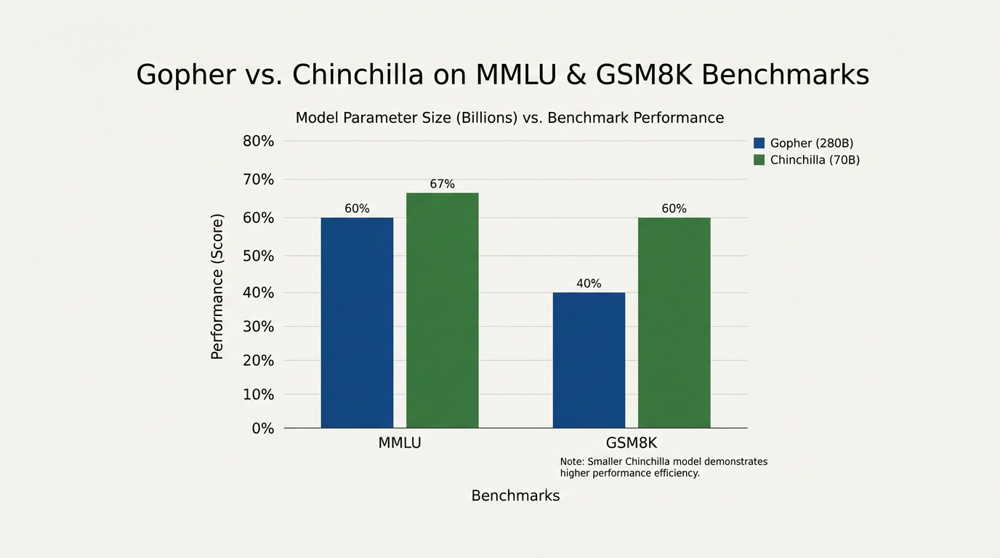

import ChinchillaAllocator from '../../../components/chapter-8/ChinchillaAllocator.tsx';

# 8.2 Chinchilla Optimality: 파라미터당 20 토큰의 법칙

Kaplan의 스케일링 법칙(Scaling Laws)이 AI 성능의 예측 가능성을 증명한 이후, 업계는 가능한 한 가장 큰 모델을 구축하기 위한 군비 경쟁에 돌입했습니다. 2021년까지 지배적인 패러다임은 파라미터 수($N$)가 지능을 결정하는 가장 핵심적인 원동력이라는 것이었습니다. 만약 거대한 GPU 클러스터를 확보했다면, 수학적으로 "올바른" 접근법은 가용한 모든 데이터를 쏟아부어 엄청난 크기의 모델을 인스턴스화하는 것이라 여겨졌습니다.

이 시대는 OpenAI의 GPT-3 (175B 파라미터)와 DeepMind의 Gopher (280B 파라미터) 같은 거대 모델(Behemoths)을 탄생시켰습니다. Kaplan의 공식에 따르면, 연산 예산(Compute budget)을 10배 늘릴 경우, 이 연산량을 모델 크기를 약 5배 키우는 데 할당하고, 데이터셋 크기는 단 2배만 늘리는 것이 최적이었습니다.

하지만 2022년, DeepMind는 이 궤도를 근본적으로 수정하는 논문을 발표했습니다. Hoffmann 연구진 [[1]](#ref-1) 은 당시 업계가 학습 데이터의 양에 비해 턱없이 **거대한 모델** 을 만들고 있었다는 사실을 수학적으로 증명했습니다. 이 역사적인 궤도 수정이 바로 오늘날 **Chinchilla Optimality** (친칠라 최적성) 이라고 불리는 개념입니다.

---

## 기존 Power Law 의 치명적 결함

그렇다면 Kaplan 연구진은 대체 무엇을 놓쳤던 것일까요? 오류의 핵심은 소규모 실험에서의 하이퍼파라미터 튜닝, 그중에서도 특히 **학습률 스케줄 (Learning rate schedule)** 에 있었습니다.

초기 OpenAI 실험에서 연구진은 다양한 크기의 모델에 대해 고정된 코사인 감쇠(Cosine decay) 학습률 스케줄을 사용했습니다. 하지만 더 적은 토큰으로 학습되는 큰 모델들은 학습 과정의 끝에 더 빨리 도달하게 됩니다. 학습률 스케줄이 각 모델 크기에 따른 정확한 학습 스텝(토큰 수)에 맞춰 적절하게 늘어나거나 압축되지 않았기 때문에, 결과적으로 경험적 데이터에서 더 작은 모델들이 체계적으로 불이익(Under-optimized)을 받게 된 것입니다.

DeepMind의 Hoffmann 팀은 수백 번의 스케일링 실험을 다시 실행하며, 모든 개별 실행에 대해 마지막 학습 토큰에서 학습률이 정확히 0으로 떨어지도록 스케줄을 세밀하게 조정했습니다.

### 수정된 스케일링 방정식

방법론적 오류를 수정한 결과, Hoffmann 연구진은 모델 크기($N$)와 데이터 크기($D$)를 비대칭적으로 확장해서는 안 된다는 것을 발견했습니다. 주어진 연산 예산($C$) 내에서 가장 낮은 손실(Loss)을 달성하려면, **모델 크기와 학습 토큰 수가 동일한 비율로 확장되어야 합니다.**

Transformer의 연산량 근사치 공식이 다음과 같을 때:
$$ C \approx 6ND $$

친칠라 최적 할당(Chinchilla optimal allocation)은 다음을 지시합니다:
$$ N_{opt} \propto C^{0.5} $$
$$ D_{opt} \propto C^{0.5} $$

경험적으로, 이는 현업에서 쓰이는 매우 단순하고 강력한 황금률로 변환됩니다: **모델의 파라미터 1개당, 약 20개의 토큰(Tokens)으로 학습시켜야 한다.**

---

## Gopher vs. Chinchilla: 세기의 비교

수정된 스케일링 법칙을 증명하기 위해, DeepMind는 **Chinchilla** 라는 새로운 모델을 학습시켰습니다. 그들은 이전 플래그십 모델이었던 **Gopher** 를 학습시킬 때 사용했던 것과 정확히 동일한 연산 예산(Compute budget)을 Chinchilla에 부여했습니다.

*   **Gopher (Pre-Chinchilla):** 280 Billion 파라미터, 300 Billion 토큰으로 학습. (비율: 파라미터당 약 1.1 토큰).
*   **Chinchilla (Compute-Optimal):** 70 Billion 파라미터, 1.4 Trillion 토큰으로 학습. (비율: 파라미터당 20 토큰).


*Source: Hoffmann et al., 2022 [[1]](#ref-1)*

Chinchilla는 크기가 4배나 작았음에도 불구하고, 거의 5배나 많은 데이터를 보았습니다. 연산량 관점에서 완벽하게 최적화(Compute-optimal)되었기 때문에, Chinchilla는 사실상 모든 하위 작업(Downstream benchmark)에서 Gopher를 압도했습니다.

이 발견은 AI 업계에 엄청난 충격을 안겨주었습니다. 이는 대략 300B 토큰으로 학습된 GPT-3(175B)와 같은 모델들이 심각한 **학습 부족 (Undertrained)** 상태였음을 의미했기 때문입니다. 친칠라 최적성을 충족하려면 175B 모델은 3.5 Trillion 개의 토큰이 필요했지만, 당시에는 그 정도 규모의 정제된 데이터셋이 존재하지 않았습니다.

---

## 연산량 할당의 엔지니어링 (Engineering the Compute Allocation)

Foundation Model 엔지니어들에게 친칠라 비율은 클러스터 자원 할당의 시작점입니다. 단 한 줄의 모델 아키텍처 코드를 작성하기 전에, 엔지니어들은 목표로 하는 파라미터 수를 확보 가능한 고품질 데이터의 양, 그리고 하드웨어의 물리적 한계와 저울질해야 합니다.

<ChinchillaAllocator client:load />

### PyTorch를 이용한 아키텍처 사이징

파라미터 수를 추정하는 것은 단순히 숫자를 고르는 작업이 아닙니다. 목표 파라미터 수를 산출하는 물리적인 Transformer 아키텍처(레이어 수, 어텐션 헤드 수, 임베딩 차원)를 정의한 다음, 그에 맞는 친칠라 최적 토큰 수를 계산해야 합니다.

다음 Python 코드는 엔지니어들이 Chinchilla 프레임워크를 사용하여 아키텍처 하이퍼파라미터를 연산 요구 사항과 어떻게 매핑하는지 보여줍니다.

```python
import torch

class ComputeEstimator:
    def __init__(self, vocab_size: int = 32000):
        self.vocab_size = vocab_size

    def estimate_transformer_params(self, d_model: int, n_layers: int, n_heads: int) -> int:
        """
        표준 Decoder-only Transformer의 임베딩을 제외한 파라미터 수를 추정합니다.
        """
        # Attention 파라미터: W_q, W_k, W_v, W_o (각각 d_model x d_model 크기)
        attn_params_per_layer = 4 * (d_model ** 2)
        
        # FFN 파라미터: 일반적으로 4 * d_model로 확장(up-project)한 뒤 축소(down-project)함
        # W_1: d_model x (4 * d_model), W_2: (4 * d_model) x d_model
        ffn_params_per_layer = 2 * (d_model * (4 * d_model))
        
        # LayerNorms (레이어당 2개, scale 및 bias)
        ln_params_per_layer = 4 * d_model
        
        params_per_layer = attn_params_per_layer + ffn_params_per_layer + ln_params_per_layer
        total_non_embedding_params = n_layers * params_per_layer
        
        return total_non_embedding_params

    def chinchilla_prescription(self, d_model: int, n_layers: int, n_heads: int):
        """
        최적의 데이터셋 크기와 요구되는 총 연산량을 계산합니다.
        """
        N = self.estimate_transformer_params(d_model, n_layers, n_heads)
        
        # Chinchilla Rule: 파라미터당 20 토큰
        D = 20 * N
        
        # Total Compute: C = 6 * N * D
        C = 6 * N * D
        
        print(f"Architecture: {n_layers} Layers, {d_model} d_model, {n_heads} Heads")
        print(f"Non-Embedding Parameters (N): {N / 1e9:.2f} Billion")
        print(f"Optimal Dataset Size (D):     {D / 1e9:.2f} Billion Tokens")
        print(f"Required Compute (C):         {C / 1e21:.2f} ZettaFLOPs\n")

# 예시: Llama-1 7B 스타일 아키텍처 사이징
estimator = ComputeEstimator(vocab_size=32000)

# Llama 7B 아키텍처 근사치
estimator.chinchilla_prescription(d_model=4096, n_layers=32, n_heads=32)

# GPT-3 175B 스타일 아키텍처로 확장
estimator.chinchilla_prescription(d_model=12288, n_layers=96, n_heads=96)
```

---

## 친칠라를 넘어서: 과잉 학습 (Over-training) 의 시대

Chinchilla 최적성은 *학습(Training)* 연산량을 가장 효율적으로 사용하는 방법을 정의하지만, 현대의 AI 생태계는 사실상 이 법칙을 넘어섰습니다.

만약 고정된 1,000만 달러의 예산으로 가능한 가장 낮은 손실(Loss)을 달성하려는 연구소라면 Chinchilla 법칙을 따르는 것이 맞습니다. 하지만 수백만 명의 사용자에게 모델을 서비스(Deploy)해야 하는 기업의 입장은 다릅니다. **학습 연산량(Training compute)은 일회성 고정 비용이지만, 추론 연산량(Inference compute)은 지속적이고 무한한 운영 비용이기 때문입니다.**

이러한 경제적 현실은 **Over-training** (과적합이 아닌 과잉 학습, 또는 추론 최적화 스케일링)의 시대를 탄생시켰습니다.

Meta의 **Llama 3 (8B)** 가 가장 대표적인 예입니다 [[2]](#ref-2). Chinchilla 법칙에 따르면 8B 파라미터 모델이 연산 최적화(Compute-optimal)가 되려면 약 160 Billion 개의 토큰이 필요합니다. 하지만 Meta는 Llama 3 8B를 무려 **15 Trillion 토큰** 으로 학습시켰습니다. 이는 친칠라 권장량의 거의 100배에 달하는 수치입니다 (약 1875:1의 비율).

이유가 무엇일까요? 8B 크기의 작은 모델을 학습 최적점을 훨씬 지나치도록 밀어붙이면, 이 작은 신경망 안에 엄청난 양의 지식을 압축할 수 있기 때문입니다. 그 결과, 70B 모델의 지능에 필적하면서도 MacBook에서 로컬로 실행되거나 클라우드에서 믿을 수 없을 정도로 저렴하게 서비스될 수 있는 강력한 소형 모델이 탄생합니다. 즉, 추론 효율성(Inference efficiency)을 극대화하기 위해 학습 효율성(Training efficiency)을 기꺼이 희생하는 것입니다.

Chinchilla 최적성은 여전히 모델 스케일링의 근본적인 '물리학'으로 남아있지만, 엔지니어링은 결국 트레이드오프(Trade-offs)의 예술입니다. 오늘날 AI 개발의 제약 조건은 더 이상 단순한 "연산량"이 아니라, 이러한 Over-training 패러다임을 뒷받침할 수 있는 고품질 데이터의 확보 여부가 되었습니다.

---

## Quizzes

<details>
<summary>Quiz 1: Kaplan 연구진이 초기에 데이터셋 크기보다 모델 크기(파라미터)가 훨씬 더 빠르게 확장되어야 한다고 잘못 결론 내린 이유는 무엇입니까?</summary>
*OpenAI 연구원들은 모든 실험 실행에 걸쳐 고정된 학습률 감쇠 스케줄(Learning rate decay schedule)을 사용했습니다. 이로 인해 더 적은 토큰으로 학습되는 작은 모델들은 학습률이 적절히 0으로 떨어지기 전에 토큰 예산이 소진되어 버렸고, 결과적으로 체계적인 최적화 실패(Under-optimized)를 겪었습니다. DeepMind가 각 특정 실행의 스텝 수에 맞춰 학습률 스케줄을 조정하여 이 문제를 바로잡자, 최적의 확장 비율은 1:1로 수정되었습니다.*
</details>

<details>
<summary>Quiz 2: 만약 정확히 100 Billion 토큰으로 구성된 엄격하게 제한된 고품질 데이터셋이 있다면, 이 데이터셋에 맞는 친칠라 최적(Chinchilla-optimal) 파라미터 수는 얼마입니까? 그리고 이 데이터셋으로 100B 파라미터 모델을 학습시키면 안 되는 이유는 무엇입니까?</summary>
*최적의 크기는 5 Billion 파라미터입니다 (100B / 20). 만약 100B 토큰으로 100B 파라미터 모델을 학습시킨다면, 그 모델은 심각한 학습 부족(Undertrained) 상태가 됩니다. 거대한 신경망을 통해 그 토큰들을 처리하느라 기하급수적으로 더 많은 연산량(FLOPs)을 소모하게 되지만, 동일한 연산량을 더 작고 밀도 높은 5B 모델에 투자하여 같은 데이터를 학습시켰을 때 얻을 수 있는 최종 손실(Loss)보다 훨씬 더 나쁜 결과를 얻게 될 것입니다.*
</details>

<details>
<summary>Quiz 3: 현재 업계에서 친칠라의 20:1 토큰-파라미터 비율을 크게 초과하는 "추론 최적화(Inference-Optimal)" 모델(예: Llama 3)을 학습시키는 것을 선호하는 근본적인 경제적 이유는 무엇입니까?</summary>
*Chinchilla 법칙은 오직 '학습 단계'에서 사용되는 연산량만을 최적화합니다. 하지만 프로덕션 환경의 모델에서는 시간이 지남에 따라 추론(Inference) 비용이 학습 비용을 압도하게 됩니다. 엄청난 양의 데이터로 작은 모델을 과잉 학습(Over-training)시키면, 엔지니어들은 체급을 뛰어넘는 성능을 내는 모델을 만들 수 있습니다. 초기 학습에 더 많은 연산량이 필요하더라도, 수백만 명의 사용자에게 서비스할 때 추론 비용이 훨씬 저렴하고 빠르며 메모리를 적게 차지하기 때문입니다.*
</details>

---

## References

1. <a id="ref-1"></a>Hoffmann, J., et al. (2022). *Training Compute-Optimal Large Language Models.* [arXiv:2203.15556](https://arxiv.org/abs/2203.15556).
2. <a id="ref-2"></a>Touvron, H., et al. (2024). *The Llama 3 Herd of Models.* [arXiv:2407.21783](https://arxiv.org/abs/2407.21783).