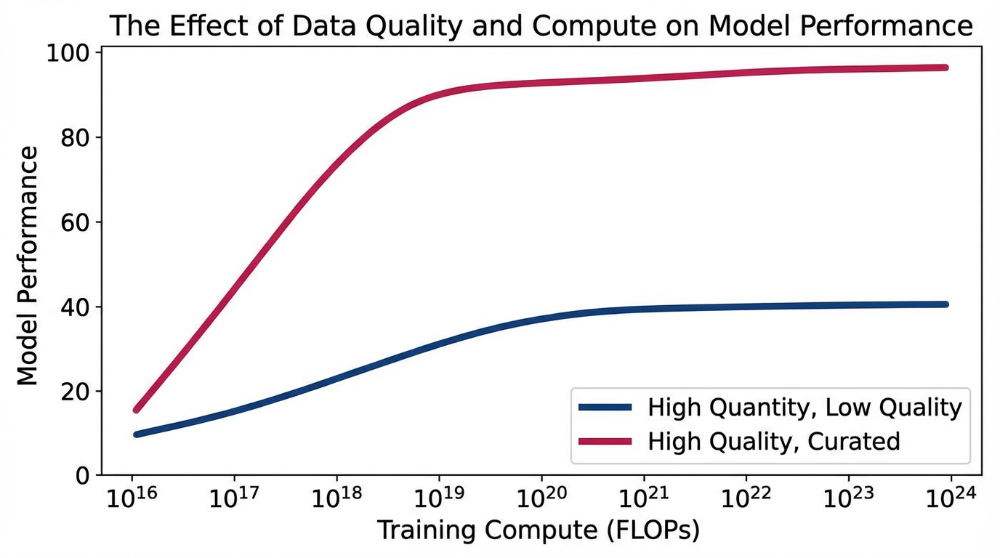

import DataQualityVisualizer from '../../../components/chapter-9/DataQualityVisualizer.tsx';

현대 파운데이션 모델(Foundation Model) 엔지니어링에서 가장 심오한 패러다임의 전환 중 하나는 **Model-Centric** (모델 중심) 및 **Volume-Centric** (볼륨 중심) 스케일링에서 **Data-Centric** (데이터 중심) 큐레이션으로의 이동입니다. 사전 학습(Pre-training) 단계에서는 방대하고 다양한 데이터셋을 통해 세상의 지식을 구축하는 데 의존하지만, 사후 학습(Post-training) 및 정렬(Alignment) 단계인 SFT(Supervised Fine-Tuning)와 RLHF/DPO에서는 완전히 역전된 스케일링 법칙이 적용됩니다. 이 단계에서는 데이터셋의 구성과 '품질'이 단순한 '양'을 압도합니다.

---

## 패러다임의 전환: Big Data에서 Smart Data로

초기 딥러닝 시대의 스케일링 법칙(Scaling Laws)에 따르면, 데이터셋의 크기를 늘리는 것은 필연적으로 더 나은 성능의 모델을 보장했습니다. 모델이 엣지 케이스(Edge case)를 잘못 분류할 경우, 엔지니어들의 지배적인 해결책은 파라미터 수를 늘리거나 더 많은 데이터를 스크래핑하는 것이었습니다.

하지만 모델이 수천억 개의 파라미터 규모로 커짐에 따라, 정제되지 않은 '다크 데이터(Dark Data)'(노이즈가 많거나 큐레이션되지 않은 웹 스크래핑 데이터 등)로 미세 조정(Fine-tuning)을 수행할 때 수확 체감의 법칙이 급격히 나타나는 것이 관찰되었습니다. 데이터의 양을 늘리면 저장 공간과 연산 비용은 선형적으로 증가하지만, 종종 상충하는 그래디언트(Gradient) 신호가 발생하여 모델의 수렴을 방해합니다. 오늘날의 SOTA(State-of-the-Art) 엔지니어링은 **Data-Centric AI** 에 집중하며, 모델의 하이퍼파라미터를 조정하는 것보다 학습 분포 내의 특정 노이즈를 식별하고 제거하는 데 대부분의 엔지니어링 리소스를 투입합니다.


*Source: Generated by Gemini*

---

## 표면적 정렬 가설 (The Superficial Alignment Hypothesis)

정렬(Alignment) 과정에서 '양보다 질'이라는 움직임을 촉발한 기념비적인 연구는 **LIMA (Less Is More for Alignment)** 논문(Zhou et al., 2023 [[1]](#ref-1))입니다. 연구진은 RLHF(인간 피드백 기반 강화학습)를 완전히 배제하고, 오직 **1,000개의 세심하게 큐레이션된 프롬프트와 응답** 만을 사용하여 65B 파라미터의 LLaMA 모델을 미세 조정했습니다. 이 극도로 작은 데이터셋에도 불구하고, LIMA는 43%의 사례에서 GPT-4와 대등하거나 오히려 더 선호되는 결과를 보여주었습니다.

이러한 결과는 **Superficial Alignment Hypothesis** (표면적 정렬 가설)을 탄생시켰습니다:
> *모델의 핵심 지식과 추론 능력은 사전 학습(Pre-training) 과정에서 거의 모두 학습된다. 정렬(SFT)은 단지 모델이 사용자와 상호작용할 때 어떤 하위 분포(Sub-distribution)의 포맷(예: 도움이 되는 어시스턴트 페르소나)을 사용해야 하는지 가르치는 피상적인 과정일 뿐이다.*

SFT는 모델에 새로운 지식을 주입하는 과정이 아니기 때문에, 거대한 데이터셋이 필요하지 않습니다. 오히려 방대한 SFT 데이터셋은 미묘한 포맷의 불일치, 사실적 오류, 또는 문체적 퇴행(Stylistic regression)을 포함하고 있어 모델이 사전 학습에서 얻은 능력을 능동적으로 저하시키는 경우가 많습니다. 이를 **Alignment Tax** (정렬 세금)라고 부릅니다.

### 라벨 노이즈의 수학적 이해

SFT 과정에서 노이즈가 섞인 데이터가 왜 그토록 파괴적인지 이해하기 위해, 표준 자기회귀(Autoregressive) Cross-Entropy 손실 함수를 살펴보겠습니다:

$$ \mathcal{L}_{SFT} = - \sum_{t=1}^{T} \log P_\theta(y_t \mid y_{<t}, x) $$

고품질의 'Gold-standard' 데이터로 학습할 때, 타겟 분포 $P^*(y \mid x)$는 매우 날카롭습니다(Sharp). 인스트럭션 $x$에서 응답 $y$로의 매핑이 일관되기 때문에, 모델은 쿨백-라이블러 발산(Kullback-Leibler Divergence) $D_{KL}(P^* \parallel P_\theta)$를 쉽게 최소화할 수 있습니다.

반면, 데이터셋에 저품질이거나 모순되는 응답(노이즈)이 포함되어 있다면, 타겟 분포 $P^*(y \mid x)$는 높은 엔트로피(High-entropy)를 갖게 됩니다. 이로 인해 그래디언트 업데이트 $\nabla_\theta \mathcal{L}_{SFT}$ 간에 충돌이 발생합니다. 모델은 노이즈의 환원 불가능한 엔트로피를 모델링하는 데 귀중한 파라미터 용량(Capacity)을 낭비하게 되며, 결과적으로 자체 예측 분포 $P_\theta$가 평탄해집니다(Flatten). 이는 할루시네이션(Hallucination)과 Loss Spike를 유발하며, 노이즈를 평균화하기 위해 기하급수적인 연산량을 요구하게 됩니다.

---

## 자동화된 데이터 큐레이션: 노이즈 필터링

LIMA처럼 1,000개의 완벽한 예제를 수동으로 큐레이션하는 것은 가능하지만, 고품질 데이터를 10k나 100k 규모로 확장하려면 자동화가 필수적입니다. **AlpaGasus** 논문(Chen et al., 2023 [[2]](#ref-2))은 **LLM-as-a-Judge** 파이프라인을 사용하여 이를 달성하는 방법을 입증했습니다.

연구진은 저품질, 관련 없는 내용, 할루시네이션이 다수 포함된 52k 규모의 유명한 Alpaca 데이터셋을 가져와 GPT-4를 이용해 각 쌍을 1점부터 5점까지 평가했습니다. 임계값(Threshold) 미만의 데이터를 모두 폐기함으로써, 데이터셋을 **9k 개의 고품질 예제** 로 정제했습니다. 이 9k 서브셋으로 미세 조정한 결과, 학습 시간은 83% 감소(80분에서 14분으로)했을 뿐만 아니라 52k 전체 데이터셋으로 학습한 모델의 성능을 크게 뛰어넘었습니다.

### 데이터 필터 파이프라인 엔지니어링 (PyTorch)

최신 MLOps 파이프라인에서는 비용이 많이 드는 API 호출 대신, 전용 **Reward Model (RM)** 이나 시퀀스 분류(Sequence Classification) 모델을 사용하여 필터링을 수행하는 경우가 많습니다. 아래는 Hugging Face를 사용하여 SFT 데이터셋을 자동으로 평가하고 필터링하는 실용적인 PyTorch 구현 코드입니다.

```python
import torch
from transformers import AutoModelForSequenceClassification, AutoTokenizer
from typing import List, Dict

def filter_sft_data(
    prompts: List[str], 
    responses: List[str], 
    model_id: str = "OpenAssistant/reward-model-deberta-v3-large-v2",
    threshold: float = 1.5
) -> List[Dict[str, str]]:
    """
    사전 학습된 보상 모델(Reward Model)을 사용하여 SFT 인스트럭션-응답 쌍을 필터링합니다.
    데이터의 높은 품질을 보장하기 위해 주어진 임계값(threshold) 미만의 점수를 받은 쌍은 폐기됩니다.
    """
    device = torch.device("cuda" if torch.cuda.is_available() else "cpu")
    
    # 토크나이저 및 시퀀스 분류(보상) 모델 초기화
    tokenizer = AutoTokenizer.from_pretrained(model_id)
    model = AutoModelForSequenceClassification.from_pretrained(model_id).to(device)
    model.eval()

    filtered_dataset = []
    
    with torch.no_grad():
        for prompt, response in zip(prompts, responses):
            # RM이 일반적으로 기대하는 입력 포맷으로 구성
            text = f"<|prompter|>{prompt}<|endoftext|><|assistant|>{response}<|endoftext|>"
            
            inputs = tokenizer(
                text, 
                return_tensors="pt", 
                truncation=True, 
                max_length=512
            ).to(device)
            
            # Forward pass를 통해 스칼라 보상(Logit) 획득
            outputs = model(**inputs)
            score = outputs.logits[0].item()
            
            if score >= threshold:
                filtered_dataset.append({
                    "prompt": prompt,
                    "response": response,
                    "score": round(score, 3)
                })
                
    return filtered_dataset

# 실행 예시
sample_prompts = [
    "역전파(backpropagation)의 개념을 설명해줘.",
    "문자열을 뒤집는 파이썬 스크립트를 작성해줘.",
    "asdfasdfasdf" # 의도적으로 삽입된 노이즈 프롬프트
]
sample_responses = [
    "역전파는 신경망에서 출력층부터 역방향으로 연쇄 법칙(chain rule)을 적용하여 그래디언트를 계산하는 알고리즘입니다.",
    "print('hello'[::-1])",
    "저는 AI 어시스턴트입니다." # 노이즈에 대한 저품질 응답
]

# filtered_data = filter_sft_data(sample_prompts, sample_responses, threshold=1.0)
# 예상 결과: 임계값을 넘는 처음 두 개의 고품질 쌍만 유지됨.
```

---

## 합성 데이터 (Synthetic Data)와 소형 언어 모델 (SLMs)

'양보다 질' 원칙의 궁극적인 발현은 **Synthetic Data** (합성 데이터)의 활용입니다. 인터넷 상의 고품질 인간 생성 텍스트가 고갈되어 감에 따라, SOTA 모델들은 교과서 수준의 데이터를 생성하기 위해 강력한 'Teacher Model'에 점점 더 의존하고 있습니다.

1. **TinyStories (Eldan & Li, 2023 [[3]](#ref-3))**: 연구진은 천만 개 미만의 파라미터를 가진 소형 모델도 문법적으로 완벽한 영어를 생성하고 기본적인 추론을 수행할 수 있음을 증명했습니다. 그 비결은 4세 아동의 어휘력으로 제한된 짧은 이야기들로 구성된 '합성 데이터셋'으로만 학습시킨 것입니다. 개방된 웹 데이터의 노이즈와 복잡성을 제거함으로써, 이 작은 모델은 구문(Syntax)과 논리에 온전히 집중할 수 있었습니다.
2. **Microsoft Phi-3 (Abdin et al., 2024 [[4]](#ref-4))**: 3.8B 파라미터의 Phi-3-mini 모델은 Mixtral 8x7B처럼 크기가 10배 이상 큰 모델들과 맞먹는 성능을 보여줍니다. 이 혁신의 핵심은 전적으로 데이터셋에 있었습니다. 3.3조 개의 토큰은 철저하게 필터링된 웹 데이터와 합성된 '교과서(Textbook)' 데이터로 구성되었습니다. Phi-3는 고품질 데이터가 소형 언어 모델(SLM)의 체급을 극적으로 높일 수 있으며, 온디바이스(On-device) AI의 강력한 가능성을 열어준다는 것을 증명했습니다.

---

## 데이터 중복의 임계점 (The Duplication Threshold)

노이즈를 필터링하는 것도 중요하지만, 남은 고품질 데이터를 어떻게 다룰 것인가 역시 매우 까다로운 문제입니다. 데이터 중복(Duplication)에 관한 최근의 실증적 연구들은 데이터 반복 횟수와 모델 성능 사이에 고도로 비선형적인(Non-linear) 관계가 있음을 밝혀냈습니다.

*   **최적의 비율 (약 25% 중복)**: 고도의 추론이 요구되는 핵심 작업에 대해 소량의 데이터를 중복 주입하는 것은 오히려 정확도를 향상시킬 수 있습니다(일종의 암시적 중요도 가중치 역할을 함). 이는 파국적 망각(Catastrophic forgetting)을 일으키지 않으면서 중요한 구문 구조를 강화합니다.
*   **성능 붕괴 (100% 중복)**: 데이터셋이 과도하게 중복될 경우, 모델은 학습 세트의 특정 엔티티나 표현 방식에 급격히 과적합(Overfitting)됩니다. 이로 인해 OOD (Out-Of-Distribution) 작업에서의 성능이 최대 40%까지 급락할 수 있습니다. 모델은 기저에 있는 추론 매니폴드(Reasoning manifold)를 학습하는 것을 멈추고, 단순히 중복된 시퀀스를 암기하기 시작합니다.

---

## 인터랙티브 시각화: 품질 vs 양의 트레이드오프

아래의 인터랙티브 컴포넌트를 사용하여 데이터셋 크기(Dataset Size), 노이즈 수준(Noise Level), 그리고 중복 비율(Duplication Rate) 간의 관계를 시뮬레이션해 보세요. 노이즈 수준이 높을 때 데이터셋 크기를 늘리는 것이 어떻게 수확 체감을 가져오는지, 그리고 극단적인 중복이 어떻게 성능 붕괴를 유발하는지 관찰할 수 있습니다.


<DataQualityVisualizer lang="ko" client:load />

---

## Quizzes

<details>
<summary>Quiz 1: 표면적 정렬 가설에 따르면, 왜 정렬 과정이 사전 학습보다 훨씬 적은 양의 데이터를 필요로 합니까?</summary>
*정렬은 모델에 새로운 사실적 지식이나 추론 능력을 주입하지 않기 때문입니다. 모든 핵심 지식은 거대한 사전 학습 단계에서 습득됩니다. 정렬은 단지 모델이 잠재적인 지식을 표면화하기 위해 요구되는 특정 포맷, 스타일, 페르소나(예: 도움이 되는 어시스턴트)를 가르치는 피상적인 과정일 뿐입니다.*
</details>

<details>
<summary>Quiz 2: 수학적 관점에서, SFT 데이터셋의 라벨 노이즈(Label Noise)가 모델 성능을 심각하게 저하시키는 이유는 무엇입니까?</summary>
*라벨 노이즈는 타겟 분포 $P^*(y \mid x)$의 엔트로피를 증가시킵니다. Cross-Entropy 손실을 최적화할 때, 모델은 유사한 입력에 대해 상충하는 그래디언트 업데이트를 받게 됩니다. 결과적으로 모델은 날카로운 추론 매니폴드에 수렴하는 대신, 환원 불가능한 노이즈를 모델링하는 데 파라미터 용량을 낭비하게 되어 예측 분포가 평탄해지고 할루시네이션이 발생합니다.*
</details>

<details>
<summary>Quiz 3: SFT 데이터를 필터링하기 위해 LLM-as-a-Judge (예: GPT-4)를 사용할 때, 결과 데이터셋에 도입될 수 있는 잠재적인 시스템적 위험은 무엇입니까?</summary>
*정제된 데이터셋이 평가자(Judge) 모델 특유의 문체적 편향, 장황함(Verbosity), 또는 '모드 붕괴(Mode collapse)'를 상속받을 위험이 있습니다. 이 데이터를 학습한 모델은 다양하고 인간다운 응답을 생성하기보다는 평가자 모델의 특정 어조를 흉내 내는 법을 배우게 되어, 결과적으로 모델의 창의적 다양성이 제한될 수 있습니다.*
</details>

<details>
<summary>Quiz 4: 소량의 데이터 중복(약 25%)은 때때로 정확도를 향상시키는 반면, 100% 중복은 왜 파국적인 성능 저하를 초래합니까?</summary>
*최소한의 중복은 암시적인 중요도 가중치 역할을 하여, 학습 분포를 압도하지 않으면서 중요한 구문 구조와 추론 경로를 강화합니다. 그러나 100%와 같은 과도한 중복은 심각한 과적합(Overfitting)을 유발합니다. 모델은 일반화(Generalization)를 멈추고 특정 중복 시퀀스를 단순히 암기하게 되어, 분포 외(OOD) 작업에서의 성능이 급격히 떨어집니다.*
</details>

<details>
<summary>Quiz 5: 데이터 볼륨 $N$과 라벨 노이즈 $\epsilon$ 사이에서 일정 테스트 오차 $E_0$를 유지하기 위한 파레토 최적 탄력성 경계 방정식을 수학적으로 수식화하십시오.</summary>
*표준 신경망 스케일링 법칙에 따르면 테스트 오차는 $E(N, \epsilon) \approx \frac{A}{N^\alpha} + B\epsilon^\beta$로 수식화될 수 있으며, 여기서 $\alpha$는 볼륨 스케일링 지수이고 $\beta$는 노이즈 민감도 지수입니다. 일정 테스트 오차 $E_0$를 유지하면서 노이즈 증가를 볼륨 증가로 상쇄하는 파레토 최적 경계를 찾기 위해 전도함수를 0으로 설정합니다: $dE = -\alpha A N^{-\alpha - 1} dN + \beta B \epsilon^{\beta - 1} d\epsilon = 0$. 트레이드오프의 탄력성에 대해 풀면 파레토 최적 경계 방정식 $\frac{dN}{d\epsilon} = \frac{\beta B}{\alpha A} N^{\alpha+1} \epsilon^{\beta-1}$이 도출됩니다.*
</details>

---

## 요약 및 다음 단계

'볼륨(Volume)'에서 '큐레이션(Curation)'으로의 전환은 현대 사후 학습(Post-training)을 정의하는 핵심 특징입니다. 데이터셋을 강력하게 필터링하고, LLM-as-a-Judge 파이프라인을 활용하며, 교과서 수준의 예제를 합성함으로써 엔지니어들은 막대한 연산 비용을 들이지 않고도 레거시 거대 모델들과 맞먹는 더 작고 빠른 모델을 학습시킬 수 있습니다.

그러나 완벽하게 큐레이션된 데이터셋이 있다 하더라도, 70B 파라미터 전체를 미세 조정하는 것은 대부분의 조직에게 연산적으로 감당하기 어려운 일입니다. 그렇다면 H100 GPU 클러스터 없이 어떻게 이 고품질 데이터셋을 거대 모델에 적용할 수 있을까요? 다음 섹션인 **9.3 Parameter-Efficient Fine-Tuning (PEFT)** 에서는 전체 가중치의 극히 일부(1% 미만)만을 업데이트하여 거대 모델을 미세 조정할 수 있게 해주는 LoRA와 DoRA 같은 수학적 기법들을 탐구해 보겠습니다.

---

## References

1. <a id="ref-1"></a>Zhou, C., et al. (2023). *LIMA: Less Is More for Alignment*. [arXiv:2305.11206](https://arxiv.org/abs/2305.11206).
2. <a id="ref-2"></a>Chen, L., et al. (2023). *AlpaGasus: Training A Better Alpaca with Fewer Data*. [arXiv:2307.08701](https://arxiv.org/abs/2307.08701).
3. <a id="ref-3"></a>Eldan, R., & Li, Y. (2023). *TinyStories: How Small Can Language Models Be and Still Speak Coherent English?*. [arXiv:2305.07759](https://arxiv.org/abs/2305.07759).
4. <a id="ref-4"></a>Abdin, M., et al. (2024). *Phi-3 Technical Report: A Highly Capable Language Model Locally on Your Phone*. [arXiv:2404.14219](https://arxiv.org/abs/2404.14219).