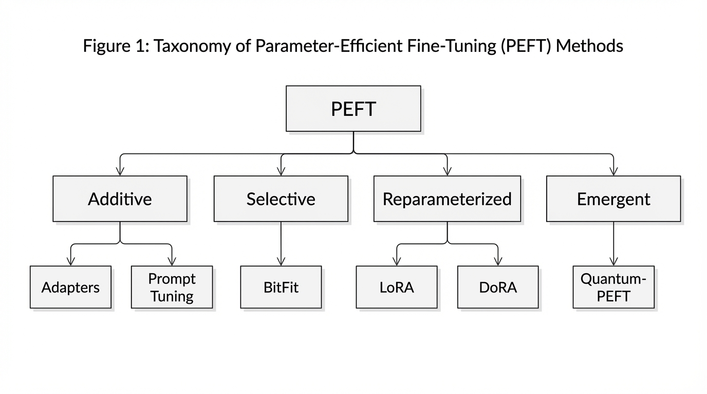

# 9.3 Parameter-Efficient Fine-Tuning (PEFT)

이전 섹션에서 우리는 사후 학습(Post-training) 단계에서 데이터셋의 큐레이션이 단순한 데이터의 양보다 종종 더 중요하다는 것을 확인했습니다. 우리는 정렬(Alignment) 과정을 수천 개의 잘 다듬어진 예제로 압축할 수 있습니다. 하지만 여전히 심각한 엔지니어링 병목 현상이 남아 있습니다. 아무리 작은 데이터셋을 사용하더라도, 70B(700억 개) 파라미터 모델의 가중치를 업데이트하는 것은 여전히 연산적으로 매우 부담스러운 작업입니다.

**Full Fine-Tuning (FFT)** 과정에서 시스템은 모델의 가중치, 옵티마이저 상태(예: Adam의 1차 및 2차 모멘트), 그래디언트(Gradient), 그리고 순전파 활성화(Forward activations)를 모두 메모리에 저장해야 합니다. 16-bit 정밀도를 사용하는 70B 모델의 경우, 이러한 메모리 공간은 multi-terabyte 수준까지 쉽게 커질 수 있으며, 단순히 **Out-Of-Memory (OOM)** 에러를 피하기 위해서도 클러스터 규모의 GPU 자원이 필요할 수 있습니다.

모델 적응(Model adaptation)의 진입 장벽을 낮추고 빠른 반복 실험을 가능하게 하기 위해, 실무에서는 **Parameter-Efficient Fine-Tuning (PEFT)** 를 널리 사용합니다. 전체 네트워크를 업데이트하는 대신, PEFT 기법들은 사전 학습된 가중치를 동결(Freeze)하고 극히 일부의 파라미터(보통 1% 미만)만을 주입하거나 최적화합니다.

---

## PEFT의 분류 (Taxonomy)

PEFT의 환경은 지난 몇 년 동안 눈부시게 발전했습니다. 최근의 종합적인 연구 [[1]](#ref-1) 에 따르면, PEFT 방법론은 구조적 패러다임에 따라 네 가지로 분류할 수 있습니다:

1. **Additive PEFT** : 아키텍처에 완전히 새로운 파라미터를 도입합니다. 트랜스포머 레이어 사이에 삽입되는 작은 피드포워드 네트워크인 **Adapters** 와, 입력 시퀀스에 학습 가능한 연속 벡터를 추가하는 **Prompt/Prefix Tuning** 이 여기에 포함됩니다.
2. **Selective PEFT** : 기존의 사전 학습된 파라미터 중 극히 일부만을 선택하여 업데이트합니다. 대표적인 예로 네트워크의 편향(Bias) 항만을 미세 조정하고 모든 가중치 행렬은 동결하는 **BitFit** 이 있습니다.
3. **Reparameterized PEFT** : 가중치 업데이트를 고도로 압축된 형태로 표현하기 위해 수학적 구조(주로 저랭크 행렬)를 활용합니다. **LoRA** 와 그 변형들이 이 범주를 지배하고 있습니다.
4. **Emergent PEFT (탐색적 최전선)** : 선형적인 스케일링 법칙을 넘어, 양자 유니터리 매개변수화(Quantum unitary parameterization)와 같은 고급 수학적 프레임워크를 탐색하여 준선형 이하 또는 로그 스케일의 파라미터 확장을 노리는 차세대 기술입니다.


*출처: AI 생성 이미지*

---

## Reparameterization: LoRA 및 DoRA

실무에서 가장 널리 쓰이는 PEFT 계열은 **LoRA (Low-Rank Adaptation)** 입니다. LoRA가 많이 쓰이는 이유는 중요한 엔지니어링적 장점 때문입니다. Additive 방법(Adapters)과 달리, 학습이 끝난 뒤 업데이트를 원래 가중치에 병합(Merge)할 수 있어서 별도의 추론 경로를 거의 남기지 않습니다.

### LoRA의 수학적 이해

LoRA의 핵심 가설은 특정 태스크에 모델을 적응시키는 데 필요한 가중치의 변화량($\Delta W$)이 낮은 "본질적 랭크(Intrinsic rank)"를 갖는다는 것입니다. 사전 학습된 가중치 행렬 $W_0$ 가 $d \times k$ (예: $4096 \times 4096$)의 차원을 가질 수 있지만, 의미 있는 업데이트는 이 전체 고차원 공간에 걸쳐 일어나지 않습니다.

LoRA는 $W_0$ 를 동결하고 업데이트 $\Delta W$ 를 두 개의 저랭크(Low-rank) 행렬 $B$ 와 $A$ 의 곱으로 표현합니다:

$$ h = W_0 x + \Delta W x = W_0 x + \frac{\alpha}{r} (B A) x $$

여기서:
* $W_0 \in \mathbb{R}^{d \times k}$ 는 동결된 사전 학습 가중치입니다.
* $B \in \mathbb{R}^{d \times r}$ 는 0으로 초기화됩니다.
* $A \in \mathbb{R}^{r \times k}$ 는 가우시안 분포로 초기화됩니다.
* $r \ll \min(d, k)$ 은 낮은 랭크 값입니다 (보통 8, 16, 또는 64).
* $\alpha$ 는 상수 스케일링 계수입니다.

$B$ 가 0으로 초기화되기 때문에, 학습 시작 시점에 $\Delta W = 0$ 이 되며, 이는 그래디언트 업데이트가 발생하기 전까지 모델이 사전 학습된 베이스 모델과 정확히 동일하게 동작함을 보장합니다.

### Forward Pass 엔지니어링

아래는 표준 선형 변환(Linear transformation)에 LoRA 레이어를 주입한 실용적인 PyTorch 구현 코드입니다. 그래디언트가 오직 작은 행렬 $A$ 와 $B$ 에 대해서만 계산되는 방식에 주목하십시오.

```python
import torch
import torch.nn as nn
import math

class LoRALinear(nn.Module):
    def __init__(self, in_features: int, out_features: int, r: int = 16, lora_alpha: int = 32, dropout: float = 0.05):
        super().__init__()
        # 1. 원래의 사전 학습된 가중치 (동결됨)
        self.linear = nn.Linear(in_features, out_features, bias=False)
        self.linear.weight.requires_grad = False
        
        # 2. LoRA 전용 속성들
        self.r = r
        self.lora_alpha = lora_alpha
        self.scaling = self.lora_alpha / self.r
        
        # 3. 저랭크 행렬들 (학습 가능)
        self.lora_A = nn.Linear(in_features, r, bias=False)
        self.lora_B = nn.Linear(r, out_features, bias=False)
        self.dropout = nn.Dropout(p=dropout)
        
        self.reset_parameters()
        
    def reset_parameters(self):
        # A를 Kaiming uniform으로 초기화 (표준 선형 초기화와 유사)
        nn.init.kaiming_uniform_(self.lora_A.weight, a=math.sqrt(5))
        # B를 0으로 초기화하여 초기 Delta W가 정확히 0이 되도록 설정
        nn.init.zeros_(self.lora_B.weight)
        
    def forward(self, x: torch.Tensor) -> torch.Tensor:
        # 동결된 가중치를 통과하는 표준 Forward pass
        frozen_out = self.linear(x)
        
        # LoRA Forward pass: x -> Dropout -> A -> B -> Scale
        lora_out = self.lora_B(self.lora_A(self.dropout(x))) * self.scaling
        
        return frozen_out + lora_out
        
    def merge_weights(self):
        """학습된 LoRA 가중치를 베이스 모델에 병합하여 지연 시간 없는 추론을 가능하게 합니다."""
        if not self.linear.weight.requires_grad:
            # W_new = W_0 + (B @ A) * scaling
            delta_w = (self.lora_B.weight @ self.lora_A.weight) * self.scaling
            self.linear.weight.data += delta_w
            self.linear.weight.requires_grad = True # 병합되었음을 표시
```


### 실무 구현: PEFT & Unsloth

LoRA를 처음부터 구현하는 것은 그 메커니즘을 이해하는 데 가치가 있지만, 실제 운영 워크플로우에서는 일반적으로 엣지 케이스, 다중 GPU 스케일링, 양자화를 자동으로 처리해 주는 특화된 라이브러리에 의존합니다.

#### 1. Hugging Face PEFT
`peft` 라이브러리는 파라미터 효율적 미세 조정을 위한 업계 표준입니다. `transformers` 생태계와 원활하게 통합됩니다.

```python
from peft import LoraConfig, get_peft_model
from transformers import AutoModelForCausalLM

# 사전 학습된 베이스 모델 로드
model = AutoModelForCausalLM.from_pretrained("meta-llama/Meta-Llama-3-8B")

# LoRA 설정 정의
peft_config = LoraConfig(
    r=16,
    lora_alpha=32,
    target_modules=["q_proj", "v_proj"], # 어텐션 프로젝션에 적용
    lora_dropout=0.05,
    bias="none",
    task_type="CAUSAL_LM"
)

# 모델을 PEFT로 래핑
model = get_peft_model(model, peft_config)
model.print_trainable_parameters()
```

#### 2. Ultra-Fast Fine-Tuning with Unsloth (Unsloth를 이용한 초고속 미세 조정)
싱글 또는 소수의 GPU에서 최대의 효율을 내기 위해 `unsloth`가 큰 인기를 얻고 있습니다. 학습 속도를 최대 2배까지 가속하고 메모리 사용량을 크게 줄여주는 수작업 최적화된 Triton 커널을 제공합니다.

```python
from unsloth import FastLanguageModel
import torch

# Unsloth로 최적화된 모델 로드
model, tokenizer = FastLanguageModel.from_pretrained(
    model_name = "unsloth/llama-3-8b-Instruct",
    max_seq_length = 2048,
    dtype = None, # 자동 감지 (float16 또는 bfloat16)
    load_in_4bit = True, # 4비트 양자화 사용
)

# LoRA 적용
model = FastLanguageModel.get_peft_model(
    model,
    r = 16,
    target_modules = ["q_proj", "k_proj", "v_proj", "o_proj",
                      "gate_proj", "up_proj", "down_proj"],
    lora_alpha = 16,
    lora_dropout = 0, # 0으로 최적화됨
    bias = "none",    # "none"으로 최적화됨
    use_gradient_checkpointing = "unsloth",
)
```

### LoRA를 넘어서: DoRA (Weight-Decomposed Low-Rank Adaptation)

LoRA가 효율적이긴 하지만, 연구자들은 LoRA가 가중치 벡터의 *크기(Magnitude)* 와 *방향(Direction)* 을 결합된 방식으로 업데이트하며, 이는 Full Fine-Tuning이 동작하는 방식과 다르다는 것을 관찰했습니다.

**DoRA** 는 사전 학습된 가중치 $W_0$ 를 두 가지 구성 요소, 즉 크기 벡터 $m$ 과 방향 행렬 $V$ 로 분리합니다. 그리고 방향 행렬 $V$ 에만 LoRA 업데이트를 적용하는 반면, 크기 벡터 $m$ 은 독립적으로 학습되도록 허용합니다. 이러한 미묘한 기하학적 분리 덕분에 DoRA는 Full Fine-Tuning의 학습 동역학을 매우 가깝게 모방할 수 있으며, 추론 시 파라미터 수를 늘리지 않고도 복잡한 추론 태스크에서 종종 더 뛰어난 정확도를 달성합니다.

---

## 통합적 관점 (Unifying View)과 편향-단독 역설 (Bias-Only Paradox)

PEFT 관련 문헌이 폭발적으로 증가함에 따라, 수백 개의 새로운 방법론들이 저마다 SOTA (State-of-the-Art) 성능을 달성했다고 주장했습니다. 하지만 2025년 CVPR에 발표된 Mai et al. [[2]](#ref-2) 의 연구는 PEFT 방법론들의 복잡성에 대해 매우 필요한 현실 점검을 제공했습니다.

### 튜닝 공정성 문제 (The Tuning Fairness Problem)
이 연구는 많은 복잡한 PEFT 기법들이 단지 베이스라인 모델들이 방치된 채 자신들만 광범위한 하이퍼파라미터 튜닝을 받았기 때문에 우수해 보였다는 사실을 밝혀냈습니다. 네트워크의 편향(Bias) 항만 튜닝하는 **BitFit** 과 같은 단순한 **Selective PEFT** 방법에도 동일한 수준의 하이퍼파라미터 최적화를 적용했을 때, 이들은 일상적으로 LoRA나 Adapters와 같은 정교한 방법들의 성능에 필적하거나 오히려 능가했습니다.

### 귀납적 편향 (Inductive Biases)과 실수의 다양성
단순한 Bias-tuning 방법이 85%의 정확도를 달성하고 복잡한 LoRA 방법 역시 85%의 정확도를 달성한다면, 이 둘은 완전히 동일한 것일까요? 연구는 그렇지 않다는 것을 증명했습니다. 전반적인 정확도가 동일하더라도, 서로 다른 PEFT 기법들은 **완전히 다른 실수(Mistakes)** 를 저지릅니다.

이는 PEFT 아키텍처들이 모델에 서로 다른 **귀납적 편향(Inductive biases)** 을 부여함을 의미합니다. Additive 방법은 사전 학습된 특징을 그대로 유지하는 것을 우선시하는 반면, Reparameterized 방법은 특징들의 기하학적 공간을 이동시키는 것을 우선시합니다.

> **전문가의 통찰 (Expert Insight):** PEFT 엔지니어링의 최전선은 단 하나의 "최고의" 기법을 찾는 것이 아닙니다. 서로 다른 PEFT 기법들이 다른 데이터 분포에서 실패하기 때문에, 엔지니어들은 점차 **가중치 공간 앙상블 (Weight-Space Ensembles)** 을 배포하고 있습니다. 여러 개의 가벼운 어댑터(예: 하나의 LoRA, 하나의 Prompt Tuner)를 학습시키고 이들의 가중치나 출력을 평균화함으로써 분포 이동(Distribution shifts)에 대해 훨씬 더 뛰어난 견고성을 확보하는 것입니다.

---

## 탐색적 최전선: Quantum-PEFT를 통한 로그 스케일링

LoRA와 같은 전통적인 PEFT 방법은 모델의 차원($d$)에 선형적으로 스케일링됩니다 ($O(d)$). 파운데이션 모델이 극단적으로 넓어짐에 따라, 가장 낮은 랭크의 LoRA 행렬조차도 기가바이트 단위의 메모리를 소비하기 시작합니다.

2025년 Koike-Akino et al. [[3]](#ref-3) 의 프리프린트는 **Quantum-PEFT** 를 탐구하며, 선형 스케일링 대신 **로그 스케일링 (Logarithmic scaling)** 가능성을 제시했습니다.

표준 행렬 곱셈을 사용하는 대신, Quantum-PEFT는 양자 유니터리 매개변수화(구체적으로 Pauli 매개변수화)를 활용합니다. 가중치 업데이트를 고도로 구조화된 양자 텐서 공간에 매핑함으로써, 학습 가능한 파라미터의 수는 주변 차원에 대해 로그 스케일로 증가하게 됩니다 ($O(\log d)$).

저자들의 정식화에 따르면, Quantum-PEFT는 랭크-1 LoRA 기준보다 훨씬 적은 학습 파라미터로도 이론적으로 **풀 랭크 (Full-rank) 업데이트** 를 표현할 수 있습니다. 이런 특성이 더 넓은 조건에서도 유지된다면, 매우 제한적인 자원 환경에서의 모델 적응에 특히 흥미로운 선택지가 될 수 있습니다.

---

## 인터랙티브 시각화: VRAM 영향도

아래의 인터랙티브 컴포넌트를 사용하여 단일 정방 가중치 행렬 ($W \in \mathbb{R}^{d \times d}$)에 대한 Full Fine-Tuning과 LoRA의 파라미터 풋프린트를 시뮬레이션해 보세요. 파라미터 수가 얼마나 극적으로 감소하는지, 그러면서도 성능은 놀라울 정도로 유사하게 유지되는지 관찰할 수 있습니다.

import LoRAParameterVisualizer from '../../../components/chapter-9/LoRAParameterVisualizer.tsx';

<LoRAParameterVisualizer lang="ko" client:load />

---

## Quizzes

<details>
<summary>Quiz 1: 학습 메모리를 줄여줌에도 불구하고, 프로덕션 서빙(Serving) 환경에서 Additive Adapters보다 LoRA가 선호되는 이유는 무엇입니까?</summary>
*Additive Adapters는 순전파(Forward pass) 과정에 새로운 신경망 레이어를 도입하여 추론 지연 시간(Inference latency)을 증가시킵니다. 반면 LoRA는 학습된 저랭크 행렬(B와 A)을 사후 학습 단계에서 수학적으로 곱하고 원래의 동결된 가중치에 직접 더할 수 있습니다 ($W_{new} = W_0 + BA$). 결과적으로 추론 시 추가적인 지연 시간이 전혀 발생하지 않습니다.*
</details>

<details>
<summary>Quiz 2: 2025년 CVPR "Unifying View" 연구에 따르면, 왜 과거 문헌에서는 BitFit(Bias-tuning)과 같은 단순한 기법들이 복잡한 기법들보다 열등해 보였습니까?</summary>
*"튜닝 공정성(Tuning Fairness)"이 부족했기 때문입니다. 연구자들은 새롭고 복잡한 PEFT 방법의 하이퍼파라미터(학습률, 가중치 감소 등)를 튜닝하는 데는 상당한 연산을 투자한 반면, BitFit과 같은 단순한 베이스라인에는 최적화되지 않은 기본 하이퍼파라미터를 사용했습니다. 동등하게 튜닝되었을 때 BitFit은 매우 경쟁력 있는 성능을 보여줍니다.*
</details>

<details>
<summary>Quiz 3: 만약 LoRA와 Prompt Tuning이 검증 세트에서 정확히 동일한 정확도를 달성한다면, 엔지니어가 굳이 두 가지를 모두 학습시키려 하는 이유는 무엇입니까?</summary>
*서로 다른 PEFT 기법은 서로 다른 귀납적 편향(Inductive biases)을 부여하여 엣지 케이스에서 각기 다른 실수를 유발하기 때문입니다. 비용이 저렴한 여러 어댑터를 학습시키고 이들을 앙상블(예: 가중치 공간 평균화 또는 라우팅)함으로써, 엔지니어는 단일 기법을 사용할 때보다 전반적인 견고성과 일반화 능력을 향상시킬 수 있습니다.*
</details>

<details>
<summary>Quiz 4: Quantum-PEFT가 LoRA보다 목표로 삼는 스케일링 이점은 무엇입니까?</summary>
*LoRA의 파라미터 수는 모델의 차원에 선형적으로 증가합니다 ($O(d)$). Quantum-PEFT는 Pauli 매개변수화(양자 유니터리 구조)를 탐색하여 로그 스케일링($O(\log d)$)에 더 가까운 파라미터 성장을 노립니다. 저자들의 정식화에서는 극히 적은 파라미터만으로도 이론적인 풀 랭크(Full-rank) 가중치 업데이트를 표현할 수 있지만, 이는 아직 탐색적 아이디어로 보는 편이 안전합니다.*
</details>

---

## 요약 및 다음 단계

Parameter-Efficient Fine-Tuning은 단순한 메모리 절약 기법에서 파운데이션 모델 엔지니어링의 핵심 축으로 진화했습니다. 편향(Bias) 튜닝의 단순한 우아함부터 DoRA의 기하학적 정밀도, 그리고 Quantum-PEFT의 로그 스케일링에 이르기까지, 이러한 기술들은 사전 학습된 모델의 일반화 능력을 훼손하지 않으면서도 거대한 모델을 우리의 목적에 맞게 빚어낼 수 있게 해줍니다.

하지만 파라미터를 아무리 효율적으로 조정한다 하더라도, 이는 여전히 데이터셋과 연산력이 요구되는 그래디언트 기반의 최적화 과정입니다. 만약 단 한 번의 그래디언트 계산 없이도 모델을 새로운 태스크에 적응시킬 수 있다면 어떨까요? 다음 섹션인 **9.4 Prompt Engineering as SFT** 에서는 세심하게 구성된 Few-Shot 프롬프트와 Chain-of-Thought 구조가 어떻게 추론 시 활성화(Activation) 공간 내에서 모델의 행동을 일시적으로 "미세 조정"할 수 있는지 탐구해 보겠습니다.

---

## References

1. <a id="ref-1"></a>Wang, Y., et al. (2024). *Parameter-Efficient Fine-Tuning in Large Models: A Survey of Methodologies*. [arXiv:2410.19878](https://arxiv.org/abs/2410.19878).
2. <a id="ref-2"></a>Mai, Z., et al. (2025). *Lessons and Insights from a Unifying Study of Parameter-Efficient Fine-Tuning (PEFT) in Visual Recognition*. CVPR 2025. [arXiv:2403.14771](https://arxiv.org/abs/2403.14771).
3. <a id="ref-3"></a>Koike-Akino, T., et al. (2025). *Quantum-PEFT: Ultra parameter-efficient fine-tuning*. [arXiv:2503.05431](https://arxiv.org/abs/2503.05431).
