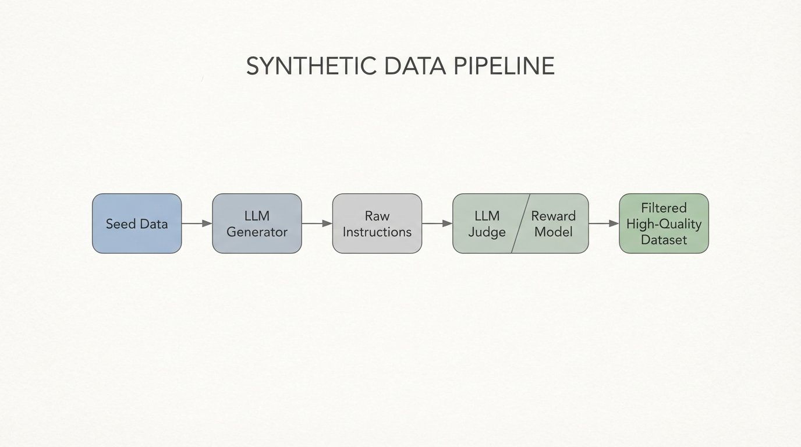

import EvolInstructVisualizer from '../../../components/chapter-9/EvolInstructVisualizer.tsx';

# 9.5 합성 지시어 및 셀프 인스트럭트 (Self-Instruct)

실무적인 post-training 상황을 하나 생각해 봅시다. 한 팀이 내부 프레임워크용 코딩 어시스턴트를 만들고 있습니다. 베이스 모델은 그럭저럭 Python을 쓰지만, 팀의 스타일 가이드와 안전 규칙, 도메인 특유의 엣지 케이스를 반복해서 놓칩니다. 자연스럽게 SFT를 떠올리게 되지만, 곧 데이터 문제가 드러납니다. 검수된 지시-응답 쌍 5만 개가 있는 것이 아니라, 좋은 예시 몇백 개와 원시 티켓 더미, 그리고 촉박한 일정만 있습니다. 이 병목이 바로 진짜 **데이터 장벽 (Data Wall)** 입니다.

이 때문에 합성 인스트럭션 생성은 현대의 post-training에서 중요한 위치를 차지합니다. 합성 인스트럭션 파이프라인은 강한 교사 모델을 활용해 사람이 비용 효율적으로 대량 작성하기 어려운 감독 신호를 만들어 냅니다. 더 넓은 태스크 커버리지, 더 어려운 추론 과정, 더 다양한 실패 사례, 더 많은 도메인 변형을 확보할 수 있습니다. 실제로는 GPU 시간보다 믿을 수 있는 라벨 데이터가 더 희소한 자원인 경우가 많습니다.

이전 섹션에서는 명시적인 가중치 업데이트 없이 모델을 제어하는 프롬프트 엔지니어링을 살펴보았습니다. 여기서는 반대로, 명시적인 weight update가 정말 필요하지만 완전히 사람이 쓴 데이터셋은 너무 비싼 상황을 다룹니다. 이 절에서는 Self-Instruct, Evol-Instruct, Magpie로 이어지는 흐름을 따라가고, 마지막에는 합성 데이터가 모델을 망치지 않고 실제로 개선하도록 만드는 실무 필터와 가드레일까지 정리합니다.

---

## 1. 실무적 동기

실무에서 합성 인스트럭션 파이프라인이 특히 유용한 이유는 세 가지입니다.

- **커버리지 확대:** 같은 태스크라도 표현 방식, 형식, 엣지 케이스를 훨씬 다양하게 만들 수 있습니다.
- **난이도 조절:** 단순한 시드 태스크에서 출발해 현실적인 디버깅, 계획 수립, 멀티턴 작업으로 점진적으로 키울 수 있습니다.
- **리뷰어 효율 극대화:** 사람은 예시를 하나하나 손으로 쓰는 대신, 시드 설계, 평가 기준, 필터, spot check에 집중할 수 있습니다.

이 관점에서 합성 데이터의 핵심은 사람을 대체하는 데 있지 않습니다. 오히려 사람의 검수 예산을 long tail과 정책 결정, 미묘한 실패 패턴을 잡는 일처럼 더 가치 있는 지점에 배치하게 해 준다는 데 있습니다.

---

## 2. 초기 접근법: Self-Instruct

언어 모델이 스스로의 학습 데이터를 생성한다는 개념은 Wang et al. (2022) 의 기념비적인 **Self-Instruct** 프레임워크 [[1]](#ref-1) 에서 공식화되었습니다. 핵심 전제는 반복적인 부트스트래핑(Bootstrapping)입니다: LLM이 스스로 새로운 지시문을 생성하고, 이에 답하며, 결과를 필터링하여 스스로 성능을 끌어올리는 것입니다.

Self-Instruct 파이프라인은 4개의 뚜렷한 단계로 구성됩니다:
1. **Instruction Generation**: 소수의 인간이 작성한 "시드(Seed)" 지시문(예: 175개 태스크)을 프롬프트의 퓨샷(Few-shot) 예제로 사용하여 모델이 완전히 새로운 지시문을 생성하도록 유도합니다.
2. **Classification**: 모델은 새로 생성된 지시문이 분류(Classification) 태스크(이산적인 레이블 필요)인지 생성(Generation) 태스크(개방형 응답 필요)인지 판별합니다.
3. **Instance Generation**: 모델에 다시 프롬프트를 입력하여 새로운 지시문에 대한 실제 입력과 출력(응답)을 생성합니다.
4. **Filtering**: 모델이 반복적인 루프에 빠지는 것을 방지하기 위해, 새로운 지시문을 기존 풀(Pool)과 비교합니다.

수학적으로, 필터링 단계는 다양성을 강제하기 위해 ROUGE-L 중복 임계값을 사용합니다. 지시문 $x_{new}$ 는 기존 지시문 $x_i$ 와의 최대 중복도가 임계값 $\tau$ 미만일 때만 학습 풀 $S$ 에 추가됩니다:

$$
\text{Keep } x_{new} \text{ if } \max_{x_i \in S} \text{ROUGE-L}(x_{new}, x_i) < \tau
$$

혁신적이긴 하지만, 바닐라(Vanilla) Self-Instruct 에는 치명적인 결함이 있습니다: 생성된 지시문의 복잡성이 정체되는 경향이 있다는 것입니다. 모델은 자연스럽게 단순한 태스크("고양이에 대한 시를 써줘", "이 문장을 번역해 줘")로 기울며, 최첨단 모델을 학습시키는 데 필요한 고도의 복잡한 추론 태스크를 생성하지 못합니다.

---

## 3. 복잡성의 확장: Evol-Instruct

복잡성의 정체를 돌파하기 위해 Xu et al. (2023) 은 WizardLM 모델 제품군의 핵심 엔진인 **Evol-Instruct** 를 도입했습니다 [[2]](#ref-2). 모델에게 단순히 *새로운* 지시문을 생성하라고 요구하는 대신, Evol-Instruct 는 모델이 기존 지시문을 체계적으로 *업그레이드* 하도록 강제합니다.

Evol-Instruct 는 두 가지 뚜렷한 변이(Mutation) 전략을 사용합니다:
*   **In-depth Evolving**: 제약 조건을 추가하거나, 논리를 심화하거나, 다단계 추론을 요구하거나, 입력 형식을 복잡하게 만들어 프롬프트의 난이도를 높입니다.
*   **In-breadth Evolving**: 프롬프트를 완전히 다른 주제나 도메인으로 변이시켜 데이터셋의 전반적인 커버리지를 넓힙니다.

In-depth Evolver 를 재귀적으로 적용함으로써, "정렬 알고리즘을 작성해 줘"와 같은 단순한 시드 프롬프트는 여러 에포크를 거치며 고도로 복잡한 소프트웨어 엔지니어링 티켓으로 변모할 수 있습니다.

### 인터랙티브 시각화: Evol-Instruct 프로세스

아래의 인터랙티브 컴포넌트를 사용하여 기본 지시문이 Evol-Instruct 방법론을 통해 어떻게 프로그래밍 방식으로 여러 수준의 복잡성으로 변이되는지 확인해 보십시오. 제약 조건이 모델로 하여금 더 깊은 추론 경로를 활용하도록 강제하는 방식에 주목하십시오.


<EvolInstructVisualizer lang="ko" client:load />

---

## 4. 제로 프롬프트 합성: Magpie

Self-Instruct 와 Evol-Instruct 모두 시드 데이터와 메타 프롬프트("당신은 지시문 재작성 어시스턴트입니다...")에 크게 의존합니다. 2024년, **Magpie** 프레임워크는 정렬된(Aligned) LLM에 *아무것도* 프롬프팅하지 않고 처음부터 정렬 데이터를 생성하는 근본적으로 더 단순한 접근 방식을 도입했습니다 [[3]](#ref-3).

Magpie 는 지시 조정된(Instruction-tuned) 모델(예: Llama-3-Instruct)의 자기 회귀적(Auto-regressive) 특성을 악용합니다. SFT 동안 이러한 모델은 특정 대화 템플릿으로 학습됩니다. 예를 들어, 일반적인 입력은 다음과 같습니다:
`<|user|>\n 양자 역학이란 무엇인가요? <|end|>\n <|assistant|>\n 양자 역학은...`

Magpie 는 모델에 쿼리 이전 템플릿만 제공함으로써 시드 프롬프트의 필요성을 완전히 우회합니다:
`<|user|>\n`

모델은 근본적으로 다음 토큰 예측기(Next-token predictor)이기 때문에 시퀀스를 완성하도록 강제됩니다. 모델은 자신의 SFT 학습 데이터의 잠재적 분포(Latent distribution)를 기반으로 그럴듯한 사용자 쿼리를 환각(Hallucinate)해 냅니다. 쿼리가 생성되면, 이를 다시 모델에 입력하여 어시스턴트의 응답을 생성합니다. 이러한 제로샷(Zero-shot) 합성은 인간의 개입 없이 매우 다양하고 네이티브 분포(Native-distribution)를 따르는 지시 데이터셋을 생성합니다.

---

## 5. 합성 파이프라인 엔지니어링

NVIDIA의 Nemotron-4 340B 개발과 같은 frontier 파이프라인에서는 정렬 데이터의 상당 부분이 합성적으로 생성됩니다. Nemotron-4는 alignment 과정에 사용된 데이터의 98% 이상이 합성 데이터였다고 보고합니다 [[4]](#ref-4). 중요한 점은 이것이 단순히 모델에 프롬프트를 넣고 바로 파인튜닝한다는 뜻이 아니라, 여러 품질 게이트를 갖춘 다단계 데이터 파이프라인을 운영한다는 뜻이라는 점입니다.

이러한 규모로 운영하려면 견고한 파이프라인이 필요합니다. 가장 중요한 구성 요소는 생성기(Generator)가 아니라 **판사 (Judge)** 입니다. LLM은 환각을 일으키거나, 유해한 콘텐츠를 생성하거나, 결함이 있는 코드를 작성하기 때문에 프로그래밍 방식의 품질 게이트가 필수적입니다. 이는 일반적으로 생성된 쌍의 점수를 매기기 위해 **Reward Model (RM)** 또는 LLM-as-a-Judge 를 사용하여 달성됩니다.

$$
\text{Keep } (x, y) \text{ if } R_\phi(x, y) \ge \theta
$$

여기서 $R_\phi$ 는 $\phi$ 로 매개변수화된 보상 모델이고, $\theta$ 는 엄격한 품질 임계값입니다.

### 프로덕션 환경에서 추가되는 고려 사항

실제 프로덕션 합성 데이터 시스템은 위의 대표 논문들보다 더 많은 품질 게이트를 둡니다.

- **실행 기반 필터:** 코드, 수학, 툴 사용 태스크에서는 유창한 문장보다 테스트 통과 여부가 더 좋은 필터가 됩니다.
- **모델 역할 분리:** 생성기, 판사, 최종 학생 모델을 서로 다르게 두어 한 모델 계열의 말버릇에 과도하게 맞춰지는 것을 줄입니다.
- **분포 설계:** 교사 모델이 평균적인 프롬프트만 뽑지 않도록 쉬운 태스크, 어려운 태스크, 안전 민감 사례, 도메인 특화 사례를 의도적으로 섞습니다.
- **사람 spot check:** 자동화 비중이 높아도 정책 드리프트, 유해 출력, 이상한 long-tail 오류를 잡기 위한 수동 검수는 여전히 필요합니다.

아래는 Magpie 메서드를 통해 지시문을 생성하고, HuggingFace 보상 모델을 사용하여 엄격한 필터링 패스를 수행하는 프로덕션 수준의 PyTorch 구현입니다.

```python
import torch
from vllm import LLM, SamplingParams
from transformers import AutoModelForSequenceClassification, AutoTokenizer

# 1. 생성기 (Teacher Model) 초기화
# 높은 처리량의 배치 생성을 위해 vLLM을 사용합니다.
generator = LLM(model="meta-llama/Meta-Llama-3-70B-Instruct", tensor_parallel_size=4)
sampling_params = SamplingParams(temperature=0.7, top_p=0.95, max_tokens=1024)

# 2. 품질 필터링을 위한 보상 모델 (Judge) 초기화
# 실제 프로덕션에서는 Nemotron-4-340B-Reward 또는 DeBERTa-v3 와 같은 모델이 사용됩니다.
rm_tokenizer = AutoTokenizer.from_pretrained("OpenAssistant/reward-model-deberta-v3-large")
reward_model = AutoModelForSequenceClassification.from_pretrained(
    "OpenAssistant/reward-model-deberta-v3-large", 
    torch_dtype=torch.bfloat16,
    device_map="auto"
)

# 3. Magpie 스타일 지시문 생성
# 모델에 사용자 템플릿만 제공합니다. 모델은 자기 회귀적으로 쿼리를 환각해 냅니다.
magpie_prompts = ["<|user|>\n"] * 1000 
generated_queries = generator.generate(magpie_prompts, sampling_params)

# 4. 응답 생성
full_conversations = []
for output in generated_queries:
    user_query = output.outputs[0].text.strip()
    # 어시스턴트의 응답을 얻기 위해 환각된 쿼리를 전체 프롬프트 형식으로 구성합니다.
    full_conversations.append(f"<|user|>\n{user_query}<|end|>\n<|assistant|>\n")

generated_responses = generator.generate(full_conversations, sampling_params)

# 5. 보상 모델을 통한 품질 필터링
high_quality_dataset = []
REWARD_THRESHOLD = 2.5  # SFT 품질을 보장하기 위한 엄격한 임계값

with torch.no_grad():
    for query, response in zip(generated_queries, generated_responses):
        q_text = query.outputs[0].text.strip()
        r_text = response.outputs[0].text.strip()
        
        # 보상 모델을 위해 전체 대화를 토큰화합니다.
        inputs = rm_tokenizer(
            f"<|user|>\n{q_text}<|end|>\n<|assistant|>\n{r_text}", 
            return_tensors="pt", 
            truncation=True
        ).to("cuda")
        
        # 스칼라 보상 점수를 추출합니다.
        reward_score = reward_model(**inputs).logits.item()
        
        # 품질 게이트를 통과한 합성 데이터만 유지합니다.
        if reward_score >= REWARD_THRESHOLD:
            high_quality_dataset.append({
                "instruction": q_text, 
                "response": r_text, 
                "score": reward_score
            })

print(f"Yield: 1000개 중 {len(high_quality_dataset)}개의 고품질 샘플이 추출되었습니다.")
```


*출처: AI 생성 이미지. (생성기와 보상 모델 필터를 활용하는 현대적 합성 데이터 파이프라인의 아키텍처).*

---

## 6. 우로보로스의 문제: 모델 붕괴 (Model Collapse)

합성 데이터가 그렇게 효과적이라면, 왜 여전히 인간이 필요할까요? 그 해답은 **모델 붕괴 (Model Collapse)** 라고 불리는 **재귀의 저주 (Curse of Recursion)** 에 있습니다.

LLM이 데이터를 생성할 때, 원래 학습된 인간 데이터의 통계적 근사치를 출력합니다. 본질적으로 이 근사치는 확률이 높은 사건(분포의 "머리" 부분)을 선호하고, 확률이 낮은 사건("꼬리" 부분—예: 엣지 케이스, 고도로 창의적인 추론, 희귀한 어휘)을 매끄럽게 깎아냅니다.

모델 B를 전적으로 모델 A가 생성한 데이터로 학습시키고, 모델 C를 모델 B의 데이터로 학습시키면, 분포의 꼬리가 점진적으로 절단됩니다. 여러 세대를 거치면서 모델은 극단적인 동질성 상태로 붕괴되어 AI 특유의 문체적 아티팩트(예: "AI 언어 모델로서...", "Delve into..." 등)를 증폭시키고, 새로운 인간의 입력에 일반화하는 능력을 잃게 됩니다. 

모델 붕괴를 방지하기 위해 엔지니어는 인간이 큐레이션한 시드 데이터를 주입하고, 공격적인 다양성 필터링(Self-Instruct 의 ROUGE-L 지표 등)을 사용하며, 생성 중 온도(Temperature) 샘플링을 활용하여 모델을 분포의 꼬리 쪽으로 인위적으로 밀어냄으로써 **데이터 다양성 (Data Diversity)** 을 보장해야 합니다.

---

## 7. 흔한 오해: 합성 인스트럭션은 도메인 적응의 대체물이 아니다

쉽게 빠지는 오해 중 하나는 합성 인스트럭션으로 "사전 학습에서 없던 지식"까지 메울 수 있다고 기대하는 것입니다. 지도 미세 조정(SFT)은 모델에게 응답하는 *방법*(형식, 페르소나, 안전성)을 가르치는 데 중점을 두지만, 방대한 양의 새로운 전문 지식을 주입하도록 설계되지는 않았습니다. 모델이 특정 도메인(예: 한국 법률 분석, 특정 병원 시스템의 의료 기록, 또는 회사의 내부 코드베이스)의 전문가가 되어야 하는 경우, 일반적인 SFT는 핵심 지식이 초기 사전 학습 단계에서 획득되지 않았기 때문에 종종 실패하거나 환각(Hallucination)을 일으킵니다.

이것이 바로 실무자에게 **지속적인 사전 학습 (Continued Pre-training)** (도메인 적응 또는 증분 사전 학습이라고도 함)이 중요한 이유입니다.

### 지속적인 사전 학습이란 무엇인가요?
지속적인 사전 학습은 이미 사전 학습된 베이스 모델(또는 지시 조정된 모델)을 가져와 레이블이 지정되지 않은 대량의 도메인 특화 텍스트에 대해 자기 지도 학습 프로세스(다음 토큰 예측)를 계속하는 과정입니다.

### 지속적인 사전 학습 vs. SFT

| 기능 | 지속적인 사전 학습 | 지도 미세 조정 (SFT) |
| :--- | :--- | :--- |
| **목적** | 새로운 도메인 지식 주입 / 어휘 적응 | 지시 따르기 및 형식 학습 |
| **데이터 유형** | 대규모의 레이블이 없는 도메인 특화 텍스트 | 정제된 레이블이 있는 지시-응답 쌍 |
| **손실 함수** | 표준 자기회귀 교차 엔트로피 (모든 토큰) | 마스킹된 교차 엔트로피 (응답 토큰만) |
| **컴퓨팅 규모** | 높음 (상당한 컴퓨팅과 데이터 필요) | 낮음에서 중간 정도 |
| **위험** | 일반 지식의 파국적 망각 | 특정 프롬프트 스타일에 대한 과적합 |

### 현실 세계의 구현 및 공급업체 서비스
실무에서 많은 AI 공급업체는 모델이 기본 능력을 잊어버리는 것을 방지하기 위해 상당한 엔지니어링 노력이 필요하기 때문에 지속적인 사전 학습을 프리미엄 서비스로 제공합니다.
- **엔터프라이즈 플랫폼**: OpenAI, Anthropic, Google 등은 기업이 안전한 환경에서 지속적인 사전 학습을 위해 대규모 데이터셋을 업로드할 수 있는 맞춤형 모델 학습 서비스를 제공합니다.
- **오픈 소스 생태계**: Hugging Face 및 `llama-factory`와 같은 프레임워크를 사용하면 엔지니어는 컴퓨팅이 허용하는 경우 LoRA(파라미터 효율적) 또는 풀 파인튜닝을 사용하여 로컬 또는 프라이빗 클라우드에서 지속적인 사전 학습을 수행할 수 있습니다.

실무자를 위한 경험 법칙은 다음과 같습니다: **지속적인 사전 학습을 사용하여 모델에게 *무엇*을 알아야 하는지(도메인 지식) 가르치고, SFT를 사용하여 *어떻게* 행동해야 하는지(상호 작용 스타일) 가르치십시오.**

---

## 8. 요약 및 다음 단계

순수하게 인간이 주석을 단 SFT 데이터셋의 시대는 끝났습니다. Self-Instruct, Evol-Instruct, Magpie 와 같은 프레임워크를 활용하여 엔지니어는 거대한 최첨단 모델의 추론 능력을 고도로 다양하고 복잡한 합성 데이터셋으로 증류(Distill)할 수 있습니다. 엄격한 보상 모델 필터링과 결합될 때, 이러한 파이프라인은 차세대 고효율 특화 모델을 학습시키는 데 필요한 고품질 데이터를 생성합니다.

하지만 인간의 데이터든 합성 데이터든, 지도 미세 조정(SFT)은 모델에게 상호 작용하는 *방법* 만을 가르칩니다. 여러 개의 유효한 답변이 존재할 때 인간이 실제로 *선호하는* 것이 무엇인지 가르치지 않으며, 모델이 유해한 콘텐츠를 생성하는 것을 본질적으로 막지도 못합니다. 

"지시 따르기"와 "안전하고 유익하게 행동하기" 사이의 간극을 메우기 위해 우리는 모방 학습(Imitation learning)을 넘어서야 합니다. 다음 장인 **Chapter 10: Alignment: RLHF & Direct Preference** 에서는 강화 학습(Reinforcement Learning)과 선호도 최적화(Preference Optimization)를 사용하여 모델을 복잡한 인간의 가치관에 수학적으로 정렬시키는 방법을 탐구해 보겠습니다.

---

## Quizzes

<details>
<summary>Quiz 1: Evol-Instruct에서 성공적인 생성 단계당 예상되는 추론 토큰 수는 어떻게 계산됩니까?</summary>
*답변: 인스트럭션이 $K$ 단계의 진화를 거치고, 각 단계 $k$가 확장 확률 $p_k$와 단계당 평균 $R_k$개의 추론 토큰을 가질 때, 예상되는 총 추론 토큰 $E[R]$은 $E[R] = \sum_{k=1}^K R_k \prod_{j=1}^{k-1} p_j$로 계산됩니다. $R_k = 500$이고 일정한 $p = 0.8$일 때, $K=3$ 단계 진화는 예상되는 $500 + 500(0.8) + 500(0.64) = 1220$개의 추론 토큰을 필요로 합니다.*
</details>

<details>
<summary>Quiz 2: Magpie 프레임워크에서 `<|user|>` 템플릿만 제공하는 것이 어떻게 시드 지시문의 필요성을 우회합니까?</summary>
*Magpie 는 이미 정렬된 LLM의 자기 회귀적(Auto-regressive) 특성을 악용합니다. 교사 모델은 수십억 개의 대화 예제에서 다음 토큰을 예측하도록 학습되었기 때문에, 사용자 역할 토큰을 제공하면 사용자가 일반적으로 묻는 내용에 대한 학습된 분포가 촉발됩니다. 이를 통해 외부 프롬프트 엔지니어링 없이도 그럴듯한 사용자 쿼리를 효과적으로 환각(Hallucinate)해 냅니다.*
</details>

<details>
<summary>Quiz 3: 합성 데이터 파이프라인을 엔지니어링할 때, 생성 단계 이후에 보상 모델(또는 LLM-as-a-Judge)이 필수적인 구성 요소인 이유는 무엇입니까?</summary>
*최첨단 모델은 뛰어난 생성기이지만, 환각, 형식 오류 및 유해한 콘텐츠 생성에 취약합니다. 보상 모델은 프로그래밍 방식의 품질 게이트 역할을 하여 생성된 쌍을 평가하고 스칼라 점수를 할당합니다. 이를 통해 엔지니어는 저품질 데이터를 체계적으로 필터링하여 SFT 데이터셋이 높은 신호 대 잡음비(Signal-to-noise ratio)를 유지하도록 보장할 수 있습니다.*
</details>

<details>
<summary>Quiz 4: 여러 세대에 걸쳐 전적으로 합성 데이터에 의존할 때 발생하는 "모델 붕괴 (Model Collapse)"의 주요 메커니즘은 무엇입니까?</summary>
*합성 데이터는 확률이 높은 사건을 선호하는 원본 분포의 통계적 근사치이기 때문에 모델 붕괴가 발생합니다. 모델이 모델 생성 데이터로 재귀적으로 학습될 때, 확률이 낮은 "꼬리" 부분(엣지 케이스, 다양한 추론 경로)이 손실됩니다. 이는 다양성의 복합적인 상실, AI 아티팩트의 증폭, 그리고 궁극적으로 일반화 능력의 저하로 이어집니다.*
</details>

---

## References

1. <a id="ref-1"></a>Wang, Y., et al. (2022). *Self-Instruct: Aligning Language Models with Self-Generated Instructions*. [arXiv:2212.10560](https://arxiv.org/abs/2212.10560).
2. <a id="ref-2"></a>Xu, C., et al. (2023). *WizardLM: Empowering Large Language Models to Follow Complex Instructions*. [arXiv:2304.12244](https://arxiv.org/abs/2304.12244).
3. <a id="ref-3"></a>Xu, Z., et al. (2024). *Magpie: Alignment Data Synthesis from Scratch by Prompting Aligned LLMs with Nothing*. [arXiv:2406.08464](https://arxiv.org/abs/2406.08464).
4. <a id="ref-4"></a>Adler, B., et al. (2024). *Nemotron-4 340B Technical Report*. [arXiv:2406.11704](https://arxiv.org/abs/2406.11704).
